```{r setup, include=FALSE}
knitr::opts_chunk$set(echo = FALSE)
```

## Goals for this week

- What is multivariate statistics
- Conceptual overview and history of multivariate statistics
- Primer on matrix algebra
- Latent roots of matrices
- Eigenvalues and eigenvectors
- Begin Principle Components Analysis (PCA)

# Multivariate Statistics

## What are multivariate statitistics?

<br>

- **General** - more than one variable recorded from a number of experimental sampling units
- **Specific** - two or more response variables that likely co-vary
- **Goals** of multivariate statistics
    - Data reduction and simplification (**PCA and PCoA**)
    - Organization of objects (**Cluster Analysis and MDS**)
    - Testing the effects of a factor on linear combinations of variables (**MANOVA and DFA**)

## Conceptual overview of multivariate statistics

<br>

```{r, echo=FALSE, out.width='75%', fig.asp=.75, fig.align='center'}
knitr::include_graphics("images/multi.001.jpeg")
```


## Conceptual overview of multivariate statistics

<br>

```{r, echo=FALSE, out.width='100%', fig.asp=.75, fig.align='center'}
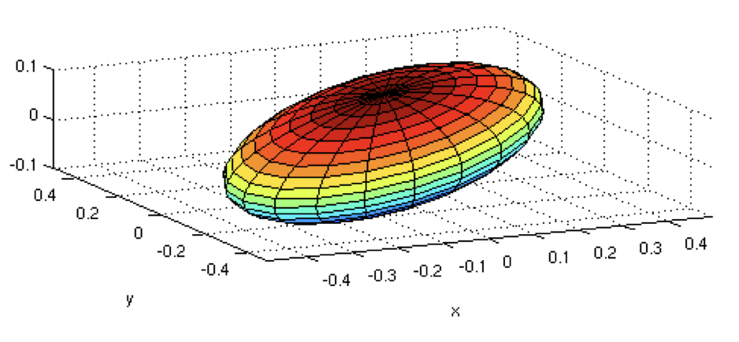
```

## Conceptual overview of multivariate statistics

```{r, echo=FALSE, out.width='90%', fig.asp=.75, fig.align='center'}
knitr::include_graphics("images/multi.002.jpeg")
```

## Multivariate statistics history

<br>

```{r, echo=FALSE, out.width='65%', fig.asp=.75, fig.align='center'}
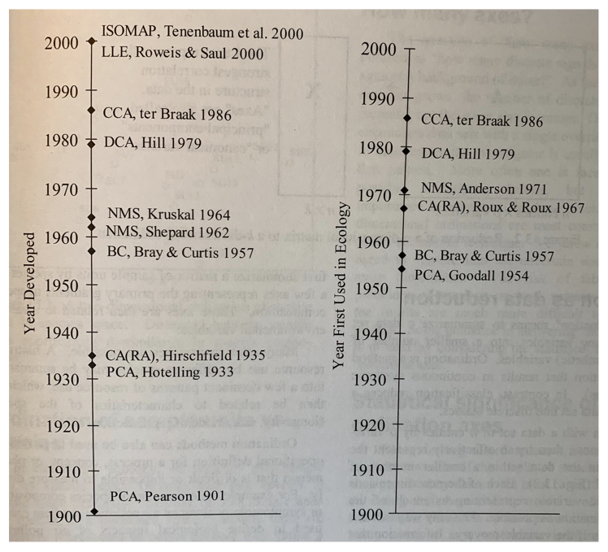
```

## Multivariate statistics history

<br>

```{r, echo=FALSE, out.width='100%', fig.asp=.75, fig.align='center'}
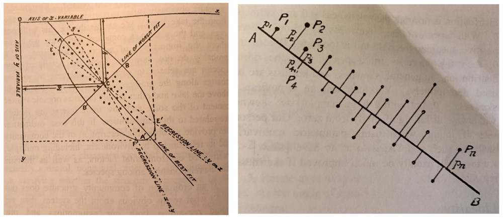
```

## Multivariate statitistics definitions?

<br>

- Some definitions first
- `i = 1 to n` objects and `j = 1 to p` variables
- Measure of center of a multivariate distribution = the centroid
- Multivariate statistics uses eigenanalysis of either matrices of covariances of variables (`p-by-p`), or dissimilarities of objects (`n-by-n`)
- Matrix and linear algebra are therefore very useful in multivariate statistics


## Eigenanalysis

<br>

$$Z_{ik} = c_{1k}y_{i1} + c_{2k}y_{i2} + c_{3k}y_{i3} + c_{4k}y_{i4} + ... + c_{pk}y_{ip}$$

<br>

- Derives linear combinations of the original variables that best summarize the total variation in the data
- These new linear combinations become `k` new variables themselves
- There are as many new equations as there were original varibles (`k=p`)
- Each object can now have a score for the new variables

## Eigenvalues

<br>

- Also called 
  - **characteristic** or **latent roots** or 
  - **factors**
- Rearranging the variance in the association matrix so that the first few derived variables explain most of the variation that was present between objects in the original variables
- The **eigenvalues** can also be expressed as proportions or percents of the original variance explained by each new derived variable (also called **components or factors**)

## Eigenvectors

<br>

- Lists of the **coefficients or  weights** showing how much each original variable contributes to each new derived variable
- The linear combination s can be solved to provide a score ($z_{ik}$) for each object
- There are the same number of derived variables as there are original variables (`p`)
- The newly derived variables are extracted sequentially so that they are **uncorrelated with each other**
- The eigenvalues and eigenvectors can be derived using either **spectral decomposition of the `p-by-p` matrix** or **singular value decomposition of the original matrix**

## Correlation vs. dissimiliarity matrices

- **Principal Component Analysis (PCA)** and **Correspondence Analysis (CA)** use covariance or correlation of variables.
- **Principal Coordinate Analysis (PCoA)**, **Cluster Analysis** and **Multidimensional Scaling (MDS)** use dissimilarity indices.
- The scaling of the derived latent variables **can therefore differ** between analyses that use covariance of variables as compared to dissimilarity indices.
- Whether the derived variable can be considered metric (e.g. on a **rational scale**) or non-metric (e.g. on an **ordinal scale**) depends on the analysis.
- As a consequence the downstream use of the derived variables can change depending upon the analysis.

## Correlation vs. dissimiliarity matrices

<br>

```{r, echo=FALSE, out.width='75%', fig.asp=.75, fig.align='center'}
knitr::include_graphics("images/multi.003.jpeg")
```

## Dissimiliarity indices for continuous variables

<br>

```{r, echo=FALSE, out.width='80%', fig.asp=.75, fig.align='center'}
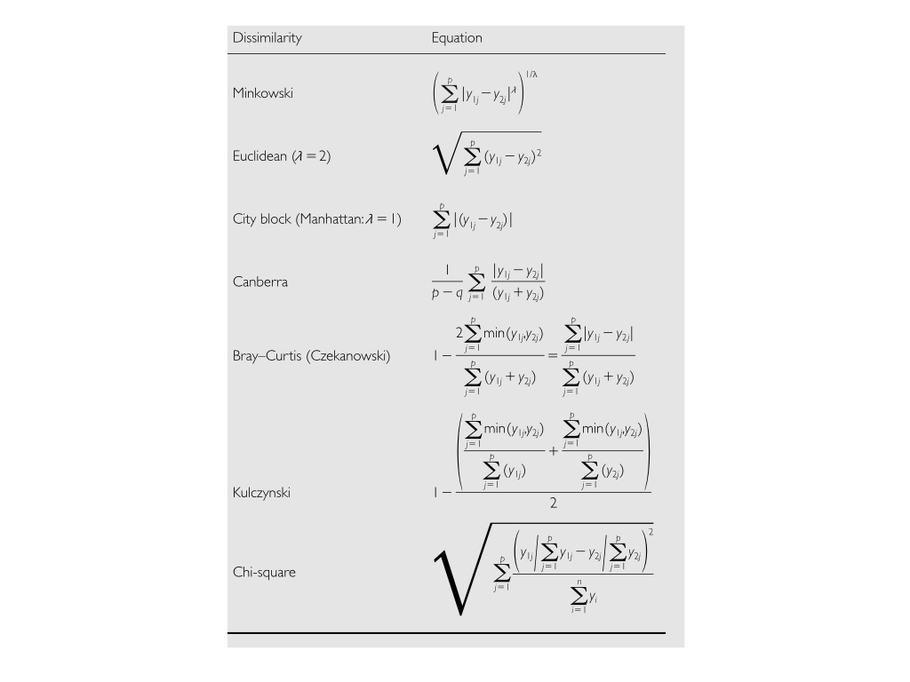
```


## Example data

```{r, echo=FALSE, out.width='50%', fig.asp=.75, fig.align='center'}
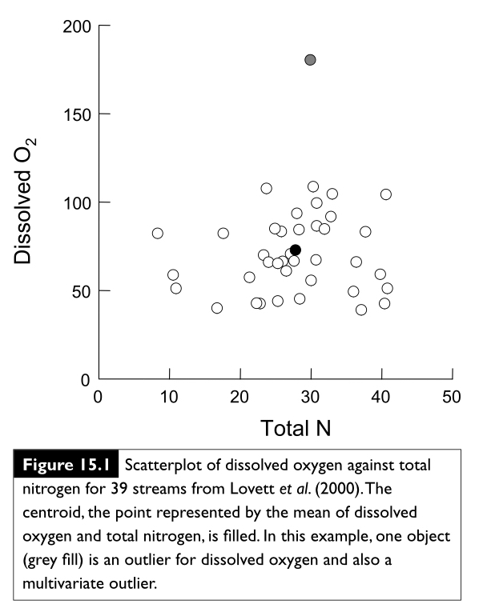
```

## Example data

```{r, echo=FALSE, out.width='100%', fig.asp=.75, fig.align='center'}
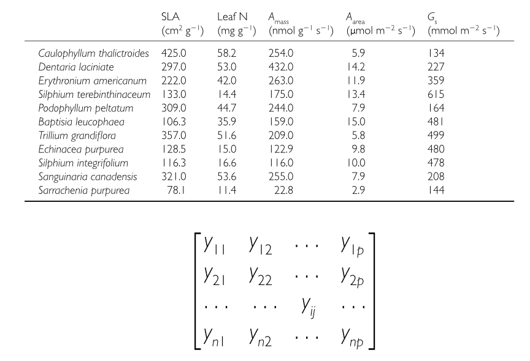
```

## Different Matrices

- S = sum of squares and sum of cross products
- C = p-by-p matrix of variances and covariances
- R = p-by-p matrix of correlations
- Two ways to summarize the variability of a multivariate data set
    - The determinant of a square matrix
    - The trace of a square matrix
- If we have groups, we can calculate determinant and trace for within and among groups and use that to partition multivariate variance


## Sums of squares and cross products

<br>

```{r, echo=FALSE, out.width='100%', fig.asp=.75, fig.align='center'}
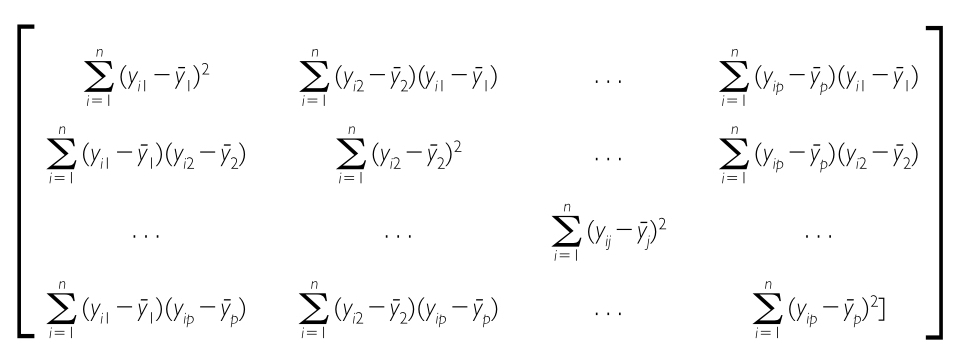
```

## Variance-covariance matrix

<br>

```{r, echo=FALSE, out.width='100%', fig.asp=.75, fig.align='center'}
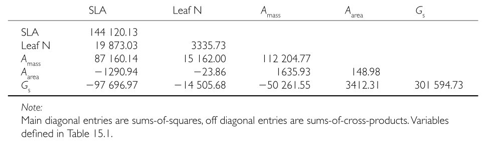
```

## Correlation matrix

<br>

```{r, echo=FALSE, out.width='100%', fig.asp=.75, fig.align='center'}
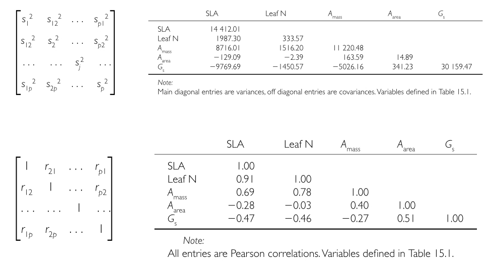
```

## How many PC's or PCo's should I examine?

<br>

```{r, echo=FALSE, out.width='75%', fig.asp=.75, fig.align='center'}
knitr::include_graphics("images/multi.004.jpeg")
```

## What else can I do with the values of the new **PCs and metric PCoAs**?

<br>

- They’re nice **new variables** that you can use in any analysis you’ve learned previously!!
- You can perform single or multiple regression of your PCs on other continuous variables 
- For example, ask whether they correlate with an environmental gradient or body mass index.
- If you have one or more grouping variables you can use ANOVA on each newly derived PC.
- **NOTE** - non-metric PCoA or NMDS values _**cannot**_ just be put into linear models!!


# Principal Component Analysis (PCA)

## Two primary aims of PCA

- **Variable reduction** - reduce a lot of variables to a smaller number of new derived variables that adequately summarize the original information (aka data reduction). 
- **Ordination** - Reveal patterns in the data - especially among variables or objects - that could not be found by analyzing each variable separately. A good way to do this is to plot the first few derived variables (this is also called multidimensional scaling).
- **General approach** - use eigenanalysis on a large dataset of continuous variables.

## Running a PCA analysis

- Start by ignoring any grouping variables
- Perform Eigenanalysis on the entire data set
- After the ordination is complete analyze the objects in the new ordination
- This includes ANOVA using the newly derived PC’s and any grouping variables

## Data standardization for PCA

- Covariances and correlations measure the linear relationships among variables and therefore assumptions of normality and homogeneity of variance are important in multivariate statistics
- Transformations to achieve linearity might be important
- Data on very different scales can also be a problem
- Centering the data subtracts the mean from all variable values so the mean becomes zero
- Ranging divides each variable by its standard deviation so that all variables have a mean of zero and a unit s.d.
- Some variables cannot be standardized (e.g.highly skewed abundance data)
- In this case converting to presence or absence (binary) data might be the most appropriate (MDS - next week)

## PCA overview with example data

```{r, echo=FALSE, out.width='100%', fig.asp=.75, fig.align='center'}
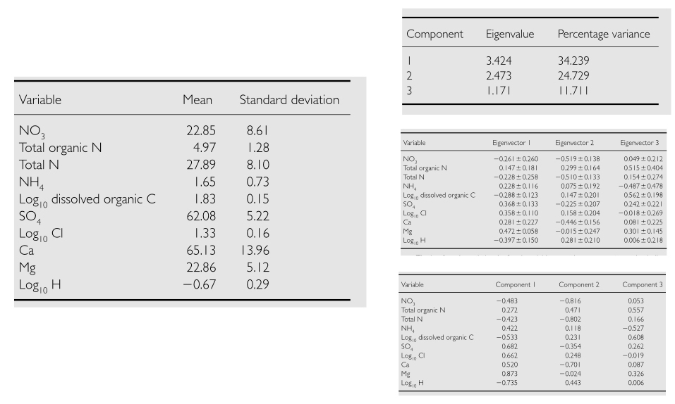
```

## Which association matrix to use?

```{r, echo=FALSE, out.width='100%', fig.asp=.75, fig.align='center'}
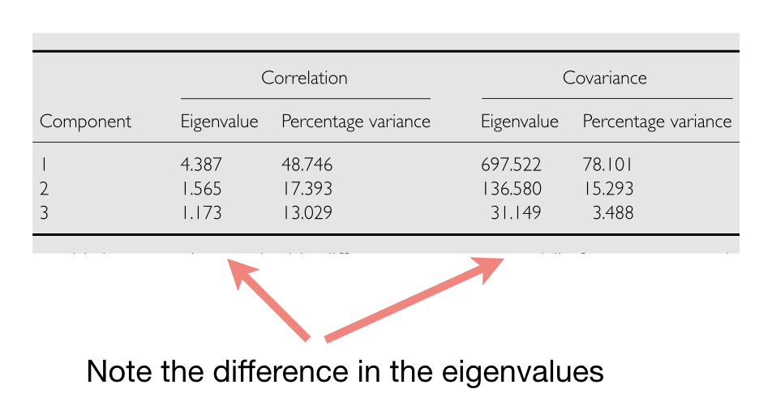
```


# R Interlude

## R Interlude
- First, read in the raw data set of wine samples.
- Note that there are 14 variables, the first column is a grouping variable for vineyard.
- The rest of the variables are chemical concentrations measured from the wine.

```{r, echo=TRUE, eval=FALSE}
wine_raw <- read.table('wine.tsv', header = T, sep = ‘\t')
head (wine_raw)
```

## R Interlude
- Step one: examine some pairwise plots to see if there is any correlation structure.
- You can even do individual bivariate plots and label points by vineyard grouping.

```{r, echo=TRUE, eval=FALSE}
plot(wine_raw$C3, wine_raw$C4)
text(wine_raw$C3, wine_raw$C4, wine_raw$Vineyard, cex=0.7, pos=4, col=“blue")
```

```{r, echo=TRUE, eval=FALSE}
Or label the different vineyards by color (or shape if you want).
plot(wine_raw$C3, wine_raw$C4, pch=19, col=ifelse(wine_raw$Vineyard==1, "blue",
                                       ifelse(wine_raw$Vineyard==2,"green","darkred")))
```

## R Interlude

- Now calculate the summary statistics for the multivariate data.
- This allows you to grasp quickly whether they have the similar means and variances.

```{r, echo=TRUE, eval=FALSE}
sapply(wine_raw[,2:14], mean)
sapply(wine_raw[,2:14], sd)
```

## R Interlude

- Since they don’t, we can standardize the data.

```{r, echo=TRUE, eval=FALSE}
wine_stand <- as.data.frame(scale(wine_raw[,2:14]))
head(wine_stand)
sapply(wine_stand[,1:13], mean)
sapply(wine_stand[,1:13], sd)
```

## R Interlude
- OK, time to run the principal component analysis:

```{r, echo=TRUE, eval=FALSE}
wine_PCA <- princomp(wine_raw, scores = T, cor = T)
```

- After the PCA is run, you need to save the results to a new object in which you can find the new data.
- Look at the wine_PCA file. What new types of data are in this file, and how do you index them?
- Make sure that you know what the 'scores' and 'cor' arguments mean.
- Try running the analysis with cor = F. What happens?
- Compare this result to running the PCA on the standardized data.

## R Interlude
- Next, let's analyze the data using a scree plot
.
```{r, echo=TRUE, eval=FALSE}
plot(wine_PCA)
```

- We can now print the loadings of the new PCs.

```{r, echo=TRUE, eval=FALSE}
wine_PCA$loadings
```

And, let's print the biplot of the data.
```{r, echo=TRUE, eval=FALSE}
biplot(wine_PCA)
```


## R Interlude

Lastly, let's look at the scores of the original objects based on our new variables.

```{r, echo=TRUE, eval=FALSE}
y <- wine_PCA$scores
head(y)
```

- Could write these to a file if we wanted.
- Note - here is a different function for performing the PCA, but run it on both the raw and standardized data.

```{r, echo=TRUE, eval=FALSE}
wine_PCA_2 <- prcomp(wine_raw)
plot (wine_PCA_2)
wine_PCA_3 <- prcomp(wine_stand)
plot (wine_PCA_3)
```


## R Interlude
If you have time - 

- First, think of a good way to visualize the loadings and scores.
- hints: 
    - Want to compare loadings within a given PC.
    - Want to compare scores among observations, usually for just 1 or 2 PCs at a time.

- Go back to your single-factor ANOVA examples, and run this type of analysis for the first 2 PCs. Because you have 3 factor levels, set up contrasts as you see fit.

- OK, now practice by performing a PCA on one of the RNAseq.tsv files.


