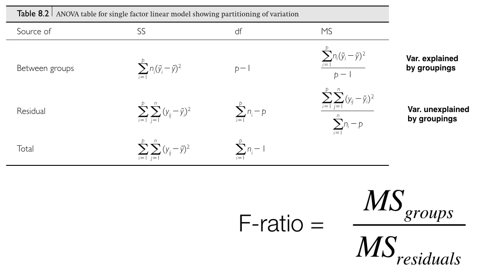
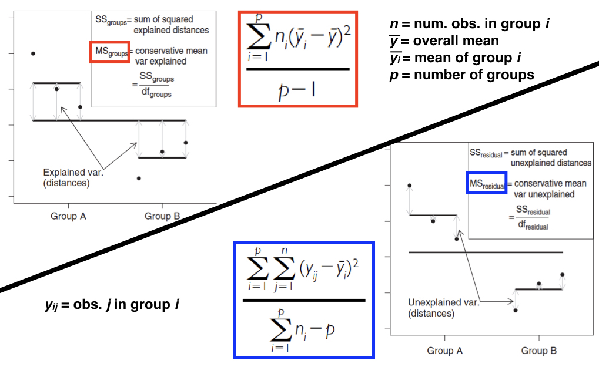
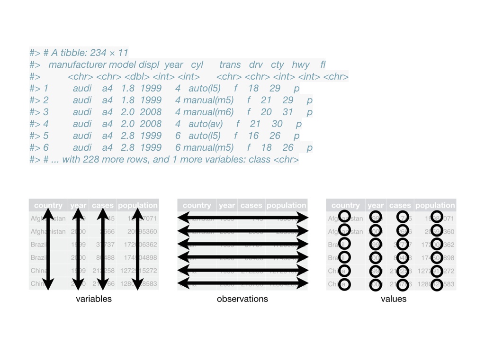

```{r setup, include=FALSE}
fig.dim <- 4
knitr::opts_chunk$set(fig.width=2*fig.dim,
                      fig.height=fig.dim,
                      fig.align='center')
set.seed(23)
library(tidyverse)
library(matrixStats)
```

# Outline

## Goal for the week

To compare means of something between groups.
(Tools will be applicable to other tasks also.)

. . .

Using statistics.

. . .

- When can you do it, and how well? Power/sensitivity, false positive rate.
- How can experiments best do it? Experimental design.
- Methods: two-sample $t$-test, (one-way) ANOVA, permutation tests

# Comparing means


## Example:

How different are AirBnB prices between neighbourhoods?

```{r get_airbnb}
airbnb <- read.csv("../Datasets/portland-airbnb-listings.csv")
airbnb$price <- as.numeric(gsub("$", "", airbnb$price, fixed=TRUE))
airbnb$neighbourhood[airbnb$neighbourhood == ""] <- NA
(neighbourhood_counts <- sort(table(airbnb$neighbourhood), decreasing=TRUE))
```

##

Let's take only the ten biggest neighbourhoods:

```{r clean_airbnb}
big_neighbourhoods <- names(neighbourhood_counts)[1:10]
sub_bnb <- subset(airbnb, !is.na(price) & neighbourhood %in% big_neighbourhoods)
sub_bnb <- droplevels(sub_bnb[, c("price", "neighbourhood", "host_id")])
nrow(sub_bnb)
```

##

Look at the data:

```{r plot_boxes}
par(mar=c(7, 3, 1, 1)+.1)
plot(price ~ neighbourhood, data=sub_bnb, fill=grey(0.8), las=2, xlab='')
```

. . .

Preliminary conclusions?

. . .

Formal questions?


# ANOVA

## The ANOVA model

The *price* $P_{ij}$ of the $j$th room in neighbourhood $i$ is
$$\begin{equation}
    P_{ij} = \mu + \alpha_i + \epsilon_{ij} ,
\end{equation}$$
where

- $\mu$ is the overall mean
- $\alpha_i$ is the mean deviation of neighborhood $i$ from $\mu$
- $\epsilon_{ij}$ is what's left over ("error", or "residual")

. . .

In words,
$$\begin{equation}
    \text{(price)} = \text{(group mean)} + \text{(residual)}
\end{equation}$$

## ANOVA 

- Stands for ANalysis of VAriance
- Core statistical procedure in biology
- Developed by R.A. Fisher in the early 20th Century
- The core idea is to ask how much variation exists within vs. among groups
- ANOVAs are linear models that have categorical predictor and continuous response variables
- The categorical predictors are often called factors, and can have two or more levels (important to specify in R)
- Each factor will have a hypothesis test
- The levels of each factor may also need to be tested

## Question 1: what are the means?

```{r airbnb_anova1}
summary(lm(formula = price ~ neighbourhood, data = sub_bnb))
```

## Question 2: is there group heterogeneity?

```{r airbnb_anova2}
anova(lm(formula = price ~ neighbourhood, data = sub_bnb))
```

## 



##



## One or more predictor variables

* One-way ANOVAs just have a single factor

* Multi-factor ANOVAs

    - Factorial - two or more factors and their interactions
    - Nested - the levels of one factor are contained within another level
    - The models can be quite complex

* ANOVAs use an $F$-statistic to test factors in a model

    - Ratio of two variances (numerator and denominator)
    - The numerator and denominator d.f. need to be included (e.g. \(F_{1, 34} = 29.43\))

* Determining the appropriate test ratios for complex ANOVAs takes some work

## Assumptions

* Normally distributed groups

    - robust to non-normality if equal variances and sample sizes

* Equal variances across groups

    - okay if largest-to-smallest variance ratio < 3:1
    - problematic if there is a mean-variance relationship among groups

* Observations in a group are independent

    - randomly selected
    - don’t confound group with another factor


# Experimental design

## Goals of an experiment

What do we want to know?

. . .

How do we measure it?

. . .

This can be done by *observation* or *experiment*.


## What's an experiment?

An *experiment* is a study in which the values of important variables
(e.g., group membership, dosage)
are determined by the *experimenters*.

Otherwise, it is an *observational* study.

. . .

Note that controlling the set-up doesn't necessarily make it a *good* experiment.

## A biological example to get us started

Say you perform an experiment on two different strains of stickleback fish, one from an ocean population (RS) and one from a freshwater lake (BP) by making them microbe free. Microbes in the gut are known to interact with the gut epithelium in ways that lead to a proper maturation of the immune system.

**Experimental setup:** 
You decide to carry out an experiment by treating multiple fish from each strain so that some of them have a conventional microbiota, and some of them are inoculated with only one bacterial species. You then measure the levels of gene expression in the stickleback gut using RNA-seq. Because you have a suspicion that the sex of the fish might be important, you track it too.

<!-- comment this out: use later?
**Getting the data ready to analyze:**
How should the data set be organized to best analyze it? What are the properties of the variables, and why does that matter?
-->

## 


##

{width=75%}

## What makes a good study?

- Will we have the *power* to detect the effect of interest?

    * What are the sources of *noise*? 
    * How big do we expect the effect to be?

- How generalizable will the results be?

    * How *representative* is the sample? Of what group?

- What are possible *causal* explanations?

    * What are possible *confounding factors*?


## Considerations

1. Where do the samples come from?
2. Sample size, replication, and balance across groups
3. Controls: setting up good comparisons
4. Randomization!

. . .

For (2), remember that
$$\begin{equation}
    \text{(margin of error)} \propto \frac{\sigma}{\sqrt{n}} .
\end{equation}$$


<!-- THURSDAY -->

# Tidy data

## Rules of thumb for data tidiness

- Store a copy of data in nonproprietary software and hardware formats, such as plain ASCII text (aka a flat file)
- Leave an uncorrected file when doing analyses
- Use descriptive names for your data files and variables
- Include a header line with descriptive variable names
- Maintain effective metadata about the data
- When you add observations to a database, add rows
- When you add variables to a database, add columns, not rows
- A column of data should contain only one data type
- All measurements of the same type should be in the same column

## Example?

Have a look at the AirBnB dataset.
Is it "tidy"?

## Exercise

Design a tidy data format for the stickleback experiment:


## Tools for tidy data

Tidying data is *hard*!

. . .

... and often requires expert input.

. . .

Many common *data wrangling* operations
are made easier by the [tidyverse](https://tidyverse.org).

## The "tidyverse"


- packages that do many of the same things as base functions in R

- designed to do them more "cleanly"

- also includes `ggplot` (for "Grammar of Graphics")

## A tibble is a data frame


## A tibble is a data frame



## Key functions in dplyr for vectors

- Pick observations by their values with `filter()`.
- Reorder the rows with `arrange()`.
- Pick variables by their names with `select()`.
- Create new variables with functions of existing variables with `mutate()`.
- Collapse many values down to a single summary with `summarise()`.

## `filter()`, `arrange()` and `select()`

```
a1 <- select(airbnb, neighbourhood, price, host_id, beds, bathrooms)
```

```
a2 <- filter(a1, neighbourhood == "Richmond" 
                 | neighbourhood == "Woodlawn"
                 | neighbourhood == "Downtown")
```

```
a3 <- arrange(a2, price, neighbourhood)
```

## `mutate()` and `transmutate()`

Add new variables:
```
mutate(a3,
    price_per_bed = price / beds,
    price_per_bath = price / bathrooms)
```
Or, make an entirely new data frame:
```
transmute(airbnb,
    price = price,
    price_per_bed = price / beds,
    price_per_bath = price / bathrooms)
```

## `group_by()` and `summarize()`

`group_by()` aggregates data by category, e.g.:
```
by_hood <- group_by(a3, neighbourhood)
```
Now, you can calculate *summaries* of other variables *within* each group, e.g.:
```
summarise(by_hood, price = mean(price, na.rm = TRUE))
```

## Your turn

1. Make a data frame only including rooms in the top ten neighbourhoods.
    Then, using only these neighbourhoods...

2. Find the mean `price`, `cleaning_fee`, and ratio of cleaning fee to price, by neighbourhood.

3. Edit your code in (2) to add variables for the 25% and 75% quantile of `price` (use `quantile( )`).

4. Do as in (2) and (3) but splitting by both `neighbourhood` and `room_type`
   (e.g., finding the mean price of private rooms in Woodlawn).

5. Edit your code in (1) to add a new variable giving the number of characters in the `house_rules` (use `nchar( )`).


