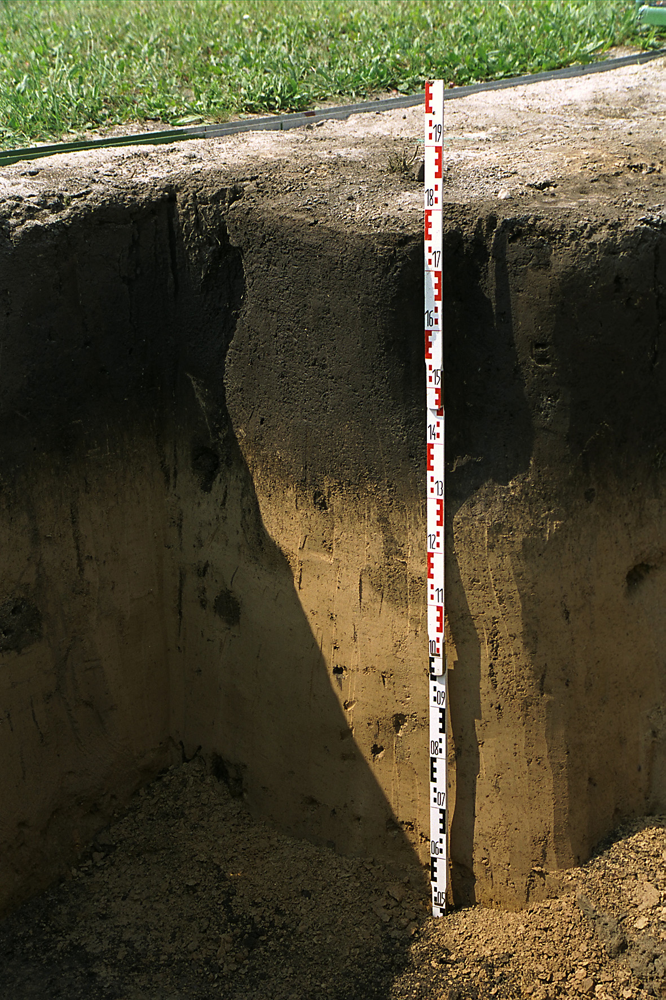
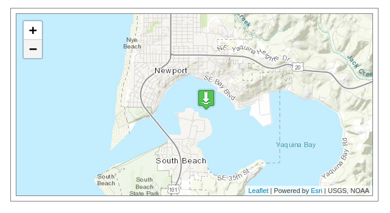

```{r setup, include=FALSE}
fig.dim <- 4
knitr::opts_chunk$set(fig.width=2*fig.dim,
                      fig.height=fig.dim,
                      fig.align='center')
set.seed(23)
library(brms)
library(tseries) # for spectrum
library(rstan)
library(matrixStats)
library(tidyverse)
options(mc.cores = parallel::detectCores())
```

# Time series data

## Time series

A *time series* is a sequence of observations
$$\begin{aligned}
    (y_1, y_2, \ldots, y_N) ,
\end{aligned}$$
that were taken at some set of *times*
$$\begin{aligned}
    t_1 < t_2 < \cdots < t_N .
\end{aligned}$$

. . .

Goals might be to:

- describe patterns
- discover trends
- quantify correlations
- predict future values


## The thing about time

Many statistical methods assume *independence* of observations.

. . .

Nearby observations in a time series are *definately* not.

. . .

Solutions: model the correlation; subtract it off.

# An oscillator

## A discrete, noisy oscillator

Suppose we have regular, noisy observations
from a discrete, noisy oscillator.

The system itself does
$$\begin{aligned}
    x_{t+1} - x_t &= \alpha y_t + \Normal(0, \sigma_{xy}) \\
    y_{t+1} - y_t &= - \beta x_t + \Normal(0, \sigma_{xy}) 
\end{aligned}$$
but we only get to observe
$$\begin{aligned}
    X_t &= x_t + \Normal(0, \sigma_\epsilon) \\
    Y_t &= y_t + \Normal(0, \sigma_\epsilon) .
\end{aligned}$$

-------------------

Here's what this looks like.
```{r sim_osc}
true_osc <- list(alpha=.1,
                 beta=.05,
                 sigma_xy=.01,
                 sigma_eps=1)
N <- 500
xy <- matrix(nrow=N, ncol=2)
xy[1,] <- c(3,0)
for (k in 1:(N-1)) {
    xy[k+1,] <- (xy[k,] 
                + c(true_osc$alpha * xy[k,2],
                    (-1) * true_osc$beta * xy[k,1])
                + rnorm(2, 0, true_osc$sigma_xy))
}
XY <- xy + rnorm(N*2, 0, true_osc$sigma_eps)
```

-----------------

```{r plot_osc, echo=FALSE, fig.height=1.5*fig.dim, fig.width=1.5*fig.dim}
plot(xy, type='l', col='red', xlab='x', ylab='y')
points(XY, col=rainbow(N))
legend("topright", lty=c(1, NA), pch=c(NA,1), col=c("red","black"),
       legend=c("xy", "XY"))
```

## A Stan block

```{r osc_stan, cache=TRUE}
osc_block <- "
data {
    int N;
    vector[N] X;
    vector[N] Y;
}
parameters {
    real alpha;
    real beta;
    real<lower=0> sigma_xy;
    real<lower=0> sigma_eps;
    vector[N] x;
    vector[N] y;
}
model {
    x[2:N] ~ normal(x[1:(N-1)] + alpha * y[1:(N-1)], sigma_xy);
    y[2:N] ~ normal(y[1:(N-1)] - beta * x[1:(N-1)], sigma_xy);
    X ~ normal(x, sigma_eps);
    Y ~ normal(y, sigma_eps);
    alpha ~ normal(0, 1);
    beta ~ normal(0, 1);
    sigma_xy ~ normal(0, 1);
    sigma_eps ~ normal(0, 1);
}
"
osc_model <- stan_model(model_code=osc_block)
```

-------------------

```{r run_osc, cache=TRUE, dependson="osc_block"}
osc_fit <- sampling(osc_model,
                    data=list(N=N,
                              X=XY[,1],
                              Y=XY[,2]),
                    iter=1000, chains=3,
                    control=list(max_treedepth=12))
```

## How'd we do?

```{r summarize_osc}
cbind(truth=c(true_osc$alpha, true_osc$beta, true_osc$sigma_xy, true_osc$sigma_eps),
      rstan::summary(osc_fit, pars=c("alpha", "beta", "sigma_xy", "sigma_eps"))$summary)
```

-------------------

Here is a density plot of 100 estimated trajectories (of `x` and `y`) from the Stan fit.

```{r show_osc_fit, echo=FALSE, fig.height=1.5*fig.dim, fig.width=1.5*fig.dim}
osc_results <- rstan::extract(osc_fit)
plot(xy, lwd=2, xlab='x', ylab='y', type='l')
for (k in 1:100) {
    lines(osc_results$x[k,], osc_results$y[k,],
          col=adjustcolor('black', 0.2))
}
```

# A noisier oscillator

## More realism?

Let's try that again, with more noise.

Here's what this looks like.
```{r sim_osc2, cache=TRUE}
true_osc2 <- list(alpha=.1,
                 beta=.05,
                 sigma_xy=2.0,
                 sigma_eps=4.0)
xy2 <- matrix(nrow=N, ncol=2)
xy2[1,] <- c(3,0)
for (k in 1:(N-1)) {
    xy2[k+1,] <- (xy2[k,] 
                + c(true_osc2$alpha * xy2[k,2],
                    (-1) * true_osc2$beta * xy2[k,1])
                + rnorm(2, 0, true_osc2$sigma_xy))
}
XY2 <- xy2 + rnorm(N*2, 0, true_osc2$sigma_eps)
```

-----------------

```{r plot_osc2, echo=FALSE, fig.height=1.5*fig.dim, fig.width=1.5*fig.dim}
plot(xy2, type='l', col='red', xlab='x', ylab='y')
points(XY2, col=rainbow(N))
legend("topright", lty=c(1, NA), pch=c(NA,1), col=c("red","black"),
       legend=c("xy", "XY"))
```

-------------------

```{r run_osc2, cache=TRUE, dependson=c("osc_block", "sim_osc2")}
osc_fit2 <- sampling(osc_model,
                    data=list(N=N,
                              X=XY2[,1],
                              Y=XY2[,2]),
                    iter=1000, chains=3,
                    control=list(max_treedepth=12))
```

## How'd we do?

```{r summarize_osc2}
cbind(truth=c(true_osc2$alpha, true_osc2$beta, true_osc2$sigma_xy, true_osc2$sigma_eps),
      rstan::summary(osc_fit2, pars=c("alpha", "beta", "sigma_xy", "sigma_eps"))$summary)
```

-------------------

Here is a density plot of 100 estimated trajectories (of `x` and `y`) from the Stan fit.

```{r show_osc_fit2, echo=FALSE, fig.height=1.5*fig.dim, fig.width=1.5*fig.dim}
osc_results2 <- rstan::extract(osc_fit2)
plot(xy2, lwd=2, xlab='x', ylab='y', type='l')
for (k in 1:100) {
    lines(osc_results2$x[k,], osc_results2$y[k,],
          col=adjustcolor('black', 0.2))
}
```

# Missing data

## Even more realism?

Now what if we actually *don't observe* most of the $Y$ values?

Here's what this looks like.
```{r sim_osc3, cache=TRUE}
true_osc3 <- list(alpha=.1,
                 beta=.05,
                 sigma_xy=.05,
                 sigma_eps=.5)
xy3 <- matrix(nrow=N, ncol=2)
xy3[1,] <- c(3,0)
for (k in 1:(N-1)) {
    xy3[k+1,] <- (xy3[k,] 
                + c(true_osc3$alpha * xy3[k,2],
                    (-1) * true_osc3$beta * xy3[k,1])
                + rnorm(2, 0, true_osc3$sigma_xy))
}
XY3 <- xy3 + rnorm(N*2, 0, true_osc3$sigma_eps)
obs_y <- sample.int(N, size=10)
XY3[setdiff(1:N, obs_y), 2] <- NA
```

-----------------

```{r plot_osc3, echo=FALSE}
matplot(xy3, xlab='time', ylab='x and y', type='l')
matpoints(XY3)
```

## A new Stan block

```{r osc_stan3, cache=TRUE}
osc_block_missing <- "
data {
    int N;
    vector[N] X;
    int k; // number of observed Y
    int obs_y[k]; // which Y values are observed
    vector[k] Y;
}
parameters {
    real alpha;
    real beta;
    real<lower=0> sigma_xy;
    real<lower=0> sigma_eps;
    vector[N] x;
    vector[N] y;
}
model {
    x[2:N] ~ normal(x[1:(N-1)] + alpha * y[1:(N-1)], sigma_xy);
    y[2:N] ~ normal(y[1:(N-1)] - beta * x[1:(N-1)], sigma_xy);
    X ~ normal(x, sigma_eps);
    Y ~ normal(y[obs_y], sigma_eps);
    alpha ~ normal(0, 1);
    beta ~ normal(0, 1);
    sigma_xy ~ normal(0, 1);
    sigma_eps ~ normal(0, 1);
}
"
osc_model_missing <- stan_model(model_code=osc_block_missing)
```

-------------------

```{r run_osc3, cache=TRUE, dependson=c("osc_stan3", "sim_osc3")}
osc_fit3 <- sampling(osc_model_missing,
                    data=list(N=N,
                              X=XY3[,1],
                              k=length(obs_y),
                              obs_y=obs_y,
                              Y=XY3[obs_y,2]),
                    iter=1000, chains=3,
                    control=list(max_treedepth=12))
```

## How'd we do?

```{r summarize_osc3}
cbind(truth=c(true_osc3$alpha, true_osc3$beta, true_osc3$sigma_xy, true_osc3$sigma_eps),
      rstan::summary(osc_fit3, pars=c("alpha", "beta", "sigma_xy", "sigma_eps"))$summary)
```

-------------------

Here is a density plot of 100 estimated trajectories (of `x` and `y`) from the Stan fit.

```{r show_osc_fit3, echo=FALSE, fig.height=1.5*fig.dim, fig.width=1.5*fig.dim}
osc_results3 <- rstan::extract(osc_fit3)
plot(xy3, lwd=2, xlab='x', ylab='y', type='l')
for (k in 1:100) {
    lines(osc_results3$x[k,], osc_results3$y[k,],
          col=adjustcolor('black', 0.2))
}
```

# CO2 concentrations

## Atmospheric CO2 concentrations at Mauna Loa


## Monthly averages

```
# The "average" column contains the monthly mean CO2 mole fraction determined
# from daily averages.  The mole fraction of CO2, expressed as parts per million
# (ppm) is the number of molecules of CO2 in every one million molecules of dried
# air (water vapor removed).  If there are missing days concentrated either early
# or late in the month, the monthly mean is corrected to the middle of the month
# using the average seasonal cycle.  Missing months are denoted by -99.99.
# The "interpolated" column includes average values from the preceding column
# and interpolated values where data are missing.  Interpolated values are
# computed in two steps.  First, we compute for each month the average seasonal
# cycle in a 7-year window around each monthly value.  In this way the seasonal
# cycle is allowed to change slowly over time.  We then determine the "trend"
# value for each month by removing the seasonal cycle; this result is shown in
# the "trend" column.  Trend values are linearly interpolated for missing months.
# The interpolated monthly mean is then the sum of the average seasonal cycle
# value and the trend value for the missing month.
```

## The data

```{r read_co2}
co2 <- read.table("../Datasets/Mauna_Loa_C02/co2_mm_mlo.txt", comment="#")
names(co2) <- c("year", "month", "decimal_date", "average", "interpolated", "trend", "num_days")
co2[co2 == -99.99] <- NA
head(co2)
```

## 

```{r plot_co2, fig.width=3*fig.dim, fig.height=2*fig.dim, echo=FALSE}
matplot(co2$decimal_date, co2[,c(4,5,6)], type='l', lwd=2, lty=1, xlab='year', ylab='CO2 (ppm)')
abline(h=350, lty=2, col=2, lwd=2)
legend("topleft", lty=c(1,1,1,2), col=c(1:3,2), legend=c(names(co2)[c(4,5,6)], '350ppm'), lwd=2)
```

## Trend plus seasonal

```{r trend_co2, fig.width=3*fig.dim, fig.height=2*fig.dim, echo=FALSE}
layout((1:2), heights=c(1,1.2))
par(mar=c(1,5,1,1)+.1)
plot(trend ~ decimal_date, data=co2, xlab='', lwd=2, xaxt='n', type='l')
par(mar=c(4,5,1,1)+.1)
plot(average - trend ~ decimal_date, data=co2, xlab='year', lwd=2, type='l')
lines(interpolated - trend ~ decimal_date, data=co2, xlab='year', lty=2)
abline(h=0, col='red')
```

## Seasonal

```{r plot_seasonal}
plot(average - trend ~ month, data=co2, pch=20, cex=0.5, col=adjustcolor("black", 0.5), xlab='Month')
```

## In class

```{r do_interp}

# 1. get monthly means of nearest 7 years and subtract off to get trend
co2$our_trend <- NA
monthly_deviation <- rep(NA, nrow(co2))
for (j in 1:nrow(co2)) {
    nearest_seven <- ( abs(co2$decimal_date - co2$decimal_date[j])  <= 3.5 )
    # e.g., if month[j] is 7 then monthly_deviation[j] will be the average difference
    # in co2 concentration from the overall mean
    # across the seven Julys in this chunk of data from 7 years
    k <- co2$month[j]
    monthly_deviation[j] <- with(subset(co2, nearest_seven),
                                 mean(average[month == k] - mean(average, na.rm=TRUE), na.rm=TRUE))
    co2$our_trend[j] <- co2$average[j] - monthly_deviation[j]
}

# 2. Interpolate missing trend values
for (j in which(is.na(co2$our_trend))) {
    before <- max(which(!is.na(co2$our_trend[1:j])))
    after <- min(which(!is.na(co2$our_trend[j:nrow(co2)])))
    dx <- (after - before)
    dy <- co2$our_trend[after] - co2$our_trend[before]
    co2$our_trend[j] <- co2$our_trend[before] + (j - before) * dy / dx
}

# sanity check
stopifnot(all(!is.na(co2$our_trend)))

# 3. Get interpolated values by adding trend to average monthly values
co2$our_interp <- co2$our_trend + monthly_deviation

stopifnot(all(!is.na(co2$our_interp)))

plot(our_trend ~ decimal_date, data=co2, type='l')

plot(our_trend ~ trend, data=co2, xlab='our trend', ylab='their trend')
abline(0, 1, col='red')

plot(our_trend - trend ~ trend, data=co2, xlab='ours - theirs', ylab='their trend')
abline(h=0, col='red')

plot(our_interp ~ decimal_date, data=co2, type='l')

plot(our_interp - average ~ decimal_date, data=co2)

plot(our_interp - interpolated ~ decimal_date, data=co2)

plot(average ~ decimal_date, data=co2, subset=(decimal_date > 1958 & decimal_date <= 1970), type='l')
points(our_interp ~ decimal_date, data=co2, col='red')
```


# Interlude: Correlation

##


## Pearson's Product-Moment Correlation Coefficent

(a.k.a. "the correlation")

$$\begin{aligned}
    r = \cor[x,y] = \frac{1}{n-1} \sum_{i=1}^n \left(\frac{ x_i - \bar x }{\sd[x]}\right)
                \left(\frac{ y_i - \bar y }{\sd[y]}\right) 
\end{aligned}$$
where
$$\begin{aligned}
    \bar x = \text{mean}[x] &= \frac{1}{n} \sum_{i=1}^n x_i \\
    s_x = \sd[x] &= \sqrt{\frac{1}{n-1} \sum_{i=1}^n (x_i - \bar x)^2}
\end{aligned}$$


## Guess the correlation?

```{r guess_cors, echo=FALSE, fig.width=3*fig.dim, fig.height=2*fig.dim}
layout(matrix(1:8, nrow=2, byrow=TRUE))
par(mar=c(1,1,1,1)+.1)
rhovals <- sort(2 * rbeta(8, 0.75, 0.75) - 1)
for (k in seq_along(rhovals)) {
    x <- rnorm(100)
    y <- rhovals[k] * x + sqrt(1 - rhovals[k]^2) * rnorm(100)
    plot(x, y, xlab='', ylab='', xaxt='n', yaxt='n')
}
```

## Guess the correlation?

```{r guess_cors2, echo=FALSE, fig.width=3*fig.dim, fig.height=2*fig.dim}
layout(matrix(1:8, nrow=2, byrow=TRUE))
par(mar=c(1,1,1,1)+.1)
for (k in seq_along(rhovals)) {
    x <- rnorm(100)
    y <- rhovals[k] * x + sqrt(1 - rhovals[k]^2) * rnorm(100)
    plot(x, y, xlab='', ylab='', xaxt='n', yaxt='n')
    abline(coef(lm(y~x)))
    text(x= - sign(rhovals[k]) * 1.5, y=1.5, label=sprintf("r = %0.2f", rhovals[k]), cex=2)
}
```

##

```
> help(cor)

Correlation, Variance and Covariance (Matrices)

Description:

     ‘var’, ‘cov’ and ‘cor’ compute the variance of ‘x’ and the
     covariance or correlation of ‘x’ and ‘y’ if these are vectors.  If
     ‘x’ and ‘y’ are matrices then the covariances (or correlations)
     between the columns of ‘x’ and the columns of ‘y’ are computed.

     ‘cov2cor’ scales a covariance matrix into the corresponding
     correlation matrix _efficiently_.

Usage:

     var(x, y = NULL, na.rm = FALSE, use)
     
     cov(x, y = NULL, use = "everything",
         method = c("pearson", "kendall", "spearman"))
```

## Rank-based statistics

**Spearman's correlation coefficient** (or, "Spearman's rho")

is just "the" correlation coefficient between the *ranks* of the vectors.

It is *nonparametric* - it makes sense regardless of the data's distribution.

. . .

```{r spearman}
x <- rnorm(20)
y <- rnorm(20)

cor(x, y, method='spearman')
cor(rank(x), rank(y))
```

# Autocorrelation

## 

The *autocorrelation function* of a time series $(x(t) : 0 \le t \le L)$
is the correlation between points as a function of lag:

$$\begin{aligned}
    \rho(\ell) &= \cor[x(T), x(T+\ell)],
\end{aligned}$$

where $T$ is uniform between 0 and $L-\ell$.

. . .


$$\begin{aligned}
    \rho(\ell) &= \frac{1}{T-\ell-1} \sum_{t=1}^{T-\ell}
            \left(\frac{ x(t) - \bar x }{ \sd[x] } \right)
            \left(\frac{ x(t + \ell) - \bar x }{ \sd[x] } \right) .
\end{aligned}$$


## Computing autocorrelation:

The `acf( )` function requires a *time series* object:
```{r co2_ts}
co2_ts <- ts(co2$interpolated, deltat=1/(12))

acf(co2_ts, lag.max=10 * 12, xlab='lag (years)')
```

## Seasonal autocorrelation

```{r seasonal_acf}
co2_seasonal <- ts(co2$interpolated - co2$trend, deltat=1/(12))
acf(co2_seasonal, lag.max=3 * 12, xlab='lag (years)')
```


# Smoothing

## loess

{width="40%"}

## `loess`

```
> help(loess)

Local Polynomial Regression Fitting

Description:

     Fit a polynomial surface determined by one or more numerical
     predictors, using local fitting.

Usage:

     loess(formula, data, weights, subset, na.action, model = FALSE,
           span = 0.75, enp.target, degree = 2,
           parametric = FALSE, drop.square = FALSE, normalize = TRUE,
           family = c("gaussian", "symmetric"),
           method = c("loess", "model.frame"),
           control = loess.control(...), ...)
```

## Example

```{r loess}
xt <- data.frame(t=seq(0, 10*pi, length.out=150))
xt$x <- cos(xt$t) + rnorm(nrow(xt), sd=0.4)
plot(x ~ t, data=xt)
```

## 

```{r loess2}
xtsm <- loess(x ~ t, data=xt, span=0.1)
xt$smoothed <- predict(xtsm, newdata=xt)

plot(x ~ t, data=xt)
lines(smoothed ~ t, data=xt, col='red')
```

## A key parameter: `span`

```{r loess3, warning=FALSE, fig.width=3*fig.dim, echo=FALSE}
fvals <- c(0.05, 0.1, 0.2, 0.5, 0.75)
smooths <- sapply(fvals, function (f)
                predict(loess(x ~ t, data=xt, span=f), newdata=xt) )

plot(x ~ t, data=xt, xlim=c(-5, 10*pi))
matlines(xt$t, smooths, lty=1, col=rainbow(10), lwd=2)
legend("topleft", lty=1, lwd=2, col=rainbow(10)[1:length(fvals)],
       legend=sprintf("span=%0.2f", fvals))
```


# Ocean temperatures

## 

Ocean temperature is available from NOAA buoys
at [tidesandcurrents.noaa.gov](https://tidesandcurrents.noaa.gov/physocean.html):


## 

Ten years of data for Newport, OR
are [in the Datasets/ directory](../Datasets/Ocean_Temp_Data/Newport_Sea_Temp_Data_2010-2019.csv)



## Reading in *dates*:

```{r load_ocean, fig.width=3*fig.dim, cache=TRUE, warning=FALSE}
library(lubridate) 
ocean <- read.csv("../Datasets/Ocean_Temp_Data/Newport_Sea_Temp_Data_2010-2019.csv")
ocean$date <- with(ocean,
                   ymd_hm(paste(paste(Year, Month, Day, sep='-'), Time)))
ocean$time <- hm(ocean$Time)

plot(WATER_TEMP_F ~ date, data=ocean, type='l')
```

## 2012:

```{r twentytwelve, fig.width=3*fig.dim}
plot(WATER_TEMP_F ~ date, data=ocean, type='l', subset=Year==2012)
```

## July, 2012:

```{r july_twentytwelve, fig.width=3*fig.dim}
plot(WATER_TEMP_F ~ date, data=ocean, type='l', subset=Year==2012 & Month==7)
```


## Autocorrelation

```{r ocean_acf0, fig.width=3*fig.dim}
water_ts <- ts(ocean$WATER_TEMP_F, deltat=1)
acf(water_ts, lag.max=10 * 12, xlab='lag (hours)', na.action=na.pass)
```


## Removing the trend

```{r smooth1, fig.width=3*fig.dim}
ocean$numdate <- as.numeric(ocean$date)
month_smooth <- loess(WATER_TEMP_F ~ numdate, data=ocean,
                      span=sum(ocean$Month < 4 & ocean$Year == 2012)/nrow(ocean))
ocean$month_sm <- predict(month_smooth, newdata=ocean)

plot(WATER_TEMP_F ~ date, data=ocean, pch=20, cex=0.5)
lines(month_sm ~ date, data=ocean, col='red', lwd=2)
```

##

```{r smooth2, fig.width=3*fig.dim, fig.height=2*fig.dim, echo=FALSE}
layout(1:2)
plot(WATER_TEMP_F ~ date, data=ocean, pch=20, cex=0.5, subset=Year==2012)
lines(month_sm ~ date, data=ocean, col='red', lwd=2)
plot(WATER_TEMP_F ~ date, data=ocean, pch=20, cex=0.5, subset=Year==2012 & (Month == 7 | Month ==8))
lines(month_sm ~ date, data=ocean, col='red', lwd=2)
```

## Remaining autocorrelation

```{r ocean_acf, fig.width=3*fig.dim}
water <- ts(ocean$WATER_TEMP_F - ocean$month_sm, deltat=1)
acf(water, lag.max=10 * 12, xlab='lag (hours)', na.action=na.pass)
```

## A 12 hour cycle?

```{r ocean_acf2, fig.width=3*fig.dim}
acf(water, lag.max=10 * 12, xlab='lag (hours)', na.action=na.pass)
abline(v=12*1:10, col=c('red', 'blue'), lwd=2)
```

## A `12 * (1 + 1/27.2)` hour cycle!

```{r ocean_acf3, fig.width=3*fig.dim}
acf(water, lag.max=10 * 12, xlab='lag (hours)', na.action=na.pass)
abline(v=12*(1 + 1/27.2) * 1:10, col=c('red', 'blue'), lwd=2)
```

. . .

... why?


# Addendum

## Spectra

```{r thespec}
# spectrum
wspec <- spectrum(water, na.action=na.remove)
plot(wspec)
```
