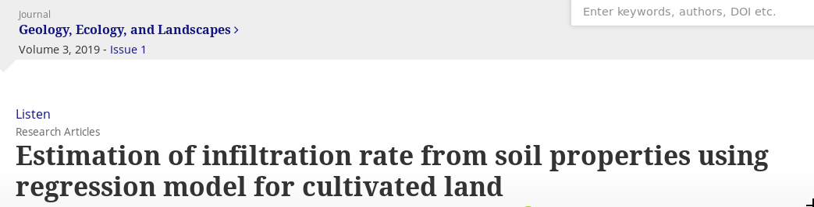

```{r setup, include=FALSE}
fig.dim <- 4
knitr::opts_chunk$set(fig.width=2*fig.dim,
                      fig.height=fig.dim,
                      fig.align='center')
set.seed(23)
options(digits=2)
```

# Soil infiltration

## 

<!-- from https://www.tandfonline.com/doi/full/10.1080/24749508.2018.1481633 -->

{ width=50% }


##

Use [the data](data/infiltration_data.tsv)
to try to reproduce their model:

```
BIR = 14,195.35 - 141.75 (sand%) - 142.10 (silt%) - 142.56 (clay%)
```

They're not wrong! What's up with those coefficients, though?

```{r infil_data, include=FALSE}
head(infil <- read.table("data/infiltration_data.tsv", header=TRUE))
```

# IN CLASS

------------------

Read in the data:
```{r data}
x <- read.table("data/infiltration_data.tsv", header=TRUE)

range(rowSums(x[, c("Sand", "Clay", "Silt")]))
```

------------------

Fit the model:
```{r the_model}
the_lm <- lm( BIR ~ Sand + Silt + Clay, data=x)
summary(the_lm)
```

------------------

There is a small difference between our predictions and theirs - 
due to rounding, it will turn out.

```{r predictions}
preds <- predict(the_lm)
ours <- -62.1123 +  0.8315 * x$Sand + 0.4733 * x$Silt
theirs <- 14195.35 - 141.75 * x$Sand - 142.10 * x$Silt - 142.56 * x$Clay
layout(1:2)
plot(preds, ours)
abline(0, 1)
plot(ours, theirs)
abline(0, 1)
```

------------------

Ok, so `Sand + Silt + Clay` is always equal to 100,
so for *any* number `a`, it's always true that
`a * Sand + a * Silt + a * Clay - a * 100 = 0`.
So, we can add this to our formula and get exactly the same thing.
Our model has no coefficient for `Clay`,
so to make their model look like ours we can do this
with `a` equal to their coefficient for `Clay`:
```{r new}
clay_coef <- 142.56
# this is the same as
theirs_noclay <- 14195.35 - clay_coef * 100 + (clay_coef - 141.75) * x$Sand + (clay_coef - 142.10) * x$Silt + (clay_coef - 142.56) * x$Clay
plot(theirs, theirs_noclay)
abline(0, 1)
```

------------------

So, what *are* these numbers?

The new coefficients that are equivalent to theirs
are nearly the same as ours - the difference is because of rounding error!
```{r coefs}
coefs <- as.data.frame(coef(the_lm))
names(coefs)[[1]] <- "lm"
coefs$theirs <- c(14195.35, - 141.75, - 142.10, - 142.56)
coefs$theirs_noclay <- c(
    14195.35 - clay_coef * 100,
    (clay_coef - 141.75),
    (clay_coef - 142.10),
    (clay_coef - 142.56)
)
coefs
```

