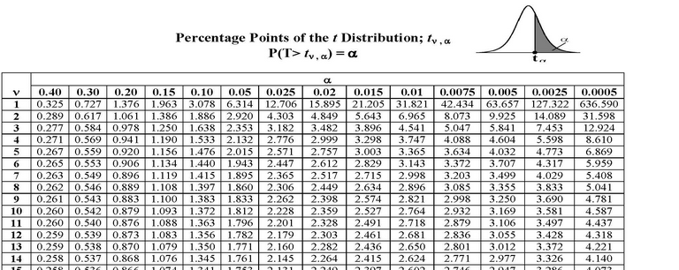

```{r setup, include=FALSE}
fig.dim <- 4
knitr::opts_chunk$set(fig.width=2*fig.dim,
                      fig.height=fig.dim,
                      fig.align='center')
set.seed(23)
library(tidyverse)
library(matrixStats)

# format numbers for display
nf <- function (x, prefix="", digits=2, ...) {
    paste(prefix, format(x, digits=digits, ...))
}
```

# Course overview

##

{width=80%}


## Steps in data analysis

1. Care, or at least think, about the data.

2. Look at the data.

3. Query the data.

4. Sanity check.

5. Communicate.

. . .

Often "statistics" focuses on *querying*.
Doing that effectively requires all the other steps, too.

## Overview and mechanics

See [the course website](https://UO-Biostats.github.io/UO_ABS).


# Some core statistical concepts

## Statistics or parameters?

A **statistic** is

: a numerical description of a dataset.

. . .

A **parameter** is 

: a numerical attribute of a model of reality.

. . .

Often, *statistics* are used to estimate *parameters*.


## The two heads of classical statistics

estimating parameters, with uncertainty *(confidence intervals)*

evaluating (in-)consistency with a particular situation *($p$-values)*

. . .

1. What do these data tell us about the world?
2. How strongly do we believe it?


. . .

*This week:* digging in, with simple examples.


# A quick look at some data

## Some data

AirBnB hosts in Portland, OR:
[website](http://insideairbnb.com/get-the-data.html) and 
[download link](http://data.insideairbnb.com/united-states/or/portland/2019-07-10/data/listings.csv.gz).

Questions: how much does an AirBnB typically cost in Portland?
Do "instant bookable" ones cost more?

```{r airbnb}
airbnb <- read.csv("../Datasets/portland-airbnb-listings.csv")
nrow(airbnb)
names(airbnb)
```


## Second, look at the data

```{r airbnb_numbers}
summary(airbnb$price)
summary(airbnb$instant_bookable)
```

## Whoops

```{r airbnb_data}
airbnb$price <- as.numeric(gsub("$", "", airbnb$price, fixed=TRUE))
airbnb$instant_bookable <- (airbnb$instant_bookable == "t")
```

------------

```{r airbnb_numbers2}
summary(airbnb$price)
summary(airbnb$instant_bookable)
```

------------

```{r bed}
table(airbnb$bed_type) # hm
```

## How much is a typical night?

```{r mean_price}
mean(airbnb$price, na.rm=TRUE)
```

-------------------

```{r airbnb_hist, fig.width=2.5*fig.dim}
hist(airbnb$price, breaks=40, xlab='nightly price ($)', col=grey(.8), xlim=range(airbnb$price, finite=TRUE), main='instant bookable') 
```

. . .

Conclusion?


## Do "instant bookable" charge more?

```{r airbnb_hist2, fig.height=1.5*fig.dim, fig.width=2.5*fig.dim}
layout(1:2)
hist(airbnb$price[!airbnb$instant_bookable], breaks=40, xlab='nightly price ($)', col=grey(.8), xlim=range(airbnb$price, finite=TRUE), main='not instant bookable') 
hist(airbnb$price[airbnb$instant_bookable], breaks=40, xlab='nightly price ($)', col=grey(.8), main='instant bookable')
```

--------------

```{r airbnb_t}
instant <- airbnb$price[airbnb$instant_bookable]
not_instant <- airbnb$price[!airbnb$instant_bookable]
(tt <- t.test(instant, not_instant))
```

## Conclusion

> Instant bookable hosts cost more than others
> (P=`r format(tt$p.value, digits=2)`, t-test with df=`r tt$parameter`).

. . .

*Critique this conclusion.*


## Don't forget Steps 1 and 5!

1. Care, or at least think, about the data.

5. Communicate.

. . .

How *big* is the difference? How sure are we?

. . .

Statistical significance does not imply real-world significance.


## Revised conclusion

The mean nightly price of Portland AirBnB hosts is <span>\$`r nf(mean(airbnb$price, na.rm=TRUE))`,</span>
with a standard deviation of <span>\$`r format(sd(airbnb$price, na.rm=TRUE), digits=2)`</span>
and a range of <span>\$`r nf(min(airbnb$price, na.rm=TRUE))`</span> to <span>\$`r nf(max(airbnb$price, na.rm=TRUE))`</span>.
"Instant bookable" hosts charged on average \$`r format(diff(tt$estimate[2:1]), digits=2)` more than others,
a difference that is statistically significant (P=`r format(tt$p.value, digits=2)`, t-test with df=`r tt$parameter`).


. . .

*Critiques?*


##


So: what did we just do?


# Hypothesis testing and $p$-values


## A $p$-value is

. . .

> the probability of seeing a result at least as surprising
> as what was observed in the data,
> if the null hypothesis is true.

. . .

Usually, this means

- *a result* - numerical value of a statistic
- *surprising* - big
- *null hypothesis* - the model we use to calculate the $p$-value

which can all be defined to suit the situation.

## What does a small $p$-value mean?

*If* the null hypothesis *were* true,
then you'd be really unlikely to see something like what you actually *did*.

. . .

So, either the "null hypothesis" is not a good description of reality
or something surprising happened.

. . .

How useful this is depends on the null hypothesis.


## For instance

```{r airbnb_t2, echo=FALSE}
tt
```

## Also for instance

```{r airbnb_t3}
t.test(airbnb$price)
```

. . .

Is *that* $p$-value useful?


## Exercise:

*(class survey)*
How many people have a longer index finger on the hand they write with?

. . .

We want to know
$$\begin{equation}
    \theta = \P(\text{random person has writing finger longer}) .
\end{equation}$$

Everyone make a fake dataset with $\theta = 1/2$, e.g.:
```
n <- 35 # class size
sum(rbinom(n, 1, 1/2) > 0)
```

. . .

Now we can estimate the $p$-value for the hypothesis that $\theta = 1/2$.
Conclusions?

. . .

```
replicate(1000, sum(rbinom(n, 1, 1/2) > 0))
```

## So, where do $p$-values come from?

Either math:



. . .

Or, computers. (maybe math, maybe simulation, maybe both)

# Stochastic minute: the $t$ distribution

## The $t$ statistic

The $t$ statistic computed from a collection of $n$ numbers
is the sample mean divided by the estimated standard error of the mean,
which is the sample SD divided by $\sqrt{n}$.

. . .

If $x_1, \ldots, x_n$ are numbers, then
$$\begin{aligned}
    \text{(sample mean)} \qquad \bar x &= \frac{1}{n}\sum_{i=1}^n x_i \\
    \text{(sample SD)} \qquad s &= \sqrt{\frac{1}{n-1}\sum_{i=1}^n (x_i - \bar x)^2} 
\end{aligned}$$
so
$$\begin{equation}
    t(x) = \frac{\bar x}{s / \sqrt{n}} .
\end{equation}$$

## Sanity check

```{r t_check}
n <- 20
x <- rnorm(n)
c(t.test(x)$statistic, 
  mean(x) / (sd(x) / sqrt(n)))
```

## The $t$ approximation

**Fact:** 
If $X_1, \ldots, X_n$ are independent random samples from a distribution with mean $\mu$,
then
$$\begin{equation}
    t(X - \mu) = \frac{\bar x - \mu}{s/\sqrt{n}} \approx \StudentsT(n-2) ,
\end{equation}$$
as long as $n$ is not too small and the distribution isn't too wierd.

## A demonstration

Let's check this, by doing:

> find the sample $t$ score of 100 random draws from some distribution

lots of times, and looking at the distribution of those $t$ scores.

. . .

Claim: no matter the distribution we sample from, it should look close to $t$.

## One sample

```{r t_one_smaple}
n <- 20
x <- 2 * runif(n) - 1
hist(x, xlab='value', col=grey(0.5),
     main=sprintf("t=%f", mean(x)*sqrt(n-1)/sd(x)))
abline(v=0, lwd=2, lty=3)
abline(v=mean(x), col='red', lwd=2)
```

## More samples

```{r t_more_samples, echo=FALSE, fig.height=2*fig.dim, fig.width=2.5*fig.dim}
par(mar=c(4,3,1,1))
layout(matrix(1:20, nrow=4))
for (k in 1:20) {
    x <- 2 * runif(n) - 1
    hist(x, xlab='value', col=grey(0.5),
         main=sprintf("t=%f", mean(x)*sqrt(n-1)/sd(x)))
    abline(v=0, lwd=2, lty=3)
    abline(v=mean(x), col='red', lwd=3)
}
```

## Distribution of 1,000 sample $t$ scores

```{r t_sampling_dist}
xm <- replicate(1000, {
            x <- 2 * runif(n) - 1;
            mean(x) * sqrt(n-1) / sd(x) })
xh <- hist(xm, breaks=40, main=sprintf('t of %d samples', n), col='red')
```

## Distribution of 1,000 sample $t$ scores

```{r t_smpling_dist2}
plot(xh, main=sprintf('t of %d samples', n), col='red')
xx <- xh$breaks
polygon(c(xx[-1] - diff(xx)/2, xx[1]),
        c(length(xm)* diff(pt(xx, df=(n-1))), 0),
        col=adjustcolor("blue", 0.4))
```

## Exercise:

Do this again (use my code) except using
```
x <- rexp(n) - 1
```
instead of `2 * runif(n) - 1`.


# Confident in confidence intervals?

##

```{r airconf}
tt
```

## Confidence intervals

A *95% confidence interval* for an estimate
is constructed so that no matter what the true value,
the confidence interval overlaps the truth 95% of the time.

. . .

In other words,
if we collect 1,000 independent samples from a population with true mean $\mu$,
and construct confidence intervals for the mean from each,
then about 950 of these should overlap $\mu$.

## How's that work?

```{r plot_t, echo=FALSE, fig.width=3*fig.dim, fig.height=2*fig.dim}
xx <- seq(-5, 5, length.out=101)
plot(c(xx[-1] - diff(xx)/2, xx[1]),
        c(diff(pt(xx, df=4)), 0), type='l', xlab='t', ylab='probability density')
polygon(c(xx[-1] - diff(xx)/2, xx[1]),
        c(diff(pt(xx, df=4)), 0),
        col=adjustcolor("blue", 0.4))
text(-2.5, 0.03, expression(t == (bar(x) - mu)/(sigma/sqrt(n))), cex=3)
```

## Check this.

> if we collect 1,000 independent samples from a population with true mean $\mu$,
> and construct confidence intervals from each,
> then about 950 of these should overlap $\mu$.

Let's take independent samples of size $n=20$ from a Normal distribution with $\mu = 0$.
Example:
```{r conf_int}
n <- 20; mu <- 0
t.test(rnorm(n, mean=mu))$conf.int
```

## 

```{r many conf_int}
tci <- replicate(300, t.test(rnorm(n, mean=mu))$conf.int)
mean(tci[1,] > 0 | tci[2,] < 0)
```

##

```{r many_conf_int_plot, fig.height=2*fig.dim, echo=FALSE} 
tci <- tci[,order(colSums(tci))]
plot((tci[1,] + tci[2,])/2, 1:ncol(tci), xlim=range(tci), type='n',
     xlab='value', ylab='')
segments(x0=tci[1,], x1=tci[2,], y0=1:ncol(tci), col=ifelse(tci[2,] < 0 | tci[1,] > 0, 'red', 'black'))
points((tci[1,] + tci[2,])/2, 1:ncol(tci), pch=20)
abline(v=0)
```

# Sensitivity analysis

## Group exercise

How does the margin of error change with sample size?
By taking random samples from the `price` column of the `airbnb` data, make two plots:

1. Probability that a sample of size `n` of Portland AirBnB rooms has a sample mean within \$10 of the (true) mean price of *all* rooms, as a function of `n`.

2. Expected difference between the mean price of a random sample of `n` Portland AirBnB rooms and the (true) mean price of *all* rooms, as a function of `n`.


## In class

```{r sampling, cache=TRUE}
x <- subset(airbnb, !is.na(price))$price # to save typing
nvals <- 10 * (2:20)
props <- rep(NA, length(nvals))
for (k in 1:length(nvals)) {
    many_means <- replicate(1e4, mean(sample(x, nvals[k])))
    props[k] <- mean(abs(many_means - mean(x)) < 10)
}
plot(nvals, 1-props,
     ylab='proportion of sample means not within $10',
     xlab='sample size',
     ylim=c(0,1), col='plum', pch=20, cex=2)
```


# Stochastic minute: the Central Limit Theorem and the Normal distribution

## The CLT


The [Central Limit Theorem](https://en.wikipedia.org/wiki/Central_limit_theorem)
says, roughly, that net effect of the *sum* of a bunch of small, *independent* random things
can be well-approximated by a [Gaussian distribution](https://en.wikipedia.org/wiki/Normal_distribution),
almost regardless of the details.


. . .

For instance: say $X_1, X_2, \ldots, X_n$ are independent, random draws
with mean $\mu$ and standard deviation $\sigma$.

Then, the difference between the "true" mean, $\mu$, and the sample mean is Gaussian,
$$\begin{aligned}
    \bar x = \frac{1}{n}\sum_{i=1}^n X_i \approx \Normal\left(\mu, \frac{\sigma}{\sqrt{n}}\right) .
\end{aligned}$$


## The Gaussian distribution

Also called the *Normal distribution*: see previous slide.

. . .

Saying that a random number $Z$ "is Normal":
$$\begin{equation}
    Z \sim \Normal(\mu, \sigma)
\end{equation}$$
means that
$$\begin{equation}
    \P\left\{Z \ge \frac{x - \mu}{\sigma}\right\} = \int_x^\infty \frac{1}{\sqrt{2 \pi}} e^{-u^2/2} du .
\end{equation}$$

. . .

What to remember:

1. $Z$ is probably no more than a few times $\sigma$ away from $\mu$
2. Using R,
```
rnorm(10, mean=3, sd=2)    # random simulations
pnorm(5, mean=3, sd=2)     # probabilities
qnorm(0.975, mean=3, sd=2) # quantiles
```

## A demonstration

Let's check this, by doing:

> find the sample mean of 100 random draws from some distribution

lots of times, and looking at the distribution of those sample means.

. . .

Claim: no matter the distribution we sample from, it should look close to Normal.

## One sample

```{r one_smaple}
n <- 100
x <- runif(n)
hist(x, xlab='value', main='sample', col=grey(0.5))
abline(v=mean(x), col='red', lwd=2)
```

## More samples

```{r more_samples, echo=FALSE, fig.height=2*fig.dim, fig.width=2.5*fig.dim}
par(mar=c(4,3,1,1))
layout(matrix(1:20, nrow=4))
for (k in 1:20) {
    x <- runif(n)
    hist(x, xlab='value', main='', col=grey(0.5))
    abline(v=mean(x), col='red', lwd=3)
}
```

## Distribution of 1,000 sample means

```{r smpling_dist}
xm <- replicate(1000, mean(runif(n)))
xh <- hist(xm, breaks=40, main=sprintf('mean of %d samples', n), col='red')
```

## Distribution of 1,000 sample means

```{r smpling_dist2}
plot(xh, main=sprintf('mean of %d samples', n), col='red')
xx <- xh$breaks
polygon(c(xx[-1] - diff(xx)/2, xx[1]),
        c(length(xm)* diff(pnorm(xx, mean=0.5, sd=1/sqrt(n*12))), 0),
        col=adjustcolor("blue", 0.4))
```

## Relationship to the $t$ distribution

If $Y$ and $Z_1, \ldots, Z_n$ are independent $\Normal(0, \sigma)$, and
$$\begin{equation}
    X = \frac{Y}{ \sqrt{\frac{1}{n}\sum_{j=1}^n Z_j^2} }
\end{equation}$$
then
$$\begin{equation}
    X \sim \StudentsT(n) .
\end{equation}$$

. . .

More usefully,
*a sample mean divided by its standard error is$^*$ $t$ distributed.*

. . .

This is thanks to the Central Limit Theorem.
($^*$ usually, approximately)


# Permutation tests

## 

Is the distribution of AirBnB prices too "wierd"?
How can we be sure?

. . .

Methods:

1. Remove the big values and try again.

2. Use a nonparametric test.


## Remove the big values


(demonstration)


## The permutation test

*Observation:*
**If** there was no meaningful difference in prices between "instant bookable" and not,
**then randomly shuffling that label** won't change anything.

. . .

Strategy:

1. Shuffle the `instant_bookable` column.
2. Compute the difference in means.
3. Repeat, many times.
4. Compare: the $p$ value is the proportion of "shuffled" values more extreme than observed.

## Shuffle once

```{r shuf}
fake_is_instant <- sample(airbnb$instant_bookable)
(mean(airbnb$price[fake_is_instant], na.rm=TRUE) - 
                mean(airbnb$price[!fake_is_instant], na.rm=TRUE))
```

## Many times

```{r many_shuf}
real_diff <- (mean(airbnb$price[airbnb$instant_bookable], na.rm=TRUE) - 
               mean(airbnb$price[!airbnb$instant_bookable], na.rm=TRUE))
permuted_diffs <- replicate(1000, {
        fake_is_instant <- sample(airbnb$instant_bookable)
        (mean(airbnb$price[fake_is_instant], na.rm=TRUE) - 
               mean(airbnb$price[!fake_is_instant], na.rm=TRUE))
   } )
hist(permuted_diffs, xlab="shuffled differences in mean", xlim=range(c(permuted_diffs, real_diff)))
abline(v=real_diff, col='red', lwd=3)
```

## How surprising was the real value?

```{r perm_p}
mean(abs(permuted_diffs) > abs(real_diff))
```

. . .

> The difference in price between instant bookable and not
> is highly statistically significant ($p \approx 0.001$, permutation test).


# Correlation

## What else predicts price?

Whimsically, what about number of characters in the house rules?

```{r house_rules}
airbnb$house_rules <- as.character(airbnb$house_rules)
hist(nchar(airbnb$house_rules), breaks=40)
```

##

```{r lm_price}
plot(price ~ nchar(house_rules), data=airbnb)
abline(coef(lm(price ~ nchar(house_rules), data=airbnb)), col='red', lwd=2)
```

## `lm()`

```{r summary_lm}
summary(lm(price ~ nchar(house_rules), data=airbnb))
```

. . .

How do we do a permutation test of *this* result?


# Recap

##

- *statistics* describe data and estimate *parameters*.

- $p$-values assess (in)consistency with specific models (ie, hypotheses)

- confidence intervals give a measure of uncertainty

- A sample mean scaled by (its sample SD over $\sqrt{n}$) is approximately $t$-distributed,

- which means that sample means are typically a few multiples of $\sigma/\sqrt{n}$ away from the true mean.

- A *permutation test* gives a way of testing hypotheses with fewer assumptions.

## and, a $p$-value is... 

*pop quiz*

