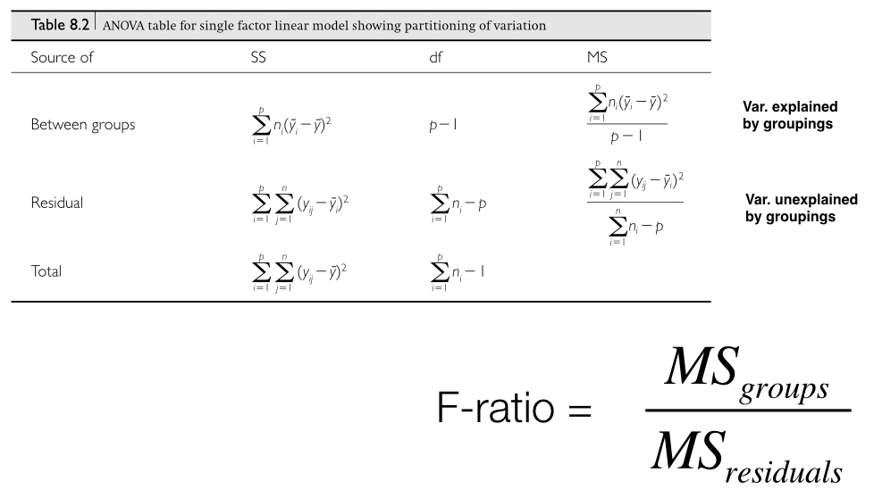
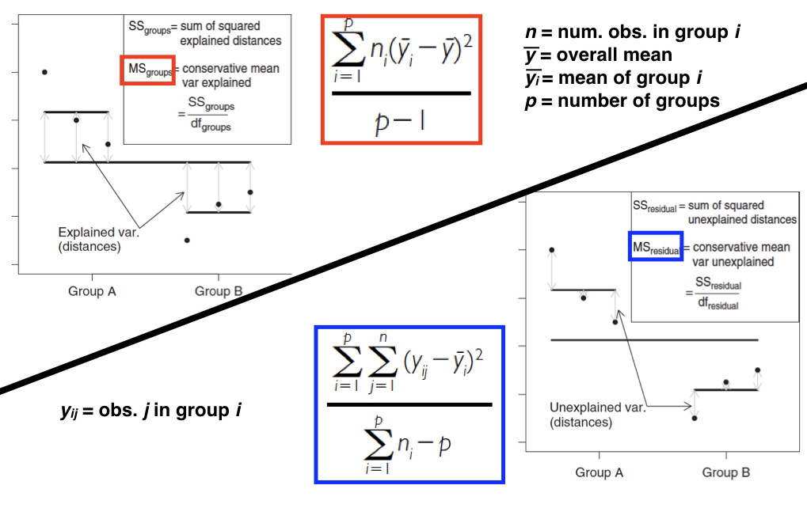

```{r setup, include=FALSE}
fig.dim <- 5
knitr::opts_chunk$set(fig.width=2*fig.dim,
                      fig.height=fig.dim,
                      fig.align='center')
set.seed(23)
library(tidyverse)
library(matrixStats)
```

# Outline

## Goal

To compare means of something between groups.

. . .

Related topics:

- When can you do it, and how well? Power, false positive rate.
- How can experiments best do it? Experimental design.
- Methods: two-sample $t$-test, (one-way) ANOVA, permutation tests


# Comparing means


## Example:

How different are AirBnB prices between neighbourhoods?

```{r get_airbnb, warning=FALSE}
airbnb <- read.csv("../Datasets/portland-airbnb-listings.csv", stringsAsFactors=TRUE)
airbnb$price <- as.numeric(gsub("$", "", airbnb$price, fixed=TRUE))
airbnb$neighbourhood[airbnb$neighbourhood == ""] <- NA
(neighbourhood_counts <- sort(table(airbnb$neighbourhood), decreasing=TRUE))
```

##

Let's take only the ten biggest neighbourhoods:

```{r clean_airbnb}
big_neighbourhoods <- names(neighbourhood_counts)[1:10]
sub_bnb <- subset(airbnb, !is.na(price) & neighbourhood %in% big_neighbourhoods)
sub_bnb <- droplevels(sub_bnb[, c("price", "neighbourhood", "host_id")])
nrow(sub_bnb)
```

##

Look at the data:

```{r plot_boxes}
par(mar=c(9, 3, 1, 1)+.1)
plot(price ~ neighbourhood, data=sub_bnb, fill=grey(0.8), las=2, xlab='')
```

. . .

Preliminary conclusions?
Formal questions?


# ANOVA

## The ANOVA model

The *price* $P_{ij}$ of the $j$th room in neighbourhood $i$ is
$$\begin{equation}
    P_{ij} = \mu + \alpha_i + \epsilon_{ij} ,
\end{equation}$$
where

- $\mu$ is the overall mean
- $\alpha_i$ is the mean deviation of neighborhood $i$ from $\mu$
- $\epsilon_{ij}$ is what's left over ("error", or "residual")

. . .

In words,
$$\begin{equation}
    \text{(price)} = \text{(group mean)} + \text{(residual)}
\end{equation}$$

## ANOVA 

- Stands for ANalysis Of VAriance
- Core statistical procedure in biology
- Developed by R.A. Fisher in the early 20th Century
- Core idea: ask how much variation exists within vs. among groups
- ANOVAs are linear models that have categorical predictor and continuous response variables
- The categorical predictors are often called factors, and can have two or more levels

## Question 1: what are the means?

```{r airbnb_anova1}
summary(lm(price ~ neighbourhood, data = sub_bnb))
```

## Question 2: is there group heterogeneity?

I.e.: do mean prices differ by neighborhood?

. . .

How would *you* do this?

Design a statistic that would be big
if mean prices are different between neighborhoods,
and will be small if all neighborhoods are the same.

## Question 2, answered by ANOVA

```{r airbnb_anova2}
anova(lm(formula = price ~ neighbourhood, data = sub_bnb))
```

## 



##



## One or more predictor variables

* One-way ANOVAs just have a single factor

* Multi-factor ANOVAs

    - Factorial - two or more factors and their interactions
    - Nested - the levels of one factor are contained within another level
    - The models can be quite complex

* ANOVAs use an $F$-statistic to test factors in a model

    - Ratio of two variances (numerator and denominator)
    - The numerator and denominator d.f. need to be included (e.g. $F_{1, 34} = 29.43$)

* Determining the appropriate test ratios for complex ANOVAs takes some work

## Assumptions

* Normally distributed groups

    - robust to non-normality if equal variances and sample sizes

* Equal variances across groups

    - okay if largest-to-smallest variance ratio < 3:1
    - problematic if there is a mean-variance relationship among groups

* Observations in a group are independent

    - randomly selected
    - don’t confound group with another factor


