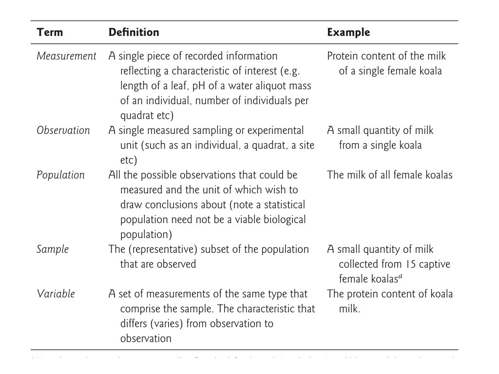

```{r setup, include=FALSE}
fig.dim <- 4
knitr::opts_chunk$set(fig.width=2*fig.dim,
                      fig.height=fig.dim,
                      fig.align='center')
set.seed(23)
library(tidyverse)
library(matrixStats)
```


# Experimental design

## Goals of an experiment

What do we want to know?

. . .

How do we measure it?

. . .

This can be done by *observation* or *experiment*.


## What's an experiment?

An *experiment* is a study in which the values of important variables
(e.g., group membership, dosage)
are determined by the *experimenters*.

Otherwise, it is an *observational* study.

. . .

Note that controlling the set-up doesn't necessarily make it a *good* experiment.

## A biological example to get us started

Say you perform an experiment on two different strains of stickleback fish, one from an ocean population (RS) and one from a freshwater lake (BP) by making them microbe free. Microbes in the gut are known to interact with the gut epithelium in ways that lead to a proper maturation of the immune system.

**Experimental setup:** 
You decide to carry out an experiment by treating multiple fish from each strain so that some of them have a conventional microbiota, and some of them are inoculated with only one bacterial species. You then measure the levels of gene expression in the stickleback gut using RNA-seq. Because you have a suspicion that the sex of the fish might be important, you track it too.

<!-- comment this out: use later?
**Getting the data ready to analyze:**
How should the data set be organized to best analyze it? What are the properties of the variables, and why does that matter?
-->

## 


##

{width=75%}

:::{.caption}
from Logan, *Biostatistical Design and Analysis Using R*
:::

## What makes a good study?

- Will we have the *power* to detect the effect of interest?

    * What are the sources of *noise*? 
    * How big do we expect the effect to be?

- How generalizable will the results be?

    * How *representative* is the sample? Of what group?

- What are possible *causal* explanations?

    * What are possible *confounding factors*?


## Considerations

1. Where do the samples come from?
2. Sample size, replication, and balance across groups
3. Controls: setting up good comparisons
4. Randomization!

. . .

For (2), remember that
$$\begin{equation}
    \text{(margin of error)} \propto \frac{\sigma}{\sqrt{n}} .
\end{equation}$$

## 

*Toxoplasma gondii* infection rates and measures of aggregate neuroticism:

::: {.smaller}

::: {.smaller}
```{r toxoplasma, echo=FALSE}
tox <- structure(list(country = c("Argentina", "Australia", "Austria", 
    "Belgium", "Brazil", "China", "Croatia", "Czech Rep", "Denmark", 
    "Ethiopia", "France", "Germany", "Hungary", "Indonesia", "Ireland", 
    "Italy"), prevalence = c(52.7, 28, 36, 46.8, 66.9, 24.3, 37.4, 
    26.6, 22, 16.4, 45, 42.7, 58.9, 46.2, 25, 32.6), N18 = c(51.3, 
    48.6, 48.3, 49.6, 53.7, 53.1, 49.3, 51.4, 50.3, 48.8, 52.7, 48.1, 
    53.8, 50, 50.1, 52.6), country = c("Japan", "Netherlands", "Norway", 
    "Peru", "Poland", "South Korea", "Slovenia", "Spain", "Sweden", 
    "Switzerland", "Thailand", "Turkey", "UK", "USA", "Yugoslavia", 
    ""), prevalence = c(12.3, 24.5, 8.6, 32.9, 46.5, 4.3, 30.9, 22.7, 
    12.5, 36.7, 11.2, 46.8, 6.6, 12.3, 66.8, NA), N18 = c(50.7, 48.6, 
    47.4, 48.5, 50.7, 48.4, 50.6, 49.7, 46.3, 47.5, 48.9, 51.4, 50.1, 
    48.1, 51.1, NA)), row.names = c(NA, -16L), class = "data.frame")
knitr::kable(tox)
```
:::

:::

:::{.caption}
Lafferty 2006, *Can the common brain parasite, Toxoplasma gondii, influence human culture?*
:::


