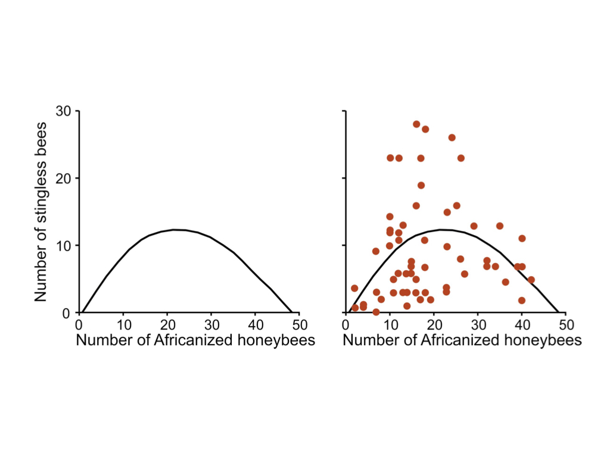
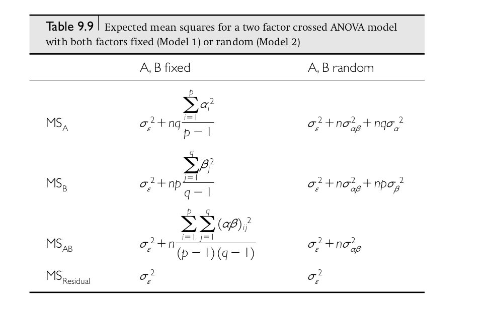

```{r setup, include=FALSE}
fig.dim <- 4
knitr::opts_chunk$set(fig.width=2*fig.dim,
                      fig.height=fig.dim,
                      fig.align='center')
set.seed(23)
library(matrixStats)
library(tidyverse)
```
```{r setup_data, include=FALSE}
read_pantheria <- function(dirname) {
    pantheria <- read.table(file.path(dirname, "PanTHERIA_WR05_mammals.txt"),
                            header=TRUE, check.names=FALSE, stringsAsFactors=FALSE, sep="\t")
    names(pantheria) <- gsub("^MSW05_", "", gsub("^[0-9-]*_", "", names(pantheria)))
    pantheria$Order <- factor(pantheria$Order)
    pantheria$Family <- factor(pantheria$Family)
    pantheria$Genus <- factor(pantheria$Genus)
    translations <- list(ActivityCycle = c("nocturnal", "crepuscular", "diurnal"),
                         Terrestriality = c("fossorial", "ground_dwelling"),
                         TrophicLevel = c("herbivore", "omnivore", "carnivore"))
    for (col in names(pantheria)) {
        a <- pantheria[[col]]
        if (is.numeric(a)) {
            a[a == -999] <- NA
        }
        if (col %in% names(translations)) {
            a <- factor(translations[[col]][a], levels=translations[[col]])
        }
        pantheria[[col]] <- a
    }
    return(pantheria)
}
```

# Outline

##

1. Permutation tests
2. Visualization
3. Means in many combinations of groups, i.e., multi-way ANOVA

# Permutation tests


## 

```{r ttest, echo=FALSE, warning=FALSE}
airbnb <- read.csv("../Datasets/portland-airbnb-listings.csv")
airbnb$price <- as.numeric(gsub("$", "", airbnb$price, fixed=TRUE))
airbnb$instant_bookable <- (airbnb$instant_bookable == "t")
t.test(airbnb$price[airbnb$instant_bookable], airbnb$price[!airbnb$instant_bookable])
```

**But,** the $t$ test relies on *Normality*.
Is the distribution of AirBnB prices too "wierd"?
How can we be sure?

. . .

Methods:

1. Remove the big values and try again.

2. Use a nonparametric test.


## Remove the big values


(demonstration)


## The permutation test

*Observation:*
**If** there was no meaningful difference in prices between "instant bookable" and not,
**then randomly shuffling that label** won't change anything.

. . .

Strategy:

1. Shuffle the `instant_bookable` column.
2. Compute the difference in means.
3. Repeat, many times.
4. Compare: the $p$-value is the proportion of "shuffled" values more extreme than observed.

. . .

{.finger width="15%"} 
*Why* is this a $p$-value?  For what hypothesis?

## Shuffle once

```{r shuf}
fake_is_instant <- sample(airbnb$instant_bookable)
(mean(airbnb$price[fake_is_instant], na.rm=TRUE) - 
                mean(airbnb$price[!fake_is_instant], na.rm=TRUE))
```

## Many times

```{r many_shuf}
real_diff <- (mean(airbnb$price[airbnb$instant_bookable], na.rm=TRUE) - 
               mean(airbnb$price[!airbnb$instant_bookable], na.rm=TRUE))
permuted_diffs <- replicate(1000, {
        fake_is_instant <- sample(airbnb$instant_bookable)
        (mean(airbnb$price[fake_is_instant], na.rm=TRUE) - 
               mean(airbnb$price[!fake_is_instant], na.rm=TRUE))
   } )
hist(permuted_diffs, xlab="shuffled differences in mean", xlim=range(c(permuted_diffs, real_diff)))
abline(v=real_diff, col='red', lwd=3)
```

## How surprising was the real value?

```{r perm_p}
mean(abs(permuted_diffs) > abs(real_diff))
```

. . .

> The difference in price between instant bookable and not instant bookable
> is highly statistically significant ($p \approx 0.001$, permutation test).


## Your turn

Do the analogous thing for the ANOVA
comparing price between neighbourhoods:
```{r anvoa_again}
anova(lm(price ~ neighbourhood, data=airbnb))
```

## in class

```{r in_class, cache=TRUE}

true_F <- anova(lm(price ~ neighbourhood, data=airbnb))[["F value"]][1]

# do this a lot of times:
## DO NOT put the randomness here: fake_neighbourhood <- sample(airbnb$neighbourhood)
fake_Fs <- replicate(1000, {
    fake_neighbourhood <- sample(airbnb$neighbourhood)  # randomness must be here
    anova(lm(price ~ fake_neighbourhood, data=airbnb))[["F value"]][1]
   })
hist(fake_Fs, xlim=range(fake_Fs, c(-1,1)*true_F), xlab="permuted F values")
abline(v=true_F, col='red', lwd=2)
```


# Visualization

## Goals

- pattern discovery

- efficient summary of information

- visual/spatial analogy for quantitative patterns


. . .

aim to *maximize information and minimize ink*

::: {.caption}
paraphrased from Edward Tufte
:::


## Considerations

- Is the visual analogy appropriate for the *type* of data? 

::: {.caption}
counts? quantities? multivariate? relationships?
:::

- Are important *comparisons* clear?

::: {.caption}
between groups? differences? time trend? 
:::

- Are *units* easily interpretable?

::: {.caption}
meters? dollars? percent? relative change? is it isometric?
:::

## Principles of effective display

- Show the data
- Encourage the eye to compare differences
- Represent magnitudes honestly and accurately
- Draw graphical elements clearly, minimizing clutter
- Make displays easy to interpret

## 

> Above all else show the data.

::: {.caption}
Tufte 1983
:::

{width=60%}


## Case study:

Distributions of litter sizes by Order, and Family, in the [PanTHERIA](../Datasets/PanTHERIA/README.html) dataset:

```{r get_pantheria, echo=1:4}
pantheria <- read_pantheria("../Datasets/PanTHERIA")
# look at most common orders
order_nums <- sort(table(pantheria$Order))
big_orders <- names(order_nums)[order_nums > 150]
order_nums
```

## note the pipe

```{r subset_pantheria}
px <- (pantheria %>% filter(Order %in% big_orders)
       %>% filter(!is.na(LitterSize))
       %>% select(Order, Family, Genus, Species, LitterSize))
for (xn in c("Order", "Family", "Genus")) px[[xn]] <- factor(px[[xn]])
summary(px)
```

## Raw numbers

```{r nums}
px$LitterSize
```


## stem-and-leaf "plot"

```{r stem}
stem(px$LitterSize)
```

## five(-ish) number summary

```{r fivenum}
summary(px$LitterSize)
```

## Points

```{r points, fig.width=3*fig.dim, fig.height=1.5*fig.dim}
plot(px$LitterSize, xlab='', ylab='Litter size', pch=20, cex=0.5)
```

## Points, sorted

```{r points2, fig.width=3*fig.dim, fig.height=1.5*fig.dim}
plot(sort(px$LitterSize), xlab='rank', ylab='Litter size', pch=20, cex=0.5)
```

## Points, sorted and colored

```{r points3, fig.width=3*fig.dim, fig.height=1.5*fig.dim}
plot(sort(px$LitterSize), col=px$Order, xlab='rank', ylab='Litter size', pch=20, cex=0.5)
legend("topleft", pch=20, col=1:nlevels(px$Order), legend=levels(px$Order))
```


## Histogram


```{r hist, fig.width=3*fig.dim, fig.height=1.5*fig.dim}
layout(t(1:2))
with(px, hist(LitterSize))
with(px, hist(LitterSize, breaks=40))
```

## Histograms

```{r many_hist_code, eval=FALSE}
layout(matrix(1:6, ncol=3, byrow=TRUE), heights=c(1, 1.2))
opar <- par(mar=c(1, 3, 1, 1)+.1)
xh <- hist(px$LitterSize, plot=FALSE, breaks=30)
for (k in 1:nlevels(px$Order)) {
    ord <- levels(px$Order)[k]
    if (k == 4) par(opar)
    with(subset(px, Order == ord), 
        hist(LitterSize, xlim=c(0, max(px$LitterSize)),
             breaks=xh$breaks, main=ord,
             xaxt=if (k > 3) 's' else 'n',
             xlab=if (k > 3) 'litter size' else '') )
}
```

## Histograms

```{r many_hist, echo=FALSE, fig.width=3*fig.dim, fig.height=1.5*fig.dim}
layout(matrix(1:6, ncol=3, byrow=TRUE), heights=c(1, 1.2))
opar <- par(mar=c(1, 3, 1, 1)+.1)
xh <- hist(px$LitterSize, plot=FALSE, breaks=30)
for (k in 1:nlevels(px$Order)) {
    ord <- levels(px$Order)[k]
    if (k == 4) par(opar)
    with(subset(px, Order == ord), 
        hist(LitterSize, xlim=c(0, max(px$LitterSize)),
             breaks=xh$breaks, main=ord,
             xaxt=if (k > 3) 's' else 'n',
             xlab=if (k > 3) 'litter size' else '') )
}
```


## Overlaid histograms

```{r stacked_hist}
overlay_hist <- function (x, f, breaks=30, ...) {
    xh <- hist(x, breaks=breaks, plot=FALSE)
    ymax <- do.call(max, with(px, lapply(tapply(LitterSize, Order, hist, plot=FALSE), "[[", "counts")))
    for (k in 1:nlevels(f)) {
        hist(x[f==levels(f)[k]], breaks=xh$breaks, ...,
             add=(k>1), col=adjustcolor(k, 0.4), ylim=c(0, ymax))
    }
    legend("topright", fill=adjustcolor(1:nlevels(f), 0.4),
           legend=levels(f))
}
```

## Overlaid histograms

```{r do_stacked_hists, fig.width=3*fig.dim, fig.height=1.5*fig.dim}
with(px, overlay_hist(LitterSize, Order, xlab='litter size', main=''))
```

## boxplots

```{r boxplot, fig.width=3*fig.dim, fig.height=1.5*fig.dim}
with(px, boxplot(LitterSize ~ Order))
```

::: {.caption}
introduced by [Mary Eleanor Spear](https://en.wikipedia.org/wiki/Mary_Eleanor_Spear)
:::

## Many boxes


```{r boxplot3, fig.width=3*fig.dim, fig.height=1.5*fig.dim}
par(mar=c(9, 3, 1, 1) + 0.1)
with(px, boxplot(LitterSize ~ Family, las=2, xlab=''))
```


##

```{r boxplot4, fig.width=3*fig.dim, fig.height=1.5*fig.dim}
par(mar=c(9, 4, 1, 1) + 0.1)
famsize <- aggregate(LitterSize ~ Order + Family, data=px, mean)
famorder <- rank(with(famsize, LitterSize + 100 * as.numeric(Order)))
with(px, boxplot(LitterSize ~ Family, las=2, xlab='',
                 col=as.numeric(famsize$Order),
                 at=famorder))
text(x=tapply(famorder, famsize$Order, mean),
     y=10, label=levels(famsize$Order))
```

## Your turn

*Challenge:* visualize `LitterSize` by `TeatNumber`, using a boxplot.

# The Grammar of Graphics

## or, "`gg`"

- introduced by [Leland Wilkinson](https://www.springer.com/gp/book/9780387245447)

- adopted by [Hadley Wickham](http://hadley.nz/) in the `ggplot` library

- thinks of plots as *objects*

- see [this chapter](https://r4ds.had.co.nz/data-visualisation.html) of *R for Data Science*

## Ingredients of a visualization

> - data
> 
> - coordinate axes
> 
> - a `geom`etric representation of numbers
> 
> - a mapping from (summaries of) variables to properties of the geoms
> 
> - maybe more plots


## basic template

```{r basic, eval=FALSE}
ggplot(data = <DATA>) + 
  <GEOM_FUNCTION>(mapping = aes(<MAPPINGS>))

```

## more options

```{r notbasic, eval=FALSE}
ggplot(data = <DATA>) + 
  <GEOM_FUNCTION>(
     mapping = aes(<MAPPINGS>),
     stat = <STAT>, 
     position = <POSITION>
  ) +
  <COORDINATE_FUNCTION> +
  <FACET_FUNCTION>
```

*Reference:* the [ggplot2 book](https://ggplot2-book.org/index.html).

## Points

```{r ggpoints}
ggplot(px, mapping=aes(x=Order, y=LitterSize)) + geom_point()
```


##

::: {.columns}
::::::: {.column width=50%}

```{r ggplot, fig.width=1.5*fig.dim}
(ggplot(px,
        mapping=aes(x=1:nrow(px),
                    y=LitterSize,
                    col=Order))
 + xlab("")
 + geom_point())
```

:::
::::::: {.column width=50%}

```{r ggplot2, fig.width=1.5*fig.dim}
(ggplot(px,
        mapping=aes(x=rank(LitterSize,
                           ties.method='first'),
                    y=LitterSize,
                    col=Order))
 + xlab("rank")
 + geom_point())
```

:::
:::::::

## Histogram

```{r gghist, fig.width=3*fig.dim, fig.height=1.5*fig.dim}
ggplot(px, mapping=aes(LitterSize)) + geom_histogram(bins=40) + facet_wrap(~ Order)
```

## Histogram, stacked

```{r gghist2, fig.width=3*fig.dim, fig.height=1.5*fig.dim}
ggplot(px, mapping=aes(LitterSize, fill=Order)) + geom_histogram(bins=40)
```

## Boxplot

```{r boxplot2, fig.width=3*fig.dim, fig.height=1.5*fig.dim}
ggplot(px, mapping=aes(y=LitterSize, x=Order)) + geom_boxplot()
```

## Your turn, again

*Challenge:* make this plot.

```{r fancyplot, echo=FALSE, fig.width=3*fig.dim, fig.height=1.5*fig.dim, warning=FALSE}
# hey, no peeking!
ggplot(pantheria, mapping=aes(x=factor(TeatNumber), y=LitterSize)) +
    geom_boxplot(fill=adjustcolor('blue', 0.5)) +
    geom_jitter(col=adjustcolor('black', 0.4)) +
    xlab("Teat number")
```


The [cheatsheet](https://rstudio.com/wp-content/uploads/2015/03/ggplot2-cheatsheet.pdf) might be helpful.


# Multivariate ANOVA


## The factorial ANOVA model

Say we have $n$ observations coming from combinations of *two* factors,
so that the $k$th observation in the $i$th group of factor $A$ and the $j$th group of factor $B$ is
$$\begin{equation}
    X_{ijk} = \mu + \alpha_i + \beta_j + \gamma_{ij} + \epsilon_{ijk} ,
\end{equation}$$
where

- $\mu$: overall mean
- $\alpha_i$: mean deviation of group $i$ of factor A from $\mu$ and average of B,
- $\beta_j$: mean deviation of group $j$ of factor B from $\mu$ and average of A,
- $\gamma_{ij}$: mean deviation of combination $i + j$ from $\mu + \alpha_i + \beta_j$, and
- $\epsilon_{ijk}$: what's left over ("error", or "residual")

. . .

In words,
$$\begin{equation} \begin{split}
    \text{(value)} &= \text{(overall mean)} + \text{(A group mean)}
    \\ &\qquad {}
    + \text{(B group mean)} + \text{(AB group mean)} + \text{(residual)}
\end{split}\end{equation}$$

## Example: pumpkin pie

We're looking at how mean pumpkin weight depends on both

- fertilizer input, and
- late-season watering

. . .

So, we

1. divide a large field into many plots
2. randomly assign plots to either "high", "medium", or "low" fertilizer, and
3. independently, assign plots to either "no late water" or "late water"; then
4. plant a fixed number of plants per plot,
5. grow pumpkins and measure their weight.

## Questions:

> 1. How does mean weight depend on fertilizer?
> 2. ... or, on late-season water?
> 3. Does the effect of fertilizer depend on late-season water?
> 4. How much does mean weight differ between different plants in the same conditions?
> 5. ... and, between *plots* of the same conditions?
> 6. How much does weight of different pumpkins on the same plant differ?

. . .

*draw the pictures*

## First, a simplification

{.finger width="15%"} 
Ignore any "plant" and "plot" effects.

*(e.g., only one pumpkin per vine and one plot per combination of conditions)*

## 

Say that $i=1, 2, 3$ indexes fertilizer levels (low to high),
and $j=1, 2$ indexes late watering (no or yes), and
$$\begin{equation}\begin{split}
    X_{ijk} 
    &=  \text{(weight of $k$th pumpkin in plot with conditions $i$, $j$)} \\
    &= \mu + \alpha_i + \beta_j + \gamma_{ij} + \epsilon_{ijk} ,
\end{split}\end{equation}$$
where

- $\mu$: 
- $\alpha_i$: 
- $\beta_j$: 
- $\gamma_{ij}$: 
- $\epsilon_{ijk}$: 


## Making it real with simulation

A good way to get a better concrete understanding of something
is by *simulating* it --

. . .

by writing code to generate a (random) dataset that you design to look, more or less
like what you expect the real data to look like.

. . .

This lets you explore statistical power, choose sample sizes, etcetera...
but also makes you realize things you hadn't, previously.

## First, make up some numbers

- $\mu$: 
- $\alpha_i$: 
- $\beta_j$: 
- $\gamma_{ij}$: 
- $\epsilon_{ijk}$: 


## Next, a data format

```{r data_fromat}
head( expand.grid(
          fertilizer=c("low", "medium", "high"),
          water=c("no water", "water"),
          plot=1:4,
          plant=1:5,
          weight=NA))
```

## Exercise: simulation

*demo*


# Questions that (linear models and) ANOVA can answer

## What are (estimates of) the coefficents?

```{r sim_data, include=FALSE}
if (!exists("pumpkins")) {
    pumpkins <- expand.grid(
              fertilizer=c("low", "medium", "high"),
              water=c("no water", "water"),
              plot=1:4,
              plant=1:5)
    alpha <- c(low=0, medium=4, high=4)
    beta <- c("no water"=0, water=-2)
    pumpkins$weight <- with(pumpkins,
               25 + alpha[fertilizer] + beta[water] + rnorm(nrow(pumpkins), sd=5))
}

ggplot(pumpkins) + geom_boxplot(aes(x=fertilizer:water, y=weight, fill=water))
par(mar=c(4,8,1,1)+.1)
boxplot(weight ~ fertilizer:water, data=pumpkins, las=2, ylab='',
        horizontal=TRUE, col=rep(c('red', 'blue'), each=3))

```

```{r lm}
summary(lm(weight ~ fertilizer + water, data=pumpkins))
```

## Do different fertilizer levels differ? water?

```{r anova}
summary(aov(weight ~ fertilizer + water, data=pumpkins))
```

--------------

Or equivalently,
```{r anova2}
anova(lm(weight ~ fertilizer + water, data=pumpkins))
```

## What are all those numbers?


## What do they mean?



## Which levels are different from which other ones?

. . .

John Tukey [has a method](https://en.wikipedia.org/wiki/Tukey%27s_range_test) for that.

##

```
> ?TukeyHSD

TukeyHSD                 package:stats                 R Documentation

Compute Tukey Honest Significant Differences

Description:

     Create a set of confidence intervals on the differences between
     the means of the levels of a factor with the specified family-wise
     probability of coverage.  The intervals are based on the
     Studentized range statistic, Tukey's ‘Honest Significant
     Difference’ method.

...

     When comparing the means for the levels of a factor in an analysis
     of variance, a simple comparison using t-tests will inflate the
     probability of declaring a significant difference when it is not
     in fact present.  This because the intervals are calculated with a
     given coverage probability for each interval but the
     interpretation of the coverage is usually with respect to the
     entire family of intervals.
```

## Example

```{r hsd}
TukeyHSD(aov(weight ~ fertilizer + water, data=pumpkins))
```

## Does the effect of fertilizer depend on water?

```{r aov}
summary(aov(weight ~ fertilizer * water, data=pumpkins))
```

--------------

Or equivalently,
```{r aov2}
anova(lm(weight ~ fertilizer * water, data=pumpkins))
```

## Nested model analysis

```{r nested_anova}
anova(lm(weight ~ fertilizer * water, data=pumpkins),
      lm(weight ~ fertilizer + water, data=pumpkins),
      lm(weight ~ fertilizer, data=pumpkins))
```

# Formulas

## Anatomy of a formula

```
  weight ~ fertilizer + water
```

is read something like

> mean weight is determined by additive effects of fertlizer and of water

. . .

$$\begin{equation}\begin{split}
    y &\sim x \qquad \text{means} \\
    y &= a + b x + \text{(mean-zero noise)} .
\end{split}\end{equation}$$

## Intercepts

The intercept is included implicitly, so these are equivalent:
```
  weight ~ fertilizer + water
  weight ~ 1 + fertilizer + water
```

. . .

... so if you *don't* want an intercept, do
```
  weight ~ 0 + fertilizer + water
```

## Interactions

To assign an effect to each element of a *crossed* design, use `:`, e.g.
```
  weight ~ fertilizer + water + fertilizer:water
```

. . .

which is the same as
```
  weight ~ fertilizer * water
```
since lower-order effects are included implicitly.


## A translation table

- `~` : depends on
- `+` : and also, independently
- `:` : in combination with
- `*` : and also
- `I(x+y)` : actually `x` plus `y`
- `I(x^2)` : actually `x` squared

. . .

Trickier things:

- `1` : an intercept
- `0` : but not an intercept
- `-` : but not
- `.` : all columns not otherwise in the formula
- `x/y` : `x`, and `y` nested within `x` (same as `x + x:y`)

## The secret to formulas


. . .

If you want to know what a formula is *really* doing,
look at its `model.matrix( )`,
whose columns correspond to the coefficients of the resulting model.

```{r model_matrix}
model.matrix(~ fertilizer, data=pumpkins)
```

------------

```{r model_matrix2}
model.matrix(~ fertilizer + water, data=pumpkins)
```

------------

```{r model_matrix3}
model.matrix(~ 0 + fertilizer * water, data=pumpkins)
```

## Exercise: what's the difference?

```{r lm1, eval=FALSE}
summary(lm(weight ~ fertilizer + water, data=pumpkins))
summary(lm(weight ~ 0 + fertilizer + water, data=pumpkins))
summary(lm(weight ~ 0 + water + fertilizer, data=pumpkins))
```
