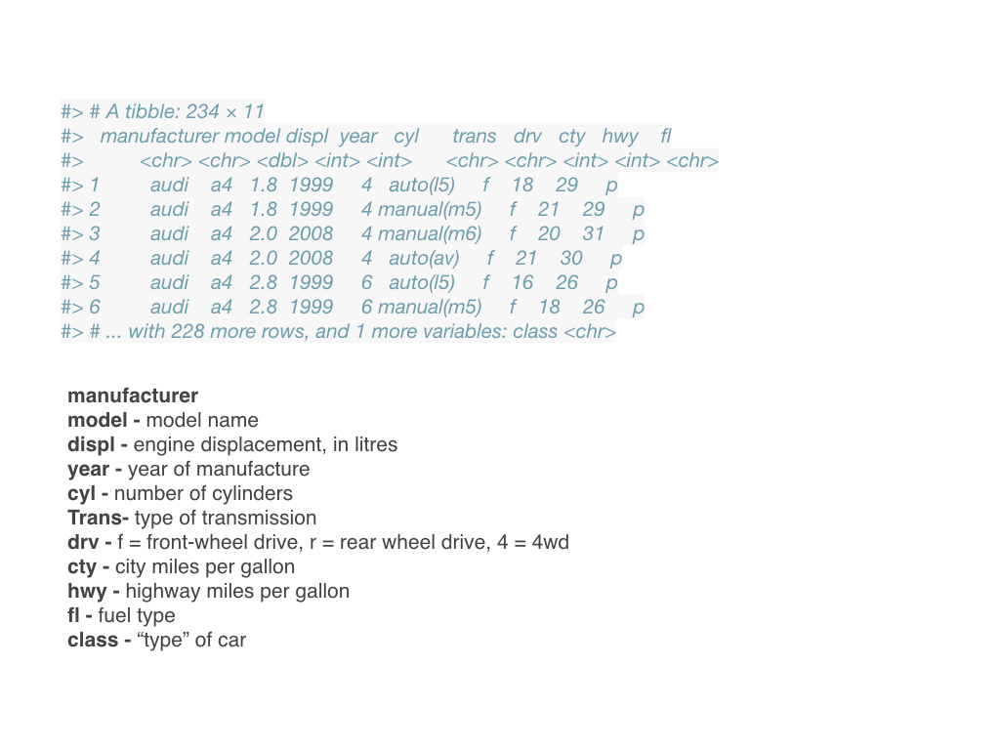
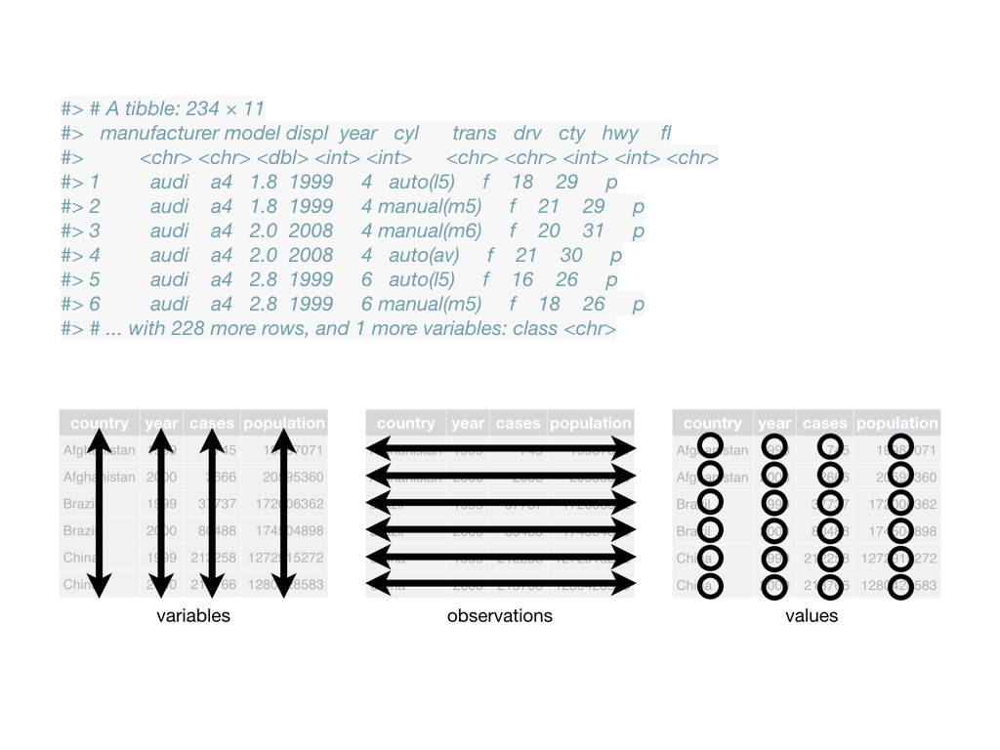

```{r setup, include=FALSE}
fig.dim <- 4
knitr::opts_chunk$set(fig.width=2*fig.dim,
                      fig.height=fig.dim,
                      fig.align='center')
set.seed(23)
library(tidyverse)
library(matrixStats)
```

```{r get_data, include=FALSE}
de_dollar <- function(x) {
    # strip off a leading "$" and convert to numeric
    return(as.numeric(gsub("$", "", x, fixed=TRUE)))
}
airbnb <- read.csv("../Datasets/portland-airbnb-listings.csv", stringsAsFactors=TRUE)
airbnb$price <- de_dollar(airbnb$price)
airbnb$cleaning_fee <- de_dollar(airbnb$cleaning_fee)
airbnb$neighbourhood[airbnb$neighbourhood == ""] <- NA
```


# Tidy data

## Checklist for data tidiness

- Store a copy of data in a nonproprietary format, (e.g. plain ASCII text)
- Leave an uncorrected file when doing analyses
- Use descriptive names for your data files and variables
- Include a header line with descriptive variable names
- Maintain effective metadata about the data (a README)
- Add new observations to a dataset by *row*
- Add new variables to a dataset by *column*
- A column of data should contain only one data type
- All measurements of the same type should be in the same column


## Wide data

*Number of eggs laid by 16 chickens of five breeds:*

::: {.smaller}
```{r tableex, echo=FALSE}
x <- cbind(data.frame(breed=c("rhode island red", "white leghorn", "barred rock", "jersey giant", "australorp")),
           matrix(c(5, 6, NA, NA, NA, NA,
                    7, 5, 6, 8,  NA,  NA,
                    3, 2, 4, 4,  3, 4,
                    5, 2, 8, NA, NA, NA,
                    4, NA, NA, NA, NA, NA), byrow=TRUE, nrow=5))
knitr::kable(x)
```
:::

## 

The same data, *long*:

::: {.smaller}
```{r tableex2, echo=FALSE}
eggs <- na.omit(data.frame(
        breed=rep(x$breed, ncol(x)-1),
        num_eggs=unlist(x[,-1])
     ))
eggs <- eggs[order(match(eggs$breed, x[,1])),]
rownames(eggs) <- NULL
knitr::kable(eggs)
```
:::


## Exercise

::: {.columns}
::::::: {.column width=50%}

Design a tidy data format for the stickleback experiment:
two strains of stickleback were made microbe free,
placed in tanks and either innoculated with microbes or not,
then had their gene expression measured with RNA-seq.
Sex is recorded, also.

:::
::::::: {.column width=50%}

{width=100%}

:::
:::::::

# The tidyverse

## Tools for tidy data

Tidying data is *hard*!

. . .

... and often requires expert input.

. . .

Many common *data wrangling* operations
are made easier by the [tidyverse](https://tidyverse.org).

## The "tidyverse"


- packages that do many of the same things as base functions in R

- designed to do them more "cleanly"

- also includes `ggplot` (for "Grammar of Graphics")

## A "tibble" is a data frame




## A "tibble" is a data frame



## Key functions in dplyr

- Pick observations by their values with `filter()`.
- Reorder the rows with `arrange()`.
- Pick variables by their names with `select()`.
- Create new variables with functions of existing variables with `mutate()`.
- Collapse many values down to a single summary with `summarise()`.

## `select()`, `filter()`, and `arrange()`

```
a1 <- select(airbnb, neighbourhood, price, host_id, beds, bathrooms)
```

```
a2 <- filter(a1, neighbourhood == "Richmond" 
                 | neighbourhood == "Woodlawn"
                 | neighbourhood == "Downtown")
```

```
a3 <- arrange(a2, price, neighbourhood)
```

## Also, the "pipe"

```
a3 <- (airbnb %>% select(neighbourhood, price, host_id, beds, bathrooms)
        %>% filter(neighbourhood == "Richmond" 
                     | neighbourhood == "Woodlawn"
                     | neighbourhood == "Downtown")
        %>% arrange(price, neighbourhood))
```

## 

Tidyverse:
```
a3 <- (airbnb %>% select(neighbourhood, price, host_id, beds, bathrooms)
        %>% filter(neighbourhood == "Richmond" 
                     | neighbourhood == "Woodlawn"
                     | neighbourhood == "Downtown")
        %>% arrange(price, neighbourhood))
```

. . .

Base:
```
a1 <- airbnb[,c("neighbourhood", "price", "host_id", "beds", "bathrooms")]
a2 <- subset(a1, neighbourhood %in% c("Richmond", "Woodlawn", "Downtown"))
a3 <- a2[order(a2$price, a2$price), ]
```


## `mutate()` and `transmutate()`

Add new variables:
```
mutate(a3,
    price_per_bed = price / beds,
    price_per_bath = price / bathrooms)
```
Or, make an entirely new data frame:
```
transmute(airbnb,
    price = price,
    price_per_bed = price / beds,
    price_per_bath = price / bathrooms)
```

## `group_by()` and `summarize()`

`group_by()` aggregates data by category, e.g.:
```
by_hood <- group_by(a3, neighbourhood)
```
Now, you can calculate *summaries* of other variables *within* each group, e.g.:
```
summarise(by_hood, price = mean(price, na.rm = TRUE))
```

## Your turn

1. Make a data frame only including rooms in the top ten neighbourhoods (use `n( )` to count them).
    Then, using only these neighbourhoods...

2. Find the mean `price`, `cleaning_fee`, and ratio of cleaning fee to price, by neighbourhood.

3. Edit your code in (2) to add variables for the 25% and 75% quantile of `price` (use `quantile( )`).

4. Do as in (2) and (3) but splitting by both `neighbourhood` and `room_type`
   (e.g., finding the mean price of private rooms in Woodlawn).

5. Edit your code in (1) to add a new variable giving the number of characters in the `house_rules` (use `nchar( )`).

## Only top ten neighbourhoods

*To get you started:*
```{r top_ten}
neighbourhood_counts <- (airbnb
                         %>% group_by(neighbourhood) %>% summarize(count=n())
                         %>% arrange(count))
top_ten <- neighbourhood_counts$neighbourhood[nrow(neighbourhood_counts) - 0:9]
sub_bnb <- filter(airbnb, neighbourhood %in% top_ten) %>% droplevels
```
