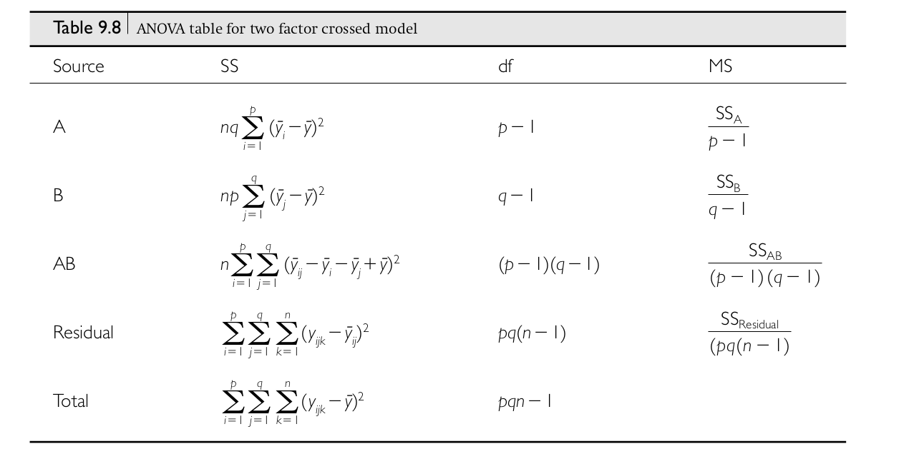

```{r setup, include=FALSE}
fig.dim <- 4
knitr::opts_chunk$set(fig.width=2*fig.dim,
                      fig.height=fig.dim,
                      fig.align='center')
set.seed(23)
library(matrixStats)
library(tidyverse)
```

# Outline

##

Linear models...

1. with categorical variables (multivariate ANOVA)
2. with continuous variables (least-squares regression)
3. and likelihood (where's "least-squares" come from).

# Multivariate ANOVA


## The factorial ANOVA model

Say we have $n$ observations coming from combinations of *two* factors,
so that the $k$th observation in the $i$th group of factor $A$ and the $j$th group of factor $B$ is
$$\begin{equation}
    X_{ijk} = \mu + \alpha_i + \beta_j + \gamma_{ij} + \epsilon_{ijk} ,
\end{equation}$$
where

- $\mu$: overall mean
- $\alpha_i$: mean deviation of group $i$ of factor A from $\mu$ and average of B,
- $\beta_j$: mean deviation of group $j$ of factor B from $\mu$ and average of A,
- $\gamma_{ij}$: mean deviation of combination $i + j$ from $\mu + \alpha_i + \beta_j$, and
- $\epsilon_{ijk}$: what's left over ("error", or "residual")

. . .

In words,
$$\begin{equation} \begin{split}
    \text{(value)} &= \text{(overall mean)} + \text{(A group mean)}
    \\ &\qquad {}
    + \text{(B group mean)} + \text{(AB group mean)} + \text{(residual)}
\end{split}\end{equation}$$

## Example: pumpkin pie

We're looking at how mean pumpkin weight depends on both

- fertilizer input, and
- late-season watering

. . .

So, we

1. divide a large field into many plots
2. randomly assign plots to either "high", "medium", or "low" fertilizer, and
3. independently, assign plots to either "no late water" or "late water"; then
4. plant a fixed number of plants per plot,
5. grow pumpkins and measure their weight.

## Questions:

> 1. How does mean weight depend on fertilizer?
> 2. ... or, on late-season water?
> 3. Does the effect of fertilizer depend on late-season water?
> 4. How much does mean weight differ between different plants in the same conditions?
> 5. ... and, between *plots* of the same conditions?
> 6. How much does weight of different pumpkins on the same plant differ?

. . .

*draw the pictures*

## First, a simplification

{.finger width="15%"} 
Ignore any "plant" and "plot" effects.

*(e.g., only one pumpkin per vine and one plot per combination of conditions)*

## 

Say that $i=1, 2, 3$ indexes fertilizer levels (low to high),
and $j=1, 2$ indexes late watering (no or yes), and
$$\begin{equation}\begin{split}
    X_{ijk} 
    &=  \text{(weight of $k$th pumpkin in plot with conditions $i$, $j$)} \\
    &= \mu + \alpha_i + \beta_j + \gamma_{ij} + \epsilon_{ijk} ,
\end{split}\end{equation}$$
where

- $\mu$: 
- $\alpha_i$: 
- $\beta_j$: 
- $\gamma_{ij}$: 
- $\epsilon_{ijk}$: 


## Making it real with simulation

A good way to get a better concrete understanding of something
is by *simulating* it --

. . .

by writing code to generate a (random) dataset that you design to look, more or less
like what you expect the real data to look like.

. . .

This lets you explore statistical power, choose sample sizes, etcetera...
but also makes you realize things you hadn't, previously.

## First, make up some numbers

- $\mu$: 
- $\alpha_i$: 
- $\beta_j$: 
- $\gamma_{ij}$: 
- $\epsilon_{ijk}$: 


## Next, a data format

```{r data_fromat}
head( expand.grid(
          fertilizer=c("low", "medium", "high"),
          water=c("no water", "water"),
          plot=1:4,
          plant=1:5,
          weight=NA))
```

## Exercise: simulation

IN CLASS:

```{r sim_datas}
# true values for means
mu <- 10  # pounds
alpha <- c(high=5, medium=0, low=-5)
beta <- c("no water"=-3, water=3)
gamma <- c("low.no water" = 0,
           "medium.no water" = 0,
           "high.no water" = 0,
           "low.water" = 0,
           "medium.water" = -3,
           "high.water" = -6)
sigma <- 0.5

pumpkins <- expand.grid(
              fertilizer=c("low", "medium", "high"),
              water=c("no water", "water"),
              plot=1:4,
              plant=1:5,
              weight=NA)

pumpkins$mean_weight <- (mu + alpha[as.character(pumpkins$fertilizer)]
                         + beta[as.character(pumpkins$water)]
                         + gamma[paste(as.character(pumpkins$fertilizer),
                                       as.character(pumpkins$water), sep=".")])

pumpkins$weight <- rnorm(nrow(pumpkins),
                         mean=pumpkins$mean_weight,
                         sd=sigma)

write.table(pumpkins, file="data/pumpkins.tsv")
```

-------------

IN CLASS:
```{r check_sim}
par(mar=c(4, 8, 1, 1)+.1)
boxplot(weight ~ water * fertilizer, data=pumpkins, horizontal=TRUE, las=2, ylab='')
```

------------

The simulated dataset is available at [data/pumpkins.tsv](data/pumpkins.tsv).

# Questions that (linear models and) ANOVA can answer

## What are (estimates of) the coefficents?

```{r sim_data, include=FALSE}
if (!exists("pumpkins")) {
    pumpkins <- expand.grid(
              fertilizer=c("low", "medium", "high"),
              water=c("no water", "water"),
              plot=1:4,
              plant=1:5)
    alpha <- c(low=0, medium=4, high=4)
    beta <- c("no water"=0, water=-2)
    pumpkins$weight <- with(pumpkins,
               25 + alpha[fertilizer] + beta[water] + rnorm(nrow(pumpkins), sd=5))
}

ggplot(pumpkins) + geom_boxplot(aes(x=fertilizer:water, y=weight, fill=water))
par(mar=c(4,8,1,1)+.1)
boxplot(weight ~ fertilizer:water, data=pumpkins, las=2, ylab='',
        horizontal=TRUE, col=rep(c('red', 'blue'), each=3))

```

```{r lm}
summary(lm(weight ~ fertilizer + water, data=pumpkins))
```

## Do different fertilizer levels differ? water?

```{r anova}
summary(aov(weight ~ fertilizer + water, data=pumpkins))
```

--------------

Or equivalently,
```{r anova2}
anova(lm(weight ~ fertilizer + water, data=pumpkins))
```

## What are all those numbers?



## What do they mean?


## Which levels are different from which other ones?

. . .

John Tukey [has a method](https://en.wikipedia.org/wiki/Tukey%27s_range_test) for that.

##

```
> ?TukeyHSD

TukeyHSD                 package:stats                 R Documentation

Compute Tukey Honest Significant Differences

Description:

     Create a set of confidence intervals on the differences between
     the means of the levels of a factor with the specified family-wise
     probability of coverage.  The intervals are based on the
     Studentized range statistic, Tukey's ‘Honest Significant
     Difference’ method.

...

     When comparing the means for the levels of a factor in an analysis
     of variance, a simple comparison using t-tests will inflate the
     probability of declaring a significant difference when it is not
     in fact present.  This because the intervals are calculated with a
     given coverage probability for each interval but the
     interpretation of the coverage is usually with respect to the
     entire family of intervals.
```

## Example

```{r hsd}
TukeyHSD(aov(weight ~ fertilizer + water, data=pumpkins))
```

## Does the effect of fertilizer depend on water?

```{r mlm}
summary(aov(weight ~ fertilizer * water, data=pumpkins))
```

-----------

```{r aov}
summary(lm(weight ~ fertilizer * water, data=pumpkins))
```


--------------

Or equivalently,
```{r aov2}
anova(lm(weight ~ fertilizer * water, data=pumpkins))
```

# Model comparison with ANOVA

## The idea

Me: *Hey, I made our model more complicated, and look, it fits better!*

. . .

You: *Yeah, of course it does. How much better?*

. . .

Me: *How can we tell?*

. . .


You: *Well, does it reduce the residual variance more than you'd expect by chance?*

## The $F$ statistic

To compare two models,
$$\begin{aligned}
F 
    &= \frac{\text{(explained variance)}}{\text{(residual variance)}} \\
    &= \frac{\text{(mean square model)}}{\text{(mean square residual)}} \\
    &= \frac{\frac{\text{RSS}_1 - \text{RSS}_2}{p_2-p_1}}{\frac{\text{RSS}_2}{n-p_2}}
\end{aligned}$$

## Nested model analysis

```{r nested_anova}
anova(
      lm(weight ~ water, data=pumpkins),
      lm(weight ~ fertilizer + water, data=pumpkins),
      lm(weight ~ fertilizer * water, data=pumpkins)
)
```

## Your turn

Do a stepwise model comparison of nested linear models,
including `plant` and `plot` in the analysis.
Think about what *order* to do the comparison in.
Make sure they are nested!

# Formulas

## Anatomy of a formula

```
  weight ~ fertilizer + water
```

is read something like

> mean weight is determined by additive effects of fertlizer and of water

. . .

$$\begin{equation}\begin{split}
    y &\sim x \qquad \text{means} \\
    y &= a + b x + \text{(mean-zero noise)} .
\end{split}\end{equation}$$

## Intercepts

The intercept is included implicitly, so these are equivalent:
```
  weight ~ fertilizer + water
  weight ~ 1 + fertilizer + water
```

. . .

... so if you *don't* want an intercept, do
```
  weight ~ 0 + fertilizer + water
```

## Interactions

To assign an effect to each element of a *crossed* design, use `:`, e.g.
```
  weight ~ fertilizer + water + fertilizer:water
```

. . .

which is the same as
```
  weight ~ fertilizer * water
```
since lower-order effects are included implicitly.


## A translation table

- `~` : depends on
- `+` : and also, independently
- `:` : in combination with
- `*` : and also
- `I(x+y)` : actually `x` plus `y`
- `I(x^2)` : actually `x` squared

. . .

Trickier things:

- `1` : an intercept
- `0` : but not an intercept
- `-` : but not
- `.` : all columns not otherwise in the formula
- `x/y` : `x`, and `y` nested within `x` (same as `x + x:y`)

## The secret to formulas


. . .

If you want to know what a formula is *really* doing,
look at its `model.matrix( )`,
whose columns correspond to the coefficients of the resulting model.

```{r model_matrix}
model.matrix(~ fertilizer, data=pumpkins)
```

-----------------

```{r plot_model_matrix}
matplot(
    model.matrix(~ fertilizer, data=pumpkins),
    type='l')
```

------------

```{r model_matrix2}
model.matrix(~ fertilizer + water, data=pumpkins)
```


------------

```{r plot_model_matrix2}
matplot(
    model.matrix(~ fertilizer + water, data=pumpkins),
    type='l')
```

------------

```{r model_matrix3, echo=2}
options(width=200)
model.matrix(~ 0 + fertilizer * water, data=pumpkins)
```

------------

```{r plot_model_matrix3}
matplot(
    model.matrix(~ 0 + fertilizer * water, data=pumpkins),
    type='l')
```

## Note:

For fine control of factors in linear models, either

- relevel them, or
- manually set their `contrasts`.

## Exercise:

Make formulas that give you estimates of

1. A global mean ($\mu$), two fertilizer effects ($\alpha_\text{medium}$ and $\alpha_\text{high}$),
    and one water effect ($\gamma_\text{water}$).

2. Three fertilizer effects ($\alpha_\text{low}$, $\alpha_\text{medium}$ and $\alpha_\text{high}$),
    and one water effect ($\gamma_\text{water}$).

3. Two fertilizer effects ($\alpha_\text{medium}$ and $\alpha_\text{high}$),
    and two water effect ($\gamma_\text{no water}$ and $\gamma_\text{water}$).

4. A single mean for each of the six conditions 
   ($\gamma_\text{high, water}$, $\gamma_\text{medium, water}$, $\gamma_\text{low, water}$, 
   $\gamma_\text{high, no water}$, $\gamma_\text{medium, no water}$, $\gamma_\text{low, no water}$).

## Example:

1. A global mean ($\mu$), two fertilizer effects ($\alpha_\text{medium}$ and $\alpha_\text{high}$),
    and one water effect ($\gamma_\text{water}$).

*Example:*
```{r lm1}
summary(lm(weight ~ fertilizer + water, data=pumpkins))
```

# Linear models

## Parent-offspring "regression"

```{r plot_galton, echo=FALSE, fig.width=2.0*fig.dim, fig.height=1.5*fig.dim}
galton <- read.table("../Datasets/galton/galton-all.tsv", header=TRUE)
gdiff <- diff(with(galton, tapply(height, gender, mean)))
galton$midparent <- (galton$mother + galton$father - gdiff)/2
galton$adj_height <- galton$height - (galton$gender == "M") * gdiff
(ggplot(galton, mapping=aes(x=adj_height, y=midparent)) + geom_jitter(cex=3)
 + geom_smooth(method='lm') + geom_abline(aes(intercept=0, slope=1), lwd=2, col='red')
 + coord_fixed() + xlab("midparent height") + ylab("child height"))
```

## A note on history


## A note on history


## A note on history

> This resulted in Galton's formulation of the Law of Ancestral Heredity, which
> states that the two parents of an offspring jointly contribute one half of an
> offspring's heritage, while more-removed ancestors constitute a
> smaller proportion of the offspring's heritage. Galton viewed reversion as a
> spring, that when stretched, would return the distribution of traits back to
> the normal distribution. 
> When Mendel's principles were rediscovered in 1900, this resulted in a fierce
> battle between the followers of Galton's Law of Ancestral Heredity, the
> biometricians, and those who advocated Mendel's principles.

::: {.caption}
[Francis Galton, Wikipedia](https://en.wikipedia.org/wiki/Francis_Galton)
:::

## Covariance and correlation

Pearson's product-moment correlation coefficient:
$$
r = \frac{\sum_{i=1}^n (x_i - \bar x) (y_i - \bar y)}{\sqrt{\sum_{i=1}^n (y_i - \bar y)^2} \sqrt{\sum_{i=1}^n (y_i - \bar y)^2}}
$$

. . .

```
> help(cor)

Correlation, Variance and Covariance (Matrices)

Description:

     ‘var’, ‘cov’ and ‘cor’ compute the variance of ‘x’ and the
     covariance or correlation of ‘x’ and ‘y’ if these are vectors.  If
     ‘x’ and ‘y’ are matrices then the covariances (or correlations)
     between the columns of ‘x’ and the columns of ‘y’ are computed.

     ‘cov2cor’ scales a covariance matrix into the corresponding
     correlation matrix _efficiently_.

Usage:

     var(x, y = NULL, na.rm = FALSE, use)
     
     cov(x, y = NULL, use = "everything",
         method = c("pearson", "kendall", "spearman"))
     
     cor(x, y = NULL, use = "everything",
         method = c("pearson", "kendall", "spearman"))

```

## Covariance and correlation

```{r plot_cors, echo=FALSE, fig.width=2.5*fig.dim, fig.height=1.5*fig.dim}
layout(matrix(1:6, nrow=2))
par(mar=c(5,4,1,1)+.1)
for (r in c(0, 0.2, 0.5, 0.7, -0.7, 0.9)) {
    n <- 100
    x <- rnorm(n)
    y <- r * x + sqrt(1 - r^2) * rnorm(n)
    plot(x, y, main=sprintf("r = %0.1f", r))
    abline(coef(lm(y~x)))
}
```

## Anscombe's quartet

```{r plot_ansc, echo=FALSE, fig.width=2.0*fig.dim, fig.height=1.5*fig.dim}
data(anscombe)
layout(matrix(1:4, nrow=2))
par(mar=c(5,4,1,1)+.1)
for (k in 1:4) {
    x <- anscombe[[paste0("x", k)]]
    y <- anscombe[[paste0("y", k)]]
    plot(x, y, main=sprintf("r = %0.3f, var(x) = %0.0f, var(y) = %0.0f", cor(x,y), var(x), var(y)), pch=20, cex=2)
    abline(coef(lm(y~x)))
}
```

## Linear models

$$
\text{(response)} = \text{(intercept)} + \text{(explanatory variables)} + \text{("error"})
$$
in the general form:
$$
    y_i = \beta_0 + \beta_1 x_{i1} + \cdots + \beta_k x_{ik} + \epsilon_i ,
$$
where $\beta_0, \beta_1, \ldots, \beta_k$ are the *parameters* of the linear model.

. . .

Goal: find $b_0, \ldots, b_k$ to *best fit* the model:
$$
    y_i = b_0 + b_1 x_{i1} + \cdots + \beta_k x_{ik} + e_i,
$$
so that $b_i$ is an *estimate* of $\beta_i$ and $e_i$ is the *residual*, an estimate of $\epsilon_i$.

## Least-squares fitting of a linear model

Define the *predicted values*:
$$
    \hat y_i = b_0 + b_1 x_{i1} + \cdots + \beta_k x_{ik},
$$
and find $b_0, \ldots, b_k$ to minimize the *sum of squared residuals*, or
$$
    \sum_i \left(y_i - \hat y_i\right)^2 .
$$

. . .

Amazing fact:
if $k=1$ then $$b_1 = r \frac{\text{sd}(y)}{\text{sd}(x)} .$$

. . .

Relationship to likelihood: the Normal distribution.

## Demonstration: heights

Let's recreate Galton's classic analysis:
midparent height, adjusted for gender, is a good predictor of child height.
*(How good?)*

Link to [the data](../Datasets/galton/galton-all.tsv).
```{r read_galton}
galton <- read.table("../Datasets/galton/galton-all.tsv", header=TRUE)
head(galton)
```
