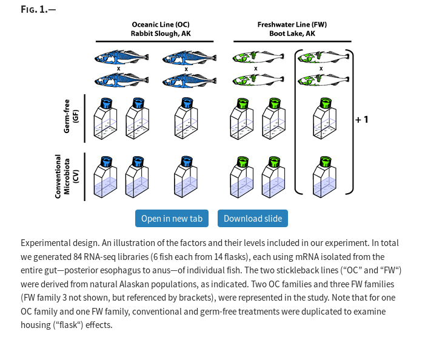

```{r setup, include=FALSE}
fig.dim <- 4
knitr::opts_chunk$set(fig.width=2*fig.dim,
                      fig.height=fig.dim,
                      fig.align='center')
set.seed(23)
library(tidyverse)
library(matrixStats)
library(lme4)
```


# Multiple comparisons

## A silly example

Suppose 100 people did 100 well-executed experiments
to ask if snails move faster while listening to metal than to mozart.

. . .

How many would find a statistically significant difference at $p < 0.05$?

. . .

Would any find a large effect size?

## A less silly example

Suppose someone conducts a well-controlled study
that records coronavirus infection rates
and the mean daily consumption of 100 different foods
in a bunch of people.

. . .

How many of the foods would be statistically significantly associated with lower infection rates at $p < 0.05$?

. . .

Would any have a large effect size?

## The problem

A $p$-value is

> the probability of seeing something at least as extreme as what was seen in the data,
> if the null hypothesis were true.

. . .

So, if the null hypothesis *is* true, then **by definition**,
$p$-values are uniformly distributed between 0 and 1,

. . .

and so $\P\{ p < 0.05 \} = 0.05$.

## The Bonferroni Correction

A cutoff of $p < 0.05$ ensures you should not wrongly reject the null hypothesis more than 5% of the time.

. . .

But, if you do $n$ different tests, all at once?

. . .

To keep the probability of not wrongly rejecting *any* of the $n$ null hypotheses
to 5%,
take a cutoff of $p < 0.05/n$.


## Example: Bonferroni

```{r null, fig.width=3*fig.dim, fig.height=1.5*fig.dim}
tp <- replicate(1000, t.test(rnorm(20))$p.value)
layout(t(1:2))
hist(tp, breaks=40, xlab='p-value')
plot(sort(tp), xlim=c(1,100), ylim=c(0, 0.1), ylab='p-values, sorted')
abline(h=c(0.05, 0.05/length(tp)), col=1:2)
legend("topright", lty=1, col=1:2, legend=paste("p=", c(0.05, 0.05/length(tp))))
```

## False Discovery Rate

To tolerate *some* errors, control the *false discovery rate*.

. . . 

Suppose you test 1,000 different songs to see if they make snails go faster, 
obtain a $p$-value for each song, 
set a threshold $p_0$, 
and study further those with $p < p_0$. 

. . . 

We expect* *no* false positives 
if $p_0 = 0.05 / 1000 = 0.00005$ (**Bonferroni**). 
($*$*at the 5% level*)

. . .

If $p_0$ is set to have a 5% *false discovery rate*, \
and 100 songs fall below the threshold, \
then we expect about 5 of these to be *false positives*.

## 

```
> help(p.adjust)

p.adjust                 package:stats                 R Documentation

Adjust P-values for Multiple Comparisons

Description:

     Given a set of p-values, returns p-values adjusted using one of
     several methods.

Usage:

     p.adjust(p, method = p.adjust.methods, n = length(p))
     
     p.adjust.methods
     # c("holm", "hochberg", "hommel", "bonferroni", "BH", "BY",
     #   "fdr", "none")
     
Arguments:

       p: numeric vector of p-values (possibly with ‘NA’s).  Any other
          R object is coerced by ‘as.numeric’.

  method: correction method, a ‘character’ string.  Can be abbreviated.

       n: number of comparisons, must be at least ‘length(p)’; only set
          this (to non-default) when you know what you are doing!

Details:

     The adjustment methods include the Bonferroni correction
     (‘"bonferroni"’) in which the p-values are multiplied by the
     number of comparisons.  Less conservative corrections are also
     included by Holm (1979) (‘"holm"’), Hochberg (1988)
     (‘"hochberg"’), Hommel (1988) (‘"hommel"’), Benjamini & Hochberg
     (1995) (‘"BH"’ or its alias ‘"fdr"’), and Benjamini & Yekutieli
     (2001) (‘"BY"’), respectively.  A pass-through option (‘"none"’)
     is also included.  The set of methods are contained in the
     ‘p.adjust.methods’ vector for the benefit of methods that need to
     have the method as an option and pass it on to ‘p.adjust’.

     The first four methods are designed to give strong control of the
     family-wise error rate.  There seems no reason to use the
     unmodified Bonferroni correction because it is dominated by Holm's
     method, which is also valid under arbitrary assumptions.

     Hochberg's and Hommel's methods are valid when the hypothesis
     tests are independent or when they are non-negatively associated
     (Sarkar, 1998; Sarkar and Chang, 1997).  Hommel's method is more
     powerful than Hochberg's, but the difference is usually small and
     the Hochberg p-values are faster to compute.

     The ‘"BH"’ (aka ‘"fdr"’) and ‘"BY"’ methods of Benjamini,
     Hochberg, and Yekutieli control the false discovery rate, the
     expected proportion of false discoveries amongst the rejected
     hypotheses.  The false discovery rate is a less stringent
     condition than the family-wise error rate, so these methods are
     more powerful than the others.

     Note that you can set ‘n’ larger than ‘length(p)’ which means the
     unobserved p-values are assumed to be greater than all the
     observed p for ‘"bonferroni"’ and ‘"holm"’ methods and equal to 1
     for the other methods.

Value:

     A numeric vector of corrected p-values (of the same length as ‘p’,
     with names copied from ‘p’).

References:

     Benjamini, Y., and Hochberg, Y. (1995).  Controlling the false
     discovery rate: a practical and powerful approach to multiple
     testing.  _Journal of the Royal Statistical Society Series B_,
     *57*, 289-300.  <URL: http://www.jstor.org/stable/2346101>.

     Benjamini, Y., and Yekutieli, D. (2001).  The control of the false
     discovery rate in multiple testing under dependency.  _Annals of
     Statistics_, *29*, 1165-1188.  doi: 10.1214/aos/1013699998 (URL:
     https://doi.org/10.1214/aos/1013699998).

     Holm, S. (1979).  A simple sequentially rejective multiple test
     procedure.  _Scandinavian Journal of Statistics_, *6*, 65-70.
     <URL: http://www.jstor.org/stable/4615733>.

     Hommel, G. (1988).  A stagewise rejective multiple test procedure
     based on a modified Bonferroni test.  _Biometrika_, *75*, 383-386.
     doi: 10.2307/2336190 (URL: https://doi.org/10.2307/2336190).

     Hochberg, Y. (1988).  A sharper Bonferroni procedure for multiple
     tests of significance.  _Biometrika_, *75*, 800-803.  doi:
     10.2307/2336325 (URL: https://doi.org/10.2307/2336325).

     Shaffer, J. P. (1995).  Multiple hypothesis testing.  _Annual
     Review of Psychology_, *46*, 561-584.  doi:
     10.1146/annurev.ps.46.020195.003021 (URL:
     https://doi.org/10.1146/annurev.ps.46.020195.003021).  (An
     excellent review of the area.)

     Sarkar, S. (1998).  Some probability inequalities for ordered MTP2
     random variables: a proof of Simes conjecture.  _Annals of
     Statistics_, *26*, 494-504.  doi: 10.1214/aos/1028144846 (URL:
     https://doi.org/10.1214/aos/1028144846).

     Sarkar, S., and Chang, C. K. (1997).  The Simes method for
     multiple hypothesis testing with positively dependent test
     statistics.  _Journal of the American Statistical Association_,
     *92*, 1601-1608.  doi: 10.2307/2965431 (URL:
     https://doi.org/10.2307/2965431).

     Wright, S. P. (1992).  Adjusted P-values for simultaneous
     inference.  _Biometrics_, *48*, 1005-1013.  doi: 10.2307/2532694
     (URL: https://doi.org/10.2307/2532694).  (Explains the adjusted
     P-value approach.)

See Also:

     ‘pairwise.*’ functions such as ‘pairwise.t.test’.

Examples:

     require(graphics)
     
     set.seed(123)
     x <- rnorm(50, mean = c(rep(0, 25), rep(3, 25)))
     p <- 2*pnorm(sort(-abs(x)))
     
     round(p, 3)
     round(p.adjust(p), 3)
     round(p.adjust(p, "BH"), 3)
     
     ## or all of them at once (dropping the "fdr" alias):
     p.adjust.M <- p.adjust.methods[p.adjust.methods != "fdr"]
     p.adj    <- sapply(p.adjust.M, function(meth) p.adjust(p, meth))
     p.adj.60 <- sapply(p.adjust.M, function(meth) p.adjust(p, meth, n = 60))
     stopifnot(identical(p.adj[,"none"], p), p.adj <= p.adj.60)
     round(p.adj, 3)
     ## or a bit nicer:
     noquote(apply(p.adj, 2, format.pval, digits = 3))
     
     
     ## and a graphic:
     matplot(p, p.adj, ylab="p.adjust(p, meth)", type = "l", asp = 1, lty = 1:6,
             main = "P-value adjustments")
     legend(0.7, 0.6, p.adjust.M, col = 1:6, lty = 1:6)
     
     ## Can work with NA's:
     pN <- p; iN <- c(46, 47); pN[iN] <- NA
     pN.a <- sapply(p.adjust.M, function(meth) p.adjust(pN, meth))
     ## The smallest 20 P-values all affected by the NA's :
     round((pN.a / p.adj)[1:20, ] , 4)

```

## Example: False Discovery Rate

```{r null2, fig.width=3*fig.dim, fig.height=1.5*fig.dim}
layout(t(1:2))
plot(sort(tp), xlim=c(1,100), ylim=c(0, 1.0), ylab='p-values, sorted', main='p')
abline(h=0.05, col=1:2)
plot(sort(p.adjust(tp, method='fdr')), xlim=c(1,100), ylim=c(0, 1.0), ylab='FDR-adjusted p-values, sorted', main='5% FDR')
abline(h=0.05, col=1:2)
```

## Exercise:

Modify the code so that 20 of the datasets have a mean of $\mu=1$ (not zero, like below).
See how many of the $p$-values are below 0.05

- with no correction
- with Bonerroni correction
- with an FDR correction

```
tp <- replicate(1000, t.test(rnorm(20))$p.value)
sprintf("%d of the %d p-values are below 0.05.", sum(tp < 0.05), length(tp))
layout(t(1:2))
hist(tp, breaks=40, xlab='p-value')
plot(sort(tp), xlim=c(1,100), ylim=c(0, 0.1), ylab='p-values, sorted')
abline(h=c(0.05, 0.05/length(tp)), col=1:2)
legend("topright", lty=1, col=1:2, legend=paste("p=", c(0.05, 0.05/length(tp))))
```


# Many linear models

## Gene expression levels

From [*Host Genotype and Microbiota Contribute Asymmetrically to Transcriptional Variation in the Threespine Stickleback Gut*
Clayton M. Small,  Kathryn Milligan-Myhre,  Susan Bassham,  Karen Guillemin, William A. Cresko.
Genome Biology and Evolution, March 2017.](https://academic.oup.com/gbe/article/9/3/504/3058199)

- Metadata: [CVvsGF_RNAseq_Metadata.tsv](../Datasets/stickleback_GFvsCV_RNAseq/CVvsGF_RNAseq_Metadata.tsv) ([direct link](https://github.com/UO-Biostats/UO_ABS/raw/master/CLASS_MATERIALS/Datasets/stickleback_GFvsCV_RNAseq/CVvsGF_RNAseq_Metadata.tsv))
- RNA-Seq: [CVvsGF_RNAseq_CPM.tsv](../Datasets/stickleback_GFvsCV_RNAseq/CVvsGF_RNAseq_CPM.tsv") ([direct link](https://github.com/UO-Biostats/UO_ABS/raw/master/CLASS_MATERIALS/Datasets/stickleback_GFvsCV_RNAseq/CVvsGF_RNAseq_CPM.tsv))

## Study design:




## The data

```{r parse_data, cache=TRUE, fig.width=1.5*fig.dim, fig.height=1.5*fig.dim}
fish <- read.table("../Datasets/stickleback_GFvsCV_RNAseq/CVvsGF_RNAseq_Metadata.tsv", header=TRUE, sep='\t')
tmp <- read.table("../Datasets/stickleback_GFvsCV_RNAseq/CVvsGF_RNAseq_CPM.tsv", header=TRUE, sep='\t', stringsAsFactors=FALSE, check.names=FALSE)
genes <- tmp[,1:5]
expression <- as.matrix(tmp[,6:ncol(tmp)])
# consistency check
stopifnot(all(match(colnames(expression), fish$Individual) == 1:nrow(fish)))
```

There are `r nrow(genes)` genes whose expression is measured in `r nrow(fish)` fish.

--------------

```{r plot_data, echo=FALSE, fig.width=2*fig.dim, fig.height=1.5*fig.dim}
plot(rowMedians(expression), rowMads(expression), log='xy',
     xlab='median expression', ylab='MAD expression')
```

## Normalize

To put coefficients on the same scale:

```{r parse_data2}
expr <- sweep(expression, 1, rowMeans(expression), "/")
```
```{r plotdata2, echo=FALSE, fig.width=2*fig.dim, fig.height=1.5*fig.dim}
plot(rowMedians(expr), rowMads(expr), log='xy',
     xlab='median normalized expression', ylab='MAD normalized expression')
```

## 

Gene expression varies across many orders of magnitude:

```{r matplot, fig.width=3*fig.dim, fig.height=1.5*fig.dim, warning=FALSE}
matplot(expr[1:1000,], pch=20, log='y', xlab='gene', ylab='normalized expression')
```

## 

Fit *lots* of models:
```{r stickleback, cache=TRUE, dependson="parse_data"}
pop_lms <- apply(expr, 1, function (x) (lm(x ~ Population, data=fish)))
all_lms <- apply(expr, 1, function (x) (lm(x ~ Population + Treatment + Sex, data=fish)))
anovas <- mapply(anova, pop_lms, all_lms, SIMPLIFY=FALSE)
```
and extract coefficients, $p$-values
```{r pvals, cache=TRUE, dependson="stickleback"}
pop_coefs <- sapply(pop_lms, coef)
all_coefs <- sapply(all_lms, coef)
pvals <- sapply(lapply(anovas, "[[", "Pr(>F)"), "[", 2)
```

## The $p$-values

... for an ANOVA comparing
```
    gene expression ~ Population
    gene expression ~ Population + Treatment + Sex
```

```{r show_pvals}
hist(pvals, breaks=500, xlab='p-values')
```

##

`r sum(pvals < 0.05)` $p$-values are less than 0.05.

. . .

But, out of `r length(pvals)`, we'd *expect* about `r round(0.05 * length(pvals))` to be less than 0.05.

. . .

Let's look at the three *coefficients* for all the models:
```
    x ~ Population + Treatment + Sex
```

##

Coefficents, with $p < 0.05$ in red:
```{r signif, fig.width=2*fig.dim, fig.height=2*fig.dim, echo=FALSE}
pairs(t(all_coefs[2:4,]), pch=20, col=ifelse(pvals < 0.05, 'red', adjustcolor('black',0.2)))
```

##

Coefficents, with $p < 0.05/n$ in red (*Bonferroni!*):
```{r signif2, fig.width=2*fig.dim, fig.height=2*fig.dim, echo=FALSE}
pairs(t(all_coefs[2:4,]), pch=20, col=ifelse(pvals < 0.05/length(pop_lms), 'red', adjustcolor('black',0.2)))
```


## The Bonferroni Bunch

```{r which}
subset(genes, pvals < 0.05/nrow(genes))
```

## The paper

<div class=caption style="width: 150%; margin-left: -25%; font-size: 90%;">

> We limited differential expression analysis to only those genes represented
> by at least two reads per million mapped (“copies per million,” CPM) in at
> least 12 of the 84 libraries (see supplementary fig. S1, Supplementary
> Material online). We normalized read counts for these 15,847 genes using TMM
> normalization (Robinson and Oshlack 2010) as implemented by the
> calcNormFactors function of the R/Bioconductor package edgeR (Robinson et al.
> 2010). In order to perform gene-wise differential expression analyses in a
> general linear model framework (Law et al. 2014), we supplied the TMM
> normalization factors to the voom function of the R/Bioconductor package
> limma (Ritchie et al. 2015), which generated appropriately weighted log2CPM
> expression values for all observations. We then fit a linear model for each
> gene including the fixed effects of factor levels for host population, host
> family (nested within host population), sex, and microbiota treatment using
> the limma lmFit function. We did not include a library “batch” effect in the
> model because initial nMDS ordination did not suggest batch as a major source
> of transcriptional variation, and our stratified assignment of samples to
> batches controlled for any confounding effect of batch with respect to other
> factors of interest. To account for variation between replicate flasks we
> incorporated flask as a random effect in the model using the limma
> duplicateCorrelation function. Each hypothesis of interest was tested, for
> each gene, using one or more contrasts via moderated t-tests applied by the
> limma function eBayes. To evaluate the effect of our microbiota treatment we
> performed a within-OC contrast, a within-FW contrast, and an overall
> contrast. Genes expressed differentially in any of these three contrasts were
> interpreted as being associated with the presence of microbes. We performed a
> single contrast to test for an overall effect of host population, and a
> single contrast to test for an interaction between host population and
> microbiota, both of these accounting for family differences nested within
> population. Finally, we performed contrasts to test for an effect of sex and
> a sex-by-microbiota interaction. For each of these seven contrasts, we
> controlled the false discovery rate (FDR) at 0.1 using the approach of
> Benjamini and Hochberg (1995), as implemented by the limma topTable function.

</div>

# Another look at error rates

##

Suppose that I got a positive result on an HIV test.
What's the chance I am HIV positive?
(Here we *really* mean that "I" am a randomly chosen person
from the US population.)

## Background data

OraQUICK advance rapid test:
99.4% specificity and 99.8% sensitivity
(from [MLO online](https://www.mlo-online.com/the-changing-landscape-of-hiv-diagnostics.php)).

. . .

Refreshing from [Wikipedia](https://en.wikipedia.org/wiki/Sensitivity_and_specificity),
specificity is the "true positive" rate and the sensitivity is the "true negative" rate:

- if you have HIV, the chance that it (wrongly) comes out negative is .006 = 0.6%;
- if you *don't* have HIV, the chance that it (wrongly) comes out positive is .002 = 0.2%.

##

There are currently around [1.1 million people with HIV in the US](https://www.hiv.gov/hiv-basics/overview/data-and-trends/statistics),
out of a total of [328 million](https://www.census.gov/popclock/),
giving an overall rate of 0.00335 = 0.335%.

```{r rates}
true_pos <- .994
true_neg <- .998
pop_rate <- 1.1 / 328
```


## Probabilities

We want to know
$$\begin{aligned}
  & \P\{ \text{HIV+} | \text{postive test} \} \\
    & \qquad =  \frac{\P\{ \text{HIV+ and getting a positive test} \} }{ \P\{ \text{getting a positive test} \} }
\end{aligned}$$


## Making that concrete with simulation

Start with a large sample from the US population,
some of whom have HIV and others do not,
and then give them all HIV tests.

```{r do_sim}
N <- 1e6
people <- data.frame(
    hiv = runif(N) < pop_rate)
people$test <- NA
people$test[people$hiv] <- ifelse(runif(sum(people$hiv)) < true_pos, "+", "-")
people$test[!people$hiv] <- ifelse(runif(sum(!people$hiv)) < true_neg, "-", "+")
addmargins(table(status=people$hiv, test=people$test))
```

------------

```{r table_again}
addmargins(table(status=people$hiv, test=people$test))
```

For example, there are `r table(people$hiv, people$test)["FALSE", "+"]`
who do not have HIV but got a positive test result.

. . .

What is the **proportion of people who got a positive test result
who actually have HIV**?

------------

Now let's compute:
the probability we want is
the **proportion of people who got a positive test result
who actually have HIV**:
```{r get_number}
hiv_given_plus <- sum(people$hiv & (people$test == "+")) / sum(people$test == "+")
```
The proportion of the `r sum(people$test == "+")` in this sample of `r N`
that had a positive test result
that *actually* have HIV is `r sum(sum(people$hiv & (people$test == "+")))`/`r sum(people$test == "+")` = `r sprintf("%0.2f", 100 * hiv_given_plus)`%.

## Conditional probabilities

We want to compute the theoretical probability of having HIV given a positive test result,
or
$$
  P(\text{HIV} \;|\; + ) = \frac{P(\text{HIV and}\; +)}{P(+)}
$$

-----------------

The probability that a randomly chosen person from the population has HIV
*and* got a positive test on this test is
$$\begin{aligned}
P(\text{HIV}\; \text{and}\; +) &= 
  P(\text{HIV}) \times P(+ \;|\; \text{HIV}) \\
  &= 0.00335 \times 0.994 \\
  &=  0.0033299
\end{aligned}$$

------------------

We'll also need the complementary probability,
$$\begin{aligned}
P(\text{not HIV}\; \text{and}\; +) &= 
  P(\text{not HIV}) \times P(+ \;|\; \text{not HIV}) \\
  &= (1 - 0.00335) \times (1 - 0.998) \\
  &=  0.0019933
\end{aligned}$$

------------------

And, the probability that a randomly chosen person from the population
has a positive test result is
$$\begin{aligned}
 P(+)
   &= P(\text{HIV and}\; +) + P(\text{not HIV and}\; +) \\
   &= 0.0033299 + 0.0019933 \\
   &= 0.0053232.
\end{aligned}$$

------------------

Putting these together, we get that
$$\begin{aligned}
  P(\text{HIV} \;|\; + ) &= \frac{0.0033299}{0.0053232} \\
  &= 0.6255448.
\end{aligned}$$
In other words, we get a predicted probability of 62.5%.


