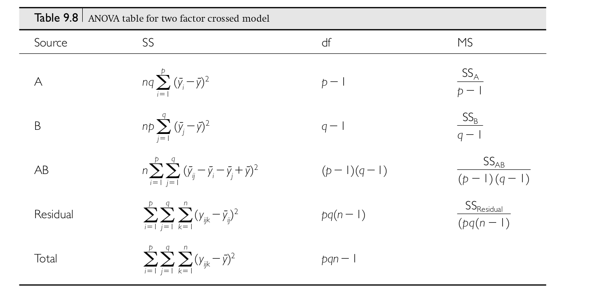
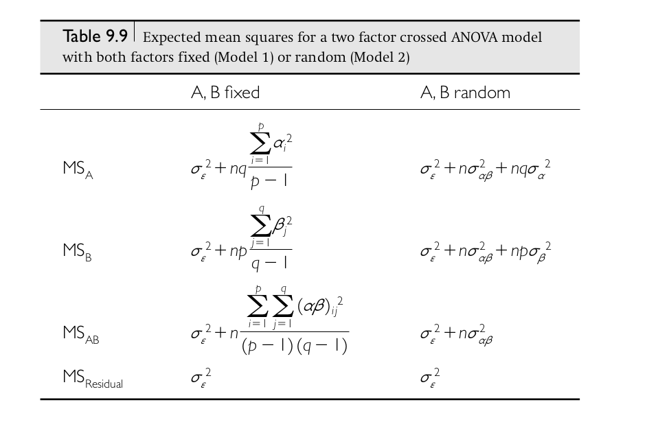

```{r setup, include=FALSE}
fig.dim <- 4
knitr::opts_chunk$set(fig.width=2*fig.dim,
                      fig.height=fig.dim,
                      fig.align='center')
set.seed(23)
library(matrixStats)
library(tidyverse)
```

# Outline

##

Linear models...

1. with categorical variables (multivariate ANOVA)
2. with continuous variables (least-squares regression)
3. and likelihood (where's "least-squares" come from).

# Multivariate ANOVA


## The factorial ANOVA model

Say we have $n$ observations coming from combinations of *two* factors,
so that the $k$th observation in the $i$th group of factor $A$ and the $j$th group of factor $B$ is
$$\begin{equation}
    X_{ijk} = \mu + \alpha_i + \beta_j + \gamma_{ij} + \epsilon_{ijk} ,
\end{equation}$$
where

- $\mu$: overall mean
- $\alpha_i$: mean deviation of group $i$ of factor A from $\mu$ and average of B,
- $\beta_j$: mean deviation of group $j$ of factor B from $\mu$ and average of A,
- $\gamma_{ij}$: mean deviation of combination $i + j$ from $\mu + \alpha_i + \beta_j$, and
- $\epsilon_{ijk}$: what's left over ("error", or "residual")

. . .

In words,
$$\begin{equation} \begin{split}
    \text{(value)} &= \text{(overall mean)} + \text{(A group mean)}
    \\ &\qquad {}
    + \text{(B group mean)} + \text{(AB group mean)} + \text{(residual)}
\end{split}\end{equation}$$

## Example: pumpkin pie

We're looking at how mean pumpkin weight depends on both

- fertilizer input, and
- late-season watering

. . .

So, we

1. divide a large field into many plots
2. randomly assign plots to either "high", "medium", or "low" fertilizer, and
3. independently, assign plots to either "no late water" or "late water"; then
4. plant a fixed number of plants per plot,
5. grow pumpkins and measure their weight.

## Questions:

> 1. How does mean weight depend on fertilizer?
> 2. ... or, on late-season water?
> 3. Does the effect of fertilizer depend on late-season water?
> 4. How much does mean weight differ between different plants in the same conditions?
> 5. ... and, between *plots* of the same conditions?
> 6. How much does weight of different pumpkins on the same plant differ?

. . .

*draw the pictures*

## First, a simplification

{.finger width="15%"} 
Ignore any "plant" and "plot" effects.

*(e.g., only one pumpkin per vine and one plot per combination of conditions)*

## 

Say that $i=1, 2, 3$ indexes fertilizer levels (low to high),
and $j=1, 2$ indexes late watering (no or yes), and
$$\begin{equation}\begin{split}
    X_{ijk} 
    &=  \text{(weight of $k$th pumpkin in plot with conditions $i$, $j$)} \\
    &= \mu + \alpha_i + \beta_j + \gamma_{ij} + \epsilon_{ijk} ,
\end{split}\end{equation}$$
where

- $\mu$: 
- $\alpha_i$: 
- $\beta_j$: 
- $\gamma_{ij}$: 
- $\epsilon_{ijk}$: 


## Making it real with simulation

A good way to get a better concrete understanding of something
is by *simulating* it --

. . .

by writing code to generate a (random) dataset that you design to look, more or less
like what you expect the real data to look like.

. . .

This lets you explore statistical power, choose sample sizes, etcetera...
but also makes you realize things you hadn't, previously.

## First, make up some numbers

- $\mu$: 
- $\alpha_i$: 
- $\beta_j$: 
- $\gamma_{ij}$: 
- $\epsilon_{ijk}$: 


## Next, a data format

```{r data_fromat}
head( expand.grid(
          fertilizer=c("low", "medium", "high"),
          water=c("no water", "water"),
          plot=1:4,
          plant=1:5,
          weight=NA))
```

## Exercise: simulation (IN CLASS)

```{r sim_data_in_class}
pumpkins <- expand.grid(
              fertilizer=c("low", "medium", "high"),
              water=c("no water", "water"),
              plot=1:4,
              plant=1:5,
              weight=NA)

# true values
mu <- 20
alpha <- c('high'=0, 'medium'=-6, 'low'=-12)
beta <- c('no water'=0, 'water'=0)
gamma <- c('high.no water'=0,
           'high.water'=0,
           'medium.no water'=0,
           'medium.water'=2,
           'low.no water'=0,
           'low.water'=-2)
weight_sd <- 1.2
pumpkins$mean_weight <- (mu
    + alpha[as.character(pumpkins$fertilizer)]
    + beta[as.character(pumpkins$water)]
    + gamma[paste(pumpkins$fertilizer, pumpkins$water, sep='.')])
pumpkins$weight <- rnorm(nrow(pumpkins),
                         mean=pumpkins$mean_weight,
                         sd=weight_sd)
write.table(pumpkins, file="data/pumpkins.tsv", sep="\t", row.names=FALSE)
```

## in class

```{r look_at_sims}

ggplot(pumpkins) + geom_boxplot(aes(x=fertilizer:water, y=weight, fill=water))
```

------------

The simulated dataset is available at [data/pumpkins.tsv](data/pumpkins.tsv).

# Questions that (linear models and) ANOVA can answer

## What are (estimates of) the coefficents?

```{r sim_data, include=FALSE}
ggplot(pumpkins) + geom_boxplot(aes(x=fertilizer:water, y=weight, fill=water))
par(mar=c(4,8,1,1)+.1)
boxplot(weight ~ fertilizer:water, data=pumpkins, las=2, ylab='',
        horizontal=TRUE, col=rep(c('red', 'blue'), each=3))

```

```{r lm}
summary(lm(weight ~ fertilizer + water, data=pumpkins))
```

## Do different fertilizer levels differ? water?

```{r anova}
summary(aov(weight ~ fertilizer + water, data=pumpkins))
```

--------------

Or equivalently,
```{r anova2}
anova(lm(weight ~ fertilizer + water, data=pumpkins))
```

## What are all those numbers?

**Note: this table assumes exactly $n$ observations in every cell.**



## What do they mean?



## Which levels are different from which other ones?

. . .

John Tukey [has a method](https://en.wikipedia.org/wiki/Tukey%27s_range_test) for that.

##

```
> ?TukeyHSD

TukeyHSD                 package:stats                 R Documentation

Compute Tukey Honest Significant Differences

Description:

     Create a set of confidence intervals on the differences between
     the means of the levels of a factor with the specified family-wise
     probability of coverage.  The intervals are based on the
     Studentized range statistic, Tukey's ‘Honest Significant
     Difference’ method.

...

     When comparing the means for the levels of a factor in an analysis
     of variance, a simple comparison using t-tests will inflate the
     probability of declaring a significant difference when it is not
     in fact present.  This because the intervals are calculated with a
     given coverage probability for each interval but the
     interpretation of the coverage is usually with respect to the
     entire family of intervals.
```

## Example

```{r hsd}
TukeyHSD(aov(weight ~ fertilizer + water, data=pumpkins))
```

## Does the effect of fertilizer depend on water?

```{r mlm}
summary(aov(weight ~ fertilizer * water, data=pumpkins))
```

-----------

```{r aov}
summary(lm(weight ~ fertilizer * water, data=pumpkins))
```


--------------

Or equivalently,
```{r aov2}
anova(lm(weight ~ fertilizer * water, data=pumpkins))
```

# Model comparison with ANOVA

## The idea

Me: *Hey, I made our model more complicated, and look, it fits better!*

. . .

You: *Yeah, of course it does. How much better?*

. . .

Me: *How can we tell?*

. . .


You: *Well, does it reduce the residual variance more than you'd expect by chance?*

## The $F$ statistic

To compare two models,
$$\begin{aligned}
F 
    &= \frac{\text{(explained variance)}}{\text{(residual variance)}} \\
    &= \frac{\text{(mean square model)}}{\text{(mean square residual)}} \\
    &= \frac{\frac{\text{RSS}_1 - \text{RSS}_2}{p_2-p_1}}{\frac{\text{RSS}_2}{n-p_2}}
\end{aligned}$$

## Nested model analysis

```{r nested_anova}
anova(
      lm(weight ~ water, data=pumpkins),
      lm(weight ~ fertilizer + water, data=pumpkins),
      lm(weight ~ fertilizer * water, data=pumpkins)
)
```

## Your turn

Do a stepwise model comparison of nested linear models,
including `plant` and `plot` in the analysis.
Think about what *order* to do the comparison in.
Make sure they are nested!

Data: [data/pumpkins.tsv](data/pumpkins.tsv)
