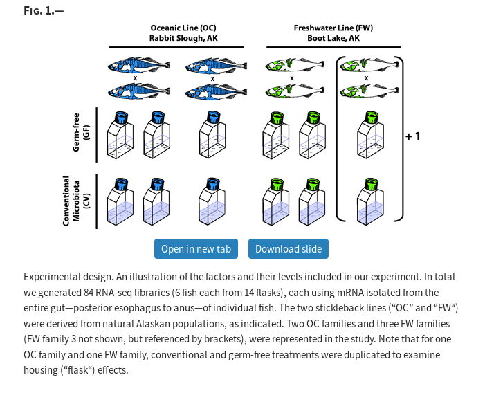

```{r setup, include=FALSE}
fig.dim <- 4
knitr::opts_chunk$set(fig.width=2*fig.dim,
                      fig.height=fig.dim,
                      fig.align='center')
set.seed(23)
library(tidyverse)
library(matrixStats)
library(lme4)
```


# Example: parent-child heights

## Demonstration: heights

Let's recreate Galton's classic analysis:
midparent height, adjusted for gender, is a good predictor of child height.
*(How good?)*

Link to [the data](../Datasets/galton/galton-all.tsv).
```{r read_galton}
galton <- read.table("../Datasets/galton/galton-all.tsv", header=TRUE)
head(galton)
```


# Random effects

## An example: urchins eat algae

From Logan:

> To investigate density-dependent grazing effects of sea urchin Andrew and Underwood
> (1993) on filamentous algae measured the percentage of filamentous algae within five
> quadrats randomly positioned within each of four random patches of reef that were in turn
> nested within four sea urchin density treatments (no urchins, 33% of natural density, 66%
> natural density and 100% natural density). The sea urchin density treatment was considered
> a fixed factor and patch within density treatment as well as the individual quadrats were
> treated as random factors.

## An example: urchins eat algae

```{r andrewdata}
andrew_data <- read.table('../Datasets/Logan_data/andrew.tsv', header=T, sep='\t')
head(andrew_data)
```

There are four variables: `TREAT`, `PATCH`, `QUAD` and `ALGAE`

Main effect factor: `TREAT`

. . .

Both `QUAD` and `PATCH` are factors:
```{r factorit}
andrew_data$QUAD <- factor(andrew_data$QUAD)
andrew_data$PATCH <- factor(andrew_data$PATCH)
andrew_data$TREAT <- factor(andrew_data$TREAT, levels=c("0%", "33%", "66%", "100%"))
```


## Experimental design

```{r tableit}
with(andrew_data, table(PATCH, QUAD, TREAT))
```

## Response distribution

```{r boxit, fig.width=2.5*fig.dim, fig.height=1.5*fig.dim}
plot(ALGAE ~ TREAT, data=andrew_data)
points(ALGAE ~ jitter(as.numeric(TREAT)), data=andrew_data, pch=20, col=1+as.numeric(PATCH)%%4)
```

##

Why is this wrong?

```{r lme_urchins}
summary(lm(ALGAE ~ TREAT, data=andrew_data))
```

##

What we really want:
$$
\text{(algae)} = \text{(mean for treatment)} + \text{(mean offset for patch)} + \text{("noise")} .
$$

. . .

We *could* do:
```
ALGAE ~ TREAT + PATCH
```
... but do we care about all those patch means?

##

```{r do_biglm}
summary(lm(ALGAE ~ TREAT + PATCH, data=andrew_data))
```

## Random effects

Small modification:
$$
\text{(algae)} = \text{(mean for treatment)} + \text{(random offset for patch)} + \text{("noise")} .
$$

. . .

We add a *random intercept*:
```
ALGAE ~ TREAT + (1|PATCH)
```

## 

```{r do_lmer}
library(lme4)
alglm <- lmer(ALGAE ~ TREAT + (1|PATCH), data=andrew_data)
summary(alglm)
```

##

```{r compare_lmer}
anova(
      lmer(ALGAE ~ TREAT + (1|PATCH), data=andrew_data),
      lm(ALGAE ~ TREAT, data=andrew_data))
```

##

```{r compare_lmer2}
anova(
      lmer(ALGAE ~ TREAT + (1|PATCH), data=andrew_data),
      lmer(ALGAE ~ (1|PATCH), data=andrew_data))
```


## What *are* the random effects?

```{r ranef}
ranef(alglm)
```

##

```{r plot_ranef}
rfs <- ranef(alglm)$PATCH
ses <- rfs[,1] + outer(sqrt(as.vector(attr(rfs, "postVar"))), c(-2, 2), "*")
plot(rfs[,1], 1:nrow(rfs), xlab='patch mean', xlim=range(ses), ylab='')
segments(x0=ses[,1], x1=ses[,2], y0=1:nrow(rfs))
abline(v=0, col='red')
```


# Back to the height data

## Your turn

1. Add a *random effect* of `family` to the model.
2. How big is the "family" effect?
3. Assess significance by using `anova( )` to compare to a nested model.
4. Sketch out how to do a permutation test to do the same thing.


# Multiple comparisons

## 14-dpf gnotobiotic stickleback experiment

[CVvsGF_RNAseq_Metadata.tsv](../Datasets/stickleback_GFvsCV_RNAseq/CVvsGF_RNAseq_Metadata.tsv)

- factor level assignments for individual fish

[CVvsGF_RNAseq_CPM.tsv](../Datasets/stickleback_GFvsCV_RNAseq/CVvsGF_RNAseq_CPM.tsv")

- normalized RNA-Seq data (copies per million) for 84 experimental fish
- only contains information for genes with reliable count data in at least some libraries
- also includes annotation information for genes
- genes especially subject to sex-biased expression should be on "groupXIX" from 6-12 Mb

Link to paper: https://academic.oup.com/gbe/article/9/3/504/3058199

## Study design:




##

```{r stickleback, cache=TRUE}
fish <- read.table("../Datasets/stickleback_GFvsCV_RNAseq/CVvsGF_RNAseq_Metadata.tsv", header=TRUE, sep='\t')
tmp <- read.table("../Datasets/stickleback_GFvsCV_RNAseq/CVvsGF_RNAseq_CPM.tsv", header=TRUE, sep='\t', stringsAsFactors=FALSE, check.names=FALSE)
genes <- tmp[,1:5]
expression <- as.matrix(tmp[,6:ncol(tmp)])
# sanity check
stopifnot(all(match(colnames(expression), fish$Individual) == 1:nrow(fish)))

expr <- sweep(expression, 1, rowMedians(expression), "/")

pop_coefs <- apply(expr, 1, function (x) coef(lm(x ~ Population, data=fish)))
all_coefs <- apply(expr, 1, function (x) coef(lm(x ~ Population + Treatment + Sex, data=fish)))

# genes: pitx1, bmp6, tsh-beta-2
# chromosome 19!

```
