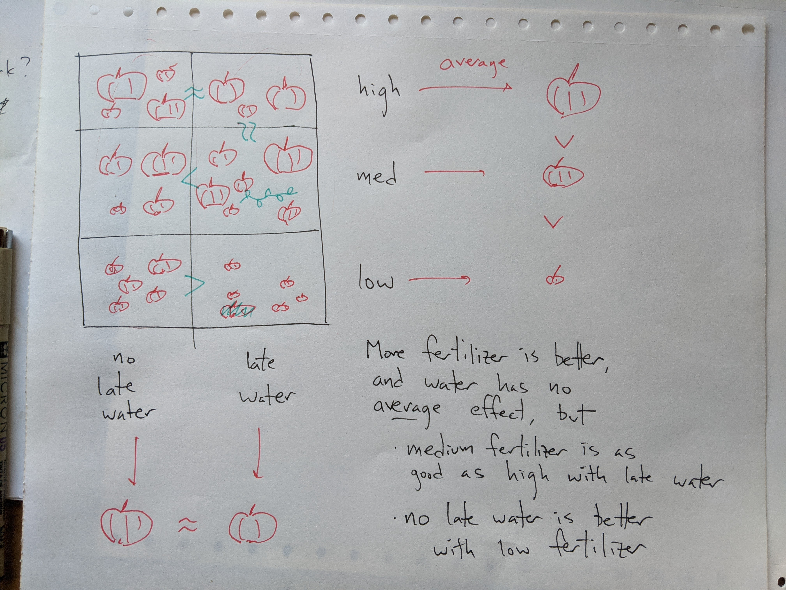

```{r setup, include=FALSE}
fig.dim <- 4
knitr::opts_chunk$set(fig.width=2*fig.dim,
                      fig.height=fig.dim,
                      fig.align='center')
set.seed(23)
library(tidyverse)
library(matrixStats)
library(lme4)
```


# Model comparison with ANOVA

## Recall the pumpkins

{width=90%}

## 

```{r pumpkins}
pumpkins <- read.table("data/pumpkins.tsv", header=TRUE)
pumpkins$plot <- factor(pumpkins$plot)
head(pumpkins)
```


## Questions:

> 1. How does mean weight depend on fertilizer?
> 2. ... or, on late-season water?
> 3. Does the effect of fertilizer depend on late-season water?
> 4. How much does mean weight differ between different plants in the same conditions?
> 5. ... and, between *plots* of the same conditions?

## Additive model

```{r pumpkin_lm}
summary(lm(weight ~ fertilizer + water, data=pumpkins))
```

##

3. Does the effect of fertilizer depend on late-season water?


## ... and, with interactions

```{r pumpkin_lm2}
summary(lm(weight ~ fertilizer * water, data=pumpkins))
```

## The idea

Me: *Hey, I made our model more complicated, and look, it fits better!*

. . .

You: *Yeah, of course it does. How much better?*

. . .

Me: *How can we tell?*

. . .


You: *Well, does it reduce the residual variance more than you'd expect by chance?*

## The $F$ statistic

To compare two models,
$$\begin{aligned}
F 
    &= \frac{\text{(explained variance)}}{\text{(residual variance)}} \\
    &= \frac{\text{(mean square model)}}{\text{(mean square residual)}} \\
    &= \frac{\frac{\text{RSS}_1 - \text{RSS}_2}{p_2-p_1}}{\frac{\text{RSS}_2}{n-p_2}}
\end{aligned}$$

## Nested model analysis

```{r nested_anova}
anova(
      lm(weight ~ water, data=pumpkins),
      lm(weight ~ fertilizer + water, data=pumpkins),
      lm(weight ~ fertilizer * water, data=pumpkins)
)
```

## Your turn

Do a stepwise model comparison of nested linear models, including `plot` in the analysis.
Think about what *order* to do the comparison in.
Make sure they are nested!

Data: [data/pumpkins.tsv](data/pumpkins.tsv)


## IN CLASS

```{r nested_anova}
anova(
      lm(weight ~ water, data=pumpkins),
      lm(weight ~ fertilizer + water, data=pumpkins),
      lm(weight ~ fertilizer * water, data=pumpkins),
    lm(weight ~ plot * fertilizer * water, data=pumpkins)
)
```

Conclusion: we don't have evidence that plots differ systematically.

```
# NOT THESE:
lm(weight ~ fertilizer + water + plot, data=pumpkins)
lm(weight ~ fertilizer * water + plot, data=pumpkins)

# THESE ARE EQUIVALENT 
summary(lm(weight ~ plot * fertilizer * water, data=pumpkins))
summary(lm(weight ~ plot * water * fertilizer, data=pumpkins))
summary(lm(weight ~ fertilizer * water * plot, data=pumpkins))
summary(lm(weight ~ fertilizer * plot * water, data=pumpkins))

# THIS IS EQUIVALENT TO THE ABOVE FOR ANOVA,
# but GIVES DIFFERENT PARAMETERS
summary(lm(weight ~ (fertilizer * water) / plot, data=pumpkins))
```
