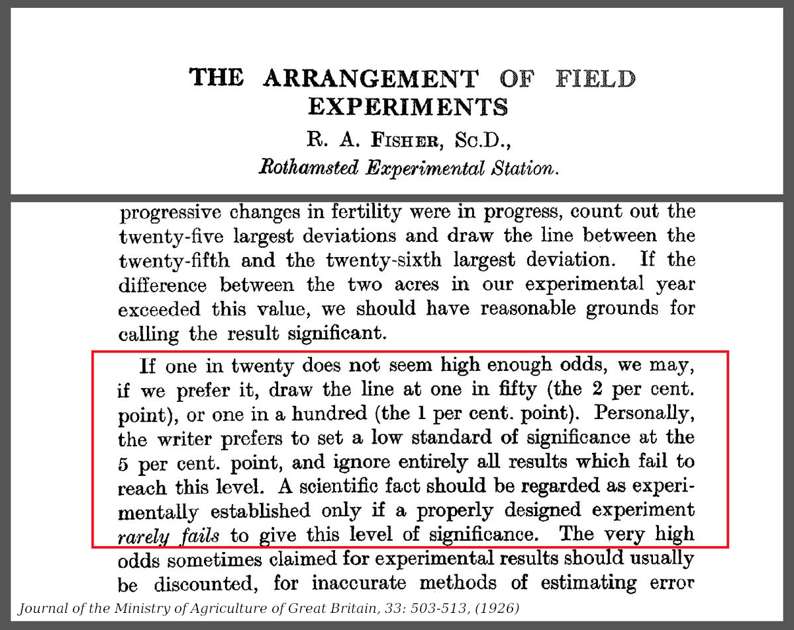
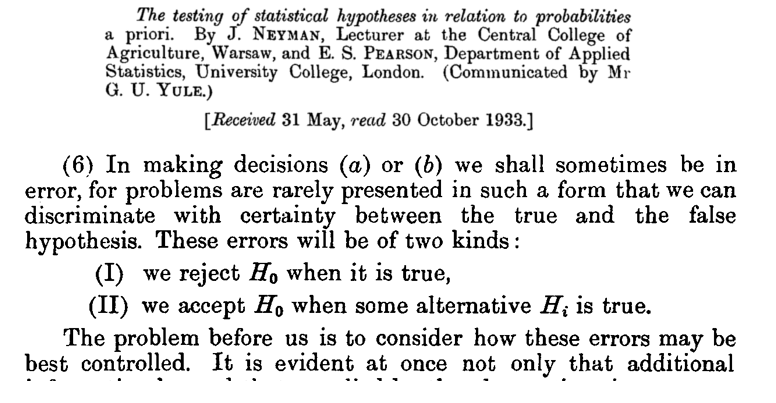

# What's up with $p < 0.05$?

##

::: {.scrollable height=500}
{width=50%}
:::

::: {.caption .floatright}
[xkcd:882](https://xkcd.com/882/)
:::

---------

{width=30%}

::: {.caption .floatright}
[xkcd:1478](https://xkcd.com/1478/)
:::

##

{width=60%}

## $p$-values control the Type I error rate

