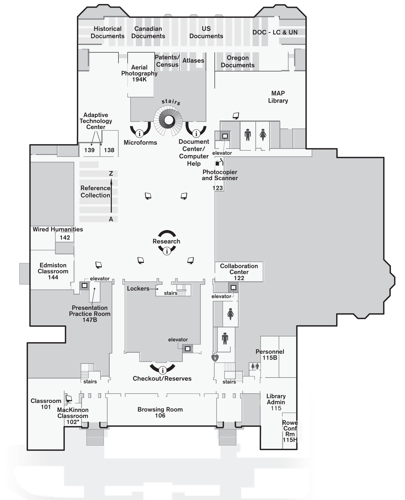

```{r setup, include=FALSE}
fig.dim <- 4
knitr::opts_chunk$set(fig.width=2*fig.dim,
                      fig.height=fig.dim,
                      fig.align='center')
set.seed(23)
library(tidyverse)
library(matrixStats)
library(rstan)
```


# Reporting uncertainty

## How do we communicate results?

If we want a *point estimate*:

1. posterior mean,
2. posterior median, or
3. maximum *a posteriori* estimate ("MAP": highest posterior density).

These all convey "where the posterior distribution is", more or less.

. . .

What about uncertainty?


## Credible region

**Definition:** A 95% *credible region* is a portion of parameter space
having a total of 95% of the *posterior probability*.

. . .

(same with other numbers for "95%")

## Interpretation \#1

If we construct a 95% credible interval for $\theta$
for each of many datasets;
*and* the coin in each dataset has $\theta$ drawn independently from the prior,
*then* the true $\theta$ will fall in its credible interval for 95% of the datasets.


## Interpretation \#2

If we construct a 95% credible interval for $\theta$ with a dataset,
and the distribution of the coin's true $\theta$ across many parallel universes
is given by the prior,
then the true $\theta$ will be in the credible interval
in 95% of those universes.


## Interpretation \#3

Given my prior beliefs (prior distribution),
the posterior distribution is the most rational${}^*$ 
way to update my beliefs to account for the data.

. . .

${}^*$ if you do this many times you will be wrong least often

. . .

${}^*$ **or** you will be wrong in the fewest possible universes


## But which credible interval?

**Definition:** The "95\% highest density interval" is the 95\% credible interval
with the highest posterior probability density at each point.


# Hierarchical coins

## Motivating problem: more coins


## Motivating problem: more coins

Suppose now we have data from $n$ different coins from the same source.
We don't assume they have the *same* $\theta$,
but don't know what its distribution is,
so try to *learn* it.

$$\begin{aligned}
  &\left. \begin{aligned}
    Z_i &\sim \Binom(N_i, \theta_i) \\
    \theta_i &\sim \Beta(\alpha, \beta)
  \end{aligned} \right\} \qquad \text{for } 1 \le i \le n \\
    &\alpha \sim \Unif(0, 100) \\
    &\beta \sim \Unif(0, 100)
\end{aligned}$$

**Goal:** find the posterior distribution of $\alpha$, $\beta$.


## Binomial versus Beta-Binomial

What is different between:

1. Pick a value of $\theta$ at random from $\Beta(3,1)$.\
   Flip one thousand $\theta$-coins, 500 times each.

2. Pick one thousand random $\theta_i \sim \Beta(3,1)$ values.\
   Flip one thousand coins, one for each $\theta_i$, 500 times each.

For instance: if you were given datasets from one of these situations,
how would you tell which situation it was generated from?


--------------

```{r beta_or_binom, fig.height=1.2*fig.dim, fig.width=3*fig.dim}
ncoins <- 1000
nflips <- 100
theta1 <- rbeta(1,3,1)
binom_Z <- rbinom(ncoins, size=nflips, prob=theta1)
theta2 <- rbeta(ncoins,3,1)
bb_Z <- rbinom(ncoins, size=nflips, prob=theta2)
hist(binom_Z, breaks=30, col=adjustcolor("blue", 0.5), main='', xlim=c(0,nflips), freq=FALSE, xlab='number of Heads')
hist(bb_Z, breaks=30, col=adjustcolor("red", 0.5), add=TRUE, freq=FALSE)
legend("topleft", fill=adjustcolor(c('blue', 'red'), 0.5), legend=c('one theta', 'many thetas'))
```

---------------

**Problem:** Find the posterior distribution of $\alpha$ and $\beta$,
given some data $(Z_1, N_1), \ldots, (Z_k, N_k)$,
under the model:
$$\begin{aligned}
    Z_i &\sim \Binom(N_i, \theta_i) \\
    \theta_i &\sim \Beta(\alpha, \beta) \\
    \alpha &\sim \Unif(0, 100) \\
    \beta &\sim \Unif(0, 100) .
\end{aligned}$$


. . .

**Problem:** we don't have a nice mathematical expression for the posterior distribution.


# MC Stan

## Stan

{height=10em}


## The skeletal Stan program

```
data {
    // stuff you input
}
transformed data {
    // stuff that's calculated from the data (just once, at the start)
}
parameters {
    // stuff you want to learn about
}
transformed parameters {
    // stuff that's calculated from the parameters (at every step)
}
model {
    // the action!
}
generated quantities {
    // stuff you want computed also along the way
}
```


# Markov Chain Monte Carlo

## When you can't do the integrals: MCMC

**Goal:** 
Given:

- a model with parameters $\theta$,
- a prior distribution $p(\theta)$ on $\theta$, and
- data, $D$,


"find"/ask questions of the posterior distribution on $\theta$,

$$\begin{aligned}
    p(\theta \given D) = \frac{ p(D \given \theta) p(\theta) }{ p(D) } .
\end{aligned}$$

. . .

**Problem:** usually we can't write down an expression for this
(because of the "$p(D)$").

. . .

**Solution:**
we'll make up a way to *draw random samples* from it.

-------------

**Toy example:** 

If we didn't know about the `pbeta( )` function,
how could we find the probability that $\theta < 0.5$?

*(math:)* 
```r
pbeta(0.5, post_a, post_b)
```

*(Monte Carlo:)* 
```r
mean(rbeta(1e6, post_a, post_b) < 0.5)
```


## How? Markov chain Monte Carlo!

i.e., "random-walk-based stochastic integration"


## Overview of MCMC

Produces a random sequence of samples $\theta_1, \theta_2, \ldots, \theta_N$.

0. Begin somewhere (at $\theta_1$).

At each step, starting at $\theta_k$:

1. **Propose** a new location (nearby?): $\theta_k'$

2. Decide whether to **accept** it.

    - if so: set $\theta_{k+1} \leftarrow \theta_k'$
    - if not: set $\theta_{k+1} \leftarrow \theta_k$

3. Set $k \leftarrow k+1$; if $k=N$ then stop.

. . .

The magic comes from doing *proposals* and *acceptance* 
so that the $\theta$'s are samples from the distribution we want.

## Key concepts

- Rules are chosen so that $p(\theta \given D)$ is the *stationary* distribution
  (long-run average!) of the random walk (the "Markov chain").

- The chain must *mix* fast enough so the distribution of visited states
  *converges* to $p(\theta \given D)$.

- Because of *autocorrelation*, $(\theta_1, \theta_2, \ldots, \theta_N)$ 
  are not $N$ independent samples:
  they are roughly equivalent to $N_\text{eff} < N$ independent samples.

- For better *mixing*, acceptance probabilities should not be too high or too low.

- Starting *several chains* far apart can help diagnose failure to mix:
  Gelman's $r$ quantifies how different they are.


## Let's "walk around":

::: {.columns}
::::::: {.column width=50%}


In each group, have one *walker* directed by others:

0. Start somewhere at "random", then repeat:

1. Pick a random $\{N,S,E,W\}$.

2. Take a step in that direction,

    * *unless* you'd run into a wall or a table.


*If online:* take a screenshot of your path after:

- 10 steps
- 50 steps


:::
::::::: {.column width=50%}



:::
:::::::


------------------------


::: {.columns}
::::::: {.column width=50%}

Imagine the heatmap of how much time your "walker" has spent in each place in the library.

**Question:** What distribution does this sample from?


:::
::::::: {.column width=50%}


:::
:::::::

-------------------


**Now:**

1. Pick a random $\{N,S,E,W\}$.

2. Take a $1+\Poisson(5)$ number of steps in that direction,

    * *unless* you'd run into a wall.


*If online:* again, take a screenshot of your path after:

- 10 steps
- 50 steps


--------------------

Does it mix faster?

. . .

Would $1 + \Poisson(50)$ steps be better?


## How it works

Imagine the walkers are on a hill, and:

1. Pick a random $\{N,S,E,W\}$.

2. If 

    * the step is *uphill*, then take it.
    * the step is *downhill*, then flip a $p$-coin;
      if you get Heads, stay were you are.


What would *this* do?

. . .

Thanks to [*Metropolis-Hastings*](https://en.wikipedia.org/wiki/Metropolis%E2%80%93Hastings_algorithm),
if "elevation" is $p(\theta \given D)$, 
then setting $p = p(\theta' \given D) / p(\theta \given D)$
makes the stationary distribution $p(\theta \given D)$. 


# IN CLASS

```{r in_class_sim}
true_alpha <- 8
true_beta <- 99
num_coins <- 500
theta <- rbeta(num_coins, shape1=true_alpha, shape2=true_beta)
N <- 15
Z <- rbinom(num_coins, size=N, prob=theta)
hist(theta, bins=40, xlim=c(0,1))
plot(theta, Z)
```

------

```{r fit}
library(brms)
df <- data.frame(
    Z = Z,
    N = N
)
brmfit <- brm(
    Z | trials(N) ~ 1,
    data=df,
    family="binomial"
)
# TODO: add in prior
```


