```{r setup, include=FALSE}
fig.dim <- 4
knitr::opts_chunk$set(fig.width=2*fig.dim,
                      fig.height=fig.dim,
                      fig.align='center')
set.seed(23)
library(tidyverse)
library(matrixStats)
library(lme4)
```


# Some history

## Threads of statistical history

- Cryptography: [Al-Khalīl, 750](https://en.wikipedia.org/wiki/Al-Khalil_ibn_Ahmad_al-Farahidi), [Al-Kindi, 800](https://en.wikipedia.org/wiki/Al-Kindi), [Ibn 'Adlan, 1200](https://en.wikipedia.org/wiki/Ibn_%27Adlan)
- Gambling: [Bernoulli, 1700](https://en.wikipedia.org/wiki/Jacob_Bernoulli), [de Moivre, 1718](https://en.wikipedia.org/wiki/The_Doctrine_of_Chances)
- Astronomy/physics: [Laplace, 1780](https://en.wikipedia.org/wiki/Pierre-Simon_Laplace), [Adrain, 1800](https://en.wikipedia.org/wiki/Robert_Adrain), [Gauss, 1800](https://en.wikipedia.org/wiki/Carl_Friedrich_Gauss)
- Public health: [Quetelet, 1835](https://en.wikipedia.org/wiki/Adolphe_Quetelet), [Nightingale, 1850](https://en.wikipedia.org/wiki/Florence_Nightingale)


## The "birth of modern statistics"

::: {.centered}
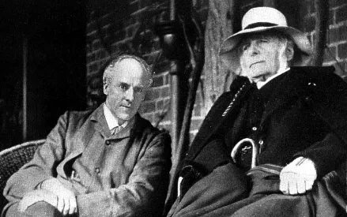{width=60%}
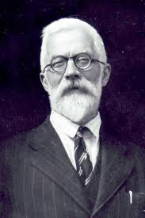{width=33%}
:::

## Galton's science

```{r plot_galton, echo=FALSE, fig.width=2.0*fig.dim, fig.height=2.0*fig.dim}
galton <- read.table("../Datasets/galton/galton-all.tsv", header=TRUE)
gdiff <- diff(with(galton, tapply(height, gender, mean)))
galton$midparent <- (galton$mother + galton$father - gdiff)/2
galton$adj_height <- galton$height - (galton$gender == "M") * gdiff
plot(jitter(adj_height) ~ jitter(midparent), data=galton, asp=1, xlab="midparent", ylab="adjusted height", pch=20)
abline(0, 1, col='red', lwd=2)
abline(coef(lm(adj_height ~ midparent, data=galton)), col='blue', lwd=2)
mh <- cut(galton$midparent, breaks=21)
with(galton, points(tapply(midparent, mh, mean), tapply(adj_height, mh, mean), col='blue', pch=20, cex=3))
legend("topleft", lty=1, col=c('red', 'blue'), legend=c('y=x', 'mean(y|x)'))
```

## Karl Pearson and the Biometrics Laboratory

::: {.columns}
::::::: {.column width=50%}


- developed the correlation coefficient and the chi-squared test;
  early use of the $p$-value

- head of the first Department of Applied Statistics,
  as the Galton chair of Eugenics

- focus on "biometry": statistical theory of biological measurements,
    especially evolution and inheritance.

- had a lengthy feud with Udny Yule
    over the correct definition
    of the correlation coefficient for a $2\times 2$ table

:::
::::::: {.column width=50%}

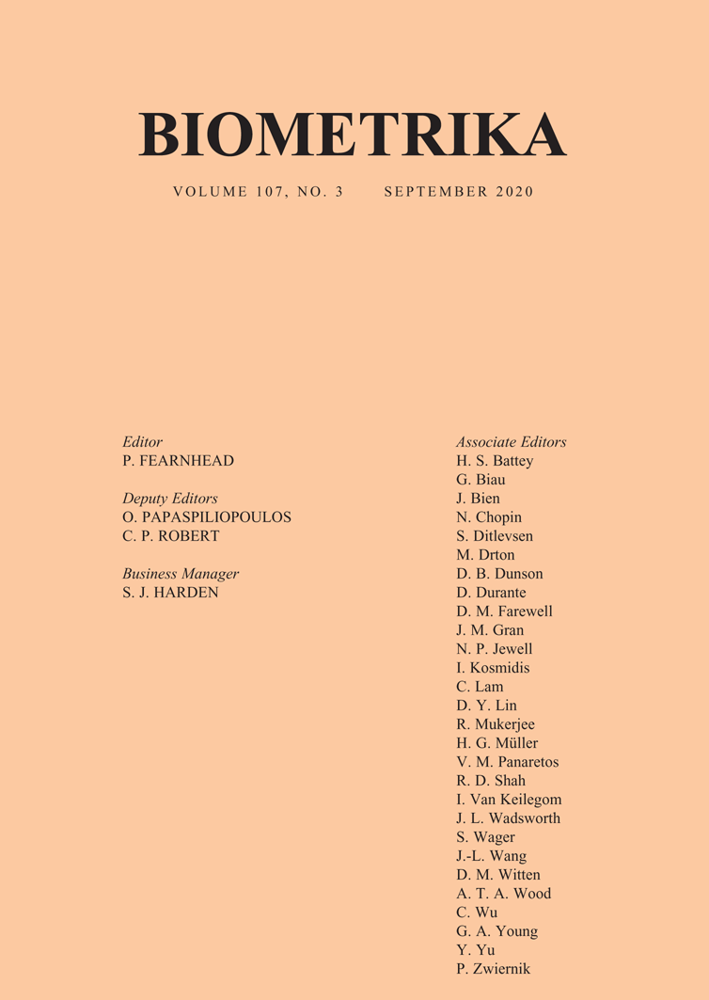{width=80%}

:::
:::::::

## RA Fisher

::: {.columns}
::::::: {.column width=50%}

- developed ANOVA, F-distribution, methods for maximum likelihood, lots of evolutionary theory

- Galton chair of Eugenics, succeeding K. Pearson

:::
::::::: {.column width=50%}

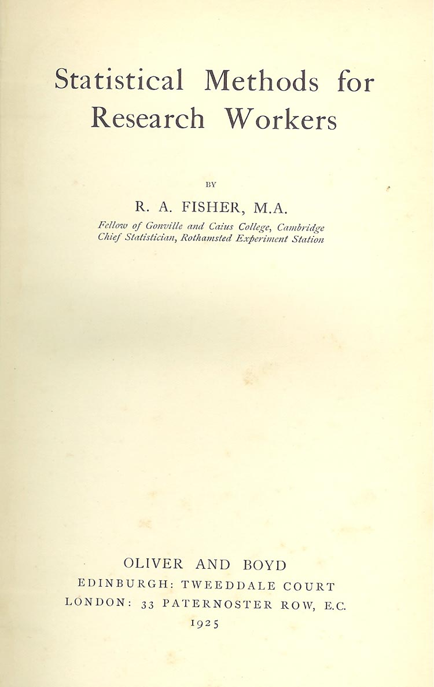{width=80%}

:::
:::::::

# Some natural questions to ask

##

1. What's up with this connection to eugenics?

2. How can we reconcile these people being very smart about some things but not about others?

3. Has this history had an impact on how we do statistics?


# Eugenics?


##

> Now, if you are going to take Darwinism as your theory of life
> and apply it to human problems, you must not only believe it to
> be true, but you must set to, and demonstrate that it actually
> applies. [...] It was not a light
> task, but it gave for many years the raison d'etre of my statistical work.

::: {.caption .floatright}
Pearson, 1912, in 'Darwinism, Medical Progress and Eugenics'.
Eugenics Laboratory Lecture Series, IX
:::


## 

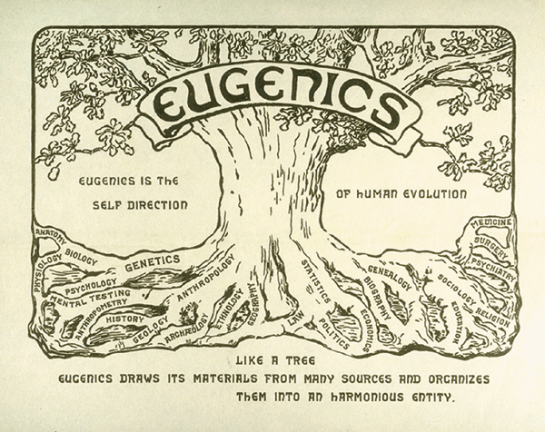

## Who gets to "direct"? {data-background-image="images/runquist-science-large.jpg" data-background-position=center data-background-size=25%}


<!-- {width=20%} -->

## 

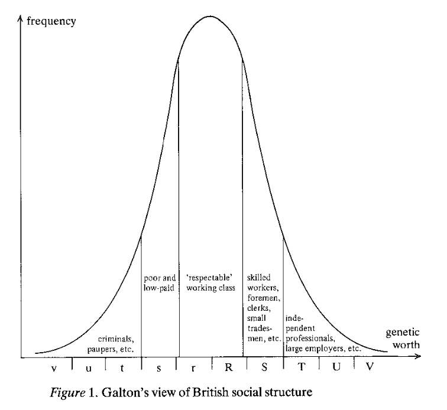

:::{.caption .floatright}
Galton 1909, *Essays in Eugenics.* London: Eugenics Education
Society.
(from [MacKenzie](https://www.google.com/books/edition/Statistics_in_Britain_1865_1930/RqJhQgAACAAJ?hl=en)
:::


##

::: {.columns}
::::::: {.column width=50%}


- upper-class Nordic eugenicists thought that everyone except upper-class Nordic people
  were dangerously degenerate

- they opposed curing tuberculosis and justified the genocide of the Americas

- this inspired forced sterilization and anti-miscengenation laws in the US,
  targeting poor and people of color

- and this directly inspired the Nazis

:::
::::::: {.column width=50%}

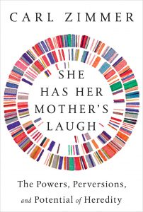{width=70%}

:::
:::::::


##

PSA: eugenics is a bunch of bullshit


## Others

Bystanders:

- William Gosset ($t$-test): focused on practical applications

- Egon Pearson (hypothesis testing): pushed to separate statistics and eugenics departments

Opponents:

- Lancelot Hogben: biologist, opponent of eugenics

- Thomas Morgan: biologist, opponent of eugenics


# "Smart" people

## Pearson and tuberculosis

- caused by Mycobacterium tuberculosis

- occurs more often among relatives

- major risk factors: silicosis (30x), malnutrition, smoking, alcoholism, crowding

- minor: genetics (mostly immune-related)

. . .

*Pearson:* it's hereditary!

## 

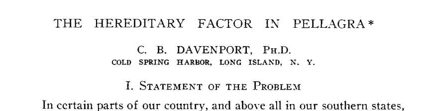

- niacin deficiency

- was common among poor Americans in the early 1900s

- ... since corn lacks niacin unless nixtamalized.

*Davenport:* it's hereditary!

## Fisher and smoking

::: {.columns}
::::::: {.column width=50%}

- *Hill & Doll:* retrospectively compare cancer rates between matched smoking/nonsmoking pairs

- *Hill & Doll:* prospectively compare cancer rates between smoking/nonsmoking doctors

- etcetera

- *Fisher:* Correlation is not causation. Let's calmly study this a while longer.

:::
::::::: {.column width=50%}


:::
:::::::


##

::: {.centered}
*what **is** being "smart", anyways?*
:::


# Has this affected how we do statistics?

##

::: {.centered}

well, numbers aren't racist?

:::

. . .

::: {.centered}

but how we *use* them might be


:::


## So the argument goes:

$p$-values and hypothesis tests focus on *whether* there's a difference between groups,

. . .

... ignoring whether any difference is *important*.

. . .

This is a major problem with reflexive reporting of "statistical significance".

. . .

Is this because of "eugenics thinking"?

##

A small methodological fix:

. . .

:::{.centered}
the *confidence interval*
:::

. . .

:::{.floatright .figcaption}
(introduced by Jerzy Neyman in 1937)
:::


## More important than statistical technique:

- What questions are being asked?

- What data is being collected? (and how)

- What assumptions are being made?

- What are the important conclusions?


# In conclusion

## Looking forward

::: {.columns}
::::::: {.column width=70%}


Pearson & Fisher had a big impact in part because (they were pushy and)
they were working towards something.

Today we have many problems that we need quantitative work to solve.

**Where do you want to have an impact?**


:::
::::::: {.column width=30%}

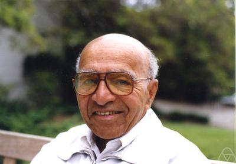{width=45%}
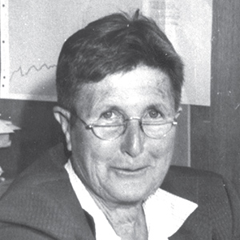{width=45%}
{width=45%}
{width=45%}

:::
:::::::

## Some sources

- [How Eugenics Shaped Statistics](http://nautil.us/issue/92/frontiers/how-eugenics-shaped-statistics), by Aubrey Clayton
- [Eugenics and Statistics](https://njoselson.github.io/Fisher-Pearson/), by Nathaniel Joselson
- [Statistics in Britain, 1865-1930](https://www.google.com/books/edition/Statistics_in_Britain_1865_1930/RqJhQgAACAAJ?hl=en), by Donald MacKenzie
- [National life from the standpoint of science](https://archive.org/stream/nationallifefro00peargoog#page/n18/mode/2up), by Karl Pearson
- [RA Fisher and the science of hatred](https://www.newstatesman.com/international/science-tech/2020/07/ra-fisher-and-science-hatred), New Statesmen, by Richard J Evans
- [Empire of Guns](https://southasia.stanford.edu/news/how-british-gun-manufacturers-changed-industrial-world-lock-stock-and-barrel-lorraine), by Priya Satia
- [Fisher and lung cancer](https://priceonomics.com/why-the-father-of-modern-statistics-didnt-believe/), Priceonomics


-----

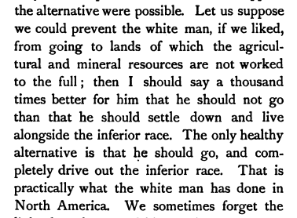
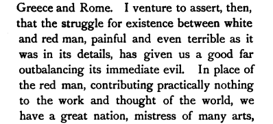

:::{.caption .floatright}
Karl Pearson, *National Life from the Standpoint of Science*, 1900.
:::

------

> It is a false view of human solidarity, a weak humanitarianism, not a true humanism, which regrets that a capable and stalwart race of white men should replace a dark-skinned tribe which can neither utilize its land for the full benefit of mankind, nor contribute its quota to the common stock of human knowledge.

:::{.caption .floatright}
Karl Pearson, *The Grammar of Science*, 1892.
:::


##


