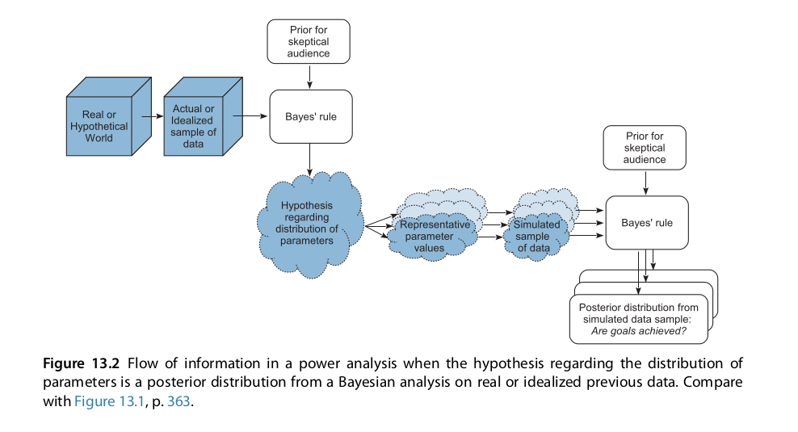

```{r setup, include=FALSE}
fig.dim <- 4
knitr::opts_chunk$set(fig.width=2*fig.dim,
                      fig.height=fig.dim,
                      fig.align='center')
set.seed(23)
library(tidyverse)
library(rstan)
library(matrixStats)
options(mc.cores = parallel::detectCores())
```

## Outline

1. Hierarchical coins

2. Introduction to MCMC with Stan

3. Sharing power, and shrinkage

4. Baseball


# Hierarchical coins

## Motivating problem: more coins

Suppose now we have data from $n$ different coins from the same source.
We don't assume they have the *same* $\theta$,
but don't know what its distribution is,
so try to *learn* it.

$$\begin{aligned}
    Z_i &\sim \Binom(N_i, \theta_i) \\
    \theta_i &\sim \Beta(\alpha, \beta) \\
    \alpha &\sim \Unif(0, 100) \\
    \beta &\sim \Unif(0, 100)
\end{aligned}$$

**Goal:** find the posterior distribution of $\alpha$, $\beta$.

. . .

**Problem:** we don't have a nice mathematical expression for this posterior distribution.


# Markov Chain Monte Carlo

## When you can't do the integrals: MCMC

**Goal:** 
Given:

- a model with parameters $\theta$,
- a prior distribution $p(\theta)$ on $\theta$, and
- data, $D$,


"find"/ask questions of the posterior distribution on $\theta$,

$$\begin{aligned}
    p(\theta \given D) = \frac{ p(D \given \theta) p(\theta) }{ p(D) } .
\end{aligned}$$

. . .

**Problem:** usually we can't write down an expression for this
(because of the "$p(D)$").

. . .

**Solution:**
we'll make up a way to *draw random samples* from it.

-------------

**Toy example:** 

*(from beta-binomial coin example)*

Do we think that $\theta < 0.5$?

*(before:)* 
```r
pbeta(0.5, post_a, post_b)
```

*(now:)* 
```r
mean(rbeta(1e6, post_a, post_b) < 0.5)
```


## How? Markov chain Monte Carlo!

i.e., "random-walk-based stochastic integration"


**Example:**
Gibbs sampling for uniform distribution on a region.
*(picture)*


## Overview of MCMC

Produces a random sequence of samples $\theta_1, \theta_2, \ldots, \theta_N$.

0. Begin somewhere (at $\theta_1$).

At each step, starting at $\theta_k$:

1. **Propose** a new location (nearby?): $\theta_k'$

2. Decide whether to **accept** it.

    - if so: set $\theta_{k+1} \leftarrow \theta_k'$
    - if not: set $\theta_{k+1} \leftarrow \theta_k$

3. Set $k \leftarrow k+1$; if $k=N$ then stop.

. . .

The magic comes from doing *proposals* and *acceptance* 
so that the $\theta$'s are samples from the distribution we want.

## Key concepts

- Rules are chosen so that $p(\theta \given D)$ is the *stationary* distribution
  (long-run average!) of the random walk (the "Markov chain").

- The chain must *mix* fast enough so the distribution of visited states
  *converges* to $p(\theta \given D)$.

- Because of *autocorrelation*, $(\theta_1, \theta_2, \ldots, \theta_N)$ 
  are not $N$ independent samples:
  they are roughly equivalent to $N_\text{eff} < N$ independent samples.

- For better *mixing*, acceptance probabilities should not be too high or too low.

- Starting *several chains* far apart can help diagnose failure to mix:
  Gelman's $r$ quantifies how different they are.


## On your feet

Three people, with randomness provided by others:

1. Pick a random $\{N,S,E,W\}$.

2. Take a step in that direction,

    * *unless* you'd run into a wall or a table.

. . .

**Question:** What distribution will this sample from?

. . .

Do this for 10 iterations. Have the *chains mixed*?


-------------------


**Now:**

1. Pick a random $\{N,S,E,W\}$.

2. Take a $1+\Poisson(5)$ number of steps in that direction,

    * *unless* you'd run into a wall or a table.

. . .

Does it mix faster?

. . .

Would $1 + \Poisson(50)$ steps be better?


## How it works

Imagine the walkers are on a hill, and:

1. Pick a random $\{N,S,E,W\}$.

2. If 

    * the step is *uphill*, then take it.
    * the step is *downhill*, then flip a $p$-coin;
      if you get Heads, stay were you are.


What would *this* do?

. . .

Thanks to *Metropolis-Hastings*,
if "elevation" is $p(\theta \given D)$, 
then setting $p = p(\theta' \given D) / p(\theta \given D)$
makes the stationary distribution $p(\theta \given D)$. 


# MC Stan

## "Quick and easy" MCMC: Stan

{height=10em}


## The skeletal Stan program

```
data {
    // stuff you input
}
transformed data {
    // stuff that's calculated from the data (just once, at the start)
}
parameters {
    // stuff you want to learn the posterior distribution of
}
transformed parameters {
    // stuff that's calculated from the parameters (at every step)
}
model {
    // the action!
}
generated quantities {
    // stuff you want computed also along the way
}
```

. . .

How to do everything: see [the user's manual](http://mc-stan.org/users/documentation/index.html).


# Beta-Binomial with Stan

## From before:

We've flipped a coin 10 times and got 6 Heads.
We think the coin is close to fair, so put a $\Beta(20,20)$ prior on
it's probability of heads,
and want the posterior distribution.

$$\begin{aligned}
    Z &\sim \Binom(10, \theta) \\
    \theta &\sim \Beta(20, 20) 
\end{aligned}$$
Sample from $$\theta \given Z = 6$$

-------------


:::::::::::::: {.columns}
::: {.column width="50%"}

$$\begin{aligned}
    Z &\sim \Binom(10, \theta) \\
    \theta &\sim \Beta(20, 20) 
\end{aligned}$$

Sample from $$\theta \given Z = 6$$

:::
::: {.column width="50%"}


```
data {
    int N;   // number of flips
    int Z;   // number of heads
}
parameters {
    // probability of heads
    real<lower=0,upper=1> theta;
}
model {
    Z ~ binomial(N, theta);
    theta ~ beta(20, 20);
}
```

:::
::::::::::::::


## Running the MCMC: rstan

```{r stan_setup, include=FALSE}
library(rstan)
stan_block <- "
data {
    int N;   // number of flips
    int Z;   // number of heads
}
parameters {
    // probability of heads
    real<lower=0,upper=1> theta;
}
model {
    Z ~ binomial(N, theta);
    theta ~ beta(20, 20);
}
"
```


```{r run_rstan, cache=TRUE}
library(rstan)
fit <- stan(model_code=stan_block,  # stan block from above
            data=list(N=10, Z=6),
            chains=3, iter=10000)

```

---------------

`lp__` is the log posterior density.
Note `n_eff`.

```{r print_rstan}
print(fit)
```

---------------

Fuzzy caterpillars are good.

```{r trace_rstan}
stan_trace(fit)
```

---------------

Stan uses ggplot2.

```{r plot_rstan}
stan_hist(fit, bins=20) + xlim(0,1)
```

---------------

What's the posterior probability that $\theta < 0.5$?

```{r results_rstan}
samples <- extract(fit)
mean(samples$theta < 0.5)

# compare to analytic solution
pbeta(0.5, shape1=10+6, shape2=10+4)
```


# Hierarchical Coins

:::::::::::::: {.columns}
::: {.column width="50%"}

$$\begin{aligned}
    Z_i &\sim \Binom(N_i, \theta_i) \\
    \theta_i &\sim \Beta(\alpha, \beta) \\
    \alpha &\sim \Unif(0, 100) \\
    \beta &\sim \Unif(0, 100)
\end{aligned}$$

:::
::: {.column width="50%"}


```
data {
    // the data (input)
}
parameters {
    // the parameters (output)
}
model {
    // how they are related
}
```

:::
::::::::::::::

-----------------------


:::::::::::::: {.columns}
::: {.column width="50%"}

$$\begin{aligned}
    Z_i &\sim \Binom(N_i, \theta_i) \\
    \theta_i &\sim \Beta(\alpha, \beta) \\
    \alpha &\sim \Unif(0, 100) \\
    \beta &\sim \Unif(0, 100)
\end{aligned}$$

:::
::: {.column width="50%"}


```
data {
    int n;      // number of coins
    int N[n];   // number of flips
    int Z[n];   // number of heads
}
parameters {
    // the parameters (output)
}
model {
    // how they are related
}
```

:::
::::::::::::::

-----------------------


:::::::::::::: {.columns}
::: {.column width="50%"}

$$\begin{aligned}
    Z_i &\sim \Binom(N_i, \theta_i) \\
    \theta_i &\sim \Beta(\alpha, \beta) \\
    \alpha &\sim \Unif(0, 100) \\
    \beta &\sim \Unif(0, 100)
\end{aligned}$$

:::
::: {.column width="50%"}


```
data {
    int n;      // number of coins
    int N[n];   // number of flips
    int Z[n];   // number of heads
}
parameters {
    // probability of heads
    real<lower=0,upper=1> theta[n];
    real<lower=0,upper=100> alpha;
    real<lower=0,upper=100> beta;
}
model {
    // how they are related
}
```

:::
::::::::::::::

-----------------------


:::::::::::::: {.columns}
::: {.column width="50%"}

$$\begin{aligned}
    Z_i &\sim \Binom(N_i, \theta_i) \\
    \theta_i &\sim \Beta(\alpha, \beta) \\
    \alpha &\sim \Unif(0, 100) \\
    \beta &\sim \Unif(0, 100)
\end{aligned}$$

:::
::: {.column width="50%"}


```
data {
    int n;      // number of coins
    int N[n];   // number of flips
    int Z[n];   // number of heads
}
parameters {
    // probability of heads
    real<lower=0,upper=1> theta[n];
    real<lower=0, upper=100> alpha;
    real<lower=0, upper=100> beta;
}
model {
    Z ~ binomial(N, theta);
    theta ~ beta(alpha, beta);
    // uniform priors "go without saying"
    // alpha ~ uniform(0, 100);
    // beta ~ uniform(0, 100);
}
```

:::
::::::::::::::


## Your turn


:::::::::::::: {.columns}
::: {.column width="50%"}

Data:
```
set.seed(23)
ncoins <- 100
true_theta <- rbeta(ncoins, 20, 50)
N <- rep(50, ncoins)
Z <- rbinom(ncoins, size=N, prob=true_theta)
```

Find the posterior distribution on `alpha` and `beta`:
check convergence with `print()` and `stan_trace()`,
then plot using `stan_hist()` and/or `stan_scat()`..


:::
::: {.column width="50%"}


```
data {
    int n;      // number of coins
    int N[n];   // number of flips
    int Z[n];   // number of heads
}
parameters {
    // probability of heads
    real<lower=0,upper=1> theta[n];
    real<lower=0,upper=100> alpha;
    real<lower=0,upper=100> beta;
}
model {
    Z ~ binomial(N, theta);
    theta ~ beta(alpha, beta);
    // uniform priors 'go without saying'
    // alpha ~ uniform(0, 100);
    // beta ~ uniform(0, 100);
}
```

:::
::::::::::::::


# Baseball

## Baseball

We have [a dataset](BattingAverage.csv) of batting averages of baseball players,
having

1. name
2. position
3. number of at bats
4. number of hits


```{r basedata}
batting <- read.csv("BattingAverage.csv", header=TRUE)
head(batting)
```

------------------------

The *overall* batting average of the `r nrow(batting)` players is `r sum(batting$Hits)/sum(batting$AtBats)`.

Here is the average by position.
```{r by_pos}
batting %>% group_by(PriPos) %>% 
    summarise(num=n(), BatAvg=sum(Hits)/sum(AtBats)) %>% 
    select(PriPos, num, BatAvg)
```

## Questions?

1. What's the overall batting average?

2. Do some positions tend to be better batters?

3. How much variation is there?


## Everyone is the same

```{r start, cache=TRUE}
first_model <- "
data {
    int N;
    int hits[N];
    int at_bats[N];
}
parameters {
    real<lower=0, upper=1> theta;
}
model {
    hits ~ binomial(at_bats, theta);
    theta ~ beta(1, 1);
} "
first_fit <- stan(model_code=first_model, chains=3, iter=1000,
                  data=list(N=nrow(batting),
                            hits=batting$Hits,
                            at_bats=batting$AtBats))
```

-----------------

```{r start_res}
stan_hist(first_fit, bins=20)
```

## Every pitcher is the same

```{r pos_model, cache=TRUE}
pos_model <- "
data {
    int N;
    int hits[N];
    int at_bats[N];
    int npos; // number of positions
    int position[N];
}
parameters {
    real<lower=0, upper=1> theta[npos];
}
model {
    real theta_vec[N];
    for (k in 1:N) {
        theta_vec[k] = theta[position[k]];
    }
    hits ~ binomial(at_bats, theta_vec);
    theta ~ beta(1, 1);
} "
pos_fit <- stan(model_code=pos_model, chains=3, iter=1000,
                  data=list(N=nrow(batting),
                            hits=batting$Hits,
                            at_bats=batting$AtBats,
                            npos=nlevels(batting$PriPos),
                            position=as.numeric(batting$PriPos)))
```

-----------------

```{r pos_res, fig.width=2*fig.dim, fig.height=1.5*fig.dim}
theta_samples <- extract(pos_fit)$theta
layout(matrix(1:9, nrow=3))
for (k in 1:ncol(theta_samples)) {
    hist(theta_samples[,k], main=levels(batting$PriPos)[k], xlim=c(0.1, 0.3),
         col=adjustcolor('red',0.6), xlab='batting avg', freq=FALSE)
}
```


## Your turn : Every individual different.

:::::::::::::: {.columns}
::: {.column width="50%"}

$$\begin{aligned}
    Z_i &\sim \Binom(N_i, \theta_i) \\
    \theta_i &\sim \Beta(\alpha_{p_i}, \beta_{p_i}) \\
    \alpha_p &= \mu_p \kappa_p \\
    \beta_p &= (1-\mu_p) \kappa_p \\
    \mu_p &\sim \Beta(1, 1) \\
    \kappa_p &\sim \Gam(0.1, 0.1) .
\end{aligned}$$

::::::::::::::
::: {.column width="50%"}

Variable types in Stan:
```
int x;       // an integer
int y[10];   // ten integers
real z;      // a number
real z[2,5]; // a 2x5 array of numbers

vector[10] u;      // length 10 vector
matrix[10,10] v;   // 10x10 matrix
vector[10] w[10];  // ten length 10 vectors
```

* don't forget the `;`
* make sure R types match
* read the error messages

:::
::::::::::::::

## In class

```{r inclass}
ind_model <- "
data {
    int N;
    int hits[N];
    int at_bats[N];
    int npos; // number of positions
    int position[N];
}
parameters {
    vector<lower=0, upper=1>[N] theta;
    vector<lower=0, upper=1>[npos] mu;
    vector<lower=0>[npos] kappa;
}
model {
    vector[npos] alpha;
    vector[N] alpha_vec;
    vector[npos] beta;
    vector[N] beta_vec;
    alpha = mu .* kappa;
    beta = (1-mu) .* kappa;
    alpha_vec = alpha[position];
    beta_vec = beta[position];
    hits ~ binomial(at_bats, theta);
    theta ~ beta(alpha_vec, beta_vec);
    mu ~ beta(1, 1);
    kappa ~ gamma(0.1, 0.1);
} "
# ind_model <- stan_model(model_code=ind_model)
# ind_fit <- sampling(ind_model,
#                    data=list(
#                              ))
```


# Stochastic minute

## Exponential, and Gamma

If $T \sim \Exp(\text{rate}=\lambda)$, then

$$\begin{aligned}
   \P\{ T \in dt \} = \lambda e^{-\lambda t} dt .
\end{aligned}$$

1. $T$ can be any nonnegative real number.

2. $T$ is *memoryless*: 
   $$\begin{aligned}
        \P\{ T > x + y \given T > x \} = \P\{ T > y \} .
   \end{aligned}$$

3. A machine produces $n$ widgets per second;
   each widget has probability $\lambda/n$ of being broken.
   The time until the first broken widget appears (in seconds)
   is approximately $\sim \Exp(\lambda)$.

---------------------

If $S \sim \Gam(\text{shape}=\alpha, \text{rate}=\lambda)$, then

$$\begin{aligned}
   \P\{ S \in dt \} = \frac{\alpha^\lambda}{\Gamma(\alpha)} t^{\alpha - 1} e^{-\lambda t} dt .
\end{aligned}$$

1. If $T_1, \ldots, T_k$ are independent $\Exp(\lambda)$, then
   $S = T_1 + \cdots + T_k$ is $\Gam(k, \lambda)$.


2. A machine produces $n$ widgets per second;
   each widget has probability $\lambda/n$ of being broken.
   The time until the $k^\text{th}$ broken widget appears (in seconds)
   is approximately $\sim \Gam(k, \lambda)$.


# Back to baseball

## The model

<!--

$$\begin{aligned}
    Z_i &\sim \Binom(N_i, \theta_i) \\
    \theta_i &\sim \Beta(\mu_{p_i} \kappa_{p_i}, (1-\mu_{p_i})\kappa_{p_i}) \\
    \mu &\sim \Beta(1, 1) \\
    \kappa_p &\sim \Gam(0.1, 0.1) .
\end{aligned}$$

-->

:::::::::::::: {.columns}
::: {.column width="50%"}

$$\begin{aligned}
    Z_i &\sim \Binom(N_i, \theta_i) \\
    \theta_i &\sim \Beta(\mu_{p_i} \kappa_{p_i}, (1-\mu_{p_i})\kappa_{p_i}) \\
    \mu &\sim \Beta(1, 1) \\
    \kappa_p &\sim \Gam(0.1, 0.1) .
\end{aligned}$$

::::::::::::::
::: {.column width="50%"}


```{r fake_stan_model, eval=FALSE}
pos_model <- "
data {
    int N;   // number of players
    int hits[N];
    int at_bats[N];
    int npos; // number of positions
    int position[N];
}
parameters {
    real<lower=0, upper=1> theta[N];
    real<lower=0, upper=1> mu[npos];
    real<lower=0> kappa[npos];
}
model {
    real alpha;
    real beta;
    hits ~ binomial(at_bats, theta);
    for (i in 1:N) {
        alpha = mu[position[i]] * kappa[position[i]];
        beta = (1 - mu[position[i]]) * kappa[position[i]];
        theta[i] ~ beta(alpha, beta);
    }
    mu ~ beta(1,1);
    kappa ~ gamma(0.1,0.1);
}"
```


```{r stan_model, cache=TRUE, include=FALSE}
pos_model <- "
data {
    int N;   // number of players
    int hits[N];
    int at_bats[N];
    int npos; // number of positions
    int position[N];
}
parameters {
    real<lower=0, upper=1> theta[N];
    real<lower=0, upper=1> mu[npos];
    real<lower=0> kappa[npos];
}
model {
    real alpha;
    real beta;
    hits ~ binomial(at_bats, theta);
    for (i in 1:N) {
        alpha = mu[position[i]] * kappa[position[i]];
        beta = (1 - mu[position[i]]) * kappa[position[i]];
        theta[i] ~ beta(alpha, beta);
    }
    mu ~ beta(1,1);
    kappa ~ gamma(0.1,0.1);
} "
```

:::
:::::::::::


##


```{r fit_pos_model, cache=TRUE, dependson="stan_model"}
batting <- read.csv("BattingAverage.csv", header=TRUE)
system.time(pos_fit <- stan(model_code=pos_model, chains=3, iter=100,
                            data=list(N=nrow(batting),
                                      hits=batting$Hits,
                                      at_bats=batting$AtBats,
                                      npos=nlevels(batting$PriPos),
                                      position=as.numeric(batting$PriPos))))
```

## Diagnostics

```{r print_fit}
print(pos_fit, pars=c("mu", "kappa"))
```

----------------

Is it mixing?

```{r plot_trace}
stan_trace(pos_fit, pars="mu")
```


## Run longer!

```{r fit_pos_model_again, cache=TRUE, dependson="stan_model"}
system.time(pos_fit <- stan(model_code=pos_model, chains=3, iter=1000,
                            control=list(max_treedepth=15),
                            data=list(N=nrow(batting),
                                      hits=batting$Hits,
                                      at_bats=batting$AtBats,
                                      npos=nlevels(batting$PriPos),
                                      position=as.numeric(batting$PriPos))))
```

-------------

```{r print_fit_again}
print(pos_fit, pars=c("mu", "kappa"))
```


-------------

Is it mixing?

```{r plot_trace_again}
stan_trace(pos_fit, pars="mu")
```

-------------

```{r plot_kappa_again}
stan_trace(pos_fit, pars="kappa")
```

## Let's look at the results!

```{r first_hist}
stan_hist(pos_fit, pars="mu", bins=30) + xlim(0, 0.4)
```

-----------

With labels: position means $\mu_p$:

```{r plot_mu, echo=FALSE, fig.width=2.0*fig.dim, fig.height=1.5*fig.dim}
param_samples <- extract(pos_fit)
layout(matrix(1:9, ncol=3))
par(mar=c(4,3,1,1)+.1)
for (k in 1:9) {
    hist(param_samples$mu[,k], main=levels(batting$PriPos)[k],
         xlim=c(0, 0.4), xlab='batting average', ylab=expression(mu))
}
```

-----------

Position "concentrations", $\kappa_p$:

```{r plot_kappa, echo=FALSE, fig.width=2.0*fig.dim, fig.height=1.5*fig.dim}
layout(matrix(1:9, ncol=3))
par(mar=c(4,3,1,1)+.1)
for (k in 1:9) {
    hist(param_samples$kappa[,k], main=levels(batting$PriPos)[k],
         xlab='batting average', ylab=expression(kappa))
}
```


# Simulation

## Wouldn't it be nice if we knew the truth?

. . .

**Discuss:**

Write down (on whiteboards)
a procedure to simulate data
that looks like the baseball data.


------------

```{r simulate_fake_data}
batting$post_mean <- colMeans(param_samples$theta)
batting$fake_hits <- rbinom(nrow(batting), 
                            size=batting$AtBats, 
                            prob=batting$post_mean)
```


:::::::: {.columns}
::: {.column width=50%}

*Option 1:* By simulating draws from the posterior mean on $\theta$,
we can check that our model is accurately describing the data.
Here is the real data against data simulated under the posterior mean $\theta$ values.
They look similar, which is good.

:::::::::::
::: {.column width=50%}

```{r plot_simfakedata, echo=FALSE, fig.width=fig.dim}
with(batting, plot(Hits, fake_hits, xlab='actual hits', ylab='simulated hits'))
```

:::
:::::::::::

------------

**But** if we want to know if we're accurately estimating $\mu$ and $\kappa$, 
then we have to start with them, and *simulate* $\theta$.
```{r simulate_with_thetas}
post_mean_mu <- colMeans(param_samples$mu)
post_mean_kappa <- colMeans(param_samples$kappa)
names(post_mean_mu) <- names(post_mean_kappa) <- levels(batting$PriPos)
batting$sim_theta <- rbeta(nrow(batting),
                           shape1=post_mean_mu[batting$PriPos] *
                                   post_mean_kappa[batting$PriPos],
                           shape2=(1-post_mean_mu[batting$PriPos]) * 
                                   post_mean_kappa[batting$PriPos])
batting$sim_theta_hits <- rbinom(nrow(batting), 
                                 size=batting$AtBats, 
                                 prob=batting$sim_theta)
```

------------

Fit the model to the *simulated* data:

```{r fit_sim_data, cache=TRUE}
sim_fit <- stan(model_code=pos_model, chains=3, iter=1000, control=list(max_treedepth=13),
                data=list(N=nrow(batting),
                          hits=batting$sim_theta_hits,
                          at_bats=batting$AtBats,
                          npos=nlevels(batting$PriPos),
                          position=as.numeric(batting$PriPos)))
```

----------

Can we estimate $\mu$ and $\kappa$?
```{r check_sim_mu}
sim_samples <- extract(sim_fit)
layout(t(1:2))
boxplot(sim_samples$mu, main="posterior distribution of mu")
points(1:9, post_mean_mu, col='red', pch=20, cex=2)
boxplot(sim_samples$kappa, main="posterior distribution of kappa")
points(1:9, post_mean_kappa, col='red', pch=20, cex=2)
```


## General questions with simulated data

1. Does my statistical inference method work?

. . .


2. Do the credible intervals contain the true value? 

    (i.e., Is the method "well-calibrated"?)

    *They usually should.*

. . .

3. How wide are credible intervals, typically?

    This is (one kind of) **statistical power.** 


# Posterior predictive sampling

## How to choose parameter values for simulation?

It depends, but one good choice is
*from the posterior distribution* -
then you can see how the model behaves
with data close to the real data.

This is known as **posterior predictive sampling**.

---------------------------




# Sharing power // Shrinkage

## Example

Suppose that I have a large pot of coins
that are all similar to each other.
I flip each one ten times, and record the number of Heads.
What is *each coin's* probability of Heads?

- Treated *separately*,
  we would be very uncertain about each coin.

- Together, they should tell us very accurately 
  what are *likely* values of $\theta$.

- This information can improve the estimate of each separate $\theta$.

- The more similar the coins are, the more information we gain.


## Shrinkage and baseball

Some players were at bat very few times.
How does the information about their position affect our inference about their batting averages?

```{r baseball_shrinkage}
batting$post_med <- colMedians(param_samples$theta)
batting$post_Q1 <- colQuantiles(param_samples$theta, probs=0.25)
batting$post_Q3 <- colQuantiles(param_samples$theta, probs=0.75)
pos_means <- colMeans(param_samples$mu)
names(pos_means) <- levels(batting$PriPos)
pos_means
```

--------------

Pitchers had posterior mean $\mu$ of `r pos_means["Pitcher"]`

````{r pitchers}
with(subset(batting[order(batting$post_med),], PriPos=="Pitcher"), {
     plot(Hits / AtBats, main="Pitchers", xaxt='n', ylim=c(0, 0.4),
         xlab='player', ylab="posterior median theta");
     segments(x0=seq_along(Hits), y0=post_Q1, y1=post_Q3,
         col=adjustcolor('red',0.5));
     points(post_med, pch=20) })
abline(h=pos_means["Pitcher"], lwd=2, col=adjustcolor("blue", 0.5))
```

---------------

Catchers had posterior mean $\mu$ of `r pos_means["Catcher"]`

````{r catchers}
with(subset(batting[order(batting$post_med),], PriPos=="Catcher"), {
     plot(Hits / AtBats, main="Catchers", xaxt='n', ylim=c(0, 0.4),
         xlab='player', ylab="posterior median theta");
     segments(x0=seq_along(Hits), y0=post_Q1, y1=post_Q3,
         col=adjustcolor('red',0.5));
     points(post_med, pch=20) })
abline(h=pos_means["Catcher"], lwd=2, col=adjustcolor("blue", 0.5))
```

## Is shrinkage here a good idea?

With *simulated data*, compare median absolute error for

- posterior mean $\theta_i$

- empirical batting average

------------

How'd we do?  Let's look at the *true* values of $\theta$
(we know because we generated them)
against the posterior means.
Red lines are 95% credible intervals.
```{r check_sim_result}
post_sim_theta <- colMeans(sim_samples$theta)
plot(batting$sim_theta, post_sim_theta, type='n', xlab="true theta", ylab="posterior mean theta", ylim=c(0,0.4))
segments(x0=batting$sim_theta,  col='red',
         y0=colQuantiles(sim_samples$theta, probs=0.05),
         y1=colQuantiles(sim_samples$theta, probs=0.95))
points(batting$sim_theta, post_sim_theta, pch=20)
abline(0, 1, lwd=3, col=adjustcolor('blue', 0.5))
```

-------------

Did we do better?

The mean absolute difference between the *truth* and

- posterior mean: `r mean(abs(batting$sim_theta - post_sim_theta))`
- empirical batting average (hits/at bats): `r mean(abs(batting$sim_theta - batting$fake_hits/batting$AtBats))`

Using information about groups **reduced our error by a factor of 4!**


