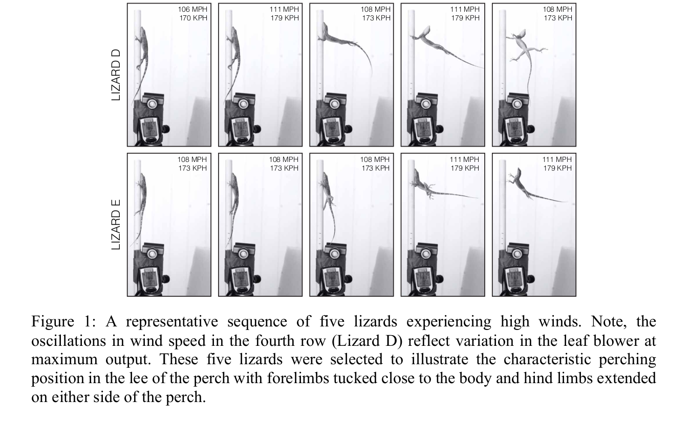

```{r setup, include=FALSE}
fig.dim <- 4
knitr::opts_chunk$set(fig.width=2*fig.dim,
                      fig.height=fig.dim,
                      fig.align='center')
set.seed(23)
library(tidyverse)
library(rstan)
library(brms)
library(cowplot)
library(bayesplot)
library(matrixStats)
options(mc.cores = parallel::detectCores())
options(digits=4)
options(warnPartialMatchDollar=FALSE) # hush, brms
```

# Hurricane lizards

##

**Data from:**
Donihue, C.M., Herrel, A., Fabre, AC. et al. [*Hurricane-induced selection on the morphology of an island lizard.*](https://doi.org/10.1038/s41586-018-0352-3) Nature 560, 88–91 (2018).

```
Anolis scriptus morphology and performance from before and after hurricanes

Lizard morphology data collected from two visits to Pine Cay and Water Cay in
the Turks and Caicos Islands. Anolis scriptus lizards were surveyed on both
islands four days before hurricane Irma and again, six weeks later, after the
islands had been hit by Hurricanes Irma and Maria. We measured morphology and
performance and found significant differences in the "before" and "after"
hurricane lizard population morphology. All linear measurements are in MM,
surface area measurements are in MM2 and force in N. Counts correspond to the
number of lamellar scales on the forelimb and hind limb toepads.
```

##


## {data-background-image="images/lizards-islands.png" data-background-size=80% data-background-position=center}

##


##


##


##



##

Here's the data: [dataset](https://github.com/UO-Biostats/UO_ABS/raw/master/CLASS_MATERIALS/Datasets/Hurricane_lizards/lizards.csv);
[README](../Datasets/Hurricane_lizards/README.html).
First we'll read it in, reorder the levels of the Hurricane factor (so that "before" comes before "after"),
change units on SVL to centimeters so it's on the same scale as the other variables
(useful below),
and drop unused variables.

```{r read_data}
lizards <- read.csv(
            "../Datasets/Hurricane_lizards/lizards.csv",
            header=TRUE, stringsAsFactors=TRUE)
lizards$Hurricane <- factor(lizards$Hurricane, levels=c("Before", "After"))
lizards$SVL_cm <- lizards$SVL / 10
varnames <- c("SVL_cm", "Femur", "Tibia", "Metatarsal", "LongestToe", "Humerus", 
    "Radius", "Metacarpal", "LongestFinger", "FingerCount", "ToeCount", 
    "MeanFingerArea", "MeanToeArea")
lizards <- lizards[, c(c("Hurricane", "Origin", "Sex"), varnames)]
head(lizards)
```

-----------

Here's the sample sizes:
```{r look}
with(lizards, table(Sex, Origin, Hurricane))
```

## Brainstorming

- What morphological differences do we expect
    betweeen the "before" and "after" groups of lizards?
- What visualizations can we use to look for these differences? (Sketch them.)
- What statistical analysis can we use?

```{r datahead, echo=FALSE}
head(lizards)
```

## Steps in data analysis

1. Care, or at least think, about the data.

2. Look at the data.

3. Query the data.

4. Check the results.

5. Communicate.


## Ideas

- do boxplots and t-tests for each variable, before vs after
- *or*, do this after dividing by length (i.e., SVL)
    so it's *relative* measurements
- *or*, fit a model with `measurement ~ SVL + hurricane`,
    which allows more flexibility in how overall length is incorporated


## Goals

- describe how traits differ before/after hurricanes
- account for confounding factor: overall size
- also possibly account for differences between islands and sexes

. . .

*Exercise:*
Write a possible conclusion sentence or two
(imagining what might happen).
Make sure to communicate
(a) the size of the effect we're looking for, in real-world terms;
(b) the strength of the statistical evidence; and
(c) context
(e.g., how's the size of the hurricane-induced change compare to other differences).


## Examples

We found that the typical ratio of hand size to body size was 10% larger after than before
(t-test, p-value 0.01).
This is roughly 2 standard deviations of the ratios observed within each sex;
ratios do not seem to differ between islands.

The body radius decreased by 20% after the hurricane compared to before.

Metatarsal length increased by 5% after the hurricane (possibly due to incrased grip).

We see that lizards with the longest fingers and toes (5% longer on average) survived better on average (t-test of p=0.01);
they seem to have been able to hold on better during the hurricane.


# Look at the data

## Histograms

```{r hists, warning=FALSE}
lizards_long <- pivot_longer(lizards, col=all_of(varnames), names_to="measurement")
ggplot(lizards_long) + geom_histogram(aes(x=value)) + facet_wrap(~measurement)
```

##

There is not a huge, obvious shift.
```{r next, warning=FALSE}
ggplot(lizards_long) + geom_boxplot(aes(x=measurement, y=value, col=Hurricane)) +  theme(axis.text.x = element_text(angle = 90, vjust = 0.5, hjust=1)) 
```

------

```{r next2, warning=FALSE}
ggplot(lizards_long) + geom_boxplot(aes(x=measurement, y=value, fill=Hurricane)) +  theme(axis.text.x = element_text(angle = 90, vjust = 0.5, hjust=1)) + facet_wrap(~Sex) 
```

------

Let's do some t-tests to see what happens:
```{r tt}
results <- expand.grid(
    variable=varnames,
    sex=levels(lizards$Sex),
    stringsAsFactors=FALSE
)
results$p <- NA
results$lower_CI <- NA
results$upper_CI <- NA

for (j in 1:nrow(results)) {
    v <- results$variable[j]
    s <- results$sex[j]
    x <- subset(lizards, Sex==s)
     t <- t.test(x[[v]][x$Hurricane == "Before"],
            x[[v]][x$Hurricane == "After"]
     )
     results$p[j] <- t$p.value
     results$lower_CI[j] <- t$conf.int[1]
     results$upper_CI[j] <- t$conf.int[2]
}
```

--------------

This is preliminary, but
it seems that maybe males need shorter (?) legs,
and females need larger (?) fingers.
```{r show_results}
results[order(results$p),]
```

## Everything is correlated with everything else:

```{r pairs, echo=FALSE, fig.width=3*fig.dim, fig.height=2.1*fig.dim}
pairs(lizards[,varnames], pch=20, cex=0.5,
      col=ifelse(lizards$Hurricane == "Before", "black", "red"),
      main="Before (black)/After (red)"
)
```

## sex and size are almost totally confounded

```{r pairs_sex, echo=FALSE, fig.width=3*fig.dim, fig.height=2.1*fig.dim}
pairs(lizards[,varnames], pch=20, cex=0.5,
      col=ifelse(lizards$Sex == "Male", "black", "red"),
      main="Male (black)/Female (red)"
)
```

## 
```{r pairs_origin, echo=FALSE, fig.width=3*fig.dim, fig.height=2.1*fig.dim}
pairs(lizards[,varnames], pch=20, cex=0.5,
      col=ifelse(lizards$Origin == "Pine Cay", "black", "red"),
      main="Pine Cay (black)/Water Cay (red)"
)
```

------

Let's look at the Femur ~ SVL plot:
```{r plitit, fig.height=1.8*fig.dim, fig.width=2*fig.dim}
simple_lm <- lm(Femur ~ SVL_cm + Hurricane, data=lizards)
plot(Femur ~ SVL_cm, data=lizards, col=ifelse(Hurricane=="Before", "black", "red"), pch=20)
coefs <- coef(simple_lm)
abline(coefs["(Intercept)"], coefs["SVL_cm"])
abline(coefs["(Intercept)"] + coefs["HurricaneAfter"], coefs["SVL_cm"], col='red', pch=20)
legend("bottomright", lty=1, col=c("black", "red"), legend=c("Before", "After"))
```


# Data analysis

## Today's plan

- Fit a model (maybe only to one or two measurements)
- check model fit, and
- summarize results.


. . .

*Steps:*

1. choose a formula, and family
2. pick some priors
3. check for convergence
4. visualize results
5. get numerical summaries of what we want

-------------

*Goal:* 

> Remaining female lizards of average size on Pine Cay had an average finger pad area that was X% larger (95% CI of L-U%) than before the hurricane. This difference of X square centimeters represents roughly Y standard deviations of finger pad area. Similarly, males of average length ...

----------------

Pick a family:
recall that the "family" describes the distribution
of the *residuals*, so let's check a histogram of those:


```{r family}
hist(resid(lm(Femur ~ SVL_cm, data=lizards)), breaks=20)
```


---------------

Priors: differences between groups will be
no bigger than 1mm or so (for Femur length);
slopes are no bigger than 10.
So, we'll set an uninformative Normal prior,
with mean 0 and sd 10;
it's "uninformative" because it's just saying that
the parameters are no bigger than $\pm$ 20 or so.

```{r priors}
bformula <- brmsformula(Femur ~ SVL_cm * Sex + Hurricane + Origin)
get_prior(bformula, data=lizards)
priors <- set_prior("normal(0, 10)", class="b")
```

----------------------------

```{r fitit}
bfit <- brm(
    bformula,
    data=lizards,
    family=gaussian(),
    prior=priors,
    file="lizardfit.rds"
)    
```


-------------

Rhat and ESS look good: it seems like we have convergence.

```{r convergence}
summary(bfit)
```

-------------

Fuzzy caterpillars are good, also:
```{r traces}
mcmc_trace(bfit)
```

----------------

This does not look like there's a difference before/after?
```{r resultsnow}
conditional_effects(bfit, effects="Hurricane")
```

----------------

Here are posterior distributions for *before* the hurricane:
notice that males/females aren't overlapping at intermediate lengths.
```{r resultsnow2}
plot(
    conditional_effects(bfit,
                        effects="SVL_cm:Sex",
                        conditions=make_conditions(bfit, "Origin"),
                        plot=FALSE),
    points=TRUE
)
```

------------------

Note that *after* the hurricane,
they found smaller male lizards;
perhaps the bigger ones got blown away,
so smaller ones got to come out into their territories.

In each case, the 95% credible intervals
for the "before" and "after" lizards are separated,
in the regions where we have data.
```{r hurricane_results}
plot(
    conditional_effects(bfit,
                    effects="SVL_cm:Hurricane",
                    conditions=make_conditions(bfit, c("Sex", "Origin")),
                    plot=FALSE
    ),
    points=TRUE
)
```

-------------

Here, let's get the posterior distributions
of femur length
for lizards of average length in the eight combinations
of hurricane, sex, and origin,
as well as the posterior of the average difference
(after minus before):

```{r answers}
mean_lengths <- tapply(lizards$SVL_cm, lizards$Sex, mean)

pred_data <- expand.grid(
    Sex=levels(lizards$Sex),
    Origin=levels(lizards$Origin),
    Hurricane=levels(lizards$Hurricane)
)
pred_data$SVL_cm <- mean_lengths[as.character(pred_data$Sex)]

posts <- posterior_epred(bfit,
                newdata=pred_data
)
post_results <- pred_data[1:4, c("Sex", "Origin", "SVL_cm")]

post_results$mean_diff <- colMeans(
    posts[,pred_data$Hurricane == "After"] 
    - posts[,pred_data$Hurricane == "Before"]
)
post_results$lower_ci_diff <- colQuantiles(
    posts[,pred_data$Hurricane == "After"] 
    - posts[,pred_data$Hurricane == "Before"],
    probs=0.025
)
post_results$upper_ci_diff <- colQuantiles(
    posts[,pred_data$Hurricane == "After"] 
    - posts[,pred_data$Hurricane == "Before"],
    probs=0.975
)
```

------------


Here are the results.
Notice that all the mean differences are *identical*;
that's because under our model
the effect of Hurricane is additive,
independent of anything else.
So, the posterior distribution of
the difference in mean femur length, after minus before,
is the same for *any* conditions.
```{r post_diff_results}
post_results
```

-----------

So, we could just look at the posterior distribution
for that parameter, e.g.
```{r mcmchist}
mcmc_hist(bfit, pars="b_HurricaneAfter", bindiwdth=0.03)
```

------------

However, it's a better idea in general
(easier to figure out, more generalizable, less confusing)
to look at posterior distributions of predicted differences
themselves, rather than the underlying parameters.
So, we'll do that.
Here's the posterior distribution
for the difference in mean femur length
of females on Pine Cay of average length:

```{r fpc_hist}
hist(posts[,5] - posts[,1], breaks=30, main="femur length difference (mm)", xlab="after - before")
```

----------

We'd also like to know how this difference compares to typical variation
in femur length;
so, we'd like to know how much lizards that are otherwise the same
differ in femur length.
This is given by the `sigma` parameter in this (Gaussian) model,
which we can get out the summary table:

```{r summary_again}
summary(bfit)
```


## Conclusion

Remaining lizards had an average femur length that was
`r (-1)* round(post_results$mean_diff[post_results$Sex=="Female"][1], 2)`mm shorter
(95% CI of 
`r (-1)* round(post_results$lower_ci_diff[post_results$Sex=="Female"][1], 2)`-`r (-1)* round(post_results$upper_ci_diff[post_results$Sex=="Female"][1], 2)`mm) than before the hurricane.
This is about a `r round(100*abs(mean(post_results$mean_diff))/mean(lizards$Femur))`% reduction in femur length.
The estimated standard deviation of femur length is 0.61mm
among lizards in the same condition
(95% CI of 0.55 to 0.68mm),
so this change represents slightly less than one standard deviation.

# Goodness of fit

## posterior predictive checks


# Multivariate model

## More than one response

```{r fitit}
bfit2 <- brm(
    brmsformula(
        mvbind(Femur, MeanToeArea) ~ SVL_cm * Sex * Hurricane
    ) + set_rescor(TRUE),
    data=lizards,
    family=gaussian(),
    prior=priors,
    file="lizardfit2.rds"
)    
```

---------

```{r moarplots}
plot(
    conditional_effects(bfit2,
                    effects="SVL_cm:Hurricane",
                    conditions=make_conditions(bfit, "Sex"),
                    resp="MeanToeArea",
                    plot=FALSE
    ),
    points=TRUE
)
```

---------

```{r moarplots}
plot(
    conditional_effects(bfit2,
                    effects="SVL_cm:Hurricane",
                    conditions=make_conditions(bfit, "Sex"),
                    resp="Femur",
                    plot=FALSE
    ),
    points=TRUE
)
```

-----------------


