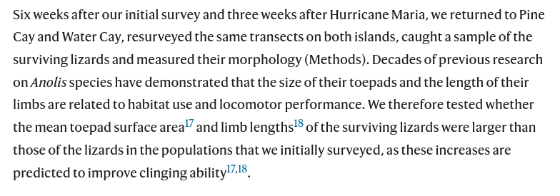
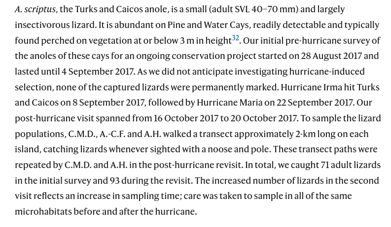
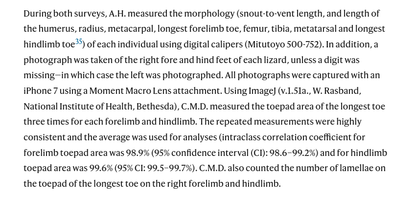

```{r setup, include=FALSE}
fig.dim <- 4
knitr::opts_chunk$set(fig.width=2*fig.dim,
                      fig.height=fig.dim,
                      fig.align='center')
set.seed(23)
library(tidyverse)
library(rstan)
library(brms)
library(cowplot)
library(bayesplot)
library(matrixStats)
options(mc.cores = parallel::detectCores())
options(digits=4)
options(warnPartialMatchDollar=FALSE) # hush, brms
```

# Hurricane lizards

##

**Data from:**
Donihue, C.M., Herrel, A., Fabre, AC. et al. [*Hurricane-induced selection on the morphology of an island lizard.*](https://doi.org/10.1038/s41586-018-0352-3) Nature 560, 88–91 (2018).

```
Anolis scriptus morphology and performance from before and after hurricanes

Lizard morphology data collected from two visits to Pine Cay and Water Cay in
the Turks and Caicos Islands. Anolis scriptus lizards were surveyed on both
islands four days before hurricane Irma and again, six weeks later, after the
islands had been hit by Hurricanes Irma and Maria. We measured morphology and
performance and found significant differences in the "before" and "after"
hurricane lizard population morphology. All linear measurements are in MM,
surface area measurements are in MM2 and force in N. Counts correspond to the
number of lamellar scales on the forelimb and hind limb toepads.
```

##


## {data-background-image="images/lizards-islands.png" data-background-size=80% data-background-position=center}

##



##



##



##


##

Here's the data: [dataset](https://github.com/UO-Biostats/UO_ABS/raw/master/CLASS_MATERIALS/Datasets/Hurricane_lizards/lizards.csv);
[README](../Datasets/Hurricane_lizards/README.html).
First we'll read it in, reorder the levels of the Hurricane factor (so that "before" comes before "after"),
change units on SVL to centimeters so it's on the same scale as the other variables
(useful below),
and drop unused variables.

```{r read_data}
lizards <- read.csv(
            "../Datasets/Hurricane_lizards/lizards.csv",
            header=TRUE, stringsAsFactors=TRUE)
lizards$Hurricane <- factor(lizards$Hurricane, levels=c("Before", "After"))
lizards$SVL_cm <- lizards$SVL / 10
varnames <- c("SVL_cm", "Femur", "Tibia", "Metatarsal", "LongestToe", "Humerus", 
    "Radius", "Metacarpal", "LongestFinger", "FingerCount", "ToeCount", 
    "MeanFingerArea", "MeanToeArea")
lizards <- lizards[, c(c("Hurricane", "Origin", "Sex"), varnames)]
head(lizards)
```

-----------

Here's the sample sizes:
```{r look}
with(lizards, table(Sex, Origin, Hurricane))
```

## Brainstorming

- What morphological differences do we expect
    betweeen the "before" and "after" groups of lizards?
- What visualizations can we use to look for these differences? (Sketch them.)
- What statistical analysis can we use?

```{r datahead, echo=FALSE}
head(lizards)
```

## Steps in data analysis

1. Care, or at least think, about the data.

2. Look at the data.

3. Query the data.

4. Check the results.

5. Communicate.


## Ideas

IN CLASS


## Goals

- describe how traits differ before/after hurricanes
- account for confounding factor: overall size
- also possibly account for differences between islands and sexes

. . .

*Exercise:*
Write a possible conclusion sentence or two
(imagining what might happen).
Make sure to communicate
(a) the size of the effect we're looking for, in real-world terms;
(b) the strength of the statistical evidence; and
(c) context
(e.g., how's the size of the hurricane-induced change compare to other differences).


## Examples

We found that the typical ratio of hand size to body size was 10% larger after than before
(t-test, p-value 0.01).
This is roughly 2 standard deviations of the ratios observed within each sex;
ratios do not seem to differ between islands.

The body radius decreased by 20% after the hurricane compared to before.

Metatarsal length increased by 5% after the hurricane (possibly due to incrased grip).

We see that lizards with the longest fingers and toes (5% longer on average) survived better on average (t-test of p=0.01);
they seem to have been able to hold on better during the hurricane.


# Look at the data

## Histograms

```{r hists, warning=FALSE}
lizards_long <- pivot_longer(lizards, col=all_of(varnames), names_to="measurement")
ggplot(lizards_long) + geom_histogram(aes(x=value)) + facet_wrap(~measurement)
```

##

There is not a huge, obvious shift.
```{r next, warning=FALSE}
ggplot(lizards_long) + geom_boxplot(aes(x=measurement, y=value, col=Hurricane)) +  theme(axis.text.x = element_text(angle = 90, vjust = 0.5, hjust=1)) 
```

------

```{r next2, warning=FALSE}
ggplot(lizards_long) + geom_boxplot(aes(x=measurement, y=value, fill=Hurricane)) +  theme(axis.text.x = element_text(angle = 90, vjust = 0.5, hjust=1)) + facet_wrap(~Sex) 
```

------

Let's do some t-tests to see what happens:
```{r tt}
results <- expand.grid(
    variable=varnames,
    sex=levels(lizards$Sex),
    stringsAsFactors=FALSE
)
results$p <- NA
results$lower_CI <- NA
results$upper_CI <- NA

for (j in 1:nrow(results)) {
    v <- results$variable[j]
    s <- results$sex[j]
    x <- subset(lizards, Sex==s)
     t <- t.test(x[[v]][x$Hurricane == "Before"],
            x[[v]][x$Hurricane == "After"]
     )
     results$p[j] <- t$p.value
     results$lower_CI[j] <- t$conf.int[1]
     results$upper_CI[j] <- t$conf.int[2]
}
```

--------------

This is preliminary, but
it seems that maybe males need shorter (?) legs,
and females need larger (?) fingers.
```{r show_results}
results[order(results$p),]
```

## Everything is correlated with everything else:

```{r pairs, echo=FALSE, fig.width=3*fig.dim, fig.height=2.1*fig.dim}
pairs(lizards[,varnames], pch=20, cex=0.5,
      col=ifelse(lizards$Hurricane == "Before", "black", "red"),
      main="Before (black)/After (red)"
)
```

## sex and size are almost totally confounded

```{r pairs_sex, echo=FALSE, fig.width=3*fig.dim, fig.height=2.1*fig.dim}
pairs(lizards[,varnames], pch=20, cex=0.5,
      col=ifelse(lizards$Sex == "Male", "black", "red"),
      main="Male (black)/Female (red)"
)
```

## 
```{r pairs_origin, echo=FALSE, fig.width=3*fig.dim, fig.height=2.1*fig.dim}
pairs(lizards[,varnames], pch=20, cex=0.5,
      col=ifelse(lizards$Origin == "Pine Cay", "black", "red"),
      main="Pine Cay (black)/Water Cay (red)"
)
```

------

Let's look at the Femur ~ SVL plot:
```{r plitit, fig.height=1.8*fig.dim, fig.width=2*fig.dim}
simple_lm <- lm(Femur ~ SVL_cm + Hurricane, data=lizards)
plot(Femur ~ SVL_cm, data=lizards, col=ifelse(Hurricane=="Before", "black", "red"), pch=20)
coefs <- coef(simple_lm)
abline(coefs["(Intercept)"], coefs["SVL_cm"])
abline(coefs["(Intercept)"] + coefs["HurricaneAfter"], coefs["SVL_cm"], col='red', pch=20)
legend("bottomright", lty=1, col=c("black", "red"), legend=c("Before", "After"))
```
