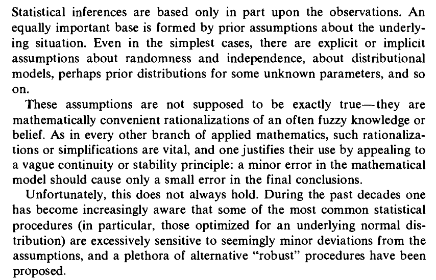

```{r setup, include=FALSE}
fig.dim <- 4
knitr::opts_chunk$set(fig.width=2*fig.dim,
                      fig.height=fig.dim,
                      fig.align='center')
set.seed(23)
library(tidyverse)
library(rstan)
library(matrixStats)
options(mc.cores = parallel::detectCores())
```

# Robustness

##

**Statistical robustness:**

{width=80%}

::: {.caption}
Huber, *Robust Statistics*.
:::

##

Methods for dealing with "outliers":

> 1. (Look at them carefully and) **remove them** (if appropriate).
> 
> 2. Use methods that are *robust* to the presence of outliers.


# Fitting linear models, robustly

## Standard "least-squares" fits

:::::::::::::: {.columns}
::: {.column width="50%"}

$$\begin{aligned}
    \hat y_i &= b_0 + b_1 x_i \\
    y_i &\sim \Normal(\hat y_i, \sigma^2) .
\end{aligned}$$

Simulate data:

```r
truth <- list(b0=1.0, b1=2.0, sigma=0.5)
n <- 200
x <- rnorm(n, mean=0, sd=1)
y <- ( truth$b0 + truth$b1 * x 
        + rnorm(n, mean=0, sd=truth$sigma) )
```

:::
::: {.column width="50%"}


```{r simdata, fig.width=1.5*fig.dim, fig.height=1.5*fig.dim, echo=FALSE}
set.seed(12)
truth <- list(b0=1.0, b1=2.0, sigma=0.5)
n <- 200
x <- rnorm(n, mean=0, sd=1)
y <- truth$b0 + truth$b1 * x + rnorm(n, mean=0, sd=truth$sigma)
plot(x,y)
abline(truth$b0, truth$b1, col='red')
```

:::
::::::::::::::


------------------

Least-squares fit:
```{r slr}
system.time( slr <- lm(y ~ x) )
summary(slr)
```

-----------------

with Stan
```{r stanlr, cache=TRUE}
slr_block <- "
data {
    int N;
    vector[N] x;
    vector[N] y;
}
parameters {
    real b0;
    real b1;
    real<lower=0> sigma;
}
model {
    y ~ normal(b0 + b1*x, sigma);
}"
system.time(
    stanlr <- stan(model_code=slr_block,
                   data=list(N=length(x), x=x, y=y), iter=1e3))
```

----------------


```{r summary_stanlr}
print(stanlr)
```


## Cauchy noise?

:::::::::::::: {.columns}
::: {.column width="50%"}


Relative axon growth
for neurons after $x$ hours:

```r
truth <- list(b0=1.0, b1=2.0, sigma=0.5)
n <- 200
x <- rnorm(n, mean=0, sd=1)
y <- ( truth$b0 + truth$b1 * x 
        + rcauchy(n, location=0, 
                  scale=truth$sigma) )
```

:::
::: {.column width="50%"}

```{r simdata_rr, fig.width=1.5*fig.dim, fig.height=1.5*fig.dim, echo=FALSE}
set.seed(12)
truth <- list(b0=1.0, b1=2.0, sigma=0.5)
n <- 200
x <- rnorm(n, mean=0, sd=1)
y <- truth$b0 + truth$b1 * x + rcauchy(n, location=0, scale=truth$sigma)
plot(x,y)
abline(truth$b0, truth$b1, col='red')
```

:::
::::::::::::::

## Compare:

```{r compare, echo=FALSE, fig.width=3*fig.dim, fig.height=1.5*fig.dim}
layout(t(1:2))
nnl <- list(Gaussian=rnorm, Cauchy=rcauchy)
for (nn in c("Gaussian", "Cauchy")) {
    set.seed(12)
    x <- rnorm(n, mean=0, sd=1)
    y <- truth$b0 + truth$b1 * x + nnl[[nn]](n, 0, truth$sigma)
    plot(x, y, main=sprintf("%s noise", nn))
    abline(truth$b0, truth$b1, col='red')
}
```


------------------

Least-squares fit:
```{r slrr}
summary(slr2 <- lm(y ~ x))
```

-----------------

with Stan
```{r stanrr, cache=TRUE}
srr_block <- "
data { 
    int N;
    vector[N] x;
    vector[N] y;
}
parameters {
    real b0;
    real b1;
    real<lower=0> sigma;
}
model {
    y ~ cauchy(b0 + b1*x, sigma);
}"
system.time(
    stanrr <- stan(model_code=srr_block,
                   data=list(N=length(x), x=x, y=y), iter=1e3))
```

----------------


```{r summary_stanrr}
print(stanrr)
```

## Inferred lines, with uncertainty


```{r plot_simdata_rr, fig.width=3.5*fig.dim, fig.height=1.5*fig.dim, echo=FALSE}
make_lm_poly <- function (min_coefs, max_coefs, xlim, ...) {
    polygon(x=c(xlim[1], 0, xlim[2], xlim[2], 0, xlim[1]),
            y=c(max_coefs[1] + xlim[1] * min_coefs[2],
                max_coefs[1],
                max_coefs[1] + xlim[2] * max_coefs[2],
                min_coefs[1] + xlim[2] * min_coefs[2],
                min_coefs[1],
                min_coefs[1] + xlim[1] * max_coefs[2]) , ...)
}
stancoefs <- rstan::extract(stanrr)
layout(t(1:2))
plot(x,y, main='lm()')
make_lm_poly(coef(slr2)-2*summary(slr2)$coefficients[,"Std. Error"], 
             coef(slr2)+2*summary(slr2)$coefficients[,"Std. Error"], 
             range(x),
             col=adjustcolor("purple", 0.2))
abline(coef=coef(slr2), col='purple', lwd=2)
abline(truth$b0, truth$b1, col='red', lwd=2)
plot(x,y, main='stan()')
make_lm_poly(c(quantile(stancoefs$b0, 0.025), quantile(stancoefs$b1, 0.025)),
             c(quantile(stancoefs$b0, 0.975), quantile(stancoefs$b1, 0.975)),
             range(x),
             col=adjustcolor("green", 0.2))
abline(truth$b0, truth$b1, col='red', lwd=2)
abline(mean(stancoefs$b0), mean(stancoefs$b1), col='green', lwd=2)
legend("topleft", lty=1, col=c("red", "purple", "green"), legend=c("truth", "lm", "stan"))
```

## Same, zoomed in


```{r plot_simdata_rr_again, fig.width=3.5*fig.dim, fig.height=1.5*fig.dim, echo=FALSE}
layout(t(1:2))
plot(x,y, main='lm()', ylim=c(-10,10))
make_lm_poly(coef(slr2)-2*summary(slr2)$coefficients[,"Std. Error"], 
             coef(slr2)+2*summary(slr2)$coefficients[,"Std. Error"], 
             range(x),
             col=adjustcolor("purple", 0.2))
abline(coef=coef(slr2), col='purple', lwd=2)
abline(truth$b0, truth$b1, col='red', lwd=2)
plot(x,y, main='stan()', ylim=c(-10,10))
make_lm_poly(c(quantile(stancoefs$b0, 0.025), quantile(stancoefs$b1, 0.025)),
             c(quantile(stancoefs$b0, 0.975), quantile(stancoefs$b1, 0.975)),
             range(x),
             col=adjustcolor("green", 0.2))
abline(truth$b0, truth$b1, col='red', lwd=2)
abline(mean(stancoefs$b0), mean(stancoefs$b1), col='green', lwd=2)
legend("topleft", lty=1, col=c("red", "purple", "green"), legend=c("truth", "lm", "stan"))
```

# Why does it work?

##

::: {.columns}
::::::: {.column width=50%}

The Cauchy distribution has "heavy tails":
extreme values are much more likely.

So, a point that's far from the line is less surprising,

and the line with the highest likelihood
isn't as strongly affected by outliers.


:::
::::::: {.column width=50%}

```{r dx, fig.height=2*fig.dim, echo=FALSE}
layout(1:2, height=c(1,1.1))
par(mar=c(1,4,1,1)+.1)
x <- seq(-20, 20, length.out=501)
plot(x, dnorm(x), type='l', xlab='', ylab='probability density')
lines(x, dcauchy(x), col='red')
legend("topright", lty=1, col=1:2, legend=c("dnorm", "dcauchy"))
par(mar=c(5,4,1,1)+.1)
plot(x, dcauchy(x), type='l', col='red', log='y', xlab='value', ylab='probability density')
lines(x, dnorm(x))
```

:::
:::::::
