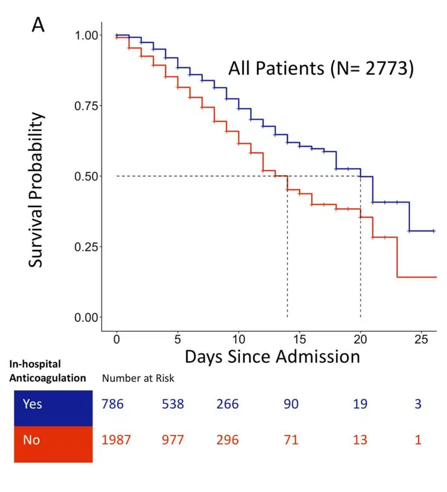

```{r setup, include=FALSE}
fig.dim <- 4
knitr::opts_chunk$set(fig.width=2*fig.dim,
                      fig.height=fig.dim,
                      fig.align='center',
                      warning=FALSE)
set.seed(42)
library(brms)
library(survival)
library(rstan)
library(matrixStats)
options(mc.cores = parallel::detectCores())
```


# Overview

## "Survival" analysis:

We are interested in
*how long until* some particular thing happens,
and *how this depends* on some covariates.

. . .

*Example:* how years until death depends on cancer grade at diagnosis and drug treatment.

. . .

*Example:* how day of first budburst depends on species and local temperature.


## Surivival data

*Ex:* For each patient, date of diagnosis and cancer grade;
date of death or last follow-up.

. . .

*Ex:* For each plant, species, date of first budburst or last survey.

. . .

Both examples are **right censored**:
for some subjects, we don't know how the actual time,
only a lower bound on it.

##

**Key assumption:** any censoring is *noninformative*,

. . .

i.e., our data collection does not depend on the status of the subjects.

. . .

Example of *informative* censoring:
patient dropout due to worsening symptoms.


## What do we want to know?

The *survival curve:*

$$\begin{aligned}
    S(t)
    &=
    \P\{\text{still 'alive' after $t$ time units}\} ,
\end{aligned}$$

*Note:* this is always *decreasing*.

. . .

and the *hazard rate:*

$$\begin{aligned}
    h(t)
    &=
    \text{(mean number of 'deaths' per still-alive subject,}
    \\ &\qquad \text{per unit time at $t$)} ,
\end{aligned}$$

. . .

which is

$$\begin{aligned}
    h(t) = - \frac{d}{dt} \log S(t) .
\end{aligned}$$

-------------

The *hazard rate*,

::: {.centered}
the rate the event of interest happens at,
:::

::: {.flushright}
is the slope of the survival curve on a log scale.
:::

## Nonparametric versus parametric?

We'll look at some methods across the
nonparametric-to-parametric continuum.

. . .

- *Nonparametric:* fewer assumptions.
- *Parametric:* fits a full, generative probability model.

## 

Replacing "death" with "your next donut",
which of these curves would you rather describe the distribution of time until your next donut?
```{r exs, echo=FALSE, fig.height=2 * fig.dim, fig.width=2.5*fig.dim}
x <- cbind(pweibull((1:1000)/50, shape=2, scale=40/5, lower.tail=FALSE),
           pweibull((1:1000)/50, shape=1, scale=30/5, lower.tail=FALSE),
           pweibull((1:1000)/50, shape=1/2, scale=20/5, lower.tail=FALSE))
matplot((1:1000)/50, x, ylim=c(0,1), xlab="number of days (t)", ylab="Prob(no donut yet by time t)", type='l')
```

## More information:

- A [series](https://www.ncbi.nlm.nih.gov/pmc/articles/PMC2394262/)
  [of](https://www.ncbi.nlm.nih.gov/pmc/articles/PMC2394368/)
  [nice](https://www.ncbi.nlm.nih.gov/pmc/articles/PMC2376927/)
  [reviews](https://www.ncbi.nlm.nih.gov/pmc/articles/PMC2394469/),
  by Clark, Bradburn, Love, and Altman.

- A [tutorial](https://www.emilyzabor.com/tutorials/survival_analysis_in_r_tutorial.html) by Emily Zabor.

. . .

{.finger width="15%"}
the [CRAN task view](https://cran.r-project.org/web/views/Survival.html)


# Datasets:

## [NCCTG Lung Cancer Data](https://www.ncbi.nlm.nih.gov/pubmed/8120560)

```{r get_lung, eval=1:2}
library(survival)
data(lung)
help(lung)
```
```
NCCTG Lung Cancer Data

Description:

     Survival in patients with advanced lung cancer from the North
     Central Cancer Treatment Group.  Performance scores rate how well
     the patient can perform usual daily activities.

Usage:

     lung
     cancer
     
Format:

       inst:       Institution code                                                    
       time:       Survival time in days                                               
       status:     censoring status 1=censored, 2=dead                                 
       age:        Age in years                                                        
       sex:        Male=1 Female=2                                                     
       ph.ecog:    ECOG performance score as rated by the physician. 
                   0=asymptomatic, 1= symptomatic but completely ambulatory, 2= in bed 
                   <50% of the day, 3= in bed > 50% of the day but not bedbound, 4 = 
                   bedbound 
       ph.karno:   Karnofsky performance score (bad=0-good=100) rated by physician     
       pat.karno:  Karnofsky performance score as rated by patient                     
       meal.cal:   Calories consumed at meals                                          
       wt.loss:    Weight loss in last six months                                      
      
Note:

     The use of 1/2 for alive/dead instead of the usual 0/1 is a
     historical footnote.  For data contained on punch cards, IBM 360
     Fortran treated blank as a zero, which led to a policy within the
     section of Biostatistics to never use "0" as a data value since
     one could not distinguish it from a missing value.  The policy
     became a habit, as is often the case; and the 1/2 coding endured
     long beyond the demise of punch cards and Fortran.

Source:

     Terry Therneau

References:

     Loprinzi CL. Laurie JA. Wieand HS. Krook JE. Novotny PJ.  Kugler
     JW. Bartel J. Law M. Bateman M. Klatt NE. et al.  Prospective
     evaluation of prognostic variables from patient-completed
     questionnaires. North Central Cancer Treatment Group.  Journal of
     Clinical Oncology. 12(3):601-7, 1994.

```

## Simulation: Constant hazard rate

Time until arrival of a high-energy neutrino
in each of many detectors:

```{r sim_surv}
nrate <- 1 / 365
study_time <- 4 * 365
nobs <- 228
neutrinos <- data.frame(
        detector_id = 1:nobs,
        time = rexp(nobs, rate=nrate))
neutrinos$status <- (neutrinos$time < study_time)
neutrinos$time <- pmin(study_time, neutrinos$time)
head(neutrinos)
```

-----------

```{r plot_neutrs, echo=FALSE}
hist(neutrinos$time, breaks=20, xlab='time', main='neutrino arrival')
```

## Simulation: Increasing hazard rate

Time until failure of lightbulbs,
that wear out as time goes on:

```{r sim_lightbulbs}
lmean <- 2 * 365
bulbs <- data.frame(
        bulb_id = 1:nobs,
        time = abs(rnorm(nobs, sd=lmean)))
bulbs$status <- (bulbs$time < study_time)
bulbs$time <- pmin(study_time, bulbs$time)
```

------------

```{r plot_lightbulbs, echo=FALSE}
hist(bulbs$time, breaks=20, xlab='time', ylab='lightbulb burnout')
```

# Kaplan-Meier curves

## Estimating probabilities

Suppose that:

- we start with 100 chickens
- in the first year, 25 of them die
- in the second year, 25 of them die
- at the end of the second year, we give 25 of the survivors away
- in the third year, 15 of them die

. . .

**Questions:**

- What percent survived each year? (of those that began that year alive)
- Find the probability of surviving to 1, 2, 3, and 4 years,
- and draw the survival curve.

## 

The **Kaplan-Meier survival curve** is a purely empirical, nonparametric
estimate of survival probability:

- one interval per unique event time
- estimated probability of surviving an interval is the proportion that did
- and so the probability of surviving until $t$
  is the product of all the survival probabilities before $t$

. . .

```{r chickens, fig.height=0.8*fig.dim, echo=2:3}
par(mar=c(5,4,1,1)+.1)
plot(Surv(time=rep(1:3, times=c(25, 50, 25)),
          event=c(rep(2, 25), rep(2, 25), rep(1, 25), rep(2, 15), rep(1, 10))), xlab="years", ylab="probability of survival", ylim=c(0,1))
```

## Neutrinos:

```{r plot_neutrinos, fig.height=1.5*fig.dim, fig.width=2.5*fig.dim}
neutrino_sf <- survfit(Surv(time, status) ~ 1, data=neutrinos)
plot(neutrino_sf, xlab='number of days', ylab='prob of detection', main="Neutrino detection")
lines(1:study_time, pexp(1:study_time, rate=nrate, lower.tail=FALSE), col='red')
```

## Light bulbs:

```{r plot_lbs, fig.height=1.5*fig.dim, fig.width=2.5*fig.dim}
bulb_sf <- survfit(Surv(time, status) ~ 1, data=bulbs)
plot(bulb_sf, xlab='number of days', ylab='prob of detection', main="Lightbulb failure")
lines(1:study_time, 2 * pnorm(1:study_time, sd=lmean, lower.tail=FALSE), col='red')
```

## Hazard rate is slope of survival on a log scale:

```{r plot_both, fig.height=1.5*fig.dim, fig.width=2.5*fig.dim}
layout(t(1:2))
plot(neutrino_sf, xlab='number of days', ylab='prob of detection', main="Neutrino detection", log='y')
plot(bulb_sf, xlab='number of days', main="Lightbulb failure", log='y')
```

## Lung cancer survival:

```{r plot_km, fig.height=1.5*fig.dim, fig.width=2.5*fig.dim}
lung_sf <- survfit(Surv(time, status) ~ 1, data=lung)
plot(lung_sf, conf.int=TRUE, xlab='number of days', ylab='prob of survival', main="Lung cancer survival")
```


## Hazard rate is slope of survival on a log scale:

```{r plot_km1, fig.height=1.5*fig.dim, fig.width=2.5*fig.dim, echo=FALSE}
plot(lung_sf, conf.int=TRUE, xlab='number of days', ylab='prob of survival', main="Lung cancer survival", log='y')
```


## Survival, by sex:

```{r plot_km2, warning=FALSE, fig.height=1.5*fig.dim, fig.width=2.5*fig.dim}
lung_sf_bysex <- survfit(Surv(time, status) ~ sex, data=lung)
plot(lung_sf_bysex, col=1:2, conf.int=TRUE, xlab='number of days', ylab='prob of survival', main="Lung cancer survival")
legend("topright", lty=c(1,1,2), col=c(1,2,1), legend=c("Male", "Female", "95% conf int"))
```


# Interpretation interlude:

## Interpret this:

::: {.columns}
::::::: {.column width=50%}


*a retrospective analysis of 2,733 patients with confirmed COVID-19 admitted at five New York City hospitals within the Mount Sinai system between 3/14 and 4/11*


- What is the "number at risk"?
- The blue curve hits 50% at 20 days. What does that mean?
- "Patients treated with anticoagulation were generally sicker" - so, what do we conclude?


:::
::::::: {.column width=50%}



::: {.caption}
From [Paranjpe et al](https://www.sciencedirect.com/science/article/abs/pii/S0735109720352189) via [emcrit.org/pulmcrit/sinai](/https://emcrit.org/pulmcrit/sinai/)
:::

:::
:::::::
