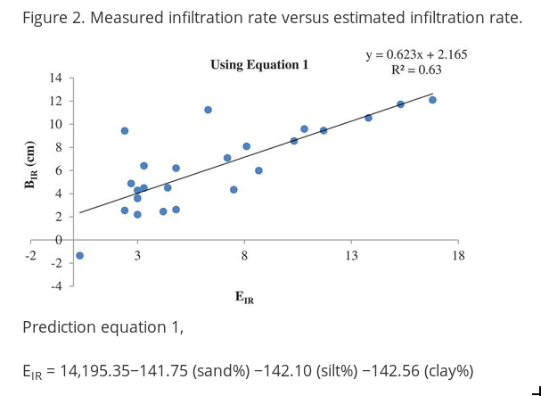

```{r setup, include=FALSE}
fig.dim <- 4
knitr::opts_chunk$set(fig.width=2*fig.dim,
                      fig.height=fig.dim,
                      fig.align='center')
set.seed(23)
library(tidyverse)
library(rstan)
library(brms)
library(bayesplot)
library(matrixStats)
options(mc.cores = parallel::detectCores())
options(digits=2)
```

```{r helpers, include=FALSE}
shadecurve <- function (pf, xlim, plot=TRUE, xlab='', ylab='', main='',
                        border="black", col=adjustcolor(border, 0.25), ...) {
    x <- seq(xlim[1], xlim[2], length.out=400)
    mids <- x[-1] - diff(x)/2
    df <- diff(pf(x, ...))
    if (plot) { plot(0, type='n', xlim=range(x), ylim=range(df),
                     main=main, xlab=xlab, ylab=ylab) }
    polygon(c(mids, x[length(x)], x[1]), c(df, 0, 0), col=col, border=border) 
}
```
```{r misc, include=FALSE}
library(lars)
```


# Prediction

## Out-of-sample prediction

To test predictive ability (and diagnose overfitting!):

1. Split the data into *test* and *training* pieces.
2. Fit the model using the training data.
3. See how well it predicts the test data.

. . .

If you do this a lot of times, it's called *crossvalidation*.


##


::: {.caption}
https://xkcd.com/2236/
:::


# Overfitting: when you have too much information


## Example data


-----------

```{r lars_data}
library(lars)
data(diabetes)
class(diabetes$x2) <- "matrix"
```
```
diabetes                 package:lars                  R Documentation

Blood and other measurements in diabetics

Description:

     The ‘diabetes’ data frame has 442 rows and 3 columns. These are
     the data used in the Efron et al "Least Angle Regression" paper.

Format:

     This data frame contains the following columns:

     x a matrix with 10 columns

     y a numeric vector

     x2 a matrix with 64 columns
```

---------------

The dataset has

- 442 diabetes patients
- 10 main variables: age, gender, body mass index, average blood pressure (map), 
  and six blood serum measurements (tc, ldl, hdl, tch, ltg, glu)
- 45 interactions, e.g. `age:ldl`
- 9 quadratic effects, e.g. `age^2`
- measure of disease progression taken one year later: `y`

##

```{r show_cors, fig.width=2.3*fig.dim, fig.height=2.3*fig.dim, echo=FALSE}
pairs(cbind(diabetes$x, y=diabetes$y))
```

##

```{r print_cors}
cor(cbind(diabetes$x, y=diabetes$y))
```

## Crossvalidation plan

1. Put aside 20% of the data for *testing*.

2. Refit the model.

3. Predict the test data; compute
   $$\begin{aligned}
    S = \sqrt{\frac{1}{M} \sum_{k=1}^M (\hat y_i - y_i)^2}
   \end{aligned}$$

. . .


4. Repeat for the other four 20%s.

5. Compare.


## Crossvalidation

First let's split the data into testing and training just once:
```{r split_data}
test_observations <- (rbinom(nrow(diabetes), size=1, prob=0.2) == 1)
test_d <- cbind(data.frame(y=diabetes$y[test_observations]),
                diabetes$x2[test_observations,])
training_d <- cbind(data.frame(y=diabetes$y[!test_observations]),
                diabetes$x2[!test_observations,])
```

## Ordinary least squares

```{r ols}
ols <- lm(y ~ ., data=training_d)
summary(ols)
```

-------------

```{r crossval_ols}
ols_pred <- predict(ols, newdata=test_d)
ols_mse <- sqrt(mean((ols_pred - test_d$y)^2))
c(train=sqrt(mean(resid(ols)^2)),
  test=ols_mse)
```
With ordinary linear regression, we got a root-mean-square-prediction-error of `r ols_mse` (on the *test* data),
compared to a root-mean-square-error of `r sqrt(mean(resid(ols)^2))` for the *training* data.

. . .

This suggests there's some overfitting going on.

------------

```{r plot_ols, echo=-1, fig.width=2.5*fig.dim, fig.height=1.5*fig.dim}
layout(t(1:2))
plot(training_d$y, predict(ols), xlab="true values", ylab="OLS predicted", main="training data", pch=20, asp=1)
abline(0,1)
plot(test_d$y, ols_pred, xlab="true values", ylab="OLS predicted", main="test data", pch=20, asp=1)
abline(0,1)
```

## A sparsifying prior

We have a lot of predictors: 64 of them.
A good guess is that only a few are really useful.
So, we can put a *sparsifying* prior on the coefficients,
i.e.,  $\beta$s in
$$\begin{aligned}
    y = \beta_0 + \beta_1 x_1 + \cdots \beta_n x_n + \epsilon
\end{aligned}$$


# Overfitting: the effect of spurious variables

## Who says we don't do experiments?

1. Simulate data with `y ~ a + b x[1] + c x[2]`, and fit a linear model.
2. Measure in-sample and out-of-sample prediction error.
3. Add spurious variables, and report the above as a function of number of variables.


## Basic data: $y = a + b_1 x_1 + b_2 x_2 + \epsilon$.

```{r in_class1, echo=-1, cache=TRUE}
set.seed(23)
N <- 500
df <- data.frame(x1 = rnorm(N),
                 x2 = runif(N))
params <- list(intercept = 2.0,
               x1 = 7.0,
               x2 = -8.0,
               sigma = 1)
pred_y <- params$intercept + params$x1 * df$x1 + params$x2 * df$x2 
df$y <- rnorm(N, mean=pred_y, sd=params$sigma)
pairs(df)
```

## Crossvalidation error function

```{r in_class2, cache=TRUE}
kfold <- function (K, df) {
    Kfold <- sample(rep(1:K, nrow(df)/K))
    results <- data.frame(test_error=rep(NA, K), train_error=rep(NA, K))
    for (k in 1:K) {
        the_lm <- lm(y ~ ., data=df, subset=(Kfold != k))
        results$train_error[k] <- sqrt(mean(resid(the_lm)^2))
        test_y <- df$y[Kfold == k]
        results$test_error[k] <- sqrt(mean(
                       (test_y - predict(the_lm, newdata=subset(df, Kfold==k)))^2 ))
    }
    return(results)
}
```

## Add spurious variables

```{r in_class3, cache=TRUE, dependson=c("in_class1", "in_class2")}
max_M <- 300  # max number of spurious variables
noise_df <- matrix(rnorm(nrow(df) * (max_M-2)), nrow=nrow(df))
colnames(noise_df) <- paste0('z', 1:ncol(noise_df))
new_df <- cbind(df, noise_df)
all_results <- data.frame(m=floor(seq(from=2, to=max_M-1, length.out=40)),
                          test_error=NA, train_error=NA)
for (j in 1:nrow(all_results)) {
    m <- all_results$m[j]
    all_results[j,2:3] <- colMeans(kfold(K=10, new_df[,1:(m+1)]))
}
```

## Results

```{r in_class5, fig.width=2.5*fig.dim, fig.height=1.5*fig.dim}
plot(all_results$m, all_results$test_error, type='l', lwd=2,
     xlab='number of variables', ylab='root mean square error', ylim=range(all_results[,2:3], 0))
lines(all_results$m, all_results$train_error, col=2, lwd=2)
legend("topleft", lty=1, col=1:2, lwd=2, legend=paste(c("test", "train"), "error"))
```

# Interlude

## 

<!-- from https://www.tandfonline.com/doi/full/10.1080/24749508.2018.1481633 -->

{ width=50% }



##

Use [the data](data/infiltration_data.tsv)
to try to reproduce their model:

```
BIR = 14,195.35 - 141.75 (sand%) - 142.10 (silt%) - 142.56 (clay%)
```

They're not wrong! What's up with those coefficients, though?

```{r infil_data, include=FALSE}
head(infil <- read.table("data/infiltration_data.tsv", header=TRUE))
```


# Sparseness and scale mixtures

## Encouraging sparseness

Suppose we do regression with a *large* number of predictor variables.

. . .

The resulting coefficients are **sparse** if most are zero.

. . .

The idea is to "encourage" all the coefficients to be zero,
**unless**  they *really* want to be nonzero,
in which case we let them be whatever they want.

. . .

This tends to discourage overfitting.

-------------

> The idea is to "encourage" all the coefficients to be zero,
> **unless**  they *really* want to be nonzero,
> in which case we let them be whatever they want.


To do this, we want a prior which is very peak-ey at zero
*but* flat away from zero ("spike-and-slab").


-------------------

:::::::::::::: {.columns}
::: {.column width="50%"}


Compare the Normal

$$\begin{aligned}
    X \sim \Normal(0,1)
\end{aligned}$$

to the "exponential scale mixture of Normals",

$$\begin{aligned}
    X &\sim \Normal(0,\sigma) \\
    \sigma &\sim \Exp(1) .
\end{aligned}$$

:::
::: {.column width="50%"}

```{r scale_mixtures, fig.width=1.5*fig.dim, echo=FALSE}
shadecurve(pnorm, xlim=c(-5,5), main='Normal(0,1)')
sdvals <- qexp(seq(0,1,length.out=10)[-c(1,10)])
for (u in sdvals) {
    shadecurve(pnorm, xlim=c(-5,5), sd=u, plot=(u==sdvals[1]), main='Normal(0, Exp(1))')
}
```

:::
::::::::::::::

## Why use a scale mixture?

1. Lets the data choose the appropriate scale of variation.

2. Weakly encourages $\sigma$ to be small: so, 
   as much variation as possible is explained by *signal* instead of *noise*.

3. Gets you a prior that is more peaked at zero and flatter otherwise.


# Application

## The plan

Fit a linear model to the `diabetes` dataset with:

1. no prior
2. horseshoe priors

## OLS in brms

```{r do_brms_ols, cache=TRUE}
xy <- cbind(data.frame(y=diabetes$y), diabetes$x2)
names(xy) <- gsub("[:^]", "_", names(xy))

# ols
brms_ols <- brm(y ~ ., data=xy, family=gaussian(link='identity'))
```


## horseshoe in brms

```{r do_brms_hs, cache=TRUE}
brms_hs <- brm(y ~ ., data=xy, family=gaussian(link='identity'), 
               prior=c(set_prior(horseshoe(), class="b")))
```

```{r brmcrossval2, cache=TRUE, dependson="do_brms_hs"}
# (khs <- brms::kfold(brms_hs, K=5))
```

## Crossvalidation error function

```{r brms_kfoldfn, cache=TRUE}
brms_kfold <- function (K, models) {
    stopifnot(!is.null(names(models)))
    Kfold <- sample(rep(1:K, nrow(xy)/K))
    results <- data.frame(rep=1:K)
    for (j in seq_along(models)) {
        train <- test <- rep(NA, K)
        for (k in 1:K) {
            new_fit <- update(models[[j]], newdata=subset(xy, Kfold != k))
            train[k] <- sqrt(mean(resid(new_fit)[,"Estimate"]^2))
            test_y <- xy$y[Kfold == k]
            test[k] <- sqrt(mean(
                   (test_y - predict(new_fit, newdata=subset(xy, Kfold==k))[,"Estimate"])^2 ))
        }
        results[[paste0(names(models)[j], "_train")]] <- train
        results[[paste0(names(models)[j], "_test")]] <- test
    }
    return(results)
}
```


---------------------

```{r brms_kfolks, cache=TRUE, dependson=c("brms_kfoldfn", "do_brms_ols", "do_brms_hs")}
brms_xvals <- brms_kfold(5, list('ols'=brms_ols, 'horseshoe'=brms_hs))
```

## Crossvalidation results


```{r show_brms_xvals, echo=FALSE, fig.width=2*fig.dim, fig.height=1.5*fig.dim}
matplot(brms_xvals[,2:5], type='l', col=rep(1:2, each=2), lty=rep(1:2, 2), ylab='root mean squared error', xlab='fold number')
legend("topright", lty=c(1,2,1,2), col=c(1,1,2,2),
       legend=c("ols test",
                "ols train",
                "horseshoe test",
                "horseshoe train"))

```


## Coefficients:

:::::::::::::: {.columns}
::: {.column width="50%"}

```{r brmresults, echo=FALSE, fig.height=2*fig.dim}
blm_samps <- fixef(brms_ols, summary=FALSE)
bayesplot::mcmc_intervals(blm_samps) + ggtitle("OLS")
```


:::
::: {.column width="50%"}

```{r brmresults2, echo=FALSE, fig.height=2*fig.dim}
bhs_samps <- fixef(brms_hs, summary=FALSE)
bayesplot::mcmc_intervals(bhs_samps) + ggtitle("horseshoe")
```

:::
::::::::::::::


# Model fit

## What's an appropriate noise distribution?

```{r show_y, echo=FALSE, fig.width=3*fig.dim, fig.height=1.5*fig.dim}
layout(t(1:2))
hist(diabetes$y, breaks=30, main="diabetes, response")
qqnorm(diabetes$y)
qqline(diabetes$y)
```

## Aside: quantile-quantile plots

The idea is to plot the *quantiles* of each distribution against each other.

If these are *datasets*, this means just plotting their *sorted values* against each other.

```{r qq, fig.width=3*fig.dim, echo=c(1,2,4)}
x <- rnorm(1e4)
y <- rbeta(1e4, 2, 2)
layout(t(1:3))
plot(sort(x), sort(y)); qqplot(x, y, main="qqplot"); qqnorm(y, main="qnorm")
```

## Look at the residuals!

$$\begin{aligned}
    y_i &= \sum_j \beta_j x_{ij} + \epsilon_i \\
    \epsilon_i &\sim \Normal(0, \sigma^2) .
\end{aligned}$$

```{r the_resids}
ols_resids <- resid(lm(y ~ ., data=xy))
qqnorm(ols_resids)
qqline(ols_resids)
```

## Posterior preditive checks:

```{r the_pp}
pp_check(brms_hs)
```

# More general crossvalidation

## `brms::kfold`

The `kfold` function will *automatically* do $k$-fold crossvalidation!
For instance:

```{r brmcrossval_hs, cache=TRUE, dependson="do_brms_hs"}
(khs <- brms::kfold(brms_hs, K=5))
```

----------

`elpd` = "expected log posterior density"

```{r show_khs, echo=FALSE}
khs
```
