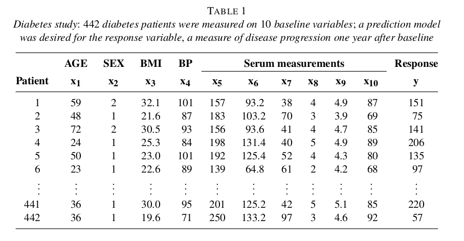

```{r setup, include=FALSE}
fig.dim <- 4
knitr::opts_chunk$set(fig.width=2*fig.dim,
                      fig.height=fig.dim,
                      fig.align='center')
set.seed(23)
library(rstan)
library(brms)
library(bayesplot)
library(matrixStats)
library(tidyverse)
options(mc.cores = parallel::detectCores())
options(digits=2)
```

```{r helpers, include=FALSE}
shadecurve <- function (pf, xlim, plot=TRUE, xlab='', ylab='', main='',
                        border="black", col=adjustcolor(border, 0.25), ...) {
    x <- seq(xlim[1], xlim[2], length.out=400)
    mids <- x[-1] - diff(x)/2
    df <- diff(pf(x, ...))
    if (plot) { plot(0, type='n', xlim=range(x), ylim=range(df),
                     main=main, xlab=xlab, ylab=ylab) }
    polygon(c(mids, x[length(x)], x[1]), c(df, 0, 0), col=col, border=border) 
}
```
```{r misc, include=FALSE}
library(lars)
```


# Variable selection


## Example data



-----------

```{r lars_data}
library(lars)
data(diabetes)
class(diabetes$x2) <- "matrix"
```
```
diabetes                 package:lars                  R Documentation

Blood and other measurements in diabetics

Description:

     The ‘diabetes’ data frame has 442 rows and 3 columns. These are
     the data used in the Efron et al "Least Angle Regression" paper.

Format:

     This data frame contains the following columns:

     x a matrix with 10 columns

     y a numeric vector

     x2 a matrix with 64 columns
```

---------------

The dataset has

- 442 diabetes patients
- 10 main variables: age, gender, body mass index, average blood pressure (map), 
  and six blood serum measurements (tc, ldl, hdl, tch, ltg, glu)
- 45 interactions, e.g. `age:ldl`
- 9 quadratic effects, e.g. `age^2`
- measure of disease progression taken one year later: `y`

##

```{r show_cors, fig.width=2.3*fig.dim, fig.height=2.3*fig.dim, echo=FALSE}
pairs(cbind(diabetes$x, y=diabetes$y))
```

##

```{r print_cors}
cor(cbind(diabetes$x, y=diabetes$y))
```

## Crossvalidation plan

1. Put aside 20% of the data for *testing*.

2. Refit the model.

3. Predict the test data; compute
   $$\begin{aligned}
    S = \sqrt{\frac{1}{M} \sum_{k=1}^M (\hat y_i - y_i)^2}
   \end{aligned}$$

. . .


4. Repeat for the other four 20%s.

5. Compare.


## Crossvalidation

First let's split the data into testing and training just once:
```{r split_data}
test_indices <- (rbinom(length(diabetes$y), size=1, prob=0.2) == 1)
test_d <- cbind(data.frame(y=diabetes$y[test_indices]),
                diabetes$x2[test_indices,])
training_d <- cbind(data.frame(y=diabetes$y[!test_indices]),
                diabetes$x2[!test_indices,])
```

## Ordinary linear regression

```{r ols}
ols <- lm(y ~ ., data=training_d)
summary(ols)
```

-------------

```{r crossval_ols}
ols_pred <- predict(ols, newdata=test_d)
ols_mse <- sqrt(mean((ols_pred - test_d$y)^2))
```
With ordinary linear regression, we got a root-mean-square-prediction-error of `r ols_mse` (on the *test* data),
compared to a root-mean-square-error of `r sqrt(mean(resid(ols)^2))` for the *training* data.

. . .

This suggests there's some overfitting going on.

------------

```{r plot_ols, echo=-1}
layout(t(1:2))
plot(training_d$y, predict(ols), xlab="true values", ylab="OLS predicted", main="training data", pch=20)
abline(0,1)
plot(test_d$y, ols_pred, xlab="true values", ylab="OLS predicted", main="test data", pch=20)
abline(0,1)
```

## A sparsifying prior

We have a lot of predictors: 64 of them.
A good guess is that only a few are really useful.
So, we can put a *sparsifying* prior on the coefficients,
i.e.,  $\beta$s in
$$\begin{aligned}
    y = \beta_0 + \beta_1 x_1 + \cdots \beta_n x_n + \epsilon
\end{aligned}$$


# Crossvalidation: the effect of spurious variables

## Who says we don't do experiments?

1. Simulate data with `y ~ a + b x[1] + c x[2]`, and fit a linear model.
2. Measure in-sample and out-of-sample prediction error.
3. Add spurious variables, and report the above as a function of number of variables.

. . .

4. Simulate data with *many, weakly predictive* explanatory variables.
5. Compare different methods for fitting linear models.


## Basic data: $y = a + b_1 x_1 + b_2 x_2 + \epsilon$.

```{r in_class1, echo=-1}
set.seed(23)
N <- 500
df <- data.frame(x1 = rnorm(N),
                 x2 = runif(N))
params <- list(intercept = 2.0,
               x1 = 7.0,
               x2 = -3.0,
               sigma = 0.1 * 10)
pred_y <- params$intercept + params$x1 * df$x1 + params$x2 * df$x2 
df$y <- rnorm(N, mean=pred_y, sd=params$sigma)
pairs(df)
```

## Crossvalidation error function

```{r in_class2}
kfold <- function (K, df) {
    N <- nrow(df)
    Kfold <- sample(rep(1:K, N/K))

    do_xval <- function (k) {
        the_lm <- lm(y ~ ., data=df, subset=(Kfold != k))
        train_error <- sqrt(mean(resid(the_lm)^2))
        test_y <- df$y[Kfold == k]
        test_error <- sqrt(mean( (test_y - predict(the_lm, newdata=subset(df, Kfold==k)))^2 ))
        return(c('test'=test_error, 'train'=train_error))
    }

    results <- sapply(1:K, do_xval)
    return(results)
}
```

## Add noise

```{r in_class3}
K <- 10
max_M <- 300
do_m <- floor(seq(from=2, to=max_M-1, length.out=40))
all_results <- matrix(NA, nrow=length(do_m) + 1, ncol=2)
first_results <- rowMeans(kfold(K, df))
all_results[1,] <- first_results
colnames(all_results) <- names(first_results)
```

```{r in_class4, cache=TRUE}
noise_df <- matrix(rnorm(N * (N-2)), nrow=N)
colnames(noise_df) <- paste0('z', 1:ncol(noise_df))
new_df <- cbind(df, noise_df)
for (j in seq_along(do_m)) {
    m <- do_m[j]
    all_results[j,] <- rowMeans(kfold(K, new_df[,1:(m+1)]))
}
```

## Results

```{r in_class5}
matplot(c(2, do_m), all_results, type='l', xlab='number of variables', ylab='root mean square error')
legend("topleft", lty=1, col=1:2, legend=colnames(all_results))
```

# Sparseness and scale mixtures

## Encouraging sparseness

Suppose we do regression with a *large* number of predictor variables.

. . .

The resulting coefficients are **sparse** if most are zero.

. . .

The idea is to "encourage" all the coefficients to be zero,
**unless**  they *really* want to be nonzero,
in which case we let them be whatever they want.

. . .

This tends to discourage overfitting.

-------------

> The idea is to "encourage" all the coefficients to be zero,
> **unless**  they *really* want to be nonzero,
> in which case we let them be whatever they want.


To do this, we want a prior which is very peak-ey at zero
*but* flat away from zero ("spike-and-slab").


-------------------

:::::::::::::: {.columns}
::: {.column width="50%"}


Compare the Normal

$$\begin{aligned}
    X \sim \Normal(0,1)
\end{aligned}$$

to the "exponential scale mixture of Normals",

$$\begin{aligned}
    X &\sim \Normal(0,\sigma) \\
    \sigma &\sim \Exp(1) .
\end{aligned}$$

:::
::: {.column width="50%"}

```{r scale_mixtures, fig.width=1.5*fig.dim, echo=FALSE}
shadecurve(pnorm, xlim=c(-5,5), main='Normal(0,1)')
sdvals <- qexp(seq(0,1,length.out=10)[-c(1,10)])
for (u in sdvals) {
    shadecurve(pnorm, xlim=c(-5,5), sd=u, plot=(u==sdvals[1]), main='Normal(0, Exp(1))')
}
```

:::
::::::::::::::

## Why use a scale mixture?

1. Lets the data choose the appropriate scale of variation.

2. Weakly encourages $\sigma$ to be small: so, 
   as much variation as possible is explained by *signal* instead of *noise*.

3. Gets you a prior that is more peaked at zero and flatter otherwise.


## Implementation

:::::::::::::: {.columns}
::: {.column width="50%"}


Note that

$$\begin{aligned}
    \beta &\sim \Normal(0,\sigma) \\
    \sigma &\sim \Exp(1) .
\end{aligned}$$

is equivalent to

$$\begin{aligned}
    \beta &= \sigma \gamma \\
    \gamma &\sim \Normal(0,1) \\
    \sigma &\sim \Exp(1) .
\end{aligned}$$

:::
::: {.column width="50%"}

```
parameters {
    real beta;
    real<lower=0> sigma;
}
model {
    beta ~ normal(0, sigma);
    sigma ~ exponential(1);
}
```

is equivalent to

```
parameters {
    real gamma;
    real<lower=0> sigma;
}
transformed parameters {
    real beta;
    beta = gamma * sigma;
}
model {
    gamma ~ normal(0, 1);
    sigma ~ exponential(1);
}
```

The second version **is better** for Stan.


:::
:::::::::::::::

-------------

:::::::::::::: {.columns}
::: {.column width="50%"}

Why is it better?


```
parameters {
    real beta;
    real<lower=0> sigma;
}
model {
    beta ~ normal(0, sigma);
    sigma ~ exponential(1);
}
```

In the first, the optimal step size
*depends on `sigma`*.

```
parameters {
    real gamma;
    real<lower=0> sigma;
}
transformed parameters {
    real beta;
    beta = gamma * sigma;
}
model {
    gamma ~ normal(0, 1);
    sigma ~ exponential(1);
}
```


:::
::: {.column width="50%"}

```{r sigma_phase, echo=FALSE, fig.width=1.5*fig.dim}
xx <- seq(0, 0.5, length.out=401)[-1]
yy <- seq(-4,4,length.out=401)
xy <- outer(xx, yy, function (x,y) { dnorm(y, sd=x) * dexp(x) })
image(xx, yy, -log10(xy), xlab="sigma", ylab="beta")
contour(xx, yy, -log10(xy), add=TRUE)
xy <- outer(xx, yy, function (x,y) { dnorm(y, sd=1) * dexp(x) })
image(xx, yy, -log10(xy), xlab="sigma", ylab="gamma")
contour(xx, yy, -log10(xy), add=TRUE)
```

:::
:::::::::::

## A strongly sparsifying prior


:::::::::::::: {.columns}
::: {.column width="50%"}

The "horseshoe":

$$\begin{aligned}
    \beta_j &\sim \Normal(0, \lambda_j) \\
    \lambda_j &\sim \Cauchy(0, \tau) \\
    \tau &\sim \Unif(0, 1) 
\end{aligned}$$

:::
::: {.column width="50%"}

```
parameters {
    vector[p] d_beta;
    vector[p] d_lambda;
    real<lower=0, upper=1> tau;
}
transformed parameters {
    vector[p] beta;
    beta = d_beta .* d_lambda * tau;
}
model {
    d_beta ~ normal(0, 1);
    d_lambda ~ cauchy(0, 1);
    // tau ~ uniform(0, 1); // uniform
}
```

:::
:::::::::::

## The Cauchy as a scale mixture

Recall that if

$$\begin{aligned}
    \beta &\sim \Normal(0, 1/\sqrt{\lambda}) \\
    \lambda &\sim \Gam(1/2, 1/2)
\end{aligned}$$

then

$$\begin{aligned}
    \beta &\sim \Cauchy(0, 1).
\end{aligned}$$


# With brms

## OLS in brms

```{r do_brms, cache=TRUE}
xy <- cbind(data.frame(y=diabetes$y), diabetes$x2)
names(xy) <- gsub("[:^]", "_", names(xy))

# ols
blm <- brm(y ~ ., data=xy, family=gaussian(link='identity'))
```

## horseshoe in brms

```{r do_brms2, cache=TRUE}
bhs <- brm(y ~ ., data=xy, family=gaussian(link='identity'), 
           prior=c(set_prior(horseshoe(), class="b")))
```

## 

:::::::::::::: {.columns}
::: {.column width="50%"}

```{r brmcrossval, cache=TRUE, dependson="do_brms"}
(klm <- brms::kfold(blm, K=5))
```


:::
::: {.column width="50%"}

```{r brmcrossval2, cache=TRUE, dependson="do_brms2"}
(khs <- brms::kfold(bhs, K=5))
```

:::
::::::::::::::

## 

:::::::::::::: {.columns}
::: {.column width="50%"}

```{r brmresults, echo=FALSE, fig.height=2*fig.dim}
bhs_samps <- fixef(blm, summary=FALSE)
bayesplot::mcmc_intervals(bhs_samps) + ggtitle("OLS")
```


:::
::: {.column width="50%"}

```{r brmresults2, echo=FALSE, fig.height=2*fig.dim}
bhs_samps <- fixef(bhs, summary=FALSE)
bayesplot::mcmc_intervals(bhs_samps) + ggtitle("horseshoe")
```

:::
::::::::::::::


# Interlude

## 

<!-- from https://www.tandfonline.com/doi/full/10.1080/24749508.2018.1481633 -->

{ width=50% }


##

Use [the data](data/infiltration_data.tsv)
to try to reproduce their model:

```
BIR = 14,195.35 - 141.75 (sand%) - 142.10 (silt%) - 142.56 (clay%)
```

They're not wrong! What's going on?

```{r infil_data, include=FALSE}
head(infil <- read.table("data/infiltration_data.tsv", header=TRUE))
```


# Using the horseshoe

## What's an appropriate noise distribution?

```{r show_y, echo=FALSE, fig.width=3*fig.dim, fig.height=1.5*fig.dim}
layout(t(1:2))
hist(diabetes$y, breaks=30, main="diabetes, response")
qqnorm(diabetes$y)
qqline(diabetes$y)
```

## Aside: quantile-quantile plots

The idea is to plot the *quantiles* of each distribution against each other.

If these are *datasets*, this means just plotting their *sorted values* against each other.

```{r qq, fig.width=3*fig.dim, echo=c(1,2,4)}
x <- rnorm(1e4)
y <- rbeta(1e4, 2, 2)
layout(t(1:3))
plot(sort(x), sort(y)); qqplot(x, y, main="qqplot"); qqnorm(y, main="qnorm")
```


## Regression with a horseshoe prior

Uses a [reparameterization](https://betanalpha.github.io/assets/case_studies/fitting_the_cauchy.html) of the Cauchy as a scale mixture of normals.


```{r horseshoe_model, cache=TRUE}
horseshoe_block <- "
data {
    int N;
    int p;
    vector[N] y;
    matrix[N,p] x;
}
parameters {
    real b0;
    vector[p] d_beta;
    vector[p] d_a;
    vector<lower=0>[p] d_b;
    real<lower=0, upper=1> tau;
    real<lower=0> sigma;
}
transformed parameters {
    vector[p] beta;
    vector[N] f;
    beta = d_beta .* d_a .* sqrt(d_b) * tau;
    f = b0 + x * beta;
}
model {
    y ~ normal(f, sigma);
    // HORSESHOE PRIOR:
    d_beta ~ normal(0, 1);
    d_a ~ normal(0, 1);
    d_b ~ inv_gamma(0.5, 0.5);
    // tau ~ uniform(0, 1); // uniform
    // priors on noise distribution:
    sigma ~ normal(0, 10);
}"
```

------------------

Note the data have already been normalized,
with the exception of $y$:

```{r data_summary}
summary(training_d)
```

------------------

```{r run_horseshoe, cache=TRUE, depends="horseshoe_model"}
horseshoe_fit <- stan(model_code=horseshoe_block,
                      data=list(N=nrow(training_d),
                                p=ncol(training_d)-1,
                                y=(training_d$y 
                                   - median(training_d$y))
                                  /mad(training_d$y),
                                x=as.matrix(training_d[,-1])),
                      iter=1000,
                      control=list(adapt_delta=0.999,
                                   max_treedepth=15))
```

--------------

```{r summary_hs}
(hs_summary <- rstan::summary(horseshoe_fit, pars=c("b0", "sigma", "beta"))$summary)
```

--------------

First compare the resulting regression parameters to OLS values.

```{r compare_betas, echo=FALSE, fig.width=3*fig.dim, fig.height=2*fig.dim}
hs_samples <- rstan::extract(horseshoe_fit, pars=c("b0", "sigma", "beta"))
# rescale to real units
post_med_intercept <- median(hs_samples$b0) * mad(training_d$y) + median(training_d$y)
post_med_sigma <- median(hs_samples$sigma) * mad(training_d$y)
post_med_slopes <- colMedians(hs_samples$beta) * mad(training_d$y)

ols_ses <- summary(ols)$coefficients[,2]

layout(t(1:2))
plot(coef(ols), seq_along(coef(ols)), ylab="coefficient", 
     xlab="estimate", main="OLS", pch=20)
segments(y0=1:65,
         x0=coef(ols) - 2 * ols_ses,
         x1=coef(ols) + 2 * ols_ses,
         col=adjustcolor("black", 0.5))
plot(c(post_med_intercept, post_med_slopes), seq_along(c(post_med_intercept, post_med_slopes)), 
     ylab='coefficient', xlab="estimate",
     col='red', pch=20, main="sparse")
segments(y0=1, 
         x0=mad(training_d$y) * quantile(hs_samples$b0, probs=0.025) + median(training_d$y), 
         x1=mad(training_d$y) * quantile(hs_samples$b0, probs=0.975) + median(training_d$y), 
         col=adjustcolor('red', 0.5))
segments(y0=2:65, 
         x0=mad(training_d$y) * colQuantiles(hs_samples$beta, probs=0.025), 
         x1=mad(training_d$y) * colQuantiles(hs_samples$beta, probs=0.975),
         col=adjustcolor('red', 0.5))
```


--------------

The coefficient estimates from OLS are *wierd*.

```{r what_coefs, echo=FALSE}
options(scipen=3)
coef_df <- data.frame(ols=coef(ols),
                      stan=c(c(b0=post_med_intercept), post_med_slopes),
                      brms=fixef(bhs)[,'Estimate'])
coef_df[c(1,1+order(abs(coef_df$ols[-1]), decreasing=TRUE)),]
```

--------------

And, quite different than what Stan gets.

```{r what_coefs2, echo=FALSE}
coef_df[c(1,1+order(abs(coef_df$stan[-1]), decreasing=TRUE)),]
```


--------------

Now let's look at out-of-sample prediction error,
using the posterior median coefficient estimates:

```{r pred_stan}
pred_stan <- function (x) {
    post_med_intercept + as.matrix(x) %*% post_med_slopes
}
pred_y <- pred_stan(test_d[,-1])
stan_pred_error <- sqrt(mean((test_d$y - pred_y)^2))
stan_mse_resid <- sqrt(mean((training_d$y - pred_stan(training_d[,-1]))^2))

plot(test_d$y, pred_y, xlab="true values", ylab="predicted values", main="test data")
abline(0,1)
```

## Conclusions?


1. Our "sparse" model is certainly more sparse, and arguably more interpretable.

2. It has a root-mean-square prediction error of 
    `r stan_pred_error`
    on the *test* data, and
    `r stan_mse_resid`
    on the training data.

3. This is substantially better than ordinary linear regression, 
   which had a root-mean-square prediction error of `r ols_mse` on the test data,
   and a root-mean-square-error of `r sqrt(mean(resid(ols)^2))` on the training data.


. . .

The sparse model is more interpretable,
and more generalizable.


# Midterm review

## Steps in data analysis

1. Care, or at least think, about the data.

2. Look at the data.

3. Query the data.

4. Sanity check.

5. Communicate.

. . .

Often "statistics" focuses on *querying*.
Doing that effectively requires all the other steps, too.

## Statistics or parameters?

A **statistic** is

: a numerical description of a dataset.

. . .

A **parameter** is 

: a numerical attribute of a model of reality.

. . .

Often, *statistics* are used to estimate *parameters*.


## The two+ heads of classical statistics

estimating parameters, with uncertainty (*confidence* or *credible intervals*)

evaluating (in-)consistency with a particular situation (*$p$-values*)

. . .

prediction, with uncertainty

model adequacy and fit (simulation, crossvalidation)


## Models, part 1: How do we do this?

Parameters are *numbers*. With *units*.

So, they need to mean something *concrete* and *precise*.

. . .

In other words, they need to be part of a *model*.


## Models, part 2: Noise, and uncertainty.

To separate *information* from *noise*,
we need to understand the noise.

. . .

*How much of these differences are due to measurement error? or, unpredictable variation?
How much is telling me something about the world?*

. . .

A full model also describes the *statistical noise* in the data.

(It's a full model if you can simulate from it.)


## Models, part 3: how to fit them.

**Fitting a model:**
Finding parameter values
that make the data look plausible.

. . .

There may be a *wide range* of plausible parameter values.

. . .

*Priors* help get answers.


## Aspects of a model

1. What variables?

2. Response distribution(s).

3. Relationship of predictors to the response(s).

4. Relationships between parameters.

##

*Every* statistical method has a model lurking somewhere behind it.


## How do we fit models?

The basic tool is **likelihood**:

how likely are the data, using this set of parameters?


. . .

*Some methods:*

1. Hill climbing (maximum likelihood).

2. Hill wandering (Monte Carlo to explore posterior distributions)

