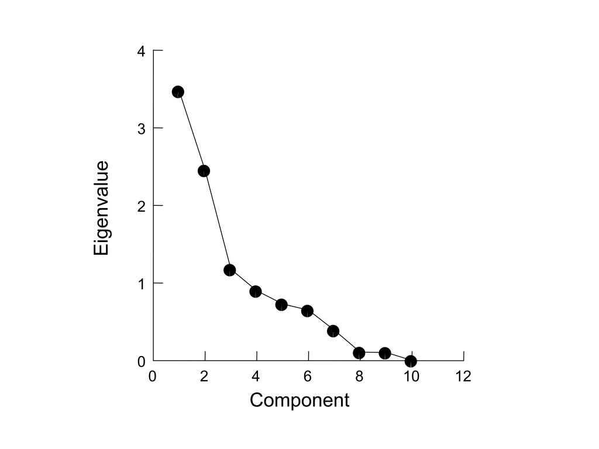

```{r setup, include=FALSE}
knitr::opts_chunk$set(echo = FALSE)
```

# Goals for today

## {}

**WE WILL COVER TODAY**

- What is multivariate statistics
- Primer on matrix algebra
- Latent roots of matrices
- Eigenvalues and eigenvectors

__________________________________


# Multivariate Statistics

## What are multivariate statitistics?

<br>

- **General** - more than one variable recorded from a number of experimental sampling units
- **Specific** - two or more response variables that likely co-vary
- **Goals** of multivariate statistics
    - Data reduction and simplification (**PCA and PCoA**)
    - Organization of objects (**Cluster Analysis and MDS**)
    - Testing the effects of a factor on linear combinations of variables (**MANOVA and DFA**)

## Conceptual overview of multivariate statistics

<br>

```{r, echo=FALSE, out.width='75%', fig.asp=.75, fig.align='center'}

```

## Multivariate statitistics definitions?

<br>

- Some definitions first
- `i = 1 to n` objects and `j = 1 to p` variables
- Measure of center of a multivariate distribution = the centroid
- Multivariate statistics uses eigenanalysis of either matrices of covariances of variables (`p-by-p`), or dissimilarities of objects (`n-by-n`)
- Matrix and linear algebra are therefore very useful in multivariate statistics

## Multivariate statitistics conceptual overview

```{r, echo=FALSE, out.width='90%', fig.asp=.75, fig.align='center'}

```

# Primer on Matrix Algebra

# Matrix algebra applied to multivariate statistics

## Eigenanalysis

<br>

$$Z_{ik} = c_1y_{i1} + c_2y_{i1} + c_3y_{i2} + c_1y_{i3} + ... + c_py_{ip}$$

<br>

- Derives linear combinations of the original variables that best summarize the total variation in the data
- These new linear combinations become new variables themselves
- Each object can now have a score for the new variables

## Eigenvalues

<br>

- Also called 
  - **characteristic** or **latent roots** or 
  - **factors**
- Rearranging the variance in the association matrix so that the first few derived variables explain most of the variation that was present between objects in the original variables
- The **eigenvalues** can also be expressed as proportions or percents of the original variance explained by each new derived variable (also called **components or factors**)

## Eigenvectors

<br>

- Lists of the **coefficients or  weights** showing how much each original variable contributes to each new derived variable
- The linear combination s can be solved to provide a score ($z_{ik}$) for each object
- There are the same number of derived variables as there are original variables (`p`)
- The newly derived variables are extracted sequentially so that they are **uncorrelated with each other**
- The eigenvalues and eigenvectors can be derived using either **spectral decomposition of the `p-by-p` matrix** or **singular value decomposition of the original matrix**

## Correlation vs. dissimiliarity matrices

- **Principal Component Analysis (PCA)** and **Correspondence Analysis (CA)** use covariance or correlation of variables.
- **Principal Coordinate Analysis (PCoA)**, **Cluster Analysis** and **Multidimensional Scaling (MDS)** use dissimilarity indices.
- The scaling of the derived latent variables **can therefore differ** between analyses that use covariance of variables as compared to dissimilarity indices.
- Whether the derived variable can be considered metric (e.g. on a **rational scale**) or non-metric (e.g. on an **ordinal scale**) depends on the analysis.
- As a consequence the downstream use of the derived variables can change depending upon the analysis.

## Correlation vs. dissimiliarity matrices

<br>

```{r, echo=FALSE, out.width='75%', fig.asp=.75, fig.align='center'}
knitr::include_graphics("images/multi.003.jpeg")
```

## Dissimiliarity indices for continuous variables

<br>

```{r, echo=FALSE, out.width='80%', fig.asp=.75, fig.align='center'}
knitr::include_graphics("images/multi.005.jpeg")
```


## How many PC's or PCo's should I examine?

<br>

```{r, echo=FALSE, out.width='75%', fig.asp=.75, fig.align='center'}

```

## What else can I do with the z-scores of the new **PCs and metric PCoAs**?

<br>

- They’re nice **new variables** that you can use in any analysis you’ve learned previously!!
- You can perform single or multiple regression of your PCs on other continuous variables 
- For example, ask whether they correlate with an environmental gradient or body mass index.
- If you have one or more grouping variables you can use ANOVA on each newly derived PC.
- **NOTE** - non-metric PCoA or NMDS values _**cannot**_ just be put into linear models!!

# R Interlude

## NMDS for the analysis of multivariate data

Nonmetric Multidimensional Scaling (NMDS) is a form of nonparametric clustering. As such, some of the distributional assumptions of multivariate analyses are relaxed. The package VEGAN was originally derived for ecological data across plots or sites. For example, enumeration of species across different locations. However, the approach is very applicable to genetic data across geographic locals or phenotypes, or gene expression data across different samples. Now examine the `yeast.tsv` data set, which is a measurement of RNAseq levels of numerous genes from six different yeast samples from different vineyards.

## R Interlude

```{r, eval=FALSE, echo=TRUE}
library (vegan)
yeast_data <- read.table('data/yeast.tsv', row.names = 1, header = T, sep = '\t')
```

1. We'll first turn the raw data matrix into a dissimilarity matrix for all samples. The `decostand` function is a form of normalization.

```{r, eval=FALSE, echo=TRUE}
vare.dis <- vegdist(decostand(yeast_data, "hell"), "euclidean")
print (vare.dis)
```

## R Interlude

2. Now we'll perform the clustering of the samples using multidimensional scaling. The goal of this is to represent complex data in lower dimensions without losing too much information. Take a look at the 'stress' values of moving from a higher to lower dimensionality of the data. Usually a value of 0.15 or lower is considered acceptable and indicates a good model fit.

```{r, eval=FALSE, echo=TRUE}
vare.mds0 <- monoMDS(vare.dis)
print (vare.mds0)
```

## R Interlude

3. Let's take a look at how the dissimilarities among samples maps onto the ordination distance. Notice that there is a fit with the data, but we're no longer assuming consistent linearity over the entire data set.

```{r, eval=FALSE, echo=TRUE}
stressplot(vare.mds0, vare.dis)
```

- What does the R^2 value tell you? Is the model accurately predicting the observed dissimilarity?

## R Interlude

4. Now let's look at the grouping of the samples in this lower dimensional space. 

```{r, eval=FALSE, echo=TRUE}
ordiplot (vare.mds0, type = "t")
```

- Any clustering?

## R Interlude

5. Now we can rerun the ordination and add all of the data (genes) as well to the plot.

```{r, eval=FALSE, echo=TRUE}
vare.mds <- metaMDS(yeast_data, trace = F)
plot (vare.mds, type = "t")
```

- How does this plot compare to your first plot? What's all that red stuff?

## R Interlude

6. We can run a PCA on our data as well, which is a *metric* analysis that utilizes Euclidean distances

```{r, eval=FALSE, echo=TRUE}
vare.pca <- rda(yeast_data, scale = TRUE)
print (vare.pca)
```

- What do you notice about the eignevalues of the PCs? 
- How many original variables were there? How many eigenvectors will there be?
- Showing both the locations of the samples and the variables. 
- Try different plots that show one or the other or both

## R Interlude

```{r, eval=FALSE, echo=TRUE}
plot (vare.pca, scaling = -1)
plot (vare.pca, scaling = 1)
plot (vare.pca, scaling = 2)
```

- What are these plots showing? What does that scaling argument do?
- What is in red? What is in black?

```{r, eval=FALSE, echo=TRUE}
biplot (vare.pca, scaling = -1)
biplot (vare.pca, scaling = 1)
```

## R Interlude

We can use the dissimilarity matrices to perform hierarchical clustering. Try both the non-normalized (clus.dis1) and normalized (clus.dis2) distances.

```{r, eval=FALSE, echo=TRUE}
clus.dis1 <- vegdist(yeast_data)
clus.dis2 <- vegdist(decostand(yeast_data, "hell"), "euclidean")
```

```{r, eval=FALSE, echo=TRUE}
cluster1 <- hclust(clus.dis1, "single")
plot(cluster1)
```

## R Interlude

Now, try these different versions of clustering. What is different about them?

```{r, eval=FALSE, echo=TRUE}
cluster_complete <- hclust(clus.dis1, "complete")
plot(cluster_complete)
```

```{r, eval=FALSE, echo=TRUE}
cluster_average <- hclust(clus.dis1, "average")
plot(cluster_average)
```

## R Interlude

Lastly, let's ask R to cut the tree into several clusters for us. I've written it as three. Try it with different numbers of clusters and the different types of clustering from above.

```{r, eval=FALSE, echo=TRUE}
grp <- cutree(cluster1, 4)
print (grp)
```


****************************


