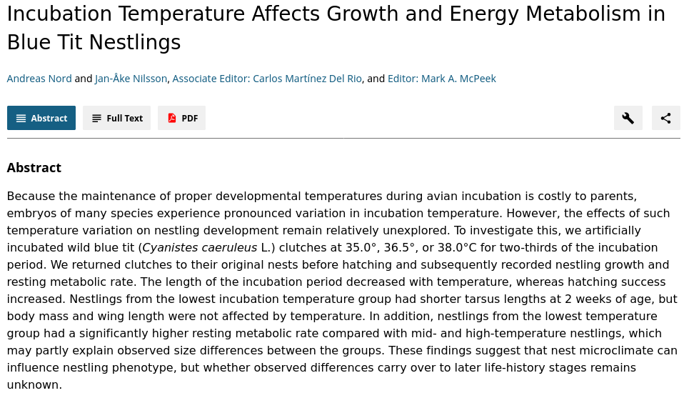

```{r setup, include=FALSE}
fig.dim <- 4
knitr::opts_chunk$set(fig.width=2*fig.dim,
                      fig.height=fig.dim,
                      fig.align='center')
set.seed(23)
library(tidyverse)
library(rstan)
library(brms)
library(bayesplot)
library(matrixStats)
options(mc.cores = parallel::detectCores())
options(digits=4)
options(warnPartialMatchDollar=FALSE) # hush, brms
```

# When you've got more than one response variable

##

How often do you really just measure *one* thing?

. . .

Even if you're interested in just one thing,
how often is there *one* way to measure it?

## Examples

- how oral and axillary temperature depend on age and treatment

- how gene expression in four tissue types varies with time of day, sex, and metabolic state

- how jaw length and eye size vary with age and habitat


## Things we might want to know

> - How do the responses depend on the predictors?
> 
> - How do the responses *covary* after accounting for the predictors?

. . .

$\ast$ "predictor" = "explanatory variable"

# Multivariate model

##

Suppose the *responses*, $(X_1, \ldots, X_k)$ depend on the *predictors* $(Y_1, \ldots, Y_m)$.

. . .

$$\begin{aligned}
    \text{(response)}_1 &= \text{(intercept)}_1 + \text{(predictors)}_1 + \text{(noise)}_1 \\
    \vdots & \qquad \vdots \\
    \text{(response)}_k &= \text{(intercept)}_k + \text{(predictors)}_k + \text{(noise)}_k
\end{aligned}$$

. . .

In symbols,
$$\begin{aligned}
    X_1 &= \beta_{0,1} + \beta_{1,1} Y_1 + \cdots + \beta_{m,1} Y_m + \epsilon_1 \\
    \vdots & \qquad \vdots \\
    X_k &= \beta_{0,k} + \beta_{1,k} Y_1 + \cdots + \beta_{m,k} Y_m + \epsilon_k
\end{aligned}$$

. . .

and the *noise* is
$$\begin{aligned}
    \epsilon &\sim \MVN(0, \Sigma) .
\end{aligned}$$


------------

(interlude on [the multivariate normal distribution](https://en.wikipedia.org/wiki/Multivariate_normal_distribution))


# Baby birds

## [https://doi.org/10.1086/662172](https://doi.org/10.1086/662172)



-----------

Their data, at [../Datasets/Incubation_temperature/nestling_biometric_data.txt](../Datasets/Incubation_temperature/nestling_biometric_data.txt):
```{r read_data, echo=1:2}
nestlings <- read.table("../Datasets/Incubation_temperature/nestling_biometric_data.txt", header=TRUE, stringsAsFactors=TRUE)
nestlings$treat <- factor(nestlings$treat, levels=c("L", "M", "H"))  # enforce a sensible ordering
nestlings
```

## Sample sizes:

There are `r nrow(nestlings)` nestlings from `r nlevels(nestlings$nest)` distinct nests;
of these, `r sum(nestlings$treat == "L")` were incubated at the `L` temperature,
`r sum(nestlings$treat == "M")` at the `M` temperature,
and `r sum(nestlings$treat == "H")` at the `H` temperature.
```{r nestnums}
with(nestlings, table(nest, treat))
```

## Response variables

We'll look at mass and tarsus length on days 6 and 14.
Color = treatment:
```{r plot_pairs, fig.width=2*fig.dim, fig.height=2*fig.dim, echo=FALSE}
pairs(nestlings[,4:7], col=nestlings$treat, pch=20)
```

## Questions

1. How much are the four measures of size affected by incubation temperature?
2. How does this effect (if any) compare to other sources of variation?
3. Is there an effect of "nest", and is it correlated between the four measures?
4. How correlated are the four measurements, after accounting for other variables?


# A multivariate model

##

We'd like to fit
$$\begin{aligned}
   \text{mass6}[i] &= \beta_{1,\text{treat[i]}} + \epsilon_{1,i} \\
   \text{tarsus6}[i] &= \beta_{2,\text{treat[i]}} + \epsilon_{2,i} \\
   \text{mass14}[i] &= \beta_{3,\text{treat[i]}} + \epsilon_{3,i} \\
   \text{tarsus14}[i] &= \beta_{4,\text{treat[i]}} + \epsilon_{4,i}  \\
   \epsilon_i &\sim \MVN(0, \Sigma) .
\end{aligned}$$

. . .


- $\beta$ is the mean effect of each *treatment*
- $\epsilon$ are the *residuals*
- $\Sigma$ is the covariance matrix of the residuals

-------

```{r brms1, cache=TRUE}
bf1 <- brmsformula( mvbind(mass6, tars6, mass14, tars14) ~ treat )
priors <- set_prior("normal(0, 5)", class='b', resp=c("mass6", "tars6", "mass14", "tars14"))
bm1 <- brm( bf1 + set_rescor(TRUE), data=nestlings,
            prior=priors)
```

-------

**Notes:**

1. `set_rescor(TRUE)` enables *residual correlations*.

2. With `set_rescor(FALSE)` we'd just have *four independent linear models*.

3. This:
```
brmsformula(
    mvbind(mass6, tars6, mass14, tars14) ~ treat
)
```
is just shorthand for this:
```
( brmsformula( mass6 ~ treat ) +
   brmsformula( tars6 ~ treat ) +
   brmsformula( mass14 ~ treat ) +
   brmsformula( tars14 ~ treat ) )
```


## Summary:

```{r sum1}
summary(bm1)
```

------------------

Let's compare the residual correlations with the actual correlations in the data:
```{r obs_cor}
cor(nestlings[,4:7], use='pairwise')
```

## Conditional effects:

```{r ce1, echo=FALSE, fig.width=3*fig.dim, fig.height=1.5*fig.dim}
cowplot::plot_grid(
            plotlist=plot(conditional_effects(bm1, plot=FALSE), plot=FALSE),
            nrow=2, ncol=2)
```


# But what about the "nest" effect?

##

We assumed that the residuals are independent between nestlings.

. . .

But, some are from the same nest?

. . . 

Seems bad.

. . .

Also, recall that

3. Is there an effect of "nest", and is it correlated between the four measures?

##

Let's add *random effects* by nest:
$$\begin{aligned}
   \text{mass6}[i] &= \beta_{1,\text{treat[i]}}    + \gamma_{1,\text{nest[i]}} + \epsilon_{1,i} \\
   \text{tarsus6}[i] &= \beta_{2,\text{treat[i]}}  + \gamma_{2,\text{nest[i]}} + \epsilon_{2,i} \\
   \text{mass14}[i] &= \beta_{3,\text{treat[i]}}   + \gamma_{3,\text{nest[i]}} + \epsilon_{3,i} \\
   \text{tarsus14}[i] &= \beta_{4,\text{treat[i]}} + \gamma_{4,\text{nest[i]}} + \epsilon_{4,i} \\
   \epsilon_i &\sim \MVN(0, \Sigma) \\
   \gamma_n &\sim \MVN(0, S)
\end{aligned}$$

. . .

Here:

- $\beta$ is the mean effect of each *treatment*
- $\epsilon$ are the *residuals*
- $\Sigma$ is the covariance matrix of the residuals
- $S$ is the **covariance matrix of nest effects**


-------

```{r brms2, cache=TRUE}
bf2 <- brmsformula( mvbind(mass6, tars6, mass14, tars14) ~ treat + (1|n|nest) )
bm2 <- brm( bf2 + set_rescor(TRUE), data=nestlings, prior=priors )
```

------

**New feature:**

```
mvbind(mass6, tars6, mass14, tars14) ~ treat + (1|n|nest)
```

Here `(1|n|nest)` means that the random effects will be *correlated* with each other
(and all others with label `n`).


## Summary:

```{r sum2}
summary(bm2)
```

## Conditional effects:

```{r ce2, echo=FALSE, fig.width=3*fig.dim, fig.height=1.5*fig.dim}
cowplot::plot_grid(
            plotlist=plot(conditional_effects(bm2, plot=FALSE), plot=FALSE),
            nrow=2, ncol=2)
```

## Exercise:

Without fitting a model,
how would you estimate the strength of correlation between
(the nest effect on tarsus length at 6 days)
and
(the nest effect on mass at 6 days)?


# Back to the questions

## 1. How much are the four measures of size affected by incubation temperature?


```{r ce3, echo=FALSE}
cowplot::plot_grid(
            plotlist=plot(conditional_effects(bm2, plot=FALSE), plot=FALSE),
            nrow=2, ncol=2)
```

## 2. How does this effect (if any) compare to other sources of variation?

```{r plot_effects, echo=FALSE}
ps <- posterior_samples(bm2, add_chain=TRUE)
mcmc_intervals(ps,
       pars=c(
  paste0("b_",
     outer(c("mass6", "tars6", "mass14", "tars14"), c("M", "H"),
           paste, sep="_treat")),
  paste0("sigma_", c("mass6", "tars6", "mass14", "tars14")),
  paste0("sd_nest__", c("mass6", "tars6", "mass14", "tars14"), "_Intercept")))
```

## 3. Is there an effect of "nest"


Well,*
```{r plot_hists, echo=FALSE}
mcmc_intervals(ps,
       pars=c(paste0("sd_nest__", c("mass6", "tars6", "mass14", "tars14"), "_Intercept")))
```

## ...and is it correlated between the four measures?

```{r plot_effects_cor, echo=FALSE}
mcmc_intervals(ps,
       pars=c(
  paste0("cor_nest__",
         apply(combn(c("mass6", "tars6", "mass14", "tars14"), 2),
               2, paste, collapse="_Intercept__"),
         "_Intercept")))
```

## 4. How correlated are the four measurements, after accounting for other variables?


```{r plot_effects_cor2, echo=FALSE}
mcmc_intervals(ps,
       pars=c(
  paste0("rescor__",
         apply(combn(c("mass6", "tars6", "mass14", "tars14"), 2),
               2, paste, collapse="__"))))
```

# Model comparison

## Did adding `nest` improve the model?

Comparing the models comes down to asking:
(how much)
does knowing measurements of others in the same nest
help predict a nestling's measurements?

. . .

this is a job for

. . .

**crossvalidation**


## Fancy-pants crossvalidation

```{r do_kfold, cache=TRUE, dependson=c("brms1", "brms2")}
bm1_kfold <- kfold(bm1, K=5, save_fits=TRUE)
bm2_kfold <- kfold(bm2, K=5, folds='stratified', group='nest', save_fits=TRUE)
```

## Extract out-of-sample predictions

```r
## DOESN'T WORK?!?!
kpred1 <- kfold_predict(bm1_kfold)
kpred2 <- kfold_predict(bm2_kfold)
```

--------------------

```{r compare_kfold, cache=TRUE, dependson=c("do_kfold")}
get_rmse <- function (kf) {
    varnames <- c("mass6", "tars6", "mass14", "tars14")
    rmse <- expand.grid(variable=varnames,
                        fold=1:5)
    rmse$rmse <- NA
    for (k in 1:5) {
        oos_indices <- kf$fits[[5+k]]
        stopifnot(all(oos_indices <= nrow(kf$data)))
        obs <- kf$data[oos_indices,]
        oos_data <- data.frame(lapply(kf$data, "[", oos_indices))
        exp <- predict(kf$fits[[k]], newdata=oos_data)[,"Estimate",]
        for (vn in varnames) {
            which_row <- which(rmse$variable == vn & rmse$fold == k)
            stopifnot(length(which_row) == 1)
            rmse$rmse[which_row] <- sqrt(mean((obs[,vn] - exp[,vn])^2))
        }
    }
    return(rmse)
}
rmse <- rbind(cbind(get_rmse(bm1_kfold), model=1),
              cbind(get_rmse(bm2_kfold), model=2))
```

## Compute root-mean-squared-error

```{r get_rmse, echo=FALSE, fig.width=3*fig.dim, fig.height=1.5*fig.dim}
plot(as.numeric(rmse$variable) + as.numeric(rmse$model)/3 + as.numeric(rmse$fold)/20 - 0.5 - 2.5/20, rmse$rmse, col=as.numeric(rmse$variable), xaxt='n', xlab='', ylab='RMSE', pch=rmse$model, cex=2)
abline(v=1:3 + 0.5)
axis(1, at=1:4, label=levels(rmse$variable))
legend("topright", pch=c(1,2), legend=c("model 1", "model 2"))
```


## Conclusions?


