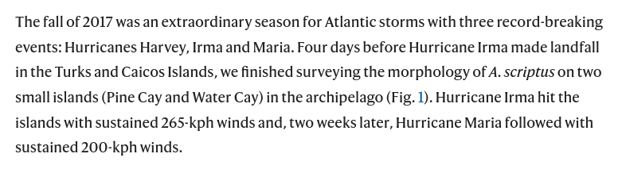
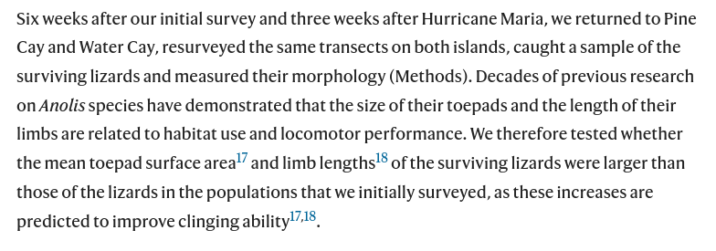
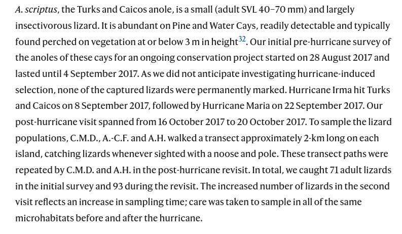
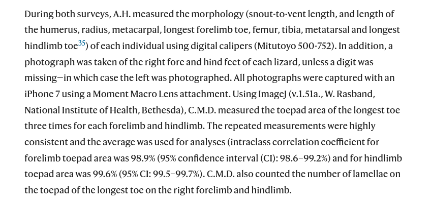

```{r setup, include=FALSE}
fig.dim <- 4
knitr::opts_chunk$set(fig.width=2*fig.dim,
                      fig.height=fig.dim,
                      fig.align='center')
set.seed(23)
library(tidyverse)
library(rstan)
library(brms)
library(cowplot)
library(bayesplot)
library(matrixStats)
options(mc.cores = parallel::detectCores())
options(digits=4)
options(warnPartialMatchDollar=FALSE) # hush, brms
```

# Hurricane lizards

##

**Data from:**
Donihue, C.M., Herrel, A., Fabre, AC. et al. [*Hurricane-induced selection on the morphology of an island lizard.*](https://doi.org/10.1038/s41586-018-0352-3
) Nature 560, 88–91 (2018).

```
Anolis scriptus morphology and performance from before and after hurricanes

Lizard morphology data collected from two visits to Pine Cay and Water Cay in
the Turks and Caicos Islands. Anolis scriptus lizards were surveyed on both
islands four days before hurricane Irma and again, six weeks later, after the
islands had been hit by Hurricanes Irma and Maria. We measured morphology and
performance and found significant differences in the "before" and "after"
hurricane lizard population morphology. All linear measurements are in MM,
surface area measurements are in MM2 and force in N. Counts correspond to the
number of lamellar scales on the forelimb and hind limb toepads.
```

##



## {data-background-image="images/lizards-islands.png" data-background-size=80% data-background-position=center}

##



##



##



##

Here's the data: [../Datasets/Hurricane_lizards/](../Datasets/Hurricane_lizards/README.md).
First we'll read it in, reorder the levels of the Hurricane factor (so that "before" comes before "after"),
change units on SVL to centimeters so it's on the same scale as the other variables
(useful below),
and drop unused variables.

```{r read_data}
lizards <- read.csv("../Datasets/Hurricane_lizards/lizards.csv", header=TRUE, stringsAsFactors=TRUE)
lizards$Hurricane <- factor(lizards$Hurricane, levels=c("Before", "After"))
lizards$SVL_cm <- lizards$SVL / 10
lizards <- lizards[,setdiff(names(lizards), c(paste0("FingerArea", 1:3), paste0("ToeArea", 1:3), "SumFingers", "SumToes", "MaxFingerForce", "SVL"))]
head(lizards)
```

# Look at the data

-----------

First, let's have a look at the sample sizes:
```{r look}
with(lizards, table(Sex, Origin, Hurricane))
```

-----------

Our preliminary brainstorming suggested that we simply look at how the means
(and distributions) of the variables changed.
(For instance, did all the lizards longer than 50cm get blown away?)
A good way to visualize this is with some boxplots, separated by
before/after hurricane and island.
To do this, we'll first reshape the data frame, making a "long" version.
```{r plotboxes_setup}
varnames <- c("SVL_cm", "Femur", "Tibia", "Metatarsal", "LongestToe", "Humerus", 
    "Radius", "Metacarpal", "LongestFinger", "FingerCount", "ToeCount", 
    "MeanFingerArea", "MeanToeArea")
lizards_long <- pivot_longer(lizards, cols=all_of(varnames))
````

-----------------

```{r plotboxes, fig.width=2.5*fig.dim, fig.height=1.5*fig.dim}
(ggplot(lizards_long) + geom_boxplot(aes(x=name, y=value, col=Hurricane))
    + theme(axis.text.x=element_text(angle=90))
    + facet_wrap(~ Origin)
        )
```

## t-tests

There's nothing super obvious going on there,
but just to have a look at the differences,
we could run some $t$ tests (basically, one variable,
comparing "before" to "after").
This ignores lots of information we have (e.g., island, sex, other variables...),
but is a good first step.
```{r t_tests}
tt_list <- lapply(varnames, function (varn) {
        t.test(lizards[[varn]][lizards$Hurricane == "Before"],
               lizards[[varn]][lizards$Hurricane == "After"])
    } )
names(tt_list) <- varnames
t_results <- data.frame(variable = names(tt_list))
t_results$statistic <- t_results$p.value <- NA
for (j in 1:nrow(t_results)) {
    stopifnot(names(tt_list)[j] == t_results$variable[j])
    t_results$statistic[j] <- tt_list[[j]][["statistic"]]
    t_results$p.value[j] <- tt_list[[j]][["p.value"]]
}
# adjust p-values for multiple testing
t_results$adj_p <- p.adjust(t_results$p.value)
```

-----------------

Here's the results:
```{r t_results}
t_results
```


## Results of preliminary one-variable analysis

The overall means of these traits has not shifted a large amount
as a result of the hurricane: examination of the boxplots (above)
shows that the distributions, before and after, by island, largely or entirely overlap,
and the mean values are at most shifted by a small amount (at most 6%, for femur length).
None of these differences are statistically significant after adjusting
for multiple corrections; however, this may be due to a lack of power
(i.e., there may be a difference in trait values of around 5%, but the sample size
is not sufficient to tell for sure).


## Pairwise plots

This maybe should have been our *first* plot - pair plots often let us see a lot more structure,
and this is no exception. Everything is correlated... with size!
In class we put these plots in a pdf, to better zoom in.
Below "black" is the first level in the title, and "red" is the second.

--------------


```{r pairs1, echo=FALSE, fig.width=2.5*fig.dim, fig.height=2.5*fig.dim}
    pairs(lizards[,varnames], col=lizards$Hurricane, pch=20, main='Before/After')
```

---------------

```{r pairs2, echo=FALSE, fig.width=2.5*fig.dim, fig.height=2.5*fig.dim}
    pairs(lizards[,varnames], col=lizards$Sex, pch=20, main='Female/Male')
```

---------------

```{r pairs3, echo=FALSE, fig.width=2.5*fig.dim, fig.height=2.5*fig.dim}
    pairs(lizards[,varnames], col=lizards$Origin, pch=20, main='Pine/Water Cay')
```


# Think about the questions

## Goals

- describe how traits differ before/after hurricanes
- account for confounding factor: overall size
- also possibly account for differences between islands and sexes

. . .

For instance, we'd like to say something like:

> Remaining male lizards of average size on Pine Cay had toepads that were X% larger by area (95% CI of L-U%).
> This represents roughly Y standard deviations of toepad area.
> Toepad area did not differ substantially by island, or by sex after accounting for length.

# Fit some models

## lm

```{r ttest}
the_lm <- lm(MeanToeArea ~ Hurricane + SVL_cm, data=lizards)
summary(the_lm)

plot(MeanToeArea ~ SVL_cm, data=lizards, pch=20, col=Hurricane)
abline(-4.14327, 1.3654, col='red')
abline(-4.14327-0.23863, 1.3654)
```

On average, lizards of the same length after the hurricane
had toe pad areas 0.24 mm2 larger than before the hurricane
(SE .04 mm2).

## in brms

```{r brm_lm, cache=TRUE}
brm_lm <- brm(MeanToeArea ~ Hurricane + SVL_cm, data=lizards,
              prior=set_prior("normal(0, 5)", class="b"))
```

-----------------

```{r brm_lm1_summary}
summary(brm_lm)
```

-------------

```{r plot_brm_lm}
plot_grid(plotlist=plot(
                  conditional_effects(brm_lm, plot=FALSE),
    plot=FALSE), nrow=1, ncol=2)
```

---------------

```{r plot_lines}
conditional_effects(brm_lm, effects="SVL_cm:Hurricane")
```

------------------

```{r brm_lm2, cache=TRUE}
brm_lm2 <- brm(MeanToeArea ~ Hurricane + SVL_cm + Sex + Origin,
              data=lizards,               
              prior=set_prior("normal(0, 5)", class="b"))
```

-----------------

```{r brm_lm2_summary}
summary(brm_lm2)
```

------------------


```{r plot_brm_lm2}
plot_grid(plotlist=plot(
        conditional_effects(brm_lm2, plot=FALSE),
    plot=FALSE), nrow=2, ncol=2)
```

-------------------

```{r plot_lines2}
conditional_effects(brm_lm2, effects="SVL_cm:Hurricane", conditions=data.frame(Origin=levels(lizards$Origin), cond__=levels(lizards$Origin)))
```

------------------

```{r brm_lm3, cache=TRUE}
brm_lm3 <- brm(MeanToeArea ~ SVL_cm * (Hurricane + Sex + Origin),
              data=lizards,               
              prior=set_prior("normal(0, 5)", class="b"))
```

-----------------

```{r brm_lm3_summary}
summary(brm_lm3)
```

------------------

```{r plot_brm_lm3}
plot_grid(plotlist=plot(
        conditional_effects(brm_lm3, plot=FALSE),
    plot=FALSE), nrow=2, ncol=3)
```

-------------------

```{r plot_lines3}
conditional_effects(brm_lm3, effects="SVL_cm:Hurricane", conditions=data.frame(Origin=levels(lizards$Origin), cond__=levels(lizards$Origin)))
```

------------------

Don't forget to think about what the reference categories are!!
```{r plot_lines3x}
condf <- expand.grid(Origin=levels(lizards$Origin), Sex=levels(lizards$Sex))
condf$cond__ <- paste(condf$Origin, condf$Sex)
plot(conditional_effects(brm_lm3, effects="SVL_cm:Hurricane", conditions=condf, plot=FALSE), facet_args=list(ncol=2), points=TRUE)
```

## Notes:

- We have no power to distinguish an effect of sex
  from a nonlinear effect of SVL


------------------

```{r brm_lm4, cache=TRUE}
brm_lm4 <- brm(MeanToeArea ~ SVL_cm * (Hurricane + Origin) + I(SVL_cm^2),
              data=lizards,               
              prior=set_prior("normal(0, 5)", class="b"))
```

-----------------

```{r brm_lm4_summary}
summary(brm_lm4)
```

------------------

```{r plot_brm_lm4}
plot_grid(plotlist=plot(
        conditional_effects(brm_lm4, plot=FALSE, effects=c("Hurricane", "Origin", paste0("SVL_cm:", c("Hurricane", "Origin")))),
    plot=FALSE), nrow=2)
```

------------------

```{r plot_lines4x}
plot(conditional_effects(brm_lm4, effects="SVL_cm:Hurricane", conditions=data.frame(Origin=levels(lizards$Origin), cond__=levels(lizards$Origin)), plot=FALSE), facet_args=list(ncol=2), points=TRUE)
```


# Multivariate

##

```{r brm_mvlm, cache=TRUE}
brm_mvlm <- brm(
   brmsformula(mvbind(Femur, Tibia, Metatarsal, LongestToe, Humerus,
                       Radius, Metacarpal, LongestFinger, FingerCount,
                       ToeCount, MeanFingerArea, MeanToeArea)
                ~ SVL_cm * (Hurricane + Origin) + I(SVL_cm^2)) + set_rescor(TRUE),
                data=lizards, prior=set_prior("normal(0, 5)", class="b"))
```

--------------------

```{r brm_mvlm_summary}
summary(brm_mvlm)
```

--------------------

```{r brm_mvlm_ce, fig.width=3*fig.dim, fig.height=2*fig.dim, cache=TRUE, echo=FALSE, dependson="brm_mvlm"}
responses <- c("Femur", "Tibia", "Metatarsal", "LongestToe", "Humerus", "Radius", 
               "Metacarpal", "LongestFinger", "FingerCount", "ToeCount",
               "MeanFingerArea", "MeanToeArea")
plot_grid(plotlist=plot(
    conditional_effects(brm_mvlm, effects="Hurricane", resp=responses, plot=FALSE),
    plot=FALSE), nrow=3, ncol=4)
```

--------------------

```{r brm_mvlm_ce2, fig.width=3*fig.dim, fig.height=2*fig.dim, cache=TRUE, echo=FALSE, dependson="brm_mvlm"}
plot_grid(plotlist=plot(
        conditional_effects(brm_mvlm, effects="SVL_cm:Hurricane", resp=responses[1:4], plot=FALSE),
    plot=FALSE, points=TRUE), nrow=2, ncol=2)
```

--------------------

```{r brm_mvlm_ce3, fig.width=3*fig.dim, fig.height=2*fig.dim, cache=TRUE, echo=FALSE, dependson="brm_mvlm"}
plot_grid(plotlist=plot(
        conditional_effects(brm_mvlm, effects="SVL_cm:Hurricane", resp=responses[5:8], plot=FALSE),
    plot=FALSE, points=TRUE), nrow=2, ncol=2)
```

--------------------

```{r brm_mvlm_ce4, fig.width=3*fig.dim, fig.height=2*fig.dim, cache=TRUE, echo=FALSE, dependson="brm_mvlm"}
plot_grid(plotlist=plot(
        conditional_effects(brm_mvlm, effects="SVL_cm:Hurricane", resp=responses[9:12], plot=FALSE),
    plot=FALSE, points=TRUE), nrow=2, ncol=2)
```

--------------------

```{r brm_mvlm_joint, cache=TRUE, dependson="brm_mvlm"}
pred_df <- expand.grid(Origin="Pine Cay", SVL_cm=5, Hurricane=levels(lizards$Hurricane))
post_pred_array <- posterior_predict(brm_mvlm, newdata=pred_df, resp=responses)
post_mean_array <- posterior_epred(brm_mvlm, newdata=pred_df, resp=responses)
dimnames(post_pred_array)[[2]] <- dimnames(post_mean_array)[[2]] <- levels(lizards$Hurricane)
# distribution of lizard measurements
post_pred <- rbind(cbind(data.frame(post_pred_array[,"Before",]), Hurricane="Before"),
                   cbind(data.frame(post_pred_array[,"After",]), Hurricane="After"))
# posterior distribution of mean lizard measurements
post_mean <- rbind(cbind(data.frame(post_mean_array[,"Before",]), Hurricane="Before"),
                   cbind(data.frame(post_mean_array[,"After",]), Hurricane="After"))
```

-------------------

```{r plot_brm_mvlm_joint1, fig.width=3*fig.dim, fig.height=2.5*fig.dim, cache=TRUE, dependson="brm_mvlm_joint", echo=FALSE}
pairs(post_pred[,responses], pch=20, cex=0.5, col=ifelse(post_mean$Hurricane == "Before", "black", "red"))
```

-------------------

```{r plot_brm_mvlm_joint2, fig.width=3*fig.dim, fig.height=2.5*fig.dim, cache=TRUE, dependson="brm_mvlm_joint", echo=FALSE}
pairs(post_mean[,responses], pch=20, cex=0.5, col=ifelse(post_mean$Hurricane == "Before", "black", "red"))
```

-------------------

```{r post_table, cache=TRUE, dependson="brm_mvlm"}
ldf <- na.omit(lizards[,setdiff(colnames(lizards), responses)])
ldf <- rbind(ldf, ldf)
ldf$Hurricane <- rep(levels(lizards$Hurricane), each=nrow(ldf)/2)
pldf <- posterior_epred(brm_mvlm, newdata=ldf, summarise=FALSE)
diff_ldf <- apply((pldf[,ldf$Hurricane == "After",] - pldf[,ldf$Hurricane == "Before",])/pldf[,ldf$Hurricane == "Before",], c(1,3), mean)
stopifnot(all(colnames(diff_ldf) == responses))
post_table <- data.frame("mean difference"=100 * colMeans(diff_ldf),
                         "lower 95% CI"=100 * colQuantiles(diff_ldf, probs=0.025),
                         "upper 95% CI"=100 * colQuantiles(diff_ldf, probs=1-0.025),
                         check.names=FALSE)
```

-----------------------

```{r show_post_table, echo=FALSE}
post_table
```

-----------------------

```{r plot_post_table, echo=FALSE, fig.width=2.5*fig.dim}
par(mar=c(5,9,1,1)+.1)
plot(post_table[,1], 1:nrow(post_table), xlim=range(post_table), type='n', yaxt='n', ylab='', xlab='percent difference at SVL=5cm')
abline(v=0, lty=3)
segments(x0=post_table[,2], x1=post_table[,3], y0=1:nrow(post_table), col='red')
points(post_table[,1], 1:nrow(post_table), xlim=range(post_table), pch=20, cex=2)
axis(2, at=1:nrow(post_table), labels=rownames(post_table), las=2)
```

