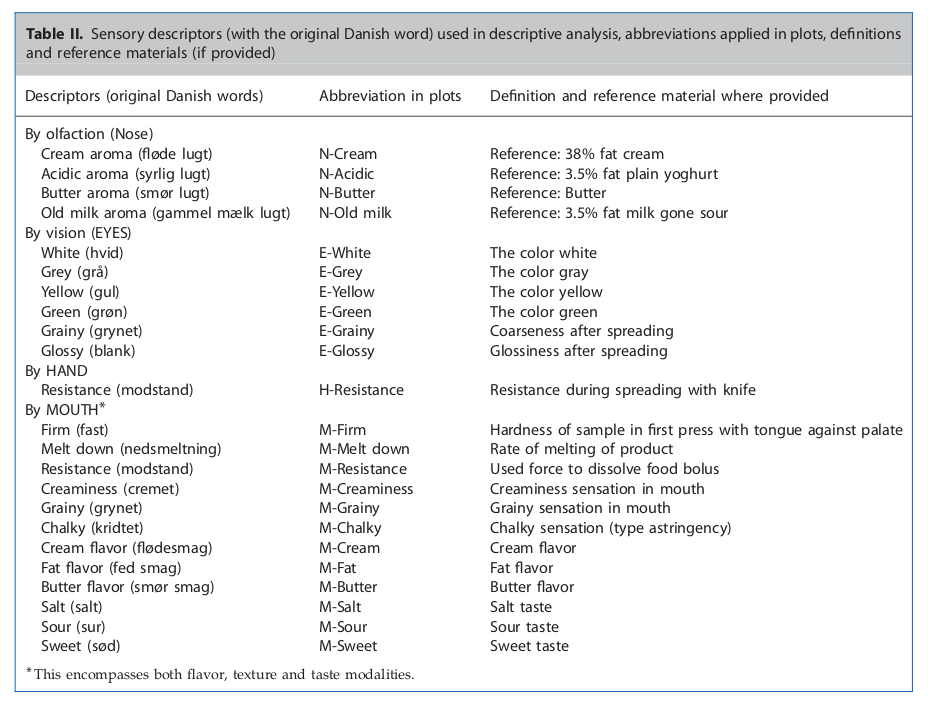

```{r setup, include=FALSE}
fig.dim <- 4
knitr::opts_chunk$set(fig.width=2*fig.dim,
                      fig.height=fig.dim,
                      fig.align='center')
set.seed(23)
library(rstan)
library(brms)
library(bayesplot)
library(matrixStats)
library(tidyverse)
library(lme4)
options(mc.cores = parallel::detectCores())
options(digits=2)
```

```{r helpers, include=FALSE}
shadecurve <- function (pf, xlim, plot=TRUE, xlab='', ylab='', main='',
                        border="black", col=adjustcolor(border, 0.25), ...) {
    x <- seq(xlim[1], xlim[2], length.out=400)
    mids <- x[-1] - diff(x)/2
    df <- diff(pf(x, ...))
    if (plot) { plot(0, type='n', xlim=range(x), ylim=range(df),
                     main=main, xlab=xlab, ylab=ylab) }
    polygon(c(mids, x[length(x)], x[1]), c(df, 0, 0), col=col, border=border) 
}
```

# Cream cheese

## Cream cheese

This dataset contains sensory data for a panel test of 9 cream cheeses that was
part of M. B. Frøst’s dissertation at the University of Copenhagen. See the
['data dictionary'](../Datasets/Cream_Cheese/cream_cheese_data_dictionary.tsv)
document for information on the cream cheese types and
sensory scales. 


##


##



## The data

```{r thedata}
cc <- read.csv("../Datasets/Cream_Cheese/cream_cheese_profile.csv")
for (vn in c("Product.number", "Panellist", "Replicate", "Session")) {
    cc[[vn]] <- factor(cc[[vn]])
}
head(cc)
```


##

```{r thedata2}
summary(cc[,1:6])
```

##

```{r thedata3}
with(cc, table(Panellist, Session))
```

##

```{r thedata4}
with(cc, table(Replicate, Session))
```

##

```{r thedata5}
with(cc, table(Product.name, Session))
```

##

```{r thedata6}
with(cc, table(Product.name, Serving.order))
```

##

- 8 panelists
- 1 Session = (4 products plus A-prot) x every panelist
- 2 Sessions = 1 replicate = all products x panelist
- randomized serving order

##

```{r plotit, echo=FALSE, fig.width=4.5*fig.dim, fig.height=2*fig.dim}
the_vars <- colnames(cc)[7:ncol(cc)]
var_cols <- rainbow(length(the_vars))
eps <- 2
plot(0, type='n', xlim=c(0, (nlevels(cc$Product.name) + eps) * length(the_vars)), ylim=range(cc[,the_vars]), ylab='value', xlab='Product', xaxt='n')
for (k in seq_along(the_vars)) {
    atvals <- (k-1)*(nlevels(cc$Product.name) + eps) + seq_len(nlevels(cc$Product.name))
    boxplot(cc[,the_vars[k]] ~ cc$Product.name, add=TRUE,
            at=atvals, col=var_cols[k], xaxt='n')
    text(mean(atvals), 12.5 + (k %% 2), the_vars[k], col=var_cols[k])
    if (k > 1) abline(v=min(atvals)-eps/2, lty=3, col='grey')
}
```

##

```{r plotit2, echo=FALSE, fig.width=4.5*fig.dim, fig.height=2*fig.dim}
eps <- 4
plot(0, type='n', xlim=c(0, nlevels(cc$Product.name) * (eps + length(the_vars))), ylim=range(cc[,the_vars]), ylab='value', xlab='Product', xaxt='n')
for (k in seq_along(the_vars)) {
    atvals <- (k-1) + (seq_len(nlevels(cc$Product.name))-1) * (length(the_vars) + eps)
    boxplot(cc[,the_vars[k]] ~ cc$Product.name, add=TRUE,
            at=atvals, col=var_cols[k], xaxt='n')
}
abline(v=1:(nlevels(cc$Product.name)-1) * (length(the_vars) + eps) - eps/2, lty=3)
axis(1, at=(1:(nlevels(cc$Product.name))-0.5) * (length(the_vars) + eps), labels=levels(cc$Product.name))
```

##

```{r plotit3, echo=FALSE, fig.width=4.5*fig.dim, fig.height=2*fig.dim}
eps <- 4
plot(0, type='n', xlim=c(0, nlevels(cc$Product.name) * (eps + length(the_vars))), ylim=range(scale(cc[,the_vars],scale=FALSE)), ylab='value', xlab='Product', xaxt='n')
abline(h=0, lwd=2)
for (k in seq_along(the_vars)) {
    atvals <- (k-1) + (seq_len(nlevels(cc$Product.name))-1) * (length(the_vars) + eps)
    boxplot(cc[,the_vars[k]] - mean(cc[,the_vars[k]]) ~ cc$Product.name, add=TRUE,
            at=atvals, col=var_cols[k], xaxt='n')
}
abline(v=1:(nlevels(cc$Product.name)-1) * (length(the_vars) + eps) - eps/2, lty=3)
axis(1, at=(1:(nlevels(cc$Product.name))-0.5) * (length(the_vars) + eps), labels=levels(cc$Product.name))
```

## Panellist heterogeneity?

```{r panellists}
summary(lm(rowMeans(cc[,the_vars]) ~ cc$Panellist))
```

## Variables

```{r thecors}
image(cor(cc[,the_vars]))
```

## Fat smell?

```{r one_var_sm}
sm_full_mod <- lmer(N.Cream ~ Product.name + Serving.order + (1|Panellist), data=cc)
sm_sub_mod <- lm(N.Cream ~ Product.name + Serving.order, data=cc)

(sm_mod_comp <- anova(sm_full_mod, sm_sub_mod))
```

##

```{r coefs_sm}
summary(sm_full_mod)$coefficients
```


## Fat taste?

```{r one_var}
fat_taste <- (cc$M.Cream + cc$M.Fat + cc$M.Butter)/3

full_mod <- lmer(fat_taste ~ Product.name + Serving.order + (1|Panellist), data=cc)
sub_mod <- lm(fat_taste ~ Product.name + Serving.order, data=cc)

(mod_comp <- anova(full_mod, sub_mod))
```

##

```{r coefs}
summary(full_mod)$coefficients
```

##

```{r analyze}
lms <- lapply(the_vars, function (vn) {
           lm(cc[[vn]] ~ Product.name + Serving.order + Panellist, data=cc)
        } )
names(lms) <- the_vars
coefs <- sapply(lapply(lapply(lms, summary), "[[", "coefficients"), function (x) x[,"Estimate"])
stderr <- sapply(lapply(lapply(lms, summary), "[[", "coefficients"), function (x) x[,"Std. Error"])
pvals <- sapply(lapply(lapply(lms, summary), "[[", "coefficients"), function (x) x[,"Pr(>|t|)"])
colnames(coefs) <- colnames(stderr) <- colnames(pvals) <- the_vars
```

##

```{r hist_pvals}
hist(pvals, breaks=30)
```


## Does serving order matter?

```{r serving, echo=FALSE, echo=FALSE, fig.width=4.5*fig.dim, fig.height=2*fig.dim}
serv_coefs <- coefs["Serving.order", ]
serv_pvals <- pvals["Serving.order", ]
serv_stderr <- stderr["Serving.order", ]

cbind(Coef = serv_coefs,
      pval = serv_pvals,
      stderr = serv_stderr)[order(serv_pvals),]
```
##

```{r abbrevs}
var_abbrev <- c("N.Cream"     = 'NC',
                "N.Acidic"    = 'NA',
                "N.Butter"    = 'NB',
                "N.Old.milk"  = 'NO',
                "E.White"     = 'EW',
                "E.Grey"      = 'EG',
                "E.Yellow"    = 'EY',
                "E.Green"     = 'EG',
                "H.Resistance"= 'HR',
                "E.Grainy"    = 'EG',
                "E.Shiny"     = 'ES',
                "M.Firm"      = 'MF',
                "M.Melt.down" = 'MM',
                "M.Resistance"= 'MR',
                "M.Creaminess"= 'MC',
                "M.Grainy"    = 'MG',
                "M.Chalky"    = 'Ch',
                "M.Cream"     = 'MC',
                "M.Fat"       = 'MF',
                "M.Butter"    = 'MB',
                "M.Salt"      = 'Sa',
                "M.Sour"      = 'So',
                "M.Sweet"     = 'Sw')
```

## Do panellists differ?

```{r ranefs, echo=FALSE, echo=FALSE, fig.width=4.5*fig.dim, fig.height=2*fig.dim}
ran_coefs <- coefs[grepl("Panellist", rownames(coefs)),]
ran_pvals <- pvals[grepl("Panellist", rownames(pvals)),]
ran_stderr <- stderr[grepl("Panellist", rownames(stderr)),]
rownames(ran_coefs) <-rownames(ran_pvals) <-  rownames(ran_stderr) <- gsub("Product.name", "", rownames(ran_coefs))

plot(0, type='n', ylim=c(-6, 6), xlim=c(0.5,nrow(ran_coefs)), ylab='coefficient', xlab='', xaxt='n')
abline(h=0)
axis(1, at=1:nrow(ran_coefs), labels=rownames(ran_coefs), las=2)
segments(y0=ran_coefs - 2 * ran_stderr,
         y1=ran_coefs + 2 * ran_stderr,
         x0=row(ran_coefs)+col(ran_coefs)/ncol(ran_coefs)/2-0.5,
         col=ifelse(ran_pvals < 0.05/length(pvals), var_cols[col(ran_coefs)], 'grey'))
text(row(ran_coefs)+col(ran_coefs)/ncol(ran_coefs)/2-0.5, ran_coefs, 
     labels=var_abbrev[match(the_vars[col(ran_coefs)], names(var_abbrev))],
     col=ifelse(ran_pvals < 0.05/length(pvals), var_cols[col(ran_coefs)], 'grey'),
     pch=20)

```

## Do cream cheeses differ?

```{r by_product, echo=FALSE, fig.width=4.5*fig.dim, fig.height=2*fig.dim}
fix_coefs <- coefs[grepl("Product", rownames(coefs)),]
fix_pvals <- pvals[grepl("Product", rownames(pvals)),]
fix_stderr <- stderr[grepl("Product", rownames(stderr)),]
rownames(fix_coefs) <-rownames(fix_pvals) <-  rownames(fix_stderr) <- gsub("Product.name", "", rownames(fix_coefs))


plot(0, type='n', ylim=c(-6, 6), xlim=c(0.5,nrow(fix_coefs)), ylab='coefficient', xlab='', xaxt='n')
abline(h=0)
axis(1, at=1:nrow(fix_coefs), labels=rownames(fix_coefs), las=2)
segments(y0=fix_coefs - 2 * fix_stderr,
         y1=fix_coefs + 2 * fix_stderr,
         x0=row(fix_coefs)+col(fix_coefs)/ncol(fix_coefs)/2-0.5,
         col=ifelse(fix_pvals < 0.05/length(pvals), var_cols[col(fix_coefs)], 'grey'))
text(row(fix_coefs)+col(fix_coefs)/ncol(fix_coefs)/2-0.5, fix_coefs, 
     labels=var_abbrev[match(the_vars[col(fix_coefs)], names(var_abbrev))],
     col=ifelse(fix_pvals < 0.05/length(pvals), var_cols[col(fix_coefs)], 'grey'),
     pch=20)

```

## What does aroma addition change?

```{r aroma, echo=FALSE, fig.width=2.0*fig.dim, fig.height=2.0*fig.dim}
plot(fix_coefs["P+Aroma",], fix_coefs["P",],
     type='n', xlim=c(-1.5,1.5), ylim=c(-1.5,1.5), asp=1,
     xlab="Prototype + Aroma", ylab="Prototype")
segments(x0=fix_coefs["P+Aroma",],
         y0=fix_coefs["P",] - 2 * fix_stderr["P",],
         y1=fix_coefs["P",] + 2 * fix_stderr["P",],
         col=var_cols)
segments(x0=fix_coefs["P+Aroma",] - 2 * fix_stderr["P+Aroma",], 
         x1=fix_coefs["P+Aroma",] + 2 * fix_stderr["P+Aroma",], 
         y0=fix_coefs["P",],
         col=var_cols)
text(fix_coefs["P+Aroma",], fix_coefs["P",], labels=var_abbrev, col=var_cols)
abline(0,1)
```
