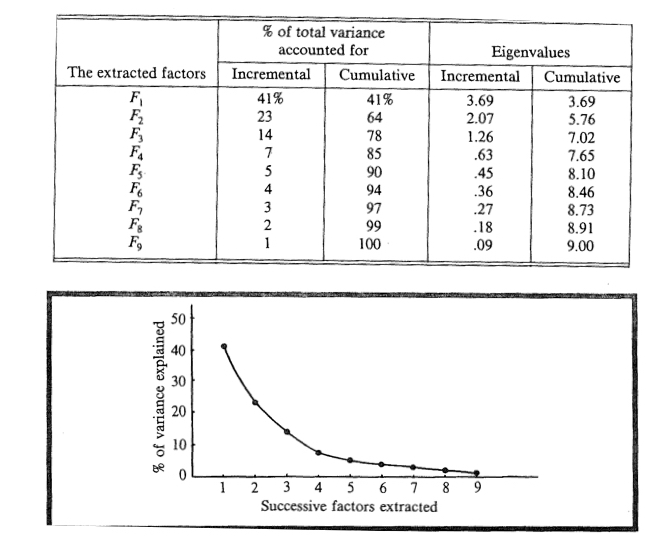
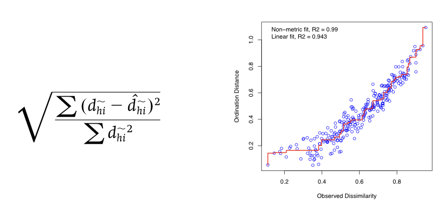

```{r setup, include=FALSE}
knitr::opts_chunk$set(echo = FALSE)
```

## Goals for this week

- Finish Principal Component Analysis (PCA)
- Primer on matrix algebra
    - Latent roots of matrices
    - Eigenvalues and eigenvectors
- Principal Coordinates Analysis (PCoA)
- Nonmetric Multidimensional Scaling (NMDS)


# Principal Component Analysis (PCA)

## Two primary aims of PCA

- **Variable reduction** - reduce a lot of variables to a smaller number of new derived variables that adequately summarize the original information (aka data reduction). 
- **Ordination** - Reveal patterns in the data - especially among variables or objects - that could not be found by analyzing each variable separately. A good way to do this is to plot the first few derived variables (this is also called multidimensional scaling).
- **General approach** - use eigenanalysis on a large dataset of continuous variables.

## Running a PCA analysis

- Start by ignoring any grouping variables
- Perform Eigenanalysis on the entire data set
- After the ordination is complete analyze the objects in the new ordination
- This includes ANOVA using the newly derived PC’s and any grouping variables

## Data standardization for PCA

- Covariances and correlations measure the linear relationships among variables and therefore assumptions of normality and homogeneity of variance are important in multivariate statistics
- Transformations to achieve linearity might be important
- Data on very different scales can also be a problem
- Centering the data subtracts the mean from all variable values so the mean becomes zero
- Ranging divides each variable by its standard deviation so that all variables have a mean of zero and a unit s.d.
- Some variables cannot be standardized (e.g.highly skewed abundance data)
- In this case converting to presence or absence (binary) data might be the most appropriate (MDS

## Assumptions of PCs

- Linear relationships among variables - transformations help!
- ML estimation of eigenvalues and eigenvectors 
    - don’t have any distributional assumptions 
    - but the confidence intervals do assume normality of residuals.
- Multivariate outliers can be a problem, and can be identified via Mahalanobis distances as before.
- Missing data are a real problem (as with all multivariate analyses), and one of the approaches (removal, imputation, EM) is required.
    - ROBUST PCA - use Spearman’s rank to form a robust correlation matrix.
    - nonmetric multidimensional scaling.

## Data standardization for PCA

- Covariances and correlations measure the **linear relationships** among variables
    - Normality and homogeneity of variance
    - Data on very different scales can also be a problem
- **Mean centering** and **ranging**
    - Centering the data subtracts the mean from all values
    - Ranging divides each variable by its standard deviation so that all variables have a mean of zero and a unit s.d.
- **Non-normal data**
    - Some variables cannot be standardized (e.g.highly skewed abundance data)
    - In this case converting to presence or absence (binary) data might be the most appropriate


## How many PCs should I concern myself with?

- The full, original variance-covariance pattern is encapsulated in all PCs.
- PCA will extract the same number of PCs as original variables.
- How many to retain? - really just a question of what to pay attention to. 
    - Eigenvalue equals one rule (correlation matrix)
    - Scree plot shows an obvious break
    - Formal tests of eigenvalue equality
    - Significant amount of the original variance
- Most of the time first few PCs are enough.
- If not, PCA might not be appropriate!

## How many PCs should I concern myself with?

```{r, echo=FALSE, out.width='75%', fig.asp=.75, fig.align='center'}

```

## How do I interpret the PCs?

- What are the latent variables captured by the PCs??
- The eigenvectors provide the coefficients for each variable in the linear combination for each component.
- The farther each coefficient is from zero, the greater the contribution that variable makes to that component.
- Component loadings are simple correlations (using Pearson’s r) between the components and the original variables


## How do I interpret the PCs?

- **High loadings** indicate that a variable is strongly correlated with a particular component (can be either positive or negative).
- The **loadings** and the **coefficients** will show a similar patterns, but different values.
- Ideally, we would like to have each variable load strongly on only one component, and the rest of the loadings are close to plus or minus one, or zero.
- Usually this ideal situation is not met initially and another rotation may be needed to aid in interpretation.

## How do I interpret the PCs?

```{r, echo=FALSE, out.width='100%', fig.asp=.75, fig.align='center'}
knitr::include_graphics("images/multi.018.jpeg")
```

## Scaling or ordination diagrams
- Also know as **‘ordination’** or **‘ordination plot’** - a term you often see in ecology.
- Helps us visualize and interpret the objects and variables with respect to one another.
- The eigenvectors can be used to calculate a new **z-value** on each newly derived PC for each object.
- The **objects** can then be positioned on a scatterplot based on their scores with the first few PCs as axes.
- Objects close together on the plot are more similar in their variable values.
- Both objects and variables are included on a single scaling plot.

## Scaling or ordination diagrams

```{r, echo=FALSE, out.width='60%', fig.asp=.75, fig.align='center'}
knitr::include_graphics("images/multi.026.jpeg")
```

## Secondary rotation of PCs

- A common scenario is where numerous variables load **moderately** on each component.
- This can be sometimes alleviated by a **secondary rotation** of the components after the initial PCA.
- The aim of this additional rotation is to 
    - obtain a more simple structure
    - with the coefficients within a component as close to |one| or zero as possible.
- Rotation often improves the **interpretability** of the PCA extracted components.

## Secondary rotation of PCs

- Orthogonal and oblique rotation methods are both possible.
    - **orthogonal** - keeps the PCs completely independent of one another
    - **oblique** - deviates from orthogonality just slightly if it helps with the rotation
- varimax, quartimax, equimax are all orthogonal methods.
- Note - **orthogonal** rotation doesn’t change the relationship of variables or objects to one another in any way.

## What else can I do with the values of the new **PCs and metric PCoAs**?

<br>

- They’re nice **new variables** that you can use in any analysis you’ve learned previously!!
- You can perform single or multiple regression of your PCs on other continuous variables 
- For example, ask whether they correlate with an environmental gradient or body mass index.
- If you have one or more grouping variables you can use ANOVA on each newly derived PC.
- **NOTE** - non-metric PCoA or NMDS values _**cannot**_ just be put into linear models!!

# Matrices for multivariate analyses

<br>

- Some definitions first
    - `i = 1 to n` objects and `j = 1 to p` variables
    - Measure of center of a multivariate distribution = the centroid
- Multivariate statistics uses eigenanalysis of either matrices 
    - covariances of variables (`p-by-p`) 
    - dissimilarities of objects (`n-by-n`)
- In reality the `n-by-p` matrix can also be analyzed directly
    
## R-mode vs. Q-mode analysis

```{r, echo=FALSE, out.width='90%', fig.asp=.75, fig.align='center'}
knitr::include_graphics("images/multi.003.jpeg")
```

## Covariation or correlation matrix

- **S** = sum of squares and sum of cross products
- **C** = p-by-p matrix of variances and covariances
- **R** = p-by-p matrix of correlations
- Two ways to summarize the variability of a multivariate data set
    - The **determinant** of a square matrix
    - The **trace** of a square matrix
- If we have groups we can 
    - calculate determinant and trace for within and among groups
    - use that to partition multivariate variance
    - basis of MANOVA and Discriminant Analysis (next week)


## Eigenanalysis of systems of linear equations

<br>

$$F_{ik} = c_{1k}y_{i1} + c_{2k}y_{i2} + c_{3k}y_{i3} + c_{4k}y_{i4} + ... + c_{pk}y_{ip}$$
where

- `i` indicates the observation
- `k` indicates the new factor
- `c` indicates the coefficients

<br>

- Derives linear combinations of the original variables that best summarize the total variation in the data
- These derived linear combinations become new variables
- Each object will now have a score for the factor variables


## Eigenvalues

<br>

- Also called 
  - **characteristic** or **latent roots** or 
  - **factors**
- Rearranging the variance in the association matrix so that the first few derived variables explain most of the variation that was present between objects in the original variables
- The **eigenvalues** can also be expressed as proportions or percents of the original variance


## Scree plots of eigenvalues

```{r, echo=FALSE, out.width='90%', fig.asp=.75, fig.align='center'}
knitr::include_graphics("images/multi.004.jpeg")
```

## Eigenvectors

$$F_{ik} = c_{1k}y_{i1} + c_{2k}y_{i2} + c_{3k}y_{i3} + c_{4k}y_{i4} + ... + c_{pk}y_{ip}$$

- Lists of the **coefficients or  weights** showing how much each original variable contributes to each new derived variable
- The linear combinations can be solved to provide a score ($F_{ik}$) for each object for each factor
- There are the same number of derived variables as there are original variables (`p`)
- The newly derived variables are extracted sequentially so that they are **uncorrelated with each other**
- The eigenvalues and eigenvectors can be derived using either
    - **spectral decomposition of the `p-by-p` matrix**
    - **singular value decomposition of the original matrix**


# Primer on Matrix Algebra


# R Interlude - Finish PCA Analysis

## R Interlude - Principal Components Analysis
- First, read in the raw data set of wine samples.
- Note that there are 14 variables, the first column is a grouping variable for vineyard.
- The rest of the variables are chemical concentrations measured from the wine.

```{r, echo=TRUE, eval=FALSE}
wine_raw <- read.table('wine.tsv', header = T, sep = ‘\t')
head (wine_raw)
```

## R Interlude
- Step one: examine some pairwise plots to see if there is any correlation structure.
- You can even do individual bivariate plots and label points by vineyard grouping.

```{r, echo=TRUE, eval=FALSE}
plot(wine_raw$C3, wine_raw$C4)
text(wine_raw$C3, wine_raw$C4, wine_raw$Vineyard, cex=0.7, pos=4, col=“blue")
```

```{r, echo=TRUE, eval=FALSE}
Or label the different vineyards by color (or shape if you want).
plot(wine_raw$C3, wine_raw$C4, pch=19, col=ifelse(wine_raw$Vineyard==1, "blue",
                                       ifelse(wine_raw$Vineyard==2,"green","darkred")))
```

## R Interlude

- Now calculate the summary statistics for the multivariate data.
- This allows you to grasp quickly whether they have the similar means and variances.

```{r, echo=TRUE, eval=FALSE}
sapply(wine_raw[,2:14], mean)
sapply(wine_raw[,2:14], sd)
```

## R Interlude

- Since they don’t, we can standardize the data.

```{r, echo=TRUE, eval=FALSE}
wine_stand <- as.data.frame(scale(wine_raw[,2:14]))
head(wine_stand)
sapply(wine_stand[,1:13], mean)
sapply(wine_stand[,1:13], sd)
```

## R Interlude
- OK, time to run the principal component analysis:

```{r, echo=TRUE, eval=FALSE}
wine_PCA <- princomp(wine_raw, scores = T, cor = T)
```

- After the PCA is run, you need to save the results to a new object in which you can find the new data.
- Look at the wine_PCA file. What new types of data are in this file, and how do you index them?
- Make sure that you know what the 'scores' and 'cor' arguments mean.
- Try running the analysis with cor = F. What happens?
- Compare this result to running the PCA on the standardized data.

## R Interlude
- Next, let's analyze the data using a scree plot
.
```{r, echo=TRUE, eval=FALSE}
plot(wine_PCA)
```

- We can now print the loadings of the new PCs.

```{r, echo=TRUE, eval=FALSE}
wine_PCA$loadings
```

And, let's print the biplot of the data.
```{r, echo=TRUE, eval=FALSE}
biplot(wine_PCA)
```


## R Interlude

Lastly, let's look at the scores of the original objects based on our new variables.

```{r, echo=TRUE, eval=FALSE}
y <- wine_PCA$scores
head(y)
```

- Could write these to a file if we wanted.
- Note - here is a different function for performing the PCA, but run it on both the raw and standardized data.

```{r, echo=TRUE, eval=FALSE}
wine_PCA_2 <- prcomp(wine_raw)
plot (wine_PCA_2)
wine_PCA_3 <- prcomp(wine_stand)
plot (wine_PCA_3)
```


## R Interlude
If you have time - 

- First, think of a good way to visualize the loadings and scores.
- hints: 
    - Want to compare loadings within a given PC.
    - Want to compare scores among observations, usually for just 1 or 2 PCs at a time.

- Go back to your single-factor ANOVA examples, and run this type of analysis for the first 2 PCs. Because you have 3 factor levels, set up contrasts as you see fit.

- OK, now practice by performing a PCA on one of the RNAseq.tsv files.


# Principal Coordinate Analysis (PCoA) and Multidimensional Scaling (MDS)

## How does PCoA differ from PCA
- PCoA uses **dissimilarity measures** among objects (not variables) to perform the eigenanalysis
    - **dissimilarity metric** if the measure is metric
    - **dissimilarity index** or **dissimilarity measure** if non-metric
    - always good to know and specify which you're using
- Can still have **distributional assumptions** about the data 
    - when using metrics (e.g. Euclidean distance)
    - because we’re using linear models as we did in PCA
- For example, the data are normally distributed, equal variances, etc….

## Multivariate distance and dissimilarity measures and metrics

- Numerous dissimilarity measures exist, and the preferred ones are those that **most closely represent** biologically meaningful differences between objects.
- The dissimilarities are often represented by an n-by-n dissimilarity matrix.
- Difficulties arise when variables are measured on very different scales or when some of the variables include a lot of zero values.
    - Some dissimilarity indices are metric (the distance scale has meaning)
    - non metric (only the ordering matters).
    
## Multivariate distance and dissimilarity measures and metrics
- PCoA is also called **classical multidimensional scaling** or **metric multidimensional scaling**. 
- The major benefit of PCoA is the ability to choose a different distance measure. 
- When Euclidean distance is used, PCoA is the same as PCA.

## Dissimilarity indices for continuous variables

```{r, echo=FALSE, out.width='50%', fig.asp=.75, fig.align='center'}
knitr::include_graphics("images/multi.021.jpeg")
```

## Example of Euclidean distances among objects

```{r, echo=FALSE, out.width='50%', fig.asp=.75, fig.align='center'}
knitr::include_graphics("images/multi.022.jpeg")
```

## Dissimilarity indices for binary and mixed variables

- Jaccard’s coefficient
- Sorensen’s coefficient
- Gower’s coefficient - mixed

## PCoA Analysis steps

- Closely related to PCA by using a **metric dissimilarity**
- Starts with an **n-by-n matrix** of object dissimilarities
- The n-by-n matrix is transformed and then subjected to eigenanalysis 
- As in PCA, 
    - **most of the information** will be in the first few dimensions
    - the eigenvectors are scaled to obtain weightings, but it’s difficult to relate these back to the original variables
    - However, the coefficients of these eigenvectors are then used to position objects on each PCoA via their new derived scores
- If Euclidean distance was used for the dissimilarity matrix  PCA and PCoA **will be very similar**

__________________________

# R Interlude - Principal Coordinate Analysis (PCoA)

## R Interlude

- Download the VEGAN Package
- We will use this package to reanalyze the ‘Wine’ dataset using PCoA instead of PCA
- If you have time, go back to some of the earlier RNAseq datasets in the term and analyze them using both PCA and PCoA in VEGAN


## R Interlude

- PCoA is a distance-based ordination method that can be performed via the `capscale()` function in the package `VEGAN`. 
- You can also use `cmdscale()` in the base installation, but you will need to produce a distance matrix from the original data. 
- The `capscale()` function is designed for another purpose, so the syntax is a bit different than the other ordination methods, but it can be used to perform PCoA:

```{r, eval=FALSE, echo=TRUE}
PCoA.res<-capscale(dataframe~1,distance="bray")
```

## R Interlude
- must specify dataframe~1 (where dataframe is the sample/variable data matrix) to perform PCoA
- must specify a distance from distances provided in vegdist()

```{r, eval=FALSE, echo=TRUE}
summary(PCoA.res)
scores(PCoA.res,display=sites)
plot(PCoA.res)
```

## R Interlude

- The `vegdist()` function has more distances, including some more applicable to (paleo)ecological data:
- Distances available in `vegdist()` are: "manhattan", "euclidean", "canberra", "bray", "kulczynski", "jaccard", "gower", "altGower", "morisita", "horn", "mountford", "raup" , "binomial" or "chao" and the default is bray or Bray-Curtis.
- Try using the different distances in `vegdist` to see how it affects your results


## R Interlude
- This function is part of the basic R installation. 
- Before you run the function, you will need to have a data frame containing only numerical data (there can be row names). 
- The default arrangement is to have the samples (or sites) in rows and the measured variables (or counts) in columns. 
- You can transpose a data frame (or matrix)  swap the rows to columns and vice versa  using the transpose function t():

```{r, eval=FALSE, echo=TRUE}
transposed.frame <- t(dataframe)
```
- transposes data frame so rows become columns and vice versa


# Multidimensional Scaling (MDS)

## Multidimensional Scaling (MDS)

- Dissimilarity indices measure how different objects are and represent multivariate distance - how far apart they are in multidimensional space.
- Principal Component Analysis (PCA), Principal Coordinate Analysis (PCoA) and Correspondence Analysis (CA) use some form of resemblance measure.
- Cluster Analysis and Multidimensional Scaling (MDS) use dissimilarity indices to group objects.
- Really, all of these approaches are flavors of multidimensional scaling

## MDS goals

- **Data reduction** - reduce a lot of variables to a smaller number of axes that group objects that adequately summarize the original information. 
- **Scaling** - Reveal patterns in the data - especially among objects - that could not be found by analyzing each variable separately. Directly scales objects based on dissimilarities between them.
- **Ordination plots** can show these multivariate dissimilarities in lower dimensional space.
- However, specifically designed to graphically represent relationships **between objects** in multidimensional space, and thus subsequent analysis is more difficult.

## MDS benefits

- MDS is more **flexible** than PCA in being able to use just about any dissimilarity measure among objects, not just Euclidean Distance. 
- **Nonmetric** multidimensional scaling (nMDS and NMS)  is an ordination technique that **differs** in several ways from nearly all other ordination methods.
- In MDS, a small number of axes are **explicitly chosen prior** to the analysis and the data are fitted to those dimensions
- Most other ordination methods are **analytical**, but MDS is a **numerical** technique that iteratively seeks a solution and stops computation when a solution is found.

## MDS benefits

- MDS is not an eigenvalue-eigenvector technique like PCA. As a result, an MDS ordination can be rotated, inverted, or centered to any desired configuration.
- Unlike other ordination methods, **MDS makes few assumptions about the nature of the data** (e.g. PCA assumes linear relationships) so is well suited for a wide variety of data.
- MDS also allows **the use of any distance measure** of the samples, unlike other methods which specify particular measures (e.g. Euclidean via covariance or correlation in PCA).

## MDS drawbacks


- MDS does suffer from **two principal drawbacks**, although these are becoming less important as computational power increases. 
- First, MDS is **slow**, particularly for large data sets.
- Second, because MDS is a **numerical optimization technique**, it can fail to find the true best solution because it can **become stuck on local minima**.

## MDS - one big ordination family

```{r, echo=FALSE, out.width='100%', fig.asp=.75, fig.align='center'}
knitr::include_graphics("images/multi.023.jpeg")
```

## Finding the best ordination in MDS

```{r, echo=FALSE, out.width='100%', fig.asp=.75, fig.align='center'}
knitr::include_graphics("images/multi.024.jpeg")
```

## Stress - the MDS analog of residuals in linear models

- A Shepard diagram is the relationship of the **dissimilarity and ordination distance**
- Fit a linear or non-linear regression between the two
- The ‘disparities’ are really just the residuals from this model
- The residuals are then analyzed to see how well the new ordination captures the original information
- One measure is called Kruskal’s Stress

## Stress - the MDS analog of residuals in linear models

```{r, echo=FALSE, out.width='100%', fig.asp=.75, fig.align='center'}

```

## Stress - the MDS analog of residuals in linear models

- The lower the stress value, the better the match
- When the relationship is linear, the fit can be metric (MDS)
- When it’s not, the relationship is based on rank orders non-metric (nMDS)
- nMDS is quite robust and is often used in areas such as ecology and microbiology
- Stress values greater than 0.3 indicate that the fit is no better than arbitrary, and we’d really like a stress that is 0.15 or less

## Scaling plots or ordinations

- Relates the objects to one another in the derived variable space
- Really only the relative distances between objects that are important for interpretation

## Scaling plots or ordinations

```{r, echo=FALSE, out.width='70%', fig.asp=.75, fig.align='center'}
knitr::include_graphics("images/multi.026.jpeg")
```

## Testing hypotheses in MDS

- What if we have factor variables that we’d like to use in an analysis?

- ANOVA on PC scores
- MANOVA on the original variables
    - MANOVA on the derived axis scores from an MDS
    - ANOSIM or perMANOVA on the derived axis scores from an nMDS

## Analysis of Similarities (ANOSIM) - one variable

- Analysis of Similarities (ANOSIM)
- Very similar to ANOVA
- Uses Bray-Curtis dissimilarities, but could use any measure
- Calculates a test statistic of the rank dissimilarities within as compared to among groups
- Uses a randomization procedure, so it’s pretty robust to assumption violation
- Complex tests (nesting or factorial) are difficult to do in ANOSIM

## Non-parametric MANOVA (perMANOVA)

- Similar to MANOVA
- Application of the approaches from linear models (SS partitioning) to non-metric measures
- Randomization approach, and can be applied to any design structure
- Start with an n-by-n matrix of dissimilarities for pairs of objects h and i
- Then, calculate and partition the sum of square (SS) dissimilarities
- Finally, perform F-tests as you’ve done previously for ANOVA and MANOVA

____________________

# R Interlude

## R Interlude

- Use VEGAN again
- We'll analyze a yeast RNAseq dataset with samples as rows and genes as columns.

```{r, eval=FALSE, echo=TRUE}
yeast_data <- read.table('yeast.tsv', row.names = 1, header = T, sep = '\t')
head(yeast_data)
```

## R Interlude

- Generate a dissimilarity matrix for all samples using `vegdist()`.
- We use `decostand()` to “normalize,” which accounts for differing total read #s per sample.
- If the expression data are already normalized (e.g. copies per million), it is not needed.
- The `vegdist()` function has more distances
- Distances available in vegdist() are: "manhattan", "euclidean", "canberra", "bray", "kulczynski", "jaccard", "gower", "altGower", "morisita", "horn", "mountford", "raup" , "binomial" or "chao" and the default is bray or Bray-Curtis.

## R Interlude

- We'll first turn the raw data matrix into a dissimilarity matrix for all samples. The `decostand` function is a form of normalization.

```{r, eval=FALSE, echo=TRUE}
vare.dis <- vegdist(decostand(yeast_data, "hell"), "euclidean")
print (vare.dis)
```

## R Interlude

- Now we'll perform the clustering of the samples using multidimensional scaling. The goal of this is to represent complex data in lower dimensions without losing too much information. Take a look at the 'stress' values of moving from a higher to lower dimensionality of the data. Usually a value of 0.15 or lower is considered acceptable and indicates a good model fit.

```{r, eval=FALSE, echo=TRUE}
vare.mds0 <- monoMDS(vare.dis)
print (vare.mds0)
```

## R Interlude

- Let's take a look at how the dissimilarities among samples maps onto the ordination distance. Notice that there is a fit with the data, but we're no longer assuming consistent linearity over the entire data set.

```{r, eval=FALSE, echo=TRUE}
stressplot(vare.mds0, vare.dis)
```

- What does the R^2 value tell you? Is the model accurately predicting the observed dissimilarity?

## R Interlude

- Now let's look at the grouping of the samples in this lower dimensional space. 

```{r, eval=FALSE, echo=TRUE}
ordiplot (vare.mds0, type = "t")
```

- Any clustering?

## R Interlude

- Now we can rerun the ordination and add all of the data (genes) as well to the plot.

```{r, eval=FALSE, echo=TRUE}
vare.mds <- metaMDS(yeast_data, trace = F)
plot (vare.mds, type = "t")
```

- How does this plot compare to your first plot? What's all that red stuff?

## R Interlude

- We can run a PCA on our data as well, which is a *metric* analysis that utilizes Euclidean distances

```{r, eval=FALSE, echo=TRUE}
vare.pca <- rda(yeast_data, scale = TRUE)
print (vare.pca)
```

- What do you notice about the eignevalues of the PCs? 
- How many original variables were there? How many eigenvectors will there be?
- Showing both the locations of the samples and the variables. 
- Try different plots that show one or the other or both

## R Interlude

```{r, eval=FALSE, echo=TRUE}
plot (vare.pca, scaling = -1)
plot (vare.pca, scaling = 1)
plot (vare.pca, scaling = 2)
```

- What are these plots showing? What does that scaling argument do?
- What is in red? What is in black?

```{r, eval=FALSE, echo=TRUE}
biplot (vare.pca, scaling = -1)
biplot (vare.pca, scaling = 1)
```

## R Interlude

- We can use the dissimilarity matrices to perform hierarchical clustering. Try both the non-normalized (clus.dis1) and normalized (clus.dis2) distances.

```{r, eval=FALSE, echo=TRUE}
clus.dis1 <- vegdist(yeast_data)
clus.dis2 <- vegdist(decostand(yeast_data, "hell"), "euclidean")
```

```{r, eval=FALSE, echo=TRUE}
cluster1 <- hclust(clus.dis1, "single")
plot(cluster1)
```

## R Interlude

- Now, try these different versions of clustering. What is different about them?

```{r, eval=FALSE, echo=TRUE}
cluster_complete <- hclust(clus.dis1, "complete")
plot(cluster_complete)
```

```{r, eval=FALSE, echo=TRUE}
cluster_average <- hclust(clus.dis1, "average")
plot(cluster_average)
```

## R Interlude

- Lastly, let's ask R to cut the tree into several clusters for us. I've written it as three. Try it with different numbers of clusters and the different types of clustering from above.

```{r, eval=FALSE, echo=TRUE}
grp <- cutree(cluster1, 4)
print (grp)
```

