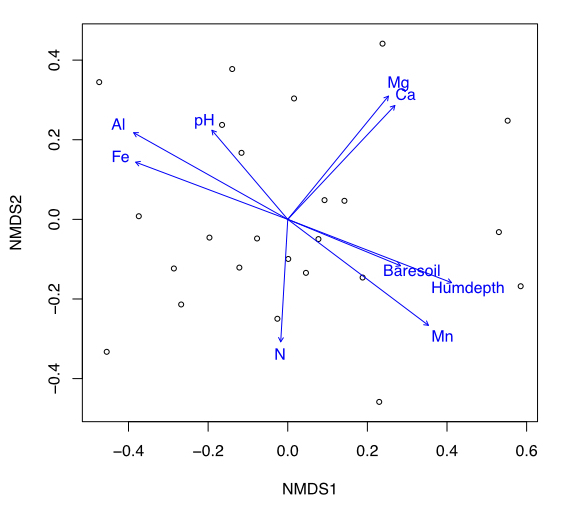
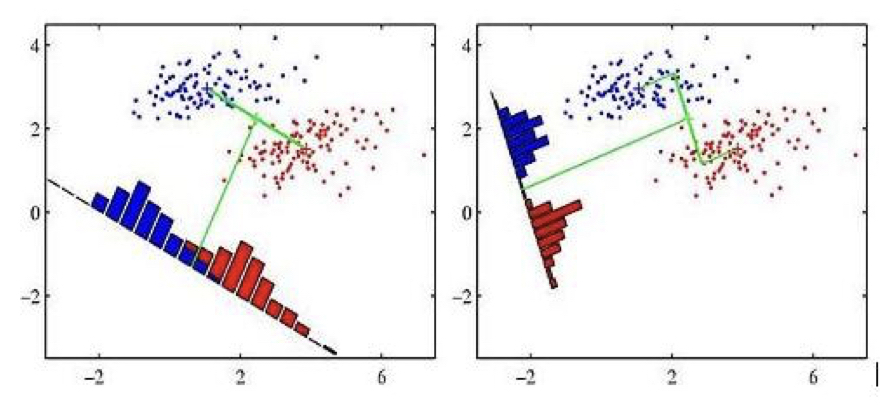
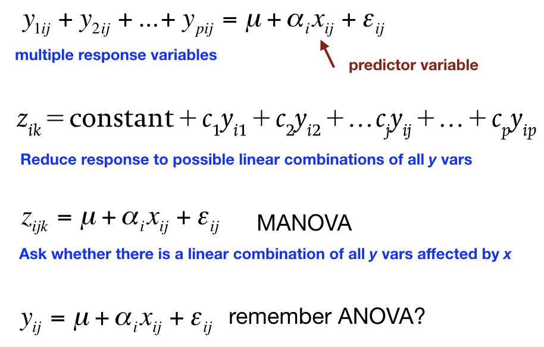
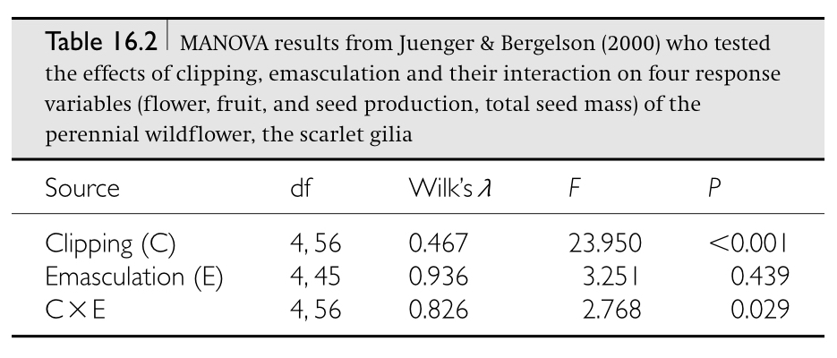
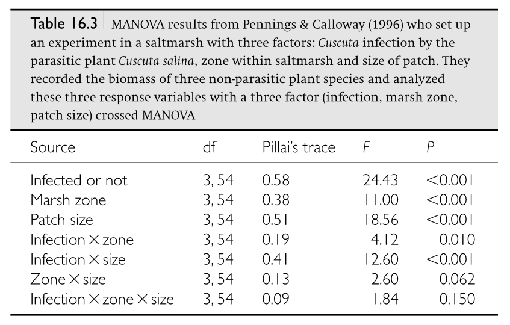
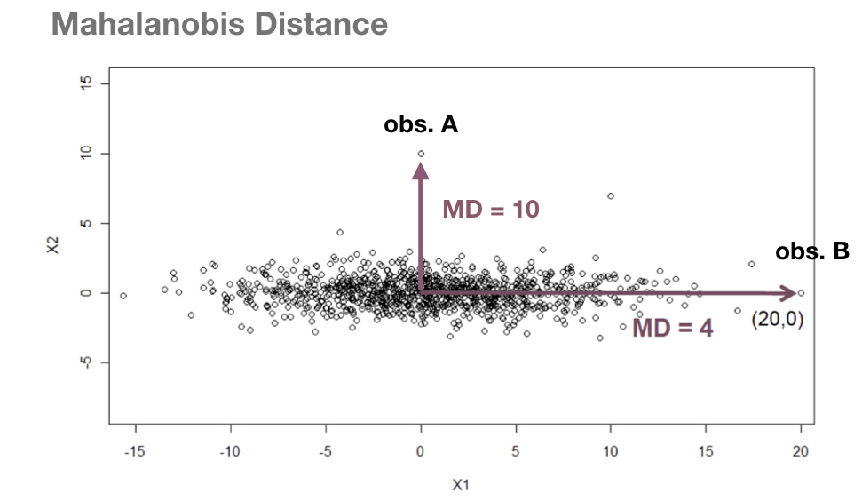
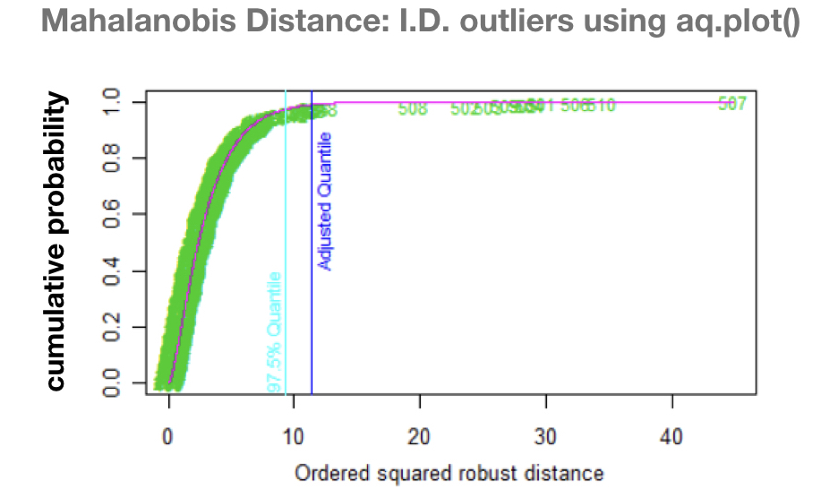
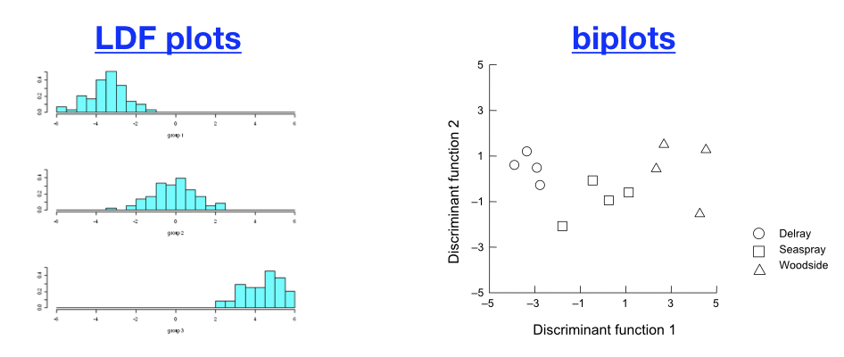
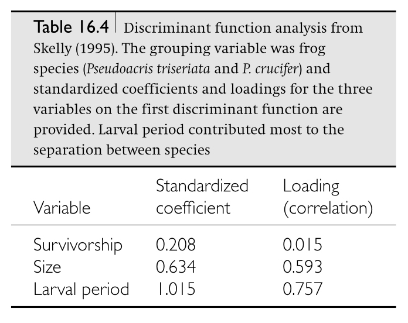

```{r setup, include=FALSE}
knitr::opts_chunk$set(echo = FALSE)
```

# TUESDAY - Finish PCoA and NMDS

## Goals for this week

- Finish PCoA and NMDS
- Introduce Clustering
- Multiple Analysis of Variance (MANOVA)
- Discriminant Function Analysis (DFA)

# Principal Coordinate Analysis (PCoA) and Multidimensional Scaling (MDS)

## How does PCoA differ from PCA

- PCoA uses **dissimilarity measures** among objects (not variables) to perform the eigenanalysis
    - **dissimilarity metric** if the measure is metric (the distance scale has meaning)
    - **dissimilarity index** or **dissimilarity measure** if non-metric (only the ordering matters)
    - always good to know and specify which you're using
- Dissimilarity **measures** can still have **distributional assumptions** about the data 
    - when using metrics (e.g. Euclidean distance)
    - because we’re using linear models as we did in PCA
- Dissimilarity indices are useful when variables are 
    - measured on **very different scales**
    - when some of the variables include **a lot of zero values**


## Dissimilarity measures and metrics

- PCoA is also called 
    - **classical multidimensional scaling** or 
    - **metric multidimensional scaling**. 
- The major benefits of PCoA are
    - the ability to choose a different distance measures 
    - when you have a lot more variables than observations
    - preferred measures **most closely represent** biologically meaningful differences between objects
- When **Euclidean distance** is used, PCoA is the same as PCA.
- When a **non-metric dissimilarity** is used 
    - we call it an **NMDS**
    - need to use different downstream analyses (e.g. PerMANOVA)
    
## Dissimilarity measures and metrics
    
- Metric coefficients satisfy four criteria: 
    - the distance between identical objects is "0", which is the minimum of the coefficient; 
    - if objects are not identical, a metric coefficient will have a positive value; 
    - symmetry, whereby the distance between A and B is the same as that between B and A;  
    - conformance to the triangle inequality, which specifies that for any triangle with vertices A, B, and C, the path defined by the line AB is always shorter than the path defined by AC + CB or BC + CA.


## Dissimilarity metrics

```{r, echo=FALSE, out.width='50%', fig.asp=.75, fig.align='center'}
knitr::include_graphics("images/multi.021.jpeg")
```


## Dissimilarity indices that are semi-metric

<br>

- Binary data
  - Jaccard
  - Simple matching coefficient
  - Sorensen
- Raw count data
  - Bray-Curtis
  - Steinhaus
- Mixed data
  - Gower’s

## PCoA Analysis steps

- Closely related to PCA by using a **metric dissimilarity**
- Starts with an **n-by-n matrix** of object dissimilarities
- Transformed and then subjected to eigenanalysis 
- As in PCA, 
    - **most of the information** will be in the first few dimensions
    - the eigenvectors are scaled to obtain weightings, but it’s difficult to relate these back to the original variables
    - However, the coefficients of these eigenvectors are then used to position objects on each PCoA via their new derived scores
- If Euclidean distance was used for the dissimilarity matrix  PCA and PCoA **will be very similar**

__________________________

# R Interlude - Principal Coordinate Analysis (PCoA)

## R Interlude - PCoA

- Download the VEGAN Package
    - https://cran.r-project.org/web/packages/vegan/vegan.pdf
    - http://www.cc.oulu.fi/~jarioksa/opetus/metodi/vegantutor.pdf
- We will use this package to reanalyze the ‘Wine’ dataset using PCoA instead of PCA
- If you have time, go back to some of the earlier RNAseq datasets in the term and analyze them using both PCA and PCoA in VEGAN


## R Interlude - PCoA

- PCoA is a distance-based ordination method that can be performed via the `capscale()` function in the package `VEGAN`. 
- You can also use `cmdscale()` in the base installation, but you would need to produce a distance matrix from the original data. 
- The `capscale()` function is designed for another purpose, so the syntax is a bit different than the other ordination methods, but it can be used to perform PCoA:

```{r, eval=FALSE, echo=TRUE}
PCoA.res<-capscale(dataframe~1,distance="euclidean")
```

## R Interlude - PCoA

- must specify dataframe~1 (where dataframe is the sample/variable data matrix) to perform PCoA
- must specify a distance from distances provided in `vegdist()`

```{r, eval=FALSE, echo=TRUE}
summary(PCoA.res)
scores(PCoA.res,display=sites)
plot(PCoA.res)
```

## R Interlude - PCoA

- The `vegdist()` function has more distances, including some more applicable to (paleo)ecological data:
- Distances available in `vegdist()` are: "manhattan", "euclidean", "canberra", "bray", "kulczynski", "jaccard", "gower", "altGower", "morisita", "horn", "mountford", "raup" , "binomial" or "chao" and the default is bray or Bray-Curtis.
- Try using the different distances in `vegdist()` to see how it affects your results

## R Interlude - PCoA

- If you use the `cmdscale` functions as part of the basic R installation you will need to have a data frame containing only numerical data (there can be row names). 
- The default arrangement is to have the samples (or sites) in rows and the measured variables (or counts) in columns. 
- You can transpose a data frame (or matrix)  swap the rows to columns and vice versa  using the transpose function t():

```{r, eval=FALSE, echo=TRUE}
transposed.frame <- t(dataframe)
```
- transposes data frame so rows become columns and vice versa


# Multidimensional Scaling (MDS)

## MDS goals and benefits

- **Data reduction** - reduce a lot of variables to a smaller number of axes that group objects that adequately summarize the original information. 
- **Scaling** - Reveal patterns in the data - especially among objects - that could not be found by analyzing each variable separately. Directly scales objects based on dissimilarities between them.
- **Ordination plots** can show these multivariate dissimilarities in lower dimensional space.
- However, specifically designed to graphically represent relationships **between objects** in multidimensional space, and thus subsequent analysis is more difficult.
- MDS is more **flexible** than PCA in being able to use just about any dissimilarity measure among objects, not just Euclidean Distance. 

## NMDS goals and benefits
- **Nonmetric** multidimensional scaling (NMDS or NMS) is an ordination technique that **differs** in several ways from nearly all other ordination methods.
- In NMDS, a small number of axes are **explicitly chosen prior** to the analysis and the data are fitted to those dimensions
- Most other ordination methods are **analytical**, but NMDS is a **numerical** technique that iteratively seeks a solution and stops computation when a solution is found.

## NMDS goals and benefits

- NMDS is not an eigenvalue-eigenvector technique like PCA. As a result, an MDS ordination can be rotated, inverted, or centered to any desired configuration.
- Unlike other ordination methods, **NMDS makes few assumptions about the nature of the data** (e.g. PCA assumes linear relationships) so is well suited for a wide variety of data.
- NMDS also allows **the use of any distance measure** of the samples, unlike other methods which specify particular measures (e.g. Euclidean via covariance or correlation in PCA).

## NMDS goals and benefits

- NMDS does suffer from **two principal drawbacks**, although these are becoming less important as computational power increases. 
- First, NMDS is **slow**, particularly for large data sets.
- Second, because NMDS is a **numerical optimization technique**, it can fail to find the true best solution because it can **become stuck on local minima**.

## MDS - one big ordination family

```{r, echo=FALSE, out.width='100%', fig.asp=.75, fig.align='center'}
knitr::include_graphics("images/multi.023.jpeg")
```

## Finding the best ordination in MDS

```{r, echo=FALSE, out.width='100%', fig.asp=.75, fig.align='center'}
knitr::include_graphics("images/multi.024.jpeg")
```

## Stress - the MDS analog of residuals in linear models

- A Shepard diagram is the relationship of the **dissimilarity and ordination distance**
- Fit a linear or non-linear regression between the two
- The **disparities** are really just the residuals from this model
- The disparities are then analyzed to see how well the new ordination captures the original information
- One measure is called **Kruskal’s Stress**

## Stress - the MDS analog of residuals in linear models

```{r, echo=FALSE, out.width='100%', fig.asp=.75, fig.align='center'}
knitr::include_graphics("images/multi.025.jpeg")
```

## Stress - the MDS analog of residuals in linear models

- The **lower the stress value**, the better the match
- When the relationship is linear, the fit can be metric (MDS)
- When it’s not, the relationship is based on rank orders non-metric (NMDS)
- NMDS is quite robust and is often used in areas such as ecology and microbiology
- Stress values greater than 0.3 indicate that the fit is no better than arbitrary, and we’d really like a stress that is 0.15 or less

## Scaling plots or ordinations

- Relates the objects to one another in the derived variable space
- Really only the relative distances between objects that are important for interpretation

```{r, echo=FALSE, out.width='50%', fig.asp=.75, fig.align='center'}

```

## Testing hypotheses in MDS

- What if we have factor variables that we’d like to use in an analysis?

- ANOVA on PC scores
- MANOVA on the original variables
    - MANOVA on the derived axis scores from an MDS
    - ANOSIM or perMANOVA on the derived axis scores from an nMDS

## Analysis of Similarities (ANOSIM)

- Very similar to ANOVA
- Uses Bray-Curtis dissimilarities, but could use any measure
- Calculates a test statistic of the rank dissimilarities within as compared to among groups
- Uses a randomization procedure, so it’s pretty robust to assumption violation
- Complex tests (nesting or factorial) are difficult to do in ANOSIM

## Non-parametric MANOVA (perMANOVA)

- Similar to MANOVA
- Sum of square (SS) partitioning to non-metric measures
- Can be applied to any design structure
- n-by-n matrix of dissimilarities for pairs of objects h and i
- partition the sum of square (SS) dissimilarities
- perform F-tests as  for ANOVA

```{r, echo=FALSE, out.width='100%', fig.asp=.75, fig.align='center'}

```

## CLUSTERING

<br>

- Goal - Partition a heterogenous overall group of data into a set of relatively homogeneous smaller groups (subsets)
- Natural extension of MDS approaches
- Used (misused) extensively in many areas of biology
- Sometimes also called network analysis


## CLUSTERING

```{r, echo=FALSE, out.width='100%', fig.asp=.75, fig.align='center'}
knitr::include_graphics("images/multi.028.jpeg")
```

## CLUSTERING

- Mostly used as an exploratory or discovery approach in combination with other analyses.
- Usually used without a priori ideas of group membership.
- Often explore a range of possible clusters (K=1, 2, 3, …., n)
- Sometimes called K-means clustering
-   Has four main steps
    - Acquire raw data of n objects measured on p variables 
    - Derive an inter object association or dissimilarity matrix
    - Cluster formation using a clustering algorithm
    - Visualization and comparison of the clusters
- There are numerous options, especially for step 3 - Neighbor joining, UPGMA, etc…

## CLUSTERING

- Could use any form of similarity
    - Covariance or correlation matrix
    - Euclidean distances (metric)
    - Dissimilarity measures (metric or nonmetric)
    - Matching-type measures of similarity (presence-absence)
- In reality both objects and variables could be clustered simultaneously

## CLUSTERING

```{r, echo=FALSE, out.width='100%', fig.asp=.75, fig.align='center'}
knitr::include_graphics("images/multi.029.jpeg")
```

## Cluster Analysis - cluster formation

```{r, echo=FALSE, out.width='100%', fig.asp=.75, fig.align='center'}

```

## Hierarchical clustering process

```{r, echo=FALSE, out.width='50%', fig.asp=.75, fig.align='center'}
knitr::include_graphics("images/multi.031.jpeg")
```


## Agglomerative and Divisive hierarchical clustering

- Long history in phylogenetics
- Start with all objects separated and then bring them together sequentially
- Main difference among algorithms is how dissimilarities among clusters are recalculated as the objects are brought together
    - Single linkage (nearest neighbor) - minimum dissimilarity among all pairs of two objects in two clusters
    - Complete linkage (furthest neighbor) - maximum dissimilarity among all pairs of two objects clusters
    - Average linkage (group mean) - average dissimilarity among all pairs of two objects in each of two clusters - often used
    
## Agglomerative and Divisive hierarchical clustering

- UPGMA - Unweighted Pair-Groups Method using Arithmetic averages.
    - Commonly used average linkage clustering algorithm
    - Also WPGMA (weighted) and UPGMC (based on centroids)
- Divisive hierarchical clustering has a long history in ecological data analysis
- Start with a large group and proceed by splitting into smaller groups
    - Twinspan - two-way indicator species analysis
- Agglomerative methods are now being used more often in ecology as well as phylogenetic and genomics

## Cluster Analysis - Non-hierarchical clustering

- Non-hierarchical clustering does not assume a strict bifurcating (tree-like) structure
- Instead, the clustering can be representing in a reticulating (network-like) structure
- In contrast to hierarchical clustering, objects can be reassigned to clusters throughout the analysis 
- Also called fuzzy clustering in that objects can belong to different clusters with a defined probability
- Becoming more common in population genetics, for example, with Bayesian posterior probabilities (PP) of belonging to a population.

## Cluster Analysis - Non-hierarchical clustering

- K-means non-hierarchical clustering is becoming a popular approach
    - Start with a pre-defined number of clusters (k), and 
    - Next assign objects to clusters
    - Then iteratively re-evaluate membership to clusters
    - Lastly maximize the ratio of between to within dissimilarity
- Can be represented as a network diagram or posterior probability plot


____________________

# R Interlude - MultiDimensional Scaling

## R Interlude - MDS

- Use VEGAN again
- We'll analyze the yeast RNAseq dataset again with samples as rows and genes as columns.

```{r, eval=FALSE, echo=TRUE}
yeast_data <- read.table('yeast.tsv', row.names = 1, header = T, sep = '\t')
head(yeast_data)
```

## R Interlude - MDS

- Generate a dissimilarity matrix for all samples using `vegdist()`.
- We use `decostand()` to “normalize,” which accounts for differing total read #s per sample.
- If the expression data are already normalized (e.g. copies per million), it is not needed.
- The `vegdist()` function has more distances
- Distances available in vegdist() are: "manhattan", "euclidean", "canberra", "bray", "kulczynski", "jaccard", "gower", "altGower", "morisita", "horn", "mountford", "raup" , "binomial" or "chao" and the default is bray or Bray-Curtis.

## R Interlude - MDS

- Turn the raw data matrix into a dissimilarity matrix
- The `decostand` function is a form of normalization

```{r, eval=FALSE, echo=TRUE}
vare.dis <- vegdist(decostand(yeast_data, "hell"), "euclidean")
print (vare.dis)
```

- Perform the clustering of the samples using multidimensional scaling. 
- Examine the 'stress' values of moving from a higher to lower dimensionality
- Usually a value of 0.15 or lower is considered acceptable

```{r, eval=FALSE, echo=TRUE}
vare.mds0 <- monoMDS(vare.dis)
print (vare.mds0)
```

## R Interlude - MDS

- Let's take a look at how the dissimilarities among samples maps onto the ordination distance. Notice that there is a fit with the data, but we're no longer assuming consistent linearity over the entire data set.

```{r, eval=FALSE, echo=TRUE}
stressplot(vare.mds0, vare.dis)
```

- What does the `R^2` value tell you? Is the model accurately predicting the observed dissimilarity?

## R Interlude - MDS

- Now let's look at the grouping of the samples in this lower dimensional space. Any Clustering

```{r, eval=FALSE, echo=TRUE}
ordiplot (vare.mds0, type = "t")
```

- Rerun the ordination and add all of the data (genes) as well to the plot. How does this plot compare to your first plot? What's all that red stuff?

```{r, eval=FALSE, echo=TRUE}
vare.mds <- metaMDS(yeast_data, trace = F)
plot (vare.mds, type = "t")
```

## R Interlude - MDS

- We can run a PCA on our data as well, which is a *metric* analysis that utilizes Euclidean distances

```{r, eval=FALSE, echo=TRUE}
vare.pca <- rda(yeast_data, scale = TRUE)
print (vare.pca)
```

- What do you notice about the eignevalues of the PCs? 
- How many original variables were there? How many eigenvectors will there be?
- Showing both the locations of the samples and the variables. 


## R Interlude - MDS

- Try different plots that show one or the other or both

```{r, eval=FALSE, echo=TRUE}
plot (vare.pca, scaling = -1)
plot (vare.pca, scaling = 1)
plot (vare.pca, scaling = 2)
```

- What are these plots showing? What does that scaling argument do?
- What is in red? What is in black?

```{r, eval=FALSE, echo=TRUE}
biplot (vare.pca, scaling = -1)
biplot (vare.pca, scaling = 1)
```

## R Interlude - MDS

- We can use the dissimilarity matrices to perform hierarchical clustering. 
- Try both the non-normalized (clus.dis1) and normalized (clus.dis2) distances.

```{r, eval=FALSE, echo=TRUE}
clus.dis1 <- vegdist(yeast_data)
clus.dis2 <- vegdist(decostand(yeast_data, "hell"), "euclidean")
```

```{r, eval=FALSE, echo=TRUE}
cluster1 <- hclust(clus.dis1, "single")
plot(cluster1)
```

## R Interlude - MDS

- Now, try these different versions of clustering. What is different about them?

```{r, eval=FALSE, echo=TRUE}
cluster_complete <- hclust(clus.dis1, "complete")
plot(cluster_complete)
```

```{r, eval=FALSE, echo=TRUE}
cluster_average <- hclust(clus.dis1, "average")
plot(cluster_average)
```

## R Interlude - MDS

- Lastly, let's ask R to cut the tree into several clusters for us. 
- Try it with different numbers of clusters and the different types of clustering from above.

```{r, eval=FALSE, echo=TRUE}
grp <- cutree(cluster1, 4)
print (grp)
```


# THURSDAY - MANOVA and DFA

## Goals for this week

<br>

- Finish PCoA and NMDS
- Introduce Clustering
- Multiple Analysis of Variance (MANOVA)
- Discriminant Function Analysis (DFA)


# Multivariate Analysis of Variance (MANOVA) and Discriminant Function Analysis (DFA)

## Conceptual overview of MANOVA & DFA

- Both focus on the analysis of a factor variable but with **multiple continuous response variables**

- **MANOVA** - explicitly test the difference between levels of a factor(s) using the first discriminant function

- **DFA** - defines the set of linear discriminant functions that most clearly differentiate the levels of a factor variable in multivariate space 

- MANOVA focuses on hypothesis testing and DFA is used more for classification

## Conceptual overview of MANOVA & DFA

<br>

```{r, echo=FALSE, out.width='100%', fig.asp=.75, fig.align='center'}

```

# Multivariate Analysis of Variance (MANOVA)

## Why use MANOVA?

- When we’re interested in the relationship of two or more response variables and one or more predictor variables
    - If we’re interested in each of the responses, then univariate ANOVA is more appropriate
    - If we are interested in group differences when all of the response variables are considered simultaneously, MANOVA is more appropriate
- The Hypothesis is now that there are **group effects** on the combinations of variables by comparing **group centroids** for two or more variables

## Single Factor MANOVA

$$ z_{ik} = constant + c_1y_{i1} + c_2y_{i2} + c_3y_{i3} + ... + c_py_{ip}$$

- MANOVA uses the linear combination (z) of the p response variables that maximizes the ratio of between and within group variances of z
- This linear combination is also called a Discriminant Function (MANOVA uses DF1)
- The between-groups, within-groups and total SS used in ANOVA are replaced by sums-of-squares and sums-of-cross-products matrices (**S**)
- One matrix is formed for between groups (the **H** matrix), nother matrix is formed within groups (the **E** matrix), and the final matrix is the total (the **T** matrix)

## Single Factor MANOVA

- Multiple linear response variables and one predictor factor variable with two or more levels
- Use matrix algebra to divide the **H** matrix by the **E** matrix
- The resulting matrix product is decomposed into eigenvalues and eigenvectors to determine how much of the between group variation is explained by the new variables
- The linear combination that produces the **largest eigenvalue** is the **eigenvector** that maximizes the ratio of between-group and within-group variance

## Single Factor MANOVA - linear model notation

```{r, echo=FALSE, out.width='100%', fig.asp=.75, fig.align='center'}

```

## Single Factor MANOVA - hypothesis tests

- The null hypothesis is that factor variable effect is zero with respect to the linear combination of response variables
- The null can be tested using test statistics based on one of the measures of variance in the matrix (either the determinant or the trace)
- Like in ANOVA we use the ratio of “between-groups” variance matrix to “within-groups” variance matrix.
- If this ratio is high, the variance explained by grouping according to the factor levels is meaningful. 
- If low, we’re not explaining additional variation in our latent variable by including the predictor in the model.

## Single Factor MANOVA - Statistics

- Common statistics 
    - Wilk’s lambda
    - Hotelling-Lawley trace
    - Pillai’s Trace
    - Roy’s Largest root
- All of these are interpreted the same way as other statistics 
- Larger statistic values and smaller p-values are more significant
- Wilk’s, Hotelling’s and Pillai’s produce identical F tests when there are only two groups and become Hotelling’s T2 statistic

## MANOVA results table

<br>

```{r, echo=FALSE, out.width='100%', fig.asp=.75, fig.align='center'}

```

## MANOVA results table

```{r, echo=FALSE, out.width='100%', fig.asp=.75, fig.align='center'}

```

## MANOVA contrasts

- A priori contrasts can be performed as before 
    - analogous to planned contrasts in single factor ANOVA
- Unplanned, post-hoc comparisons of group means are much more difficult
- What can you do?
    - Perform univariate ANOVA on each factor (or pseudofactor of combined factors)
    - Step-down analysis for model selection
    - Discriminant Function investigation by looking at the first eigenvector

## Single Factor MANOVA - Assumptions

- **Normality** - less important, especially for Pillai’s trace test statistic
- **Homogeneity of variance** (and covariance) - important, but tricky
- Data on very **different scales** can also be a problem - standardize
- **Outliers** - multivariate tests are very sensitive to these
    - Pillai’s trace is the most robust to deviation of homogeneity of variance
    - Can use Mahalanobis distance to detect and do something with outliers


## Outliers and Missing Data

- Outliers in multivariate space can be particularly misleading but difficult to detect
- Can use **Mahalanobis Distance**, which is the square root of the distance in multivariate space of the object from the centroid
- Options 
    - transform
    - remove
- As with univariate analyses the removal of outliers should be justified, or both analyses should be presented


## Identifying Outliers

```{r, echo=FALSE, out.width='100%', fig.asp=.75, fig.align='center'}

```

## Identifying Outliers

```{r, echo=FALSE, out.width='100%', fig.asp=.75, fig.align='center'}

```

## Outliers and Missing Data

<br>

- Missing observations are particularly vexing for multivariate analyses
    - **MCAR** - missing completely at random
    - **MAR** - missing at random
    - **MBC** - missing but correlated
- Three approaches
    - **Deletion** - remove the entire object from the data set
    - **Imputation** - infer the value based upon other values
    - **Maximum Likelihood** and **Expectation Maximization**

# R interlude - MANOVA using stickleback RNAseq data

## R interlude | MANOVA stickleback RNAseq

- This is the same dataset as you've used previously but with a few modifications
- FACTORS - Genotype, microbiota, a combined genotype and microbiota 
- RESPONSE - 600 genes as counts

```{r, eval=FALSE, echo=TRUE}
clay_data <- read.table('Clays_RNAseq.tsv', header=T, sep=‘\t')
head(clay_data)
geneA <- clay_data$Gene110 
geneB <- clay_data$Gene147 
geneC <- clay_data$Gene292
```

- Do these variables co-vary??? (try some scatterplots)

## R interlude | MANOVA stickleback RNAseq

<br>

- Detect and then show list of outliers based on Mahalanobis distances

```{r, eval=FALSE, echo=TRUE}
install.packages('mvoutlier')
library(mvoutlier)
outliers <- aq.plot(clay_data[c("Gene110","Gene147","Gene292")])
outliers 
```

## R interlude | MANOVA stickleback RNAseq

<br>

- Test for multivariate normality

```{r, eval=FALSE, echo=TRUE}
install.packages('mvnormtest')
library(mvnormtest)
three_genes <- t(as.matrix(cbind(clay_data$Gene110,clay_data$Gene147,
 clay_data$Gene292)))
mshapiro.test(three_genes)
```

- Are our data multivariate normal?
- specify main effect 1 

## R interlude | MANOVA stickleback RNAseq

<br>

- Fit the MANOVA model

```{r, eval=FALSE, echo=TRUE}
microbiota <- clay_data$Microbiota
clay_manova <- manova(cbind(geneA, geneB, geneC) ~ microbiota)
summary(clay_manova, test = "Pillai")
summary(clay_manova, test = "Wilks")
summary(clay_manova, test = "Hotelling-Lawley")
summary(clay_manova, test = “Roy")
summary.aov(clay_manova)
```

- Are the F-ratios and p-values different?
- What does `summary.aov()` do, and what does this tell you about the data?
- Now change the main effect variable around so that it has the four microbiota&genotype levels.

## R interlude | MANOVA stickleback RNAseq

<br>

- Fit the MANOVA model with a new combined effect (“genotype-microbiota combination”): 

```{r, eval=FALSE, echo=TRUE}
geno_micro <- clay_data$Geno.Micro
clay_manova <- manova(cbind(geneA, geneB, geneC) ~ geno_micro)
summary(clay_manova, test = "Pillai")
summary(clay_manova, test = "Wilks")
summary(clay_manova, test = "Hotelling-Lawley")
summary(clay_manova, test = "Roy")
summary.aov(clay_manova)
```

- Any differences relative to before?

## R interlude | MANOVA stickleback RNAseq

<br>

- Now change the model around so that it is a factorial MANOVA with microbiota and genotype as separate factors.

```{r, eval=FALSE, echo=TRUE} 
microbiota <- clay_data$Microbiota
genotype <- clay_data$Genotype
clay_manova <- manova(cbind(geneA, geneB, geneC) ~ genotype*microbiota)
summary(clay_manova, test = "Pillai")
summary(clay_manova, test = "Wilks")
summary(clay_manova, test = "Hotelling-Lawley")
summary(clay_manova, test = "Roy")
summary.aov(clay_manova)
```

- Any differences relative to before?

## R interlude | MANOVA stickleback RNAseq

<br>

- Now include 10 response variables, re-evaluate assumptions, and re-fit the factorial model.

```{r, eval=FALSE, echo=TRUE}
Fit the MANOVA model
clay_manova <- manova(cbind(clay_data$Gene5,clay_data$Gene6,
clay_data$Gene7,clay_data$Gene8,clay_data$Gene9,
clay_data$Gene10,clay_data$Gene11,clay_data$Gene12,
                clay_data$Gene13,clay_data$Gene14)~genotype*microbiota)


summary(clay_manova, test = "Pillai")
summary(clay_manova, test = "Wilks")
summary(clay_manova, test = "Hotelling-Lawley")
summary(clay_manova, test = "Roy")
summary.aov(clay_manova)
```

- Now include 100 response variables and re-fit the factorial model.


# Discriminant Function Analysis (DFA)

## Conceptual overview of MANOVA & DFA

- Both focus on the analysis of a factor variable but with **multiple continuous response variables**

- **MANOVA** - explicitly test the difference between levels of a factor(s) using the first discriminant function

- **DFA** - defines the set of linear discriminant functions that most clearly differentiate the levels of a factor variable in multivariate space 

- MANOVA focuses on hypothesis testing and DFA is used more for classification

## Conceptual overview of MANOVA & DFA

<br>

```{r, echo=FALSE, out.width='100%', fig.asp=.75, fig.align='center'}

```

## Steps involved in Discriminant Function Analysis (DFA)

1. Run MANOVA to test for a group difference
    - If no significant difference, DFA is not be useful
    - Single factor ANOVA on each response variable
2. Calculate Linear Discriminant Functions (LDF) scores
    - Evaluate the distributions of these scores
    - Do they have separate distributions for the groups?
3. Classify observations into groups
    - Generate conditional probabilities for each observation belonging to a given group
    - Determine the percentage of 'correct' assignments
    - Possible to “train” LDF with one data set, and then assign individuals from a new data set to factor levels

## Steps involved in Discriminant Function Analysis (DFA)

<br>

```{r, echo=FALSE, out.width='100%', fig.asp=.75, fig.align='center'}

```

## Discriminant Function Scores

```{r, echo=FALSE, out.width='80%', fig.asp=.75, fig.align='center'}

```


# R INTERLUDE - Discriminant Function Analysis (using the same RNA-seq data)

## R INTERLUDE - DFA stickleback RNAseq

<br>

- This is the same dataset as you've used previously but with a few modifications
- FACTORS - Genotype, microbiota, a combined genotype and microbiota 
- RESPONSE - 600 genes as counts

```{r, eval=FALSE, echo=TRUE}
clay_data <- read.table('Clays_RNAseq.tsv', header=T, sep=‘\t')
geneA <- clay_data$Gene110 
geneB <- clay_data$Gene147 
geneC <- clay_data$Gene292 
geno_micro <- clay_data$Geno.Micro
```

## R INTERLUDE - DFA stickleback RNAseq

<br>

```{r, eval=FALSE, echo=TRUE}
library(MASS)
clay_lda <- lda(geno_micro ~ geneA + geneB + geneC)
clay_lda
```

- What information do the different components of clay_lda contain? 
- Show results focused on first column of the DFA weightings

```{r, eval=FALSE, echo=TRUE}
clay_lda$scaling[,1]
```

## R INTERLUDE - DFA stickleback RNAseq

<br>

- Now, repeat the analysis but use the first 100 genes instead of just 3
- Don't worry about the warning

```{r, eval=FALSE, echo=TRUE}
clay_data_100 <- clay_data[,6:105]
clay_lda_100 <- lda(geno_micro~., clay_data_100)
clay_lda_100
```

## R INTERLUDE - DFA stickleback RNAseq

<br>

- Now, Let's predict the DF scores for the original objects, based on the 100 genes. 

```{r, eval=FALSE, echo=TRUE}
predict(clay_lda_100)
```

- What information does the `predict()` output contain?

# R INTERLUDE | Prediction using biomarker data

## R INTERLUDE | Biomarker DFA

- Here we have 200 patients and their prior histology-based diagnoses. There are three diagnoses (“benign,” “sarcoma 1,” and “sarcoma 2”). Also included are data from a panel of 6 qPCR-based biomarkers. This set of biomarkers is considered largely congruent with histology for cancer diagnosis, but more accurate. Specifically, the histology approach incorrectly leads to a sarcoma diagnosis (when the tumor is actually benign) about 2% of the time, whereas the biomarker approach has no such problem. 

- The goal here is to use DFA to separate sarcoma from benign diagnoses via the 6 biomarkers, but using the prior histology diagnosis as an informative grouping variable. This way we can evaluate whether any of the prior diagnoses may be erroneous.    


## R INTERLUDE | Biomarker DFA

- Read in the data and specify our 6 response variables

```{r, eval=FALSE, echo=TRUE}
biomarkers <- read.table('biomarkers.tsv', header=T, sep='\t')
mark1 <- biomarkers$marker1
##etc… 
```

- Specify “diagnosis” as our categorical predictor variable 
- First, run a quick MANOVA on the data (as before) to test the hypothesis that prior diagnosis significantly affects where patients lie in multi-dimensional (biomarker) space…   
- Next, use the `lda()` function to find the discriminant functions.
- Remember, the algorithm is deriving the “latent” variable(s) that best separate our samples (based on the prior diagnosis) in 6-dimensional space. 

## R INTERLUDE | Biomarker DFA

```{r, eval=FALSE, echo=TRUE}
diag <- biomarkers$diagnosis
library(MASS)
diag_lda <- lda(diag ~ mark1 + mark2 + mark3 + mark4 + mark5 + mark6)
diag_lda
```

- Show results focused on first column of the LDA weightings

```{r, eval=FALSE, echo=TRUE}
diag_lda$scaling[,1]
```
- Why are there only 2 Linear Discriminant Variables?

## R INTERLUDE | Biomarker DFA

- Now, let's predict the LD scores for the original objects (our patients)
```{r, eval=FALSE, echo=TRUE}
predict(diag_lda)
```

- What other information does diag_lda contain?

## R INTERLUDE | Biomarker DFA

- Now store the LD1 and LD2 scores (the last item in diag_lda) as a new data frame.
- Make a histogram of the LD scores for the different diagnosis groups.

```{r, eval=FALSE, echo=TRUE}   
LD_scores <- as.data.frame(predict(diag_lda)$x)
ldahist(LD_scores$LD1, biomarkers$diagnosis)#For LD1 
ldahist(LD_scores$LD2, biomarkers$diagnosis)#For LD2
```

- Do you notice anything strange about any of the distributions? 

## R INTERLUDE | Biomarker DFA

- Now make a bivariate plot for DF1 and DF2 with diagnosis groups labeled uniquely.

```{r, eval=FALSE, echo=TRUE}
LD_scores$diag <- diag
#Adds the original diagnosis variable to the LD data frame
plot(LD_scores$LD2~LD_scores$LD1, 
    main="Prior diagnosis groups in 6-D biomarker space”)
```

- Labeling by group is up to you! (Hint: can set col and/or pch params using `ifelse()` functional statements).
- Notice anything weird about any observations in the plot??? What do they mean???
- Let’s say you had a handful of new patients with no prior diagnosis and only the qPCR data from the six biomarkers. 
- Could re-running the LDA with those samples help you make the appropriate diagnoses?

