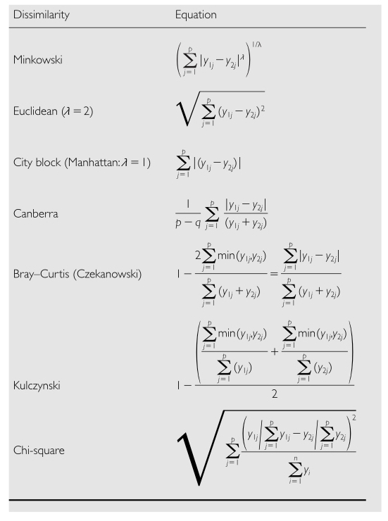
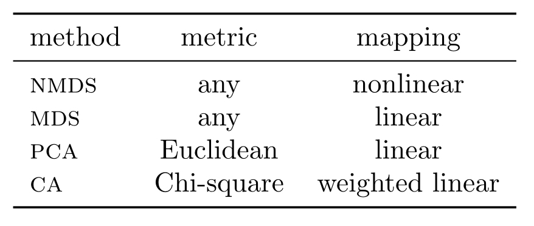
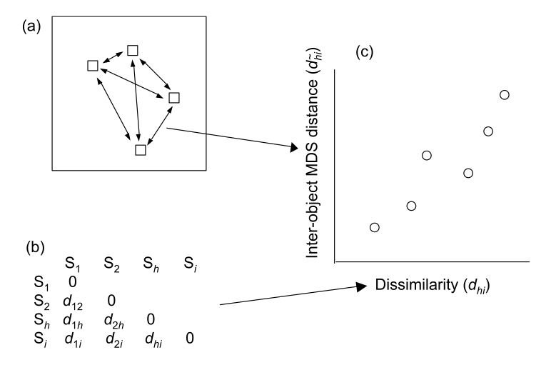

```{r setup, include=FALSE}
knitr::opts_chunk$set(echo = FALSE)
```

## Goals for this week

- Finish PCoA and NMDS
- Introduce Clustering
- Multiple Analysis of Variance (MANOVA)
- Discriminant Function Analysis (DFA)

# Principal Coordinate Analysis (PCoA) and Multidimensional Scaling (MDS)

## How does PCoA differ from PCA

- PCoA uses **dissimilarity measures** among objects (not variables) to perform the eigenanalysis
    - **dissimilarity metric** if the measure is metric (the distance scale has meaning)
    - **dissimilarity index** or **dissimilarity measure** if non-metric (only the ordering matters)
    - always good to know and specify which you're using
- Dissimilarity **measures** can still have **distributional assumptions** about the data 
    - when using metrics (e.g. Euclidean distance)
    - because we’re using linear models as we did in PCA
- Dissimilarity indices are useful when variables are 
    - measured on **very different scales**
    - when some of the variables include **a lot of zero values**


## Dissimilarity measures and metrics

- PCoA is also called 
    - **classical multidimensional scaling** or 
    - **metric multidimensional scaling**. 
- The major benefits of PCoA are
    - the ability to choose a different distance measures 
    - when you have a lot more variables than observations
    - preferred measures **most closely represent** biologically meaningful differences between objects
- When **Euclidean distance** is used, PCoA is the same as PCA.
- When a **non-metric dissimilarity** is used 
    - we call it an **NMDS**
    - need to use different downstream analyses (e.g. PerMANOVA)
    
## Dissimilarity measures and metrics
    
- Metric coefficients satisfy four criteria: 
    - the distance between identical objects is "0", which is the minimum of the coefficient; 
    - if objects are not identical, a metric coefficient will have a positive value; 
    - symmetry, whereby the distance between A and B is the same as that between B and A;  
    - conformance to the triangle inequality, which specifies that for any triangle with vertices A, B, and C, the path defined by the line AB is always shorter than the path defined by AC + CB or BC + CA.


## Dissimilarity metrics

```{r, echo=FALSE, out.width='50%', fig.asp=.75, fig.align='center'}

```


## Dissimilarity indices that are semi-metric

<br>

- Binary data
  - Jaccard
  - Simple matching coefficient
  - Sorensen
- Raw count data
  - Bray-Curtis
  - Steinhaus
- Mixed data
  - Gower’s

## PCoA Analysis steps

- Closely related to PCA by using a **metric dissimilarity**
- Starts with an **n-by-n matrix** of object dissimilarities
- Transformed and then subjected to eigenanalysis 
- As in PCA, 
    - **most of the information** will be in the first few dimensions
    - the eigenvectors are scaled to obtain weightings, but it’s difficult to relate these back to the original variables
    - However, the coefficients of these eigenvectors are then used to position objects on each PCoA via their new derived scores
- If Euclidean distance was used for the dissimilarity matrix  PCA and PCoA **will be very similar**

__________________________

# R Interlude - Principal Coordinate Analysis (PCoA)

## R Interlude

- Download the VEGAN Package
    - https://cran.r-project.org/web/packages/vegan/vegan.pdf
    - http://www.cc.oulu.fi/~jarioksa/opetus/metodi/vegantutor.pdf
- We will use this package to reanalyze the ‘Wine’ dataset using PCoA instead of PCA
- If you have time, go back to some of the earlier RNAseq datasets in the term and analyze them using both PCA and PCoA in VEGAN


## R Interlude

- PCoA is a distance-based ordination method that can be performed via the `capscale()` function in the package `VEGAN`. 
- You can also use `cmdscale()` in the base installation, but you would need to produce a distance matrix from the original data. 
- The `capscale()` function is designed for another purpose, so the syntax is a bit different than the other ordination methods, but it can be used to perform PCoA:

```{r, eval=FALSE, echo=TRUE}
PCoA.res<-capscale(dataframe~1,distance="euclidean")
```

## R Interlude

- must specify dataframe~1 (where dataframe is the sample/variable data matrix) to perform PCoA
- must specify a distance from distances provided in `vegdist()`

```{r, eval=FALSE, echo=TRUE}
summary(PCoA.res)
scores(PCoA.res,display=sites)
plot(PCoA.res)
```

## R Interlude

- The `vegdist()` function has more distances, including some more applicable to (paleo)ecological data:
- Distances available in `vegdist()` are: "manhattan", "euclidean", "canberra", "bray", "kulczynski", "jaccard", "gower", "altGower", "morisita", "horn", "mountford", "raup" , "binomial" or "chao" and the default is bray or Bray-Curtis.
- Try using the different distances in `vegdist()` to see how it affects your results

## R Interlude
- If you use the `cmdscale` functions as part of the basic R installation you will need to have a data frame containing only numerical data (there can be row names). 
- The default arrangement is to have the samples (or sites) in rows and the measured variables (or counts) in columns. 
- You can transpose a data frame (or matrix)  swap the rows to columns and vice versa  using the transpose function t():

```{r, eval=FALSE, echo=TRUE}
transposed.frame <- t(dataframe)
```
- transposes data frame so rows become columns and vice versa


# Multidimensional Scaling (MDS)

## MDS goals

- **Data reduction** - reduce a lot of variables to a smaller number of axes that group objects that adequately summarize the original information. 
- **Scaling** - Reveal patterns in the data - especially among objects - that could not be found by analyzing each variable separately. Directly scales objects based on dissimilarities between them.
- **Ordination plots** can show these multivariate dissimilarities in lower dimensional space.
- However, specifically designed to graphically represent relationships **between objects** in multidimensional space, and thus subsequent analysis is more difficult.

## MDS benefits

- MDS is more **flexible** than PCA in being able to use just about any dissimilarity measure among objects, not just Euclidean Distance. 
- **Nonmetric** multidimensional scaling (NMDS or NMS)  is an ordination technique that **differs** in several ways from nearly all other ordination methods.
- In NMDS, a small number of axes are **explicitly chosen prior** to the analysis and the data are fitted to those dimensions
- Most other ordination methods are **analytical**, but MDS is a **numerical** technique that iteratively seeks a solution and stops computation when a solution is found.

## MDS benefits

- MDS is not an eigenvalue-eigenvector technique like PCA. As a result, an MDS ordination can be rotated, inverted, or centered to any desired configuration.
- Unlike other ordination methods, **MDS makes few assumptions about the nature of the data** (e.g. PCA assumes linear relationships) so is well suited for a wide variety of data.
- MDS also allows **the use of any distance measure** of the samples, unlike other methods which specify particular measures (e.g. Euclidean via covariance or correlation in PCA).

## MDS drawbacks

- MDS does suffer from **two principal drawbacks**, although these are becoming less important as computational power increases. 
- First, MDS is **slow**, particularly for large data sets.
- Second, because MDS is a **numerical optimization technique**, it can fail to find the true best solution because it can **become stuck on local minima**.

## MDS - one big ordination family

```{r, echo=FALSE, out.width='100%', fig.asp=.75, fig.align='center'}

```

## Finding the best ordination in MDS

```{r, echo=FALSE, out.width='100%', fig.asp=.75, fig.align='center'}

```

## Stress - the MDS analog of residuals in linear models

- A Shepard diagram is the relationship of the **dissimilarity and ordination distance**
- Fit a linear or non-linear regression between the two
- The **disparities** are really just the residuals from this model
- The disparities are then analyzed to see how well the new ordination captures the original information
- One measure is called **Kruskal’s Stress**

## Stress - the MDS analog of residuals in linear models

```{r, echo=FALSE, out.width='100%', fig.asp=.75, fig.align='center'}
knitr::include_graphics("images/multi.025.jpeg")
```

## Stress - the MDS analog of residuals in linear models

- The **lower the stress value**, the better the match
- When the relationship is linear, the fit can be metric (MDS)
- When it’s not, the relationship is based on rank orders non-metric (NMDS)
- NMDS is quite robust and is often used in areas such as ecology and microbiology
- Stress values greater than 0.3 indicate that the fit is no better than arbitrary, and we’d really like a stress that is 0.15 or less

## Scaling plots or ordinations

- Relates the objects to one another in the derived variable space
- Really only the relative distances between objects that are important for interpretation

```{r, echo=FALSE, out.width='50%', fig.asp=.75, fig.align='center'}
knitr::include_graphics("images/multi.026.jpeg")
```

## Testing hypotheses in MDS

- What if we have factor variables that we’d like to use in an analysis?

- ANOVA on PC scores
- MANOVA on the original variables
    - MANOVA on the derived axis scores from an MDS
    - ANOSIM or perMANOVA on the derived axis scores from an nMDS

## Analysis of Similarities (ANOSIM)

- Very similar to ANOVA
- Uses Bray-Curtis dissimilarities, but could use any measure
- Calculates a test statistic of the rank dissimilarities within as compared to among groups
- Uses a randomization procedure, so it’s pretty robust to assumption violation
- Complex tests (nesting or factorial) are difficult to do in ANOSIM

## Non-parametric MANOVA (perMANOVA)

- Similar to MANOVA
- Sum of square (SS) partitioning to non-metric measures
- Can be applied to any design structure
- n-by-n matrix of dissimilarities for pairs of objects h and i
- partition the sum of square (SS) dissimilarities
- perform F-tests as  for ANOVA

```{r, echo=FALSE, out.width='100%', fig.asp=.75, fig.align='center'}
knitr::include_graphics("images/multi.027.jpeg")
```

## CLUSTERING

<br>

- Goal - Partition a heterogenous overall group of data into a set of relatively homogeneous smaller groups (subsets)
- Natural extension of MDS approaches
- Used (misused) extensively in many areas of biology
- Sometimes also called network analysis


## CLUSTERING

```{r, echo=FALSE, out.width='100%', fig.asp=.75, fig.align='center'}
knitr::include_graphics("images/multi.028.jpeg")
```

## CLUSTERING

- Mostly used as an exploratory or discovery approach in combination with other analyses.
- Usually used without a priori ideas of group membership.
- Often explore a range of possible clusters (K=1, 2, 3, …., n)
- Sometimes called K-means clustering
-   Has four main steps
    - Acquire raw data of n objects measured on p variables 
    - Derive an inter object association or dissimilarity matrix
    - Cluster formation using a clustering algorithm
    - Visualization and comparison of the clusters
- There are numerous options, especially for step 3 - Neighbor joining, UPGMA, etc…

## CLUSTERING

- Could use any form of similarity
    - Covariance or correlation matrix
    - Euclidean distances (metric)
    - Dissimilarity measures (metric or nonmetric)
    - Matching-type measures of similarity (presence-absence)
- In reality both objects and variables could be clustered simultaneously

## CLUSTERING

```{r, echo=FALSE, out.width='100%', fig.asp=.75, fig.align='center'}

```

## Cluster Analysis - cluster formation

```{r, echo=FALSE, out.width='100%', fig.asp=.75, fig.align='center'}
knitr::include_graphics("images/multi.030.jpeg")
```

## Hierarchical clustering process

```{r, echo=FALSE, out.width='50%', fig.asp=.75, fig.align='center'}

```


## Agglomerative and Divisive hierarchical clustering

- Long history in phylogenetics
- Start with all objects separated and then bring them together sequentially
- Main difference among algorithms is how dissimilarities among clusters are recalculated as the objects are brought together
    - Single linkage (nearest neighbor) - minimum dissimilarity among all pairs of two objects in two clusters
    - Complete linkage (furthest neighbor) - maximum dissimilarity among all pairs of two objects clusters
    - Average linkage (group mean) - average dissimilarity among all pairs of two objects in each of two clusters - often used
    
## Agglomerative and Divisive hierarchical clustering

- UPGMA - Unweighted Pair-Groups Method using Arithmetic averages.
    - Commonly used average linkage clustering algorithm
    - Also WPGMA (weighted) and UPGMC (based on centroids)
- Divisive hierarchical clustering has a long history in ecological data analysis
- Start with a large group and proceed by splitting into smaller groups
    - Twinspan - two-way indicator species analysis
- Agglomerative methods are now being used more often in ecology as well as phylogenetic and genomics

## Cluster Analysis - Non-hierarchical clustering

- Non-hierarchical clustering does not assume a strict bifurcating (tree-like) structure
- Instead, the clustering can be representing in a reticulating (network-like) structure
- In contrast to hierarchical clustering, objects can be reassigned to clusters throughout the analysis 
- Also called fuzzy clustering in that objects can belong to different clusters with a defined probability
- Becoming more common in population genetics, for example, with Bayesian posterior probabilities (PP) of belonging to a population.

## Cluster Analysis - Non-hierarchical clustering

- K-means non-hierarchical clustering is becoming a popular approach
    - Start with a pre-defined number of clusters (k), and 
    - Next assign objects to clusters
    - Then iteratively re-evaluate membership to clusters
    - Lastly maximize the ratio of between to within dissimilarity
- Can be represented as a network diagram or posterior probability plot


____________________

# R Interlude

## R Interlude

- Use VEGAN again
- We'll analyze the yeast RNAseq dataset again with samples as rows and genes as columns.

```{r, eval=FALSE, echo=TRUE}
yeast_data <- read.table('yeast.tsv', row.names = 1, header = T, sep = '\t')
head(yeast_data)
```

## R Interlude

- Generate a dissimilarity matrix for all samples using `vegdist()`.
- We use `decostand()` to “normalize,” which accounts for differing total read #s per sample.
- If the expression data are already normalized (e.g. copies per million), it is not needed.
- The `vegdist()` function has more distances
- Distances available in vegdist() are: "manhattan", "euclidean", "canberra", "bray", "kulczynski", "jaccard", "gower", "altGower", "morisita", "horn", "mountford", "raup" , "binomial" or "chao" and the default is bray or Bray-Curtis.

## R Interlude

- Turn the raw data matrix into a dissimilarity matrix
- The `decostand` function is a form of normalization

```{r, eval=FALSE, echo=TRUE}
vare.dis <- vegdist(decostand(yeast_data, "hell"), "euclidean")
print (vare.dis)
```

- Perform the clustering of the samples using multidimensional scaling. 
- Examine the 'stress' values of moving from a higher to lower dimensionality
- Usually a value of 0.15 or lower is considered acceptable

```{r, eval=FALSE, echo=TRUE}
vare.mds0 <- monoMDS(vare.dis)
print (vare.mds0)
```

## R Interlude

- Let's take a look at how the dissimilarities among samples maps onto the ordination distance. Notice that there is a fit with the data, but we're no longer assuming consistent linearity over the entire data set.

```{r, eval=FALSE, echo=TRUE}
stressplot(vare.mds0, vare.dis)
```

- What does the `R^2` value tell you? Is the model accurately predicting the observed dissimilarity?

## R Interlude

- Now let's look at the grouping of the samples in this lower dimensional space. Any Clustering

```{r, eval=FALSE, echo=TRUE}
ordiplot (vare.mds0, type = "t")
```

- Rerun the ordination and add all of the data (genes) as well to the plot. How does this plot compare to your first plot? What's all that red stuff?

```{r, eval=FALSE, echo=TRUE}
vare.mds <- metaMDS(yeast_data, trace = F)
plot (vare.mds, type = "t")
```

## R Interlude

- We can run a PCA on our data as well, which is a *metric* analysis that utilizes Euclidean distances

```{r, eval=FALSE, echo=TRUE}
vare.pca <- rda(yeast_data, scale = TRUE)
print (vare.pca)
```

- What do you notice about the eignevalues of the PCs? 
- How many original variables were there? How many eigenvectors will there be?
- Showing both the locations of the samples and the variables. 


## R Interlude

- Try different plots that show one or the other or both

```{r, eval=FALSE, echo=TRUE}
plot (vare.pca, scaling = -1)
plot (vare.pca, scaling = 1)
plot (vare.pca, scaling = 2)
```

- What are these plots showing? What does that scaling argument do?
- What is in red? What is in black?

```{r, eval=FALSE, echo=TRUE}
biplot (vare.pca, scaling = -1)
biplot (vare.pca, scaling = 1)
```

## R Interlude

- We can use the dissimilarity matrices to perform hierarchical clustering. 
- Try both the non-normalized (clus.dis1) and normalized (clus.dis2) distances.

```{r, eval=FALSE, echo=TRUE}
clus.dis1 <- vegdist(yeast_data)
clus.dis2 <- vegdist(decostand(yeast_data, "hell"), "euclidean")
```

```{r, eval=FALSE, echo=TRUE}
cluster1 <- hclust(clus.dis1, "single")
plot(cluster1)
```

## R Interlude

- Now, try these different versions of clustering. What is different about them?

```{r, eval=FALSE, echo=TRUE}
cluster_complete <- hclust(clus.dis1, "complete")
plot(cluster_complete)
```

```{r, eval=FALSE, echo=TRUE}
cluster_average <- hclust(clus.dis1, "average")
plot(cluster_average)
```

## R Interlude

- Lastly, let's ask R to cut the tree into several clusters for us. 
- Try it with different numbers of clusters and the different types of clustering from above.

```{r, eval=FALSE, echo=TRUE}
grp <- cutree(cluster1, 4)
print (grp)
```


