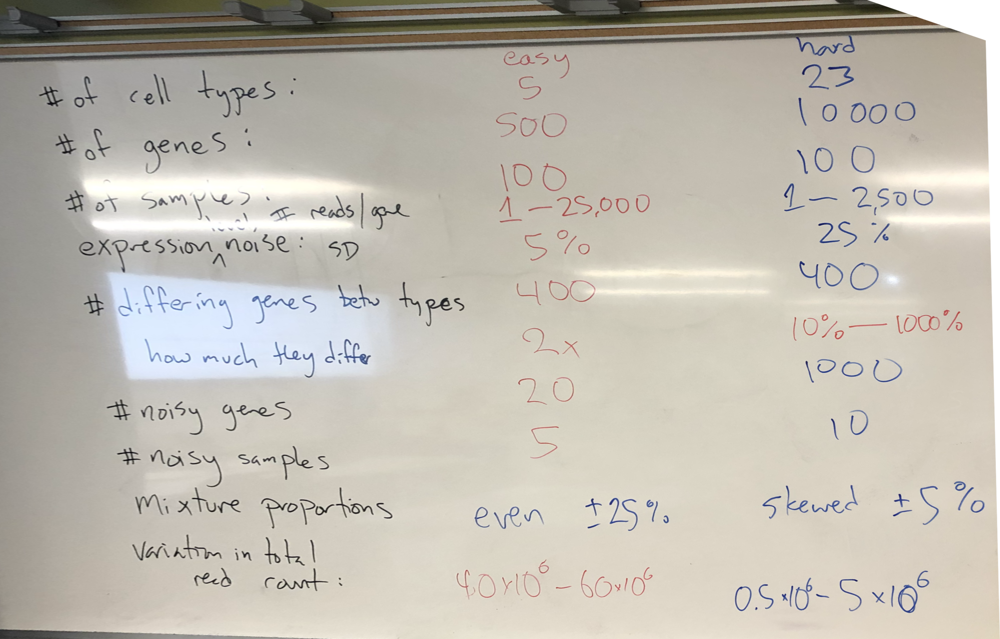

```{r setup, include=FALSE}
fig.dim <- 4
knitr::opts_chunk$set(fig.width=2*fig.dim,
                      fig.height=fig.dim,
                      fig.align='center')
set.seed(23)
library(lars)
library(tidyverse)
library(rstan)
library(matrixStats)
rstan_options(auto_write = TRUE)
options(mc.cores = parallel::detectCores())
```


# Overview of dimension reduction

## The menagerie

There are *many* dimension reduction methods, e.g.:

- principal components analysis (PCA)
- non-negative matrix factorization (NMF)
- independent components analysis (ICA)
- canonical correpondence analysis (CCA)
- principal coordinates analysis (PCoA)
- multidimensional scaling (MDS)
- redundancy analysis (RDA)
- Sammon mapping
- kernel PCA
- t-SNE
- UMAP
- locally linear embedding (LLE)
- Laplacian eigenmaps
- autoencoders

## Using distances or similarities?

PCA uses the *covariance matrix*, which measures similarity.

t-SNE begins with the matrix of *distances*, measuring dissimilarity.

## Metric or non-Metric?

Are distances interpretable?

. . .

*metric:* In PCA, each axis is a fixed linear combination of variables.
So, distances always mean the same thing no matter where you are on the plot.

. . .

*non-metric:* In t-SNE,
distances within different clusters are not comparable.


## Why ordination?

From [ordination.okstate.edu](http://ordination.okstate.edu/overview.htm),
about ordination in ecology:


1. Graphical results often lead to intuitive interpretations of species-environment relationships.

2. A single multivariate analysis saves time, in contrast to a separate univariate analysis for each species.

3. Ideally and typically, dimensions of this 'low dimensional space' will represent important and interpretable environmental gradients.

4. If statistical tests are desired, problems of multiple comparisons are diminished when species composition is studied in its entirety.

5. Statistical power is enhanced when species are considered in aggregate, because of redundancy.

6. By focusing on 'important dimensions', we avoid interpreting (and misinterpreting) noise.


## Beware overinterpretation


1. Ordination methods
    are strongly influenced by *sampling*:
    ordination may ignore large-scale patterns in favor of describing variation within a highly oversampled area.

2. Ordination methods also describe patterns common to many variables:
   measuring the same thing many times may drive results.

3. Many methods are designed to find clusters, because our brain likes to categorize things.
   This doesn't mean those clusters are well-separated in reality.


# Text analysis

## Identifying authors

In [data/passages.txt](data/passages.txt)
we have a number of short passages from a few different books.

. . .

Can we identify the authors of each passage?

. . .

The true sources of the passages are in [data/passage_sources.tsv](data/passage_sources.tsv).

## Turn the data into a matrix

```{r wordmat, cache=TRUE}
passages <- readLines("data/passages.txt")
sources <- read.table("data/passage_sources.tsv", header=TRUE)
words <- sort(unique(strsplit(paste(passages, collapse=" "), " +")[[1]]))
tabwords <- function (x, w) { tabulate(match(strsplit(x, " ")[[1]], w), nbins=length(w)) }
wordmat <- sapply(passages, tabwords, words)
dimnames(wordmat) <- list(words, NULL)
stopifnot( min(rowSums(wordmat)) > 0 )
wordmat[1:20, 1:20]
```

## PCA?

```{r wordpca, fig.width=2.5*fig.dim, fig.height=1.5*fig.dim, cache=TRUE, dependson="wordmat"}
wordpcs <- prcomp(wordmat, scale.=TRUE)
layout(t(1:2))
plot(wordpcs$rotation[,1:2], col=sources$source, pch=20, xlab="PC1", ylab="PC2")
plot(wordpcs$rotation[,2:3], col=sources$source, pch=20, xlab="PC2", ylab="PC3")
legend("topright", pch=20, col=1:3, legend=levels(sources$source))
```

## PC1 is shortness

```{r wordlen, fig.width=2.0*fig.dim, fig.height=1.5*fig.dim}
plot(colSums(wordmat), wordpcs$rotation[,1], col=sources$source, xlab='length', ylab='PC1')
```

## PC2 is book

::: {.columns}
:::::::::::::: {.column width=50%}

```{r wordloadings, echo=FALSE}
xw <- wordpcs$x
head(xw[order(xw[,2]),1:3], 50)
```

:::
:::::::::::::: {.column width=50%}

```{r wordloadings2, echo=FALSE}
head(xw[order(xw[,2],decreasing=TRUE),1:3], 50)
```

:::
::::::::::::::


## PC3 ???

::: {.columns}
:::::::::::::: {.column width=50%}

```{r wordloadings3, echo=FALSE}
head(xw[order(xw[,3]),1:3], 50)
```

:::
:::::::::::::: {.column width=50%}

```{r wordloadings4, echo=FALSE}
head(xw[order(xw[,3],decreasing=TRUE),1:3], 50)
```

:::
::::::::::::::


# Visualizing expression space

## A conceptual model

Let's build a *conceptual* model for
descriptive analysis of "mixture" expression data.

. . .

**Data:** expression data from tissue samples
that consist of various *mixtures* of different cell types.

. . .

**Goal:** identify shared coexpression patterns
corresponding to *cell type*.

. . .

*Similar situations:* 
identify different developmental stages from whole-organism expression;
common community structures from metagenomic data.

----------------


1. Each cell type has a typical set of *mean* expression levels.

2. Each sample is composed of a mixture of cell types,
   defined by the proportions that come from each type.


------------------

::: {.columns}
:::::::::::::: {.column width=50%}


1. Mean expression by cell type.

2. Cell type proportions by sample.


:::
:::::::::::::: {.column width=50%}


1. $x_{kj}$ : Mean expression of gene $j$ in cell type $k$.

2. $w_{ik}$ : Proportion of sample $i$ of cell type $k$.

$Z_{ij}$ : expression level in sample $i$ of gene $j$.

   $$\begin{aligned}
        Z_{ij} \approx \sum_{k=1}^K w_{ik} x_{kj} .
   \end{aligned}$$


:::
:::::::::::::: 


# Nonnegative matrix factorization

## ... aka "NMF"


We are *decomposing* $Z$ into the product of two lower-dimensional,
nonnegative factors:

$$\begin{aligned}
    Z_{ij} &\approx \sum_k w_{ik} x_{kj} \\
    w_{ik} &\ge 0 \\
    x_{kj} &\ge 0 .
\end{aligned}$$

## A simple NMF model

```{r simple_nmf, cache=TRUE}
simple_nmf <- stan_model(model_code="
data {
    int N; // samples
    int L; // variables
    int K; // factors
    real Z[L,N];
}
parameters {
    matrix<lower=0>[L,K] x;
    matrix<lower=0>[K,N] w;
    real<lower=0> sigma;
}
model {
    for (j in 1:L) {
        Z[j] ~ normal(x[j] * w, sigma);
    }
}
")
```

## Relationship to PCA

PCA finds $w$ and $z$ to minimize
$$\begin{aligned}
    \sum_{ij} \| Z_{ij} - \sum_k w_{ik} x_{kj} \|^2 .
\end{aligned}$$

In other words, it is the maximum-likelihood solution to
$$\begin{aligned}
    Z_{ij} &\sim \Normal(\sum_k w_{ik} x_{kj}, \sigma^2) .
\end{aligned}$$
(The eigenvectors are the columns of $x$,
and the eigenvectors are related to the size of $w$ and $x$.)

## PCA, in Stan

```{r stan_pca, cache=TRUE}
stan_pca <- stan_model(model_code="
data {
    int N; // samples
    int L; // variables
    int K; // factors
    real Z[L,N];
}
parameters {
    matrix[L,K] x;
    matrix[K,N] w;
    real<lower=0> sigma;
}
model {
    for (j in 1:L) {
        Z[j] ~ normal(x[j] * w, sigma);
    }
}
")
```
*(note: needs some priors to work well; see [here](https://arxiv.org/abs/1603.00788).)*

<!--
## PCA in Stan

```{r pca_in_stan, cache=TRUE, dependson="stan_pca"}
nvars <- 20
nsamp <- 200
xy <- matrix(rnorm(2*nvars), nrow=2)
z <- matrix(rnorm(2*nsamp), ncol=2) %*% xy
stpca <- optimizing(stan_pca, data=list(N=nsamp, L=nvars, K=2, Z=t(z)))
stan_x <- t(matrix(stpca$par[grepl("^w",names(stpca$par))], nrow=2))
```

----------------

```{r plot_pcas, fig.width=3*fig.dim, fig.height=1.5*fig.dim}
usual_pca <- eigen(cov(t(z)))
layout(t(1:2))
plot(usual_pca$vectors[,1:2], cex=2,
     col=rainbow(10)[as.numeric(cut(xy[1,], 10))], 
     pch=as.numeric(cut(xy[2,], 6)),
     xlab="PC 1", ylab="PC 2")
plot(stan_x, cex=2,
     col=rainbow(10)[as.numeric(cut(xy[1,], 10))], 
     pch=as.numeric(cut(xy[2,], 6)),
     xlab="Stan PC 1", ylab="Stan PC 2")
```
-->

# Stochastic minute

## the Dirichlet distribution

A random set of $k$ *proportions* $0 \le P_i \le 1$
has a $\Dirichlet(\alpha_1, \ldots, \alpha_k)$ if it has probability density
$$\begin{aligned}
    \frac{1}{B(\alpha)} \prod_{i=1}^k p_i^{\alpha_i} 
\end{aligned}$$
over the set of possible values
$$\begin{aligned}
    P_1 + \cdots + P_k = 1 .
\end{aligned}$$

. . .

1. This is useful as a prior on *proportions*.

2. The *mean* is
   $$ \left( \frac{\alpha_1}{\sum_j \alpha_j}, \frac{\alpha_2}{\sum_j \alpha_j}, \cdots, \frac{\alpha_k}{\sum_j \alpha_j} \right) . $$

3. This generalizes the Beta: if $X \sim \Beta(a, b)$ then $(X, 1-X) \sim \Dirichlet(a, b)$.

-----------------

4. Marginal distributions are Beta distributed: $P_i \sim \Beta(\alpha_i, \sum_{j=1}^k \alpha_j - \alpha_i)$.

5. If $X_i \sim \Gam(\text{shape}=\alpha_i)$, and
   $$\begin{aligned}
    P_i = X_i / \sum_{j=1}^k X_j
   \end{aligned}$$
   then $P \sim \Dirichlet(\alpha)$.

## "Simplex" parameters

"The $k$-simplex" is the set of *proportions*,
i.e., nonnegative numbers $p$ satisfying
$$\begin{aligned}
    p_1 + \cdots p_k = 1 .
\end{aligned}$$

```
parameters {
    simplex[K] p;
}
model {
    p ~ dirichlet(alpha);
}
```


# Back to expression space

----------------


1. Each cell type has a typical set of *mean* expression levels.

2. Each sample is composed of a mixture of cell types,
   defined by the proportions that come from each type.

3. Mean expression levels differ between cell types
   for only some of the genes.

4. Some samples are *noisier* than others.


------------------

::: {.columns}
:::::::::::::: {.column width=50%}


1. Mean expression by cell type.

2. Cell type proportions by sample.


:::
:::::::::::::: {.column width=50%}


1. $x_{kj}$ : Mean expression of gene $j$ in cell type $k$.

2. $w_{ik}$ : Proportion of sample $i$ of cell type $k$.

$Z_{ij}$ : expression in sample $i$ of gene $j$.

   $$\begin{aligned}
        Z_{ij} \approx \sum_{k=1}^K w_{ik} x_{kj} .
   \end{aligned}$$


:::
:::::::::::::: 

------------------

::: {.columns}
:::::::::::::: {.column width=50%}


1. Mean expression by cell type.

2. Cell type proportions by sample.

3. Mean expression levels differ between cell types
   for only some of the genes.

4. Some samples are *noisier* than others.

:::
:::::::::::::: {.column width=50%}


$Z_{ij}$ : expression level in sample $i$ of gene $j$.

   $$\begin{aligned}
        Z_{ij} \approx \sum_{k=1}^K w_{ik} x_{kj} .
   \end{aligned}$$

3. $y_j$, $\eta_j$ : mean and SD of expression of gene $j$ across *all* cell types;
   shrink $x_{kj}$ towards $y_j$.

4. *(omit this)*

:::
:::::::::::::: 

----------------------

::: {.columns}
:::::::::::::: {.column width=50%}

```
```{r nmf1, echo=FALSE, results="asis", cache=TRUE}
cat(nmf1 <- "data {
  int N; // # samples
  int L; // # genes
  int K; // # cell types
  int Z[N,L];
}")
```
```
```
```{r nmf2, echo=FALSE, results="asis", cache=TRUE}
cat(nmf2 <- "parameters {
  matrix<lower=0>[L,K] x;
  vector[L] y;
  simplex[K] w[N];
  vector<lower=0>[L] eta;
  vector<lower=0>[K] alpha;
  real<lower=0> d_alpha;
}")
```
```
```
```{r nmf3, echo=FALSE, results="asis", cache=TRUE}
cat(nmf3 <- "model {
  for (i in 1:N) {
      Z[i] ~ poisson(eta .* (x * w[i]));
      w[i] ~ dirichlet(d_alpha * alpha);
  }
  for (j in 1:K) 
      { x[,j] ~ normal(y ./ eta, 1); }
  y ~ normal(0, 20);
  alpha ~ normal(0, 1);
  d_alpha ~ exponential(0.2);
  eta ~ cauchy(0, 10);
}")
```
```


:::
:::::::::::::: {.column width=50%}


1. $x_{kj}$ : Mean expression of gene $j$ in cell type $k$.

2. $w_{ik}$ : Proportion of sample $i$ of cell type $k$.

$$\begin{aligned}
    Z_{ij} \approx \sum_k w_{ik} x_{kj} .
\end{aligned}$$

3. $y_j$, $\eta_j$ : mean and SD of expression of gene $j$ across *all* cell types;
   shrink $x_{kj}$ towards $y_j$.


:::
:::::::::::::: 

## Testing: compiles?

```{r model_compiles, echo=-1, cache=TRUE, dependson=c("nmf1", "nmf2", "nmf3")}
nmf_block <- paste(nmf1, nmf2, nmf3, sep='\n')
nmf_model <- stan_model(model_code=nmf_block)
```

## Testing: runs?

```{r test_runs}
sampling(nmf_model,
         data=list(N=10,
                   L=5,
                   K=2,
                   Z=matrix(rpois(50, 100), ncol=5)),
         chains=1, iter=100)
```

# Simulate data

## Outline

1. How many cell types?

2. How many genes?

3. How many samples?

4. How much noise in expression?

5. How many genes distinguish cell types,
   and by how much relative to expression?

6. How many "noisy" genes?  How many "noisy" samples?

7. How much variation in mixture proportions?

## In class



## 

```{r simit}

num_genes <- 500
num_cell_types <- 5
num_samples <- 100

num_diff_genes <- 400
mean_total_expression <- 50e6
sd_total_expression <- 5e6

gene_names <- paste0("gene_", apply(matrix(sample(letters, 5*num_genes, replace=TRUE), nrow=num_genes), 1, paste, collapse=''))
stopifnot(length(unique(gene_names)) == num_genes)

# mean expression profiles by cell type:
# x[k,j] is Mean expression of gene j in cell type k.
# we wil have num_diff_genes / num_cell_type genes specific to each cell type
# and each of these differing genes will have some randomly chosen expression level
x <- matrix(0, nrow=num_cell_types, ncol=num_genes)
colnames(x) <- gene_names
# vector of typical expression levels across *all* cell types
x_mean <- rgamma(num_genes, shape=0.5, scale=20000)
# which genes are differentially expressed: 0 mean no gene
diff_gene <- sample(0:num_cell_types, num_genes, replace=TRUE)
for (k in 1:num_cell_types) {
    diffex <- which(diff_gene == k)
    x[k,] <- x_mean
    x[k,diffex] <- x[k,diffex] * runif(length(diffex), min=0, max=3)
    # x[k,diffex] <- 10 * x[k,diffex]
}

x_ord <- order(diff_gene, x_mean)
matplot(t(x[,x_ord]), type='l')

layout(1:5)
par(mar=c(0,4,0,0))
for (k in 1:5) plot(x[k,x_ord], type='l', col=k)

# cell type proportions
# w[i,k] is proportion of sample i of cell type k.
# use gammas with shapes=vector of low integers;
# normalize to get Dirichlet
w <- matrix(0, nrow=num_samples, ncol=num_cell_types)
for (i in 1:num_samples) {
    dirich <- rgamma(num_cell_types, rep(1, num_cell_types))
    w[i,] <- dirich/sum(dirich)
}
stopifnot(all(abs(rowSums(w) - 1) < 1e-14))

pairs(w, xlim=c(0,1), ylim=c(0,1))

# total expression per sample:
# y[i] is total reads for sample i
# this would be hard: y <- rcauchy(num_samples, location=mean_total_expression, scale=sd_total_expression)
y <- rnorm(num_samples, mean=mean_total_expression, sd=sd_total_expression)

hist(y, main='total expression by sample')

# put these together to make total expression level
# Z[i,j] will be read counts of sample i for gene j
# 1. scale mean expression based on total expression level
# 2. matrix multiply mean scaled levels by proportions (x * w)
# 3. actual expression levels should be (poisson? normal?)

# this will have mean_Z[i,j] = (sum_k w[i,k] x[k,j])
mean_Z <- (w %*% x)
# but we want total sequencing to be y[i] so...
mean_Z <- y * mean_Z / rowSums(mean_Z)
stopifnot(all(abs(y - rowSums(mean_Z)) < 1e-8))

# we should make this overdispersed, here are two options
# Z <- rnegbinom(length(mean_Z), lambda=mean_Z) # this is if mean of Poisson is Gamma
# Z <- rpois(length(mean_Z), lambda=rexp(length(mean_Z), rate=1/mean_Z))
Z <- rpois(length(mean_Z), lambda=mean_Z)
dim(Z) <- dim(mean_Z)

# order samples by proportion
w_ord <- order(apply(w, 1, which.max), rowMaxs(w))

Znorm <- Z / colMeans(Z)[col(Z)]
Znorm <- Znorm / rowMeans(Znorm)
image(Znorm[w_ord,x_ord])


```

##

```{r in_class_stan, cache=TRUE}

class_model_code <- "
data {
    int num_genes;
    int num_samples;
    int num_cell_types;
    int Z[num_samples, num_genes]; // Z[i,j] is expression level of jth gene in ith sample
}
parameters {
    simplex[num_cell_types] w[num_samples];
    //   w[i][k] is proportion of sample i that is cell type k
    matrix<lower=0>[num_cell_types, num_genes] x;
    //   x[k,j] is typical expression level of gene j in cell type k
    vector<lower=0>[num_samples] y;
    //   y[i] is total expression level of sample i
    vector<lower=0>[num_genes] x_mean;
    //   x_mean[j] is 'typical' expression level for cell type j across all cell types
    real<lower=0> eta; // SD of x about x_mean
    vector<lower=0>[num_cell_types] alpha; // mean of dirichlet
}
model {
    matrix[num_samples, num_genes] mean_Z; // mean_Z[i,j] is 'expected' expression of gene j in sample i
    for (i in 1:num_samples) {
        for (j in 1:num_genes) {
            // matrix mult version?
            // mean_Z[i,j] = y[i] * (w[i] * x[,j]); // the first * is normal; the second is matrix mult
            // for loop version:
            mean_Z[i,j] = 0.0;
            for (k in 1:num_cell_types) {
                mean_Z[i,j] += y[i] * w[i][k] * x[k,j];
            }
        }
        Z[i,] ~ poisson(mean_Z[i,]);
    }
    y ~ normal(0, 10);
    for (k in 1:num_cell_types) {
        x[k,] ~ normal(x_mean, eta * x_mean); // maybe this should be lognormal
    }
    for (i in 1:num_samples) {
        w[i] ~ dirichlet(alpha);
    }
    alpha ~ exponential(1);
    eta ~ normal(0, 4);
    x_mean ~ gamma(0.5, 0.5e-4);
}
"
class_model <- stan_model(model_code=class_model_code)

class_fit <- optimizing(class_model,
                      data=list(num_genes=num_genes,
                                num_samples=num_samples,
                                num_cell_types=num_cell_types,
                                Z=Z))

opt_w <- class_fit$par[grepl("^w", names(class_fit$par))]
dim(opt_w) <- c(num_samples, num_cell_types)
cor(w, opt_w)
```
