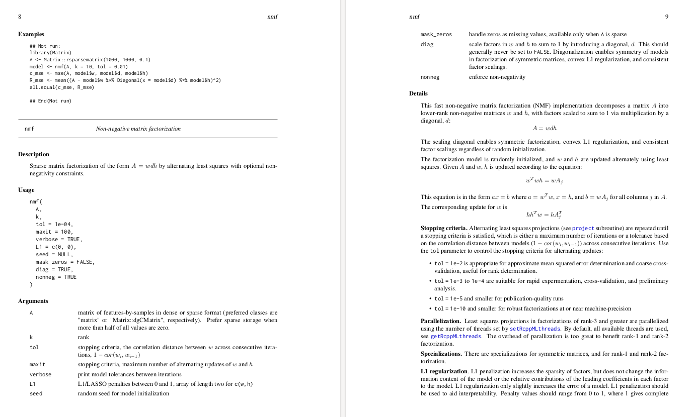

```{r setup, include=FALSE}
fig.dim <- 4
knitr::opts_chunk$set(fig.width=2*fig.dim,
                      fig.height=fig.dim,
                      fig.align='center')
set.seed(24)
library(lars)
library(tidyverse)
library(rstan)
library(matrixStats)
rstan_options(auto_write = TRUE)
options(mc.cores = parallel::detectCores())
```


# Visualizing expression space

## A conceptual model

Let's build a *conceptual* model for
descriptive analysis of "mixture" expression data.

. . .

**Data:** expression data from tissue samples
that consist of various *mixtures* of different cell types.

. . .

**Goal:** identify shared coexpression patterns
corresponding to *cell type*.

. . .

*Similar situations:* 
identify different developmental stages from whole-organism expression;
common community structures from metagenomic data.

----------------


1. Each cell type has a typical set of *mean* expression levels.

2. Each sample is composed of a mixture of cell types,
   defined by the proportions that come from each type.


------------------

::: {.columns}
:::::::::::::: {.column width=50%}


1. Mean expression by cell type.

2. Cell type proportions by sample.


:::
:::::::::::::: {.column width=50%}


1. $x_{kj}$ : Mean expression of gene $j$ in cell type $k$.

2. $w_{ik}$ : Proportion of sample $i$ of cell type $k$.

$Z_{ij}$ : expression level in sample $i$ of gene $j$.

   $$\begin{aligned}
        Z_{ij} \approx \sum_{k=1}^K w_{ik} x_{kj} .
   \end{aligned}$$


:::
:::::::::::::: 


# Nonnegative matrix factorization

## ... aka "NMF"


We are *decomposing* $Z$ into the product of two lower-dimensional,
nonnegative factors:

$$\begin{aligned}
    Z_{ij} &\approx \sum_k w_{ik} x_{kj} \\
    w_{ik} &\ge 0 \\
    x_{kj} &\ge 0 .
\end{aligned}$$

## A simple NMF model

```
simple_nmf <- stan_model(model_code="
data {
    int N; // samples
    int L; // variables
    int K; // factors
    real Z[L,N];
}
parameters {
    matrix<lower=0>[L,K] x;
    matrix<lower=0>[K,N] w;
    real<lower=0> sigma;
}
model {
    for (j in 1:L) {
        Z[j] ~ normal(x[j] * w, sigma);
    }
}
")
```

## Relationship to PCA

PCA finds $w$ and $z$ to minimize
$$\begin{aligned}
    \sum_{ij} \| Z_{ij} - \sum_k w_{ik} x_{kj} \|^2 .
\end{aligned}$$

In other words, it is the maximum-likelihood solution to
$$\begin{aligned}
    Z_{ij} &\sim \Normal(\sum_k w_{ik} x_{kj}, \sigma^2) .
\end{aligned}$$
(The eigenvectors are the columns of $x$,
and the eigenvectors are related to the size of $w$ and $x$.)

## PCA, in Stan

```
stan_pca <- stan_model(model_code="
data {
    int N; // samples
    int L; // variables
    int K; // factors
    real Z[L,N];
}
parameters {
    matrix[L,K] x;
    matrix[K,N] w;
    real<lower=0> sigma;
}
model {
    for (j in 1:L) {
        Z[j] ~ normal(x[j] * w, sigma);
    }
}
")
```
*(note: needs some priors to work well; see [here](https://arxiv.org/abs/1603.00788).)*


# Stochastic minute

## the Dirichlet distribution

A random set of $k$ *proportions* $0 \le P_i \le 1$
has a $\Dirichlet(\alpha_1, \ldots, \alpha_k)$ if it has probability density
$$\begin{aligned}
    \frac{1}{B(\alpha)} \prod_{i=1}^k p_i^{\alpha_i} 
\end{aligned}$$
over the set of possible values
$$\begin{aligned}
    P_1 + \cdots + P_k = 1 .
\end{aligned}$$

. . .

1. This is useful as a prior on *proportions*.

2. The *mean* is
   $$ \left( \frac{\alpha_1}{\sum_j \alpha_j}, \frac{\alpha_2}{\sum_j \alpha_j}, \cdots, \frac{\alpha_k}{\sum_j \alpha_j} \right) . $$

3. This generalizes the Beta: if $X \sim \Beta(a, b)$ then $(X, 1-X) \sim \Dirichlet(a, b)$.

-----------------

4. Marginal distributions are Beta distributed: $P_i \sim \Beta(\alpha_i, \sum_{j=1}^k \alpha_j - \alpha_i)$.

5. If $X_i \sim \Gam(\text{shape}=\alpha_i)$, and
   $$\begin{aligned}
    P_i = X_i / \sum_{j=1}^k X_j
   \end{aligned}$$
   then $P \sim \Dirichlet(\alpha)$.

## "Simplex" parameters

"The $k$-simplex" is the set of *proportions*,
i.e., nonnegative numbers $p$ satisfying
$$\begin{aligned}
    p_1 + \cdots p_k = 1 .
\end{aligned}$$

```
parameters {
    simplex[K] p;
}
model {
    p ~ dirichlet(alpha);
}
```

## Exercise

1. Simulate 10,000 samples from the $\Dirichlet(20, 10, 3)$ distribution.
   (This should be a 10,000 x 3 matrix.)
2. Confirm that rows sum to 1.
3. Confirm that columns have the correct means.
4. Plot the result (the pairwise plots, or in 3D).
5. Do the same for $\alpha = (0.2, 0.1, 0.03)$.

## IN CLASS

```{r in_class}
# 1. Simulate 10,000 samples from the Dirichlet(20, 10, 3)
#   distribution. (This should be a 10,000 x 3 matrix.)

alpha <- c(20, 10, 3)
P <- matrix(NA, nrow=10000, ncol=length(alpha))
for (i in 1:nrow(P)) {
    X <- rgamma(3, shape=alpha)
    P[i,] <- X / sum(X)
}
    
# Confirm that rows sum to 1.

stopifnot(all(
    abs(rowSums(P) - 1) < 1e-15
))

# Confirm that columns have the correct means.

true_means <- alpha / sum(alpha)
rbind(true_means, colMeans(P))

# Plot the result (the pairwise plots, or in 3D).

pairs(P, pch=20, cex=0.25, col=adjustcolor("black", 0.1))
```


# Back to expression space

----------------


1. Each cell type has a typical set of *mean* expression levels.

2. Each sample is composed of a mixture of cell types,
   defined by the proportions that come from each type.

3. Mean expression levels differ between cell types
   for only some of the genes.


------------------

::: {.columns}
:::::::::::::: {.column width=50%}


1. Mean expression by cell type.

2. Cell type proportions by sample.


:::
:::::::::::::: {.column width=50%}


1. $x_{kj}$ : Mean expression of gene $j$ in cell type $k$.

2. $w_{ik}$ : Proportion of sample $i$ of cell type $k$.

$Z_{ij}$ : expression in sample $i$ of gene $j$.

   $$\begin{aligned}
        Z_{ij} \approx \sum_{k=1}^K w_{ik} x_{kj} .
   \end{aligned}$$


:::
:::::::::::::: 

------------------

::: {.columns}
:::::::::::::: {.column width=50%}


1. Mean expression by cell type.

2. Cell type proportions by sample.

3. Mean expression levels differ between cell types
   for only some of the genes.

:::
:::::::::::::: {.column width=50%}


$Z_{ij}$ : expression level in sample $i$ of gene $j$.

   $$\begin{aligned}
        Z_{ij} \approx \sum_{k=1}^K w_{ik} x_{kj} .
   \end{aligned}$$

3. $\bar x_j$, $\eta_j$ : mean and SD of expression of gene $j$ across *all* cell types;
   shrink $x_{kj}$ towards $\bar x_j$.

:::
:::::::::::::: 

----------------------

::: {.columns}
:::::::::::::: {.column width=50%}

```
```{r nmf1, echo=FALSE, results="asis", cache=TRUE}
cat(nmf1 <- "data {
  int N; // # samples
  int L; // # genes
  int K; // # cell types
  int Z[N,L];
}")
```
```
```
```{r nmf2, echo=FALSE, results="asis", cache=TRUE}
cat(nmf2 <- "parameters {
  matrix<lower=0>[K,L] x;
  vector<lower=0>[N] y;
  vector<lower=0>[L] x_bar;
  simplex[K] w[N];
  real<lower=0> eta;
  vector<lower=0>[K] alpha;
}")
```
```
```
```{r nmf3, echo=FALSE, results="asis", cache=TRUE}
cat(nmf3 <- "model {
  matrix[N,L] mean_Z;
  for (i in 1:N) {
    for (j in 1:L) {
      mean_Z[i,j] = 0.0;
      for (k in 1:K) {
        mean_Z[i,j] += y[i] * w[i][k] * x[k,j];
      }
    }
    Z[i,] ~ poisson(mean_Z[i,]);
    w[i] ~ dirichlet(alpha);
  }
  for (k in 1:K) 
      { x[k,] ~ normal(x_bar, eta * x_bar); }
  y ~ normal(0, 10);
  alpha ~ exponential(1);
  eta ~ normal(0, 4);
  x_bar ~ gamma(0.5, 0.5e-4);
}")
```
```


:::
:::::::::::::: {.column width=50%}


1. $x_{kj}$ : Mean expression of gene $j$ in cell type $k$.

2. $w_{ik}$ : Proportion of sample $i$ of cell type $k$.

3. $y_{i}$ : Total sequencing depth of sample $i$.

$$\begin{aligned}
    Z_{ij} \approx y_i \sum_k w_{ik} x_{kj} .
\end{aligned}$$

4. $\bar x_j$, $\eta_j$ : mean and SD of expression of gene $j$ across *all* cell types;
   shrink $x_{kj}$ towards $\bar x_j$.


:::
:::::::::::::: 

## Testing: compiles?

```{r model_compiles, echo=-1, cache=TRUE, dependson=c("nmf1", "nmf2", "nmf3")}
nmf_block <- paste(nmf1, nmf2, nmf3, sep='\n')
nmf_model <- stan_model(model_code=nmf_block)
```

## Testing: runs?

```{r test_runs}
sampling(nmf_model,
         data=list(N=10,
                   L=5,
                   K=2,
                   Z=matrix(rpois(50, 100), ncol=5)),
         chains=1, iter=100)
```

# Simulate data

## Overall plan:

1. Choose mean expression levels per gene from a Gamma distribution.
2. For each cell type, set expression levels to the mean, but for some of the genes,
   multiply this by a random number in $[0, 2]$.
3. Choose sample-specific cell type proportions from a Dirichlet distribution.
4. Choose total expression per sample from a Normal.
5. Simulate per-sample and per-gene expression as Poisson with mean computed from the above.

## Questions:

1. How many cell types?

2. How many genes?

3. How many samples?

4. How much noise in expression?

5. How many genes distinguish cell types,
   and by how much relative to expression?

6. How much variation in mixture proportions?

7. How much variation in total coverage?

## Simulation: easy case

Expression parameters:
```{r simit, cache=TRUE}
num_cell_types <- 5
num_genes <- 500
num_samples <- 100

mean_total_expression <- 50e6
sd_total_expression <- 5e6
num_diff_genes <- 180

gene_names <- paste0("gene_", apply(matrix(sample(letters, 5*num_genes, replace=TRUE), nrow=num_genes), 1, paste, collapse=''))
stopifnot(length(unique(gene_names)) == num_genes)
```

##

Mean expression profiles by cell type:

- have `num_diff_genes` genes specific to each cell type
- and each of these differing genes will have some randomly chosen expression level

```{r simit2, cache=TRUE, dependson="simit"}
# x[k,j] is mean expression of gene j in cell type k.
x <- matrix(0, nrow=num_cell_types, ncol=num_genes)
colnames(x) <- gene_names
# vector of typical expression levels across *all* cell types
x_mean <- rgamma(num_genes, shape=0.5, scale=20000)
# which genes are differentially expressed in which cell type
for (k in 1:num_cell_types) {
    diffex <- sample.int(num_genes, num_diff_genes)
    x[k,] <- x_mean
    x[k,diffex] <- x[k,diffex] * 3 * runif(length(diffex))
}
```

## Gene expression profiles

```{r simit3, fig.width=3*fig.dim, fig.height=1.5*fig.dim, echo=FALSE}
x_ord <- order(apply(x, 2, which.max), colMaxs(x))
matplot(t(x[,x_ord]), type='l', xlab='gene', ylab='mean expression')
```

## Gene expression profiles

```{r simit4, fig.width=3*fig.dim, fig.height=2.0*fig.dim, echo=FALSE}
layout(1:5)
par(mar=c(0,4,0,0))
for (k in 1:5) plot(x[k,x_ord], type='l', col=k)
```

## Cell type proportions

Use gammas with *shapes* a vector of low integers;
normalize to get Dirichlet.
```{r simit5, cache=TRUE, dependson="simit2"}
# w[i,k] is proportion of sample i of cell type k.
w <- matrix(0, nrow=num_samples, ncol=num_cell_types)
for (i in 1:num_samples) {
    dirich <- rgamma(num_cell_types, rep(0.3, num_cell_types))
    w[i,] <- dirich/sum(dirich)
}
stopifnot(all(abs(rowSums(w) - 1) < 1e-14))
```

## Cell type proportions

```{r simit6, fig.width=3*fig.dim, fig.height=1.8*fig.dim}
pairs(w, xlim=c(0,1), ylim=c(0,1))
```

## Total expression per sample

```{r simit7, cache=TRUE, dependson="simit5"}
# y[i] is total reads for sample i
y <- rnorm(num_samples, mean=mean_total_expression, sd=sd_total_expression)

hist(y, main='total expression by sample')
```

## Simulate expression

1. scale mean expression based on total expression level
2. matrix multiply mean scaled levels by proportions (x * w)
3. actual expression levels are Poisson (TODO: make overdispersed)

```{r simit8, cache=TRUE, dependson="simit7"}
# Z[i,j] is read counts of sample i for gene j

# this will have mean_Z[i,j] = (sum_k w[i,k] x[k,j])
mean_Z <- (w %*% x)
# but we want total sequencing to be y[i] so...
mean_Z <- y * mean_Z / rowSums(mean_Z)
stopifnot(all(abs(y - rowSums(mean_Z)) < 1e-8))
Z <- rpois(length(mean_Z), lambda=mean_Z)
dim(Z) <- dim(mean_Z)
```
```{r write_Z, include=FALSE}
colnames(Z) <- gene_names
write.csv(Z, file="data/sim_expression.csv", row.names=FALSE)
```


## Visualize normalized expression levels

```{r simit10, fig.width=3*fig.dim, fig.height=1.8*fig.dim}
w_ord <- order(apply(w, 1, which.max), rowMaxs(w)) # order samples by proportion
Znorm <- Z / pmax(100, colMeans(Z)[col(Z)])
Znorm[!is.finite(Znorm)] <- 1
Znorm <- Znorm / rowMeans(Znorm)
image(t(Znorm[w_ord,x_ord]), xlab='gene', ylab='sample')
```

# Exercise

------

Suppose instead that
$Z_{ij}$ is number of individuals of plant species $j$
in a quadrat at spatial location $i$,
sampled in a transect across an environmental transition
(e.g., up the Cascades).

Applying the same method, what are $x_{ik}$ and $w_{kj}$?


# Fit the model

##

```{r fit_sim1, cache=TRUE, dependson=c("simit8", "model_compiles")}
fit_sim1 <- optimizing(nmf_model,
                data=list(N=num_samples,
                          L=num_genes,
                          K=num_cell_types,
                          Z=Z),
                seed=125)
```

## The results!

Here's the correlation matrix between inferred and true cell type proportions, $w$:

```{r results1}
opt_w <- fit_sim1$par[grepl("^w", names(fit_sim1$par))]
dim(opt_w) <- c(num_samples, num_cell_types)
cor(w, opt_w)
```

## HOWever...

```{r fit_sim2, cache=TRUE, dependson=c("simit8", "model_compiles")}
fit_sim2 <- optimizing(nmf_model,
                data=list(N=num_samples,
                          L=num_genes,
                          K=num_cell_types,
                          Z=Z),
                seed=127)
```

## The results, again?

```{r results2}
opt_w <- fit_sim2$par[grepl("^w", names(fit_sim2$par))]
dim(opt_w) <- c(num_samples, num_cell_types)
cor(w, opt_w)
```

## Goodness-of-fit

```{r gof, echo=FALSE, fig.width=3*fig.dim, fig.height=2*fig.dim}
get_pred <- function (fit) {
    x <- fit$par[grepl("^x\\[", names(fit$par))]
    dim(x) <- c(num_cell_types, num_genes)
    w <- fit$par[grepl("^w\\[", names(fit$par))]
    dim(w) <- c(num_samples, num_cell_types)
    y <- fit$par[grepl("^y\\[", names(fit$par))]
    return(y * w %*% x)
}

layout(t(1:3))
p1 <- get_pred(fit_sim1)
plot(as.vector(p1), as.vector(Z), xlab="predicted, fit 1", ylab="Z")
abline(0, 1, col='red', lwd=2)
p2 <- get_pred(fit_sim2)
plot(as.vector(p2), as.vector(Z), xlab="predicted, fit 2", ylab="Z")
abline(0, 1, col='red', lwd=2)
plot(as.vector(mean_Z), as.vector(Z), xlab="simulated mean", ylab="Z")
abline(0, 1, col='red', lwd=2)
```


## What's going on?

```
optimizing                package:rstan                R Documentation

Obtain a point estimate by maximizing the joint posterior

Description:

     Obtain a point estimate by maximizing the joint posterior from the
     model defined by class ‘stanmodel’.

Usage:

     ## S4 method for signature 'stanmodel'
     optimizing(object, data = list(), 
         seed = sample.int(.Machine$integer.max, 1), init = 'random', 
         check_data = TRUE, sample_file = NULL, 
         algorithm = c("LBFGS", "BFGS", "Newton"),
         verbose = FALSE, hessian = FALSE, as_vector = TRUE, 
         draws = 0, constrained = TRUE, importance_resampling = FALSE, ...)   
     
Arguments:

  object: An object of class ‘stanmodel’.

    data: A named ‘list’ or ‘environment’ providing the data for the
          model or a character vector for all the names of objects used
          as data.  See the *Passing data to Stan* section in ‘stan’.

    seed: The seed for random number generation. The default is
          generated from 1 to the maximum integer supported by R on the
          machine. Even if multiple chains are used, only one seed is
          needed, with other chains having seeds derived from that of
          the first chain to avoid dependent samples.  When a seed is
          specified by a number, ‘as.integer’ will be applied to it.
          If ‘as.integer’ produces ‘NA’, the seed is generated
          randomly.  The seed can also be specified as a character
          string of digits, such as ‘"12345"’, which is converted to
          integer.

    init: Initial values specification. See the detailed documentation
          for the ‘init’ argument in ‘stan’ with one exception. If
          specifying inits using a list then only a single named list
          of values should be provided.  For example, to initialize a
          parameter ‘alpha’ to ‘value1’ and ‘beta’ to ‘value2’ you can
          specify ‘list(alpha = value1, beta = value2)’.

```

## MCMC?

Too slow.


# NMF?

## `?nmf in r`

Well, there's the [RcppML package](https://github.com/zdebruine/RcppML)?
```
install.packages('RcppML')
```

---------

It's got great documentation: that's very reasurring!


##

```{r nmf}
library(RcppML)
nmfZ <- nmf(Z, k=5)
```

## 

It works just as well - maybe a bit better?
```{r results}
cor(nmfZ$w, w)
```

# Takeaways

---------

1. There are many possible ways to obtain low-dimensional approximations:
   think about what you want.
2. Often we want to impose conditions to improve *interpretability*.
3. Unfortunately, these often suffer from nonidentifiability.
   (Why? Find $x$ and $y$ to solve $24 = xy$.)
4. With a lot of data and a complex model, MCMC can be way too slow.
5. Optimization of "non-convex" problems can be hard, and require special approaches.
6. Careful documentation is a sign of reliable software.
7. Check your results, with simulation!

