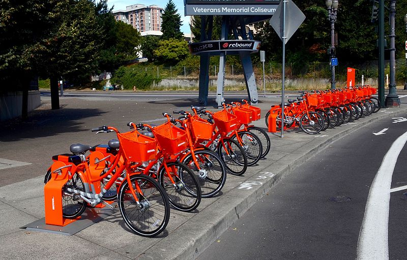

```{r setup, include=FALSE}
fig.dim <- 5
knitr::opts_chunk$set(fig.width=2*fig.dim,
                      fig.height=fig.dim,
                      fig.align='center')
set.seed(23)
library(matrixStats)
```

```{r more_setup, include=FALSE}
library(RColorBrewer)
library(KernSmooth)
library(fields)
library(rgdal)
library(sp)
library(raster)
```

# An example

## Biketown

```
git clone git@github.com:UO-Biostats/datasets.git
```

{width=70%}

::: {.caption}
catmapper: Wikimedia
:::

##



::: {.caption}
Steve Morgan: Wikimedia
:::

##


## August, 2018


```{r biketown, cache=TRUE}
data_dir <- "../../../datasets" 
bt <- read.csv(file.path(data_dir, "biketown/2019_08.csv.gz"), header=TRUE, stringsAsFactors=FALSE)
xylims <- c(-122.75, -122.6, 45.46, 45.56)
bt <- subset(bt, !is.na(Start_Latitude) & Start_Latitude > xylims[3] & Start_Latitude < xylims[4] 
                 & !is.na(End_Latitude) & End_Latitude > xylims[3] & End_Latitude < xylims[4] 
                 & !is.na(Start_Longitude) & Start_Longitude > xylims[1] & Start_Longitude < xylims[2] 
                 & !is.na(End_Longitude) & End_Longitude > xylims[1] & End_Longitude < xylims[2])
nrow(bt)
```

```{r biketown_plot, eval=FALSE}
layout(t(1:2))
plot(Start_Latitude ~ Start_Longitude, data=bt, pch=20, cex=0.5, col=adjustcolor('black', 0.2), xlab='eastings', ylab='northings')
plot(Start_Latitude ~ Start_Longitude, data=bt, type='n', xlab='eastings', ylab='northings')
with(bt, segments(x0=Start_Longitude, y0=Start_Latitude,
                  x1=End_Longitude, y1=End_Latitude, col=adjustcolor("black", 0.05), lwd=0.5))
```

##


```{r biketown_it, cache=TRUE, dependson='biketown', echo=FALSE}
layout(t(1:2))
plot(Start_Latitude ~ Start_Longitude, data=bt, pch=20, cex=0.5, col=adjustcolor('black', 0.2))
plot(Start_Latitude ~ Start_Longitude, data=bt, type='n')
with(bt, segments(x0=Start_Longitude, y0=Start_Latitude, x1=End_Longitude, y1=End_Latitude, col=adjustcolor("black", 0.05), lwd=0.5))
```


## Goals:

Visualize:

1. Starting and ending locations of trips.
2. Net flux of bikes by area (e.g., places where more trips start than end).
3. Distance of trips depending on start and end location.


# Making nice maps

##

See [this tutorial](https://mgimond.github.io/Spatial/index.html) by Manual Gimond.

```{r spstuff}
library(rgdal)
library(sp)
library(raster)
```

## How I got the mapping data

```{r load_maps0, cache=TRUE, warning=FALSE}
crop_extent <- extent(xylims)
river <- readOGR(dsn=file.path(data_dir, "biketown/River_Overlay/"))
bikepaths <- readOGR(dsn=file.path(data_dir, "biketown/bicycle_network/"))
streets <- readOGR(dsn=file.path(data_dir, "biketown/pdx_streets/"))
```

## How I got the mapping data, continued

```{r load_maps, cache=TRUE, dependson="load_maps0"}
bikepaths <- subset(bikepaths, Status == "Active")
streets <- subset(streets, LCITY == "Portland" | RCITY == "Portland")
river <- crop(river, crop_extent)
freeways <- crop(subset(streets, TYPE == 1110), crop_extent)
bigstreets <- crop(subset(streets, TYPE %in% c(1300, 1400)), crop_extent)
rm(streets)
```

## How you can get the mapping data

```{r load_maps_not_really, eval=FALSE}
show(load(file.path(data_dir, "biketown/pdx_features.RData"))) 
## [1] "crop_extent" "river"       "bikepaths"   "freeways"    "bigstreets" 
```

## 

```{r plot_river}
layout(t(1:2))
sp::plot(river, col=adjustcolor('blue', 0.25), main='river')
sp::plot(bikepaths, col=adjustcolor('grey', 0.75), main='bikepaths')
```


##

```{r get_points, cache=TRUE, dependson=c("load_maps", "biketown"), warning=FALSE}
bt_start <- SpatialPointsDataFrame(coords=cbind(bt$Start_Longitude, bt$Start_Latitude),
                                   data=bt, proj4string=CRS("+proj=longlat"))
bt_end <- SpatialPointsDataFrame(coords=cbind(bt$End_Longitude, bt$End_Latitude),
                                   data=bt, proj4string=CRS("+proj=longlat"))
bt_start <- crop(
                 spTransform(bt_start,
                             proj4string(river)),
                 crop_extent)
bt_end <- crop(
               spTransform(bt_end,
                           proj4string(river)),
               crop_extent)
```

## 

**Important:** the "projection" tells R *what the coordinates mean*:

```r
bt_start <- SpatialPointsDataFrame( # make a legit 'spatial' object
    coords=cbind(bt$Start_Longitude, bt$Start_Latitude), # at these coordinates
    data=bt,
    proj4string=CRS("+proj=longlat") # <---- the projection!
)
```

... and the *proj4 string* is the magical incantation that says what the projection is.

##

```{r setup_map, cache=TRUE, echo=-1}
library(sp)
setup_map <- function (..., add=FALSE) {
    plot(bigstreets, col=grey(0.75), add=add, ...)
    lines(freeways, col=adjustcolor('brown', 0.25), lwd=2)
    plot(river, col=adjustcolor('blue', 0.25), add=TRUE)
    lines(bikepaths, col=adjustcolor(grey(0.25), 0.5))
}
```

##

```{r plot_pdx, cache=TRUE, dependson=c("load_maps", "setup_map"), echo=-1}
setup_map <- function (..., add=FALSE) {
    sp::plot(bigstreets, col=grey(0.75), add=add, ...)
    lines(freeways, col=adjustcolor('brown', 0.25), lwd=2)
    sp::plot(river, col=adjustcolor('blue', 0.25), add=TRUE)
    lines(bikepaths, col=adjustcolor(grey(0.25), 0.5))
}
layout(t(1:2))
setup_map(main='starts'); points(bt_start, pch=20, cex=0.5, col='red')
setup_map(main='ends'); points(bt_end, pch=20, cex=0.5, col='blue')
```

# More resources:

##

- CRAN task view: [analysis of spatial data](https://cran.r-project.org/web/views/Spatial.html)

- [Geocomputation with R](https://geocompr.robinlovelace.net/index.html), by Robin Lovelace

- [Intro to GIS and Spatial Analysis](https://mgimond.github.io/Spatial/index.html), by Manual Gimond.
