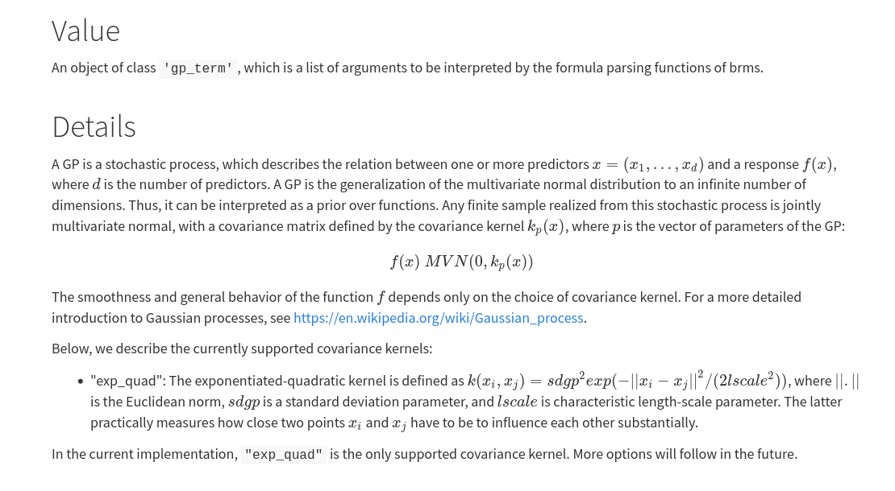

```{r setup, include=FALSE}
fig.dim <- 5
knitr::opts_chunk$set(fig.width=2*fig.dim,
                      fig.height=fig.dim,
                      fig.align='center')
set.seed(23)
library(matrixStats)
library(brms)
library(bayesplot)
options(mc.cores = parallel::detectCores())
options(warnPartialMatchDollar = FALSE)
```


# Spatial models

## A simple scenario

Suppose we have estimates of abundance of a soil microbe
from a number of samples across our study area:

```{r sim_data_plot, echo=FALSE}
library(mvtnorm)
N <- 20
xy <- data.frame(x=runif(N), y=runif(N))
dxy <- as.matrix(dist(xy))
ut <- upper.tri(dxy, diag=TRUE)
truth <- list(rho=.6,
              nugget=.1,
              delta=5,
              mu=5)
truth$covmat <- (truth$nugget * diag(N) 
                 + truth$delta * exp(-(dxy/truth$rho)^2))
xy$z <- as.vector(rmvnorm(1, mean=rep(truth$mu,N), sigma=truth$covmat))
```

```{r show_study, echo=FALSE, fig.width=2.5*fig.dim, fig.height=1.5*fig.dim}
layout(t(1:2))
plot(xy$x, xy$y, xlab='eastings', ylab='northings', pch=21, asp=1,
     cex=xy$z/4,
     bg=colorRampPalette(c('blue', 'red'))(10)[cut(xy$z, breaks=10)],
     main='size, color = abundance', asp=1)
plot(dxy[ut], abs(xy$z[row(dxy)[ut]] - xy$z[col(dxy)[ut]]), asp=1,
     pch=20, cex=0.5,
     xlab='distance apart',
     ylab='|difference in abundance|')

```

## The data

`(x,y)` : spatial coords; `z` : abundance

```{r show_data}
xy
```

----------------------

**Goals:** 

1. (descriptive) What spatial scale does abundance vary over?

2. (predictive) What are the likely (range of) abundances at new locations?

## Exercise:

Let's brainstorm a few examples, listing

1. a spatially autocorrelated variable
2. the spatial scale of autocorrelation


# Spatial covariance

## Tobler's First Law of Geography:

> Everything is related to everything else, but near things are more related than distant things.

. . .

*Modeler:* Great, covariance is a decreasing function of distance.


## A decreasing function of distance.

A convenient choice: the covariance between two points distance $d$ apart is
$$\begin{aligned}
    \alpha^2 \exp\left(- \frac{1}{2}\left(\frac{d}{\rho}\right)^2 \right) .
\end{aligned}$$

- $\alpha$ controls the overall variance (amount of noise)

- $\rho$ is the spatial scale that covariance decays over


## In Stan


## In brms: `~ gp( )`

[](https://paul-buerkner.github.io/brms/reference/gp.html)


------------

Here's an `R` function that takes a set of locations (`xy`),
a variance scaling `alpha`, and a spatial scale `rho`:
```{r cov_exp_quad}
cov_exp_quad <- function (xy, alpha, rho) {
    # return the 'quadratic exponential' covariance matrix
    # for spatial positions xy
    dxy <- as.matrix(dist(xy))
    return( alpha^2 * exp( - (1/2) * dxy^2 / rho^2 ) )
}
```

. . .

**Challenge:** simulate spatially autocorrelated random Gaussian values,
and plot them, in space. Pick parameters so you can tell they are autocorrelated.

. . .

*Hint:* `library(mvtnorm)` and
```r
    # to color points by a continuous value:
    colorRampPalette(c('blue', 'red'))(24)[cut(xy$z, breaks=24)]
```


# Fitting a model

## Goals


1. (descriptive) What spatial scale does abundance vary over?

    $\Rightarrow$ What is $\rho$?

2. (predictive) What are the likely (range of) abundances at new locations?

    $\Rightarrow$ *Predict* at new locations.


## Simulate data


```{r sim_data, cache=TRUE}
N <- 20
xy <- data.frame(x=runif(N), y=runif(N))
dxy <- as.matrix(dist(xy))
ut <- upper.tri(dxy, diag=TRUE)
truth <- list(rho=.6,
              delta=.1,
              alpha=2.5,
              mu=5)
truth$covmat <- (truth$delta * diag(N) 
                 + truth$alpha^2 * exp(-(dxy/truth$rho)^2))
xy$z <- as.vector(rmvnorm(1, mean=rep(truth$mu,N), sigma=truth$covmat))
```

## Pick priors?

Default looks okay:
```{r the_params, warning=FALSE}
get_prior(z ~ gp(x, y), data=xy)
```

## Fit the model

```{r run_new_sp, cache=TRUE, dependson=c("sim_data")}
sp_fit <- brm(
    z ~ gp(x, y),
    data=xy,
    file="cache/sp_fit.rds"
)
```

## Convergence issues

```
6: There were 114 divergent transitions after warmup. See
http://mc-stan.org/misc/warnings.html#divergent-transitions-after-warmup
to find out why this is a problem and how to eliminate them. 
```

```{r plot_conv}
mcmc_pairs(sp_fit, pars=c("lscale_gpxy", "sigma", "lp__"), np=nuts_params(sp_fit))

```

## Try again

```{r run_new_sp2, cache=TRUE, dependson=c("sim_data")}
sp_fit <- brm(
    z ~ gp(x, y),
    data=xy,
    file="cache/sp_fit2.rds",
    control=list(adapt_delta=0.95)
)
```


-----------

```{r show_sp_fit}
sp_fit
```

## Does it work?

```{r show_sp_results, warning=FALSE, echo=FALSE, message=FALSE, error=FALSE}
sp_sum <- summary(sp_fit)
out <- as.data.frame(cbind(truth=truth[c("alpha", "rho", "delta", "mu")]))
for (vn in c("Estimate", "l-95% CI", "u-95% CI")) {
    out[[vn]] <- 
      c(
           alpha=sp_sum$gp["sdgp(gpxy)", vn],
           rho=sp_sum$gp["lscale(gpxy)", vn],
           delta=sp_sum$spec_pars["sigma", vn],
           mu=sp_sum$fixed["Intercept", vn]
      )
}
out
```

----------------


```{r plot_pts_interp, cache=TRUE, dependson="run_new_sp2", echo=FALSE, fig.height=2*fig.dim}
new_xy = data.frame(x = runif(10), y=runif(10))
new_z <- predict(sp_fit, newdata=new_xy)
plot(c(xy$x, new_xy[,1]), c(xy$y, new_xy[,2]), xlab='x spatial coord', 
     ylab='y spatial coord', pch=20, 
     cex=as.numeric(cut(c(xy$z,new_z[,"Estimate"]), breaks=0:10)),
     col=colorRampPalette(c('blue', 'red'))(11)[cut(c(xy$z,new_z[,"Estimate"]), breaks=0:10)])
points(new_xy[,1], new_xy[,2], cex=8)
legend("topright", pch=1, pt.cex=8,
       legend="interpolated points")
```

## Conclusions


1. (descriptive) What spatial scale does abundance vary over?

    Values are correlated over distances of order
    $\rho=`r round(sp_sum$gp["sdgp(gpxy)","Estimate"],2)`$
    units of distance
    (95% CI of `r round(sp_sum$gp["sdgp(gpxy)","u-95% CI"],2)`
    to `r round(sp_sum$gp["sdgp(gpxy)","u-95% CI"], 2)`).

2. (predictive) What are the likely (range of) abundances at new locations?

    These are
```{r new_z_summary, echo=FALSE}
cbind(new_xy, new_z)
```

## Interpolating to a grid


```{r ineterp, cache=TRUE, dependson="run_new_sp2"}
grid_xy <- expand.grid(x=seq(0,1,length.out=11), y=seq(0,1,length.out=11))
grid_pred <- predict(sp_fit, newdata=grid_xy)
```

---------

```{r plot_interp, fig.width=2*fig.dim, fig.height=2*fig.dim, echo=FALSE}
grid_z <- grid_pred[,"Estimate"]
plot(c(xy$x,grid_xy[,1]), c(xy$y,grid_xy[,2]), xlab='x spatial coord', 
     ylab='y spatial coord', pch=20, asp=1,
     cex=as.numeric(cut(c(xy$z,grid_z), breaks=0:10)),
     col=colorRampPalette(c('blue', 'red'))(11)[cut(c(xy$z,grid_z), breaks=0:10)])
```

