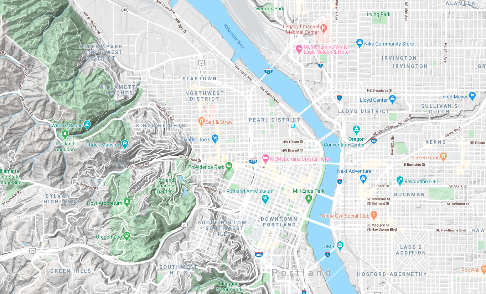

```{r setup, include=FALSE}
fig.dim <- 5
knitr::opts_chunk$set(fig.width=2*fig.dim,
                      fig.height=fig.dim,
                      fig.align='center')
set.seed(23)
library(rstan)
library(matrixStats)
rstan_options(auto_write = TRUE)
options(mc.cores = parallel::detectCores())
```

```{r more_setup, include=FALSE}
library(RColorBrewer)
library(KernSmooth)
library(fields)
library(rgdal)
library(sp)
library(raster)
```

# An example

## Biketown

```
git clone git@github.com:UO-Biostats/datasets.git
```

{width=70%}

::: {.caption}
catmapper: Wikimedia
:::

##


::: {.caption}
Steve Morgan: Wikimedia
:::

##


## August, 2018


```{r biketown, cache=TRUE}
data_dir <- "../../../datasets" 
bt <- read.csv(file.path(data_dir, "biketown/2019_08.csv.gz"), header=TRUE, stringsAsFactors=FALSE)
xylims <- c(-122.75, -122.6, 45.46, 45.56)
bt <- subset(bt, !is.na(Start_Latitude) & Start_Latitude > xylims[3] & Start_Latitude < xylims[4] 
                 & !is.na(End_Latitude) & End_Latitude > xylims[3] & End_Latitude < xylims[4] 
                 & !is.na(Start_Longitude) & Start_Longitude > xylims[1] & Start_Longitude < xylims[2] 
                 & !is.na(End_Longitude) & End_Longitude > xylims[1] & End_Longitude < xylims[2])
nrow(bt)
```

```{r biketown_plot, eval=FALSE}
layout(t(1:2))
plot(Start_Latitude ~ Start_Longitude, data=bt, pch=20, cex=0.5, col=adjustcolor('black', 0.2), xlab='eastings', ylab='northings')
plot(Start_Latitude ~ Start_Longitude, data=bt, type='n', xlab='eastings', ylab='northings')
with(bt, segments(x0=Start_Longitude, y0=Start_Latitude,
                  x1=End_Longitude, y1=End_Latitude, col=adjustcolor("black", 0.05), lwd=0.5))
```

##


```{r biketown_it, cache=TRUE, dependson='biketown', echo=FALSE}
layout(t(1:2))
plot(Start_Latitude ~ Start_Longitude, data=bt, pch=20, cex=0.5, col=adjustcolor('black', 0.2))
plot(Start_Latitude ~ Start_Longitude, data=bt, type='n')
with(bt, segments(x0=Start_Longitude, y0=Start_Latitude, x1=End_Longitude, y1=End_Latitude, col=adjustcolor("black", 0.05), lwd=0.5))
```


## Goals:

Visualize:

1. Starting and ending locations of trips.
2. Net flux of bikes by area (e.g., places where more trips start than end).
3. Distance of trips depending on start and end location.


# Making nice maps

##

See [this tutorial](https://mgimond.github.io/Spatial/reading-and-writing-spatial-data-in-r.html) by Manual Gimond.

```{r spstuff}
library(rgdal)
library(sp)
library(raster)
```

## How I got the mapping data

```{r load_maps0, cache=TRUE, warning=FALSE}
crop_extent <- extent(xylims)
river <- readOGR(dsn=file.path(data_dir, "biketown/River_Overlay/"))
bikepaths <- readOGR(dsn=file.path(data_dir, "biketown/bicycle_network/"))
streets <- readOGR(dsn=file.path(data_dir, "biketown/pdx_streets/"))
```

## How I got the mapping data, continued

```{r load_maps, cache=TRUE, dependson="load_maps0"}
bikepaths <- subset(bikepaths, Status == "Active")
streets <- subset(streets, LCITY == "Portland" | RCITY == "Portland")
river <- crop(river, crop_extent)
freeways <- crop(subset(streets, TYPE == 1110), crop_extent)
bigstreets <- crop(subset(streets, TYPE %in% c(1300, 1400)), crop_extent)
rm(streets)
```

## How you can get the mapping data

```{r load_maps_not_really, eval=FALSE}
show(load(file.path(data_dir, "biketown/pdx_features.RData"))) 
## [1] "crop_extent" "river"       "bikepaths"   "freeways"    "bigstreets" 
```

## 

```{r plot_river}
layout(t(1:2))
plot(river, col=adjustcolor('blue', 0.25), main='river')
plot(bikepaths, col=adjustcolor('grey', 0.75), main='bikepaths')
```


##

```{r get_points, cache=TRUE, dependson=c("load_maps", "biketown")}
bt_start <- SpatialPointsDataFrame(coords=cbind(bt$Start_Longitude, bt$Start_Latitude),
                                   data=bt, proj4string=CRS("+proj=longlat"))
bt_end <- SpatialPointsDataFrame(coords=cbind(bt$End_Longitude, bt$End_Latitude),
                                   data=bt, proj4string=CRS("+proj=longlat"))
bt_start <- crop(
                 spTransform(bt_start,
                             proj4string(river)),
                 crop_extent)
bt_end <- crop(
               spTransform(bt_end,
                           proj4string(river)),
               crop_extent)
```

##

```{r setup_map}
setup_map <- function (..., add=FALSE) {
    plot(bigstreets, col=grey(0.75), add=add, ...)
    lines(freeways, col=adjustcolor('brown', 0.25), lwd=2)
    plot(river, col=adjustcolor('blue', 0.25), add=TRUE)
    lines(bikepaths, col=adjustcolor(grey(0.25), 0.5))
}
```

##

```{r plot_pdx, cache=TRUE, dependson="load_maps"}
layout(t(1:2))
setup_map(main='starts'); points(bt_start, pch=20, cex=0.5, col='red')
setup_map(main='ends'); points(bt_end, pch=20, cex=0.5, col='blue')
```

# Spatial density estimation

## Kernel density estimation

::: {.columns}
::::::: {.column width=60%}

Suppose we have a bunch of points

$$ (x_1, y_1), \ldots, (x_n, y_n) $$

with density $f(x,y)$, i.e.,

$$
f(x,y) \approx \frac{\#(\text{of points within $r$ of $(x,y)$})}{\pi r^2}
$$

Now using

$$
\rho_\sigma(x,y) = \frac{1}{2\pi\sigma^2} e^{-\frac{x^2+y^2}{2\sigma^2}} 
$$

:::
::::::: {.column width=40%}

we can estimate $f(x,y)$ by

$$
\hat f(x,y) = \sum_{i=1}^n \rho_\sigma(x_i-x, y_i-y) .
$$

:::
:::::::

## The two choices of kernel density estimation


1. The **kernel**, $\rho()$.

   (we used a Gaussian)

2. The **bandwidth**, $\sigma$.


## Your turn

1. Simulate 200 spatial locations with a density having two "bumps".
   Plot these points.
    (`rnorm(n, mean=-3), rnorm(n, mean=+3)`)

2. Make a $20 \times 20$ grid of "reference" locations.
    (`expand.grid( )`)

3. Compute the kernel density estimate for each location,
   with $\sigma$ chosen appropriately, and plot it.


# Bike trip density estimation

## `bkde2D`

```{r do_ks}
grid_n <- 301
start_smooth <- bkde2D(bt_start@coords, bandwidth=0.004, gridsize=c(grid_n, grid_n))
str(start_smooth)
```

## Plotting surfaces, method 1

`image( )` and `contour( )`

```{r plot_surface1, eval=FALSE}
image(x=start_smooth$x1, y=start_smooth$x2, z=matrix(start_smooth$fhat, nrow=grid_n, ncol=grid_n), xlab='eastings', ylab='northings')
contour(x=start_smooth$x1, y=start_smooth$x2, z=matrix(start_smooth$fhat, nrow=grid_n, ncol=grid_n), add=TRUE)
```

##

```{r plot_surface1x, fig.height=2*fig.dim, echo=FALSE}
image(x=start_smooth$x1, y=start_smooth$x2, z=matrix(start_smooth$fhat, nrow=grid_n, ncol=grid_n), xlab='eastings', ylab='northings')
contour(x=start_smooth$x1, y=start_smooth$x2, z=matrix(start_smooth$fhat, nrow=grid_n, ncol=grid_n), add=TRUE)
```


## Plotting surfaces, method 2

```{r plot_surface2, fig.height=2*fig.dim, eval=FALSE}
smooth_df <- as.data.frame(expand.grid(x=start_smooth$x1, y=start_smooth$x2))
smooth_df$z <- as.vector(start_smooth$fhat)
raster_smooth <- rasterFromXYZ(smooth_df)

plot(raster_smooth)
setup_map(add=TRUE)
```

##

```{r plot_surface2x, fig.height=2*fig.dim, echo=FALSE, warning=FALSE}
the_palette <- c(NA, rev(heat.colors(50, alpha=0.75)))
smooth_df <- as.data.frame(expand.grid(x=start_smooth$x1, y=start_smooth$x2))
smooth_df$z <- as.vector(start_smooth$fhat)
raster_smooth <- rasterFromXYZ(smooth_df)

plot(raster_smooth, col=the_palette)
setup_map(add=TRUE)
contour(raster_smooth, add=TRUE)
```

# Choosing a bandwidth

## The bandwidth is important

```{r kernsmooth, cache=TRUE, echo=FALSE, fig.height=2*fig.dim, fig.width=3*fig.dim}
bw_list <- c(0.001, 0.003, 0.009, 0.015, 0.02, 0.1)
layout(matrix(1:6, nrow=2, byrow=TRUE))
for (bw in bw_list) {
    start_smooth <- bkde2D(bt_start@coords, bandwidth=bw, gridsize=c(grid_n, grid_n))

    image(x=start_smooth$x1, y=start_smooth$x2, z=matrix(start_smooth$fhat, nrow=grid_n, ncol=grid_n),
    main=sprintf("bandwidth = %0.03f", bw))
    contour(x=start_smooth$x1, y=start_smooth$x2, z=matrix(start_smooth$fhat, nrow=grid_n, ncol=grid_n), add=TRUE)
}
```

## How to pick a bandwidth?

There are various automatic methods.

. . .

But... crossvalidation!

. . .

For each bandwidth:

1. Fit using most of the data,
2. and predict the remaining data.
3. Do this a bunch and return an estimate of goodness-of-fit.

. . .

... but wait, what's this mean, here?

## Revised:

For each bandwidth:

1. Fit the smooth using most of the data,
2. and predict the density at the locations of the remaining data,
3. as well as the density at uniformly sampled "background" points.
4. Return the mean density at "true" points minus the mean density at "background" points.


## On example data

```{r do_it}
n <- 400
xy <- cbind(rnorm(n, mean=rep(c(-3,3), times=c(n/2,n/2))), rnorm(n))
xygrid <- expand.grid(x=seq(-5,5,length.out=40),
                      y=seq(-5,5,length.out=40))
xy_fhat <- rep(NA, nrow(xygrid))
sigma <- 0.25
for (k in 1:nrow(xygrid)) {
    xy_fhat[k] <- sum( exp(-( (xy[,1] - xygrid[k,1])^2 + (xy[,2] - xygrid[k,2])^2 )/(2*sigma^2) ) / (2 * pi * sigma^2 ) )
}
plot(xy, asp=1)
points(xygrid[,1], xygrid[,2], cex=xy_fhat/6)
```

## Prediction, by linear interpolation

```{r xval_fnA, cache=TRUE}
the_xval <- function (bw, points, ntest, grid_n=301) {
    background <- cbind(x=runif(ntest, min=-5.5, max=5.5),
                        y=runif(ntest, min=-2.3, 2.3))
    use_these <- sample(rep(c(TRUE, FALSE), times=c(nrow(xy)-ntest, ntest)))
    smooth <- bkde2D(xy[use_these,], bandwidth=bw, gridsize=c(grid_n, grid_n))
    names(smooth) <- c("x", "y", "z")
    pred_yes <- interp.surface(smooth, loc=xy[!use_these,])
    pred_no <- interp.surface(smooth, loc=background)
    return(c(mean(pred_yes, na.rm=TRUE), mean(pred_no, na.rm=TRUE)))
}
```

##

```{r do_xvalA, cache=TRUE, dependson='xval_fnA'}
the_scores <- data.frame(bw = rep(seq(0.1, 1.0, length.out=12), each=20),
                          pred_yes = NA,
                          pred_no = NA)
for (k in 1:nrow(the_scores)) {
    pred <- the_xval(bw=the_scores$bw[k], points=bt_start, ntest=100)
    the_scores$pred_yes[k] <- pred[1]
    the_scores$pred_no[k] <- pred[2]
}
```

## The results

```{r plot_xvalA}
layout(t(1:2))
plot(pred_yes ~ bw, data=the_scores, col='red', ylim=c(0, max(pred_yes, na.rm=TRUE)))
points(pred_no ~ bw, data=the_scores, col='blue')
legend("topright", pch=1, col=c("red", "blue"), legend=c("points", "background"))
plot(pred_yes - pred_no ~ bw, data=the_scores, pch=20,
     xlab='bandwidth', ylab='mean density minus background')
lines(lowess(the_scores$bw, the_scores$pred_yes - the_scores$pred_no), lwd=2, col='red')
```


## Prediction, on bicycle data

```{r one_xval}
bw <- 0.004
xy <- bt_start@coords
ntest <- 100
background <- cbind(x=runif(ntest, min=extent(bt_start@coords)@xmin, max=extent(bt_start@coords)@xmax),
                    y=runif(ntest, min=extent(bt_start@coords)@ymin, max=extent(bt_start@coords)@ymax))
use_these <- sample(rep(c(TRUE, FALSE), times=c(nrow(xy)-ntest, ntest)))
smooth <- bkde2D(xy[use_these,], bandwidth=bw, gridsize=c(grid_n, grid_n))
names(smooth) <- c("x", "y", "z")
pred_yes <- fields::interp.surface(smooth, loc=xy[!use_these,])
pred_no <- fields::interp.surface(smooth, loc=background)
boxplot(list(yes=pred_yes, no=pred_no))
```

##

```{r xval_fn, cache=TRUE}
density_xval <- function (bw, points, ntest, grid_n=301) {
    xy <- points@coords
    background <- cbind(x=runif(ntest, min=extent(points@coords)@xmin, max=extent(points@coords)@xmax),
                        y=runif(ntest, min=extent(points@coords)@ymin, max=extent(points@coords)@ymax))
    use_these <- sample(rep(c(TRUE, FALSE), times=c(nrow(xy)-ntest, ntest)))
    smooth <- bkde2D(xy[use_these,], bandwidth=bw, gridsize=c(grid_n, grid_n))
    names(smooth) <- c("x", "y", "z")
    pred_yes <- interp.surface(smooth, loc=xy[!use_these,])
    pred_no <- interp.surface(smooth, loc=background)
    return(c(mean(pred_yes), mean(pred_no)))
}
```

##

```{r do_xval, cache=TRUE, dependson='xval_fn'}
xval_scores <- data.frame(bw = rep(bw_list[1:5], each=20),
                          pred_yes = NA,
                          pred_no = NA)
for (k in 1:nrow(xval_scores)) {
    pred <- density_xval(bw=xval_scores$bw[k], points=bt_start, ntest=100)
    xval_scores$pred_yes[k] <- pred[1]
    xval_scores$pred_no[k] <- pred[2]
}

plot(pred_yes ~ bw, data=xval_scores, col='red', ylim=c(0, max(pred_yes)))
points(pred_no ~ bw, data=xval_scores, col='blue')
legend("topright", pch=1, col=c("red", "blue"), legend=c("points", "background"))
```


# Bicycle migration

##

```{r plot_surface2y, fig.height=1.5*fig.dim, fig.width=3*fig.dim, echo=FALSE, warning=FALSE}
range.x <- list(range(bt_start@coords[,1], bt_end@coords[,1]), range(bt_start@coords[,2], bt_end@coords[,2]))
start_smooth <- bkde2D(bt_start@coords, bandwidth=0.002, gridsize=c(grid_n, grid_n), range.x=range.x)
end_smooth <- bkde2D(bt_end@coords, bandwidth=0.002, gridsize=c(grid_n, grid_n), range.x=range.x)
start_df <- as.data.frame(expand.grid(x=start_smooth$x1, y=start_smooth$x2))
start_df$z <- as.vector(start_smooth$fhat)
start_raster <- rasterFromXYZ(start_df)
end_df <- as.data.frame(expand.grid(x=end_smooth$x1, y=end_smooth$x2))
end_df$z <- as.vector(end_smooth$fhat)
end_raster <- rasterFromXYZ(end_df)

layout(t(1:2))
plot(start_raster, col=the_palette, main='start')
setup_map(add=TRUE)
contour(start_raster, add=TRUE)
plot(end_raster, col=the_palette, main='end')
setup_map(add=TRUE)
contour(end_raster, add=TRUE)
```

## Start minus end

```{r plot_diff, fig.width=2*fig.dim, fig.height=1.5*fig.dim, echo=FALSE}
diff_palette <- c(NA, rev(hcl.colors(50, alpha=0.75)))
plot(start_raster - end_raster, col=diff_palette, main='start - end')
setup_map(add=TRUE)
```

## Start minus end

```{r plot_diff2, fig.width=2*fig.dim, fig.height=1.5*fig.dim, echo=FALSE}
diff_palette <- c(NA, rev(hcl.colors(50, alpha=0.75)))
plot(start_raster - end_raster, col=diff_palette, main='start - end', 
     xlim=c(-122.735, -122.635), ylim=c(45.5, 45.55))
setup_map(add=TRUE)
```


##




# Kernel smoothing

## What is mean local trip length?


```{r duration}
bt$Duration <- as.numeric(as.difftime(bt$Duration, format="%X"))
hist(as.numeric(bt$Duration), breaks=200, xlab='ride durations in minutes')
```

## Our old friend, loess

```{r duration_loess, cache=TRUE}
lo_dur <- loess(Duration ~ Start_Latitude * Start_Longitude, data=bt, span=0.1)
pred_lats <- seq(min(bt$Start_Latitude), max(bt$Start_Latitude), length.out=101)
pred_lons <- seq(min(bt$Start_Longitude), max(bt$Start_Longitude), length.out=101)
pred_locs <- expand.grid(Start_Latitude=pred_lats,
                         Start_Longitude=pred_lons)
pred_duration <- predict(lo_dur, newdata=pred_locs)
```

## ... loess!?!?!

```{r plot_loess}
image(pred_lons, pred_lats, pred_duration)
contour(pred_lons, pred_lats, pred_duration, add=TRUE)
```

##

1. Why?

2. Suggest another method.


## Another method: [Kriging](https://en.wikipedia.org/wiki/Kriging)

```{r kriging, cache=TRUE}
krig_dur <- fields::Krig(x=cbind(bt$Start_Latitude, bt$Start_Longitude), Y=bt$Duration)
pred_krig <- matrix(predict(krig_dur, x=pred_locs), nrow=length(pred_lats))
image(pred_lons, pred_lats, pred_krig)
contour(pred_lons, pred_lats, pred_krig, add=TRUE)
```

