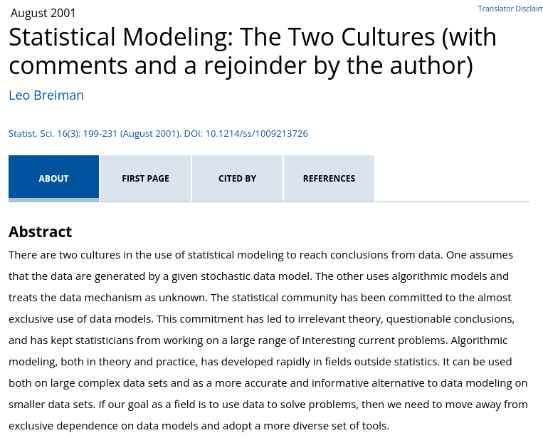
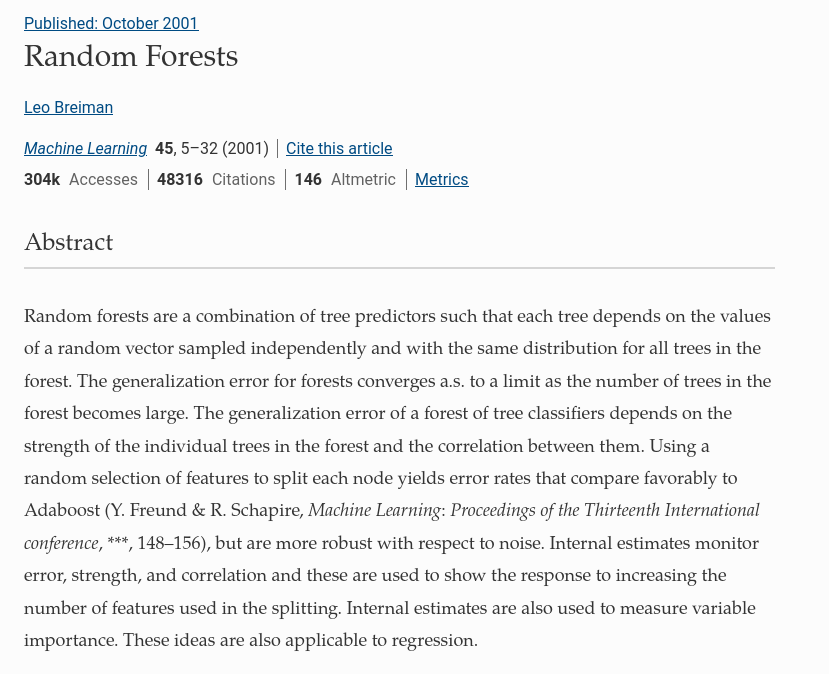
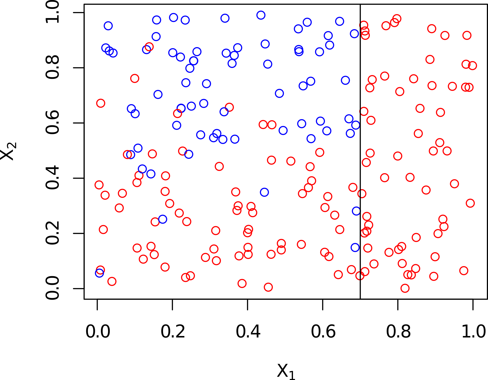
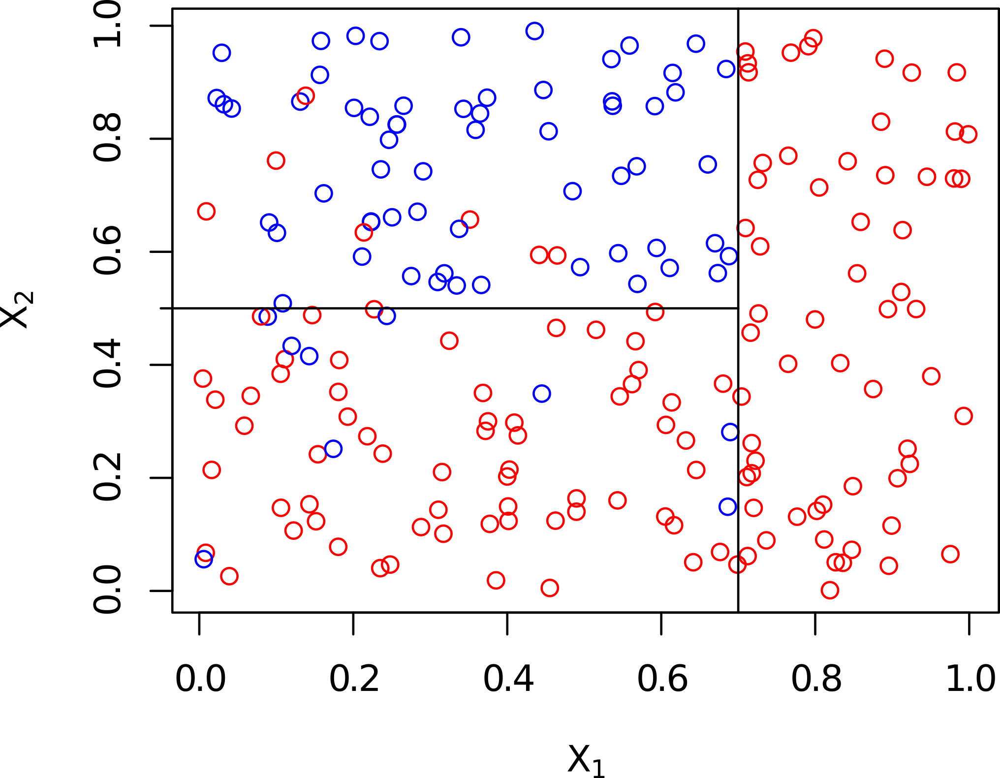
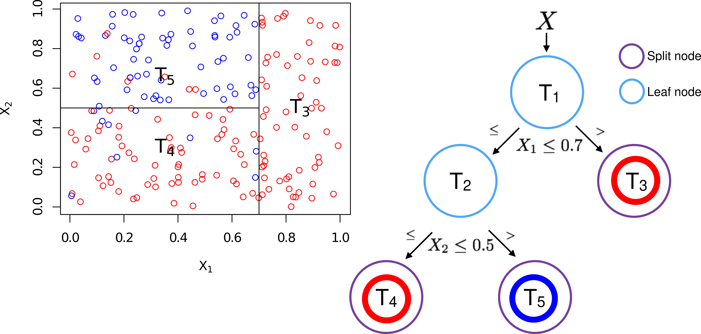

```{r setup, include=FALSE}
fig.dim <- 5
knitr::opts_chunk$set(fig.width=2*fig.dim,
                      fig.height=fig.dim,
                      fig.align='center')
set.seed(23)
library(matrixStats)
```
```{r more_setup, include=FALSE}
library(ISLR2)
library(randomForest)
```

# The "two cultures"

##

{width=40%}

## 

doi: [10.1214/ss/1009213726](https://dx.doi.org/10.1214/ss/1009213726)

{width=70%}

##

Today: [link](https://link.springer.com/article/10.1023/A:1010933404324)

{width=60%}

. . .

Thursday: discussion of "the two cultures" and review.


# Exercise

## 

In an *experiment*, we usually go to great lengths
to measure the effect of *just one thing* on the respose.

. . .

Out in the wild, we can't always do that.


## Example: house prices

*Easy:* predict house prices
in South Eugene
using square footage, elevation, lot size, distance to transit,
latitude, longitude.

. . .

*Hard:* predict building prices
in Oregon
using square footage, elevation, lot size, distance to transit,
latitude, longitude.

. . .

*Why is it hard?*
The effect of everything depends on everything else,
and there's lots of nonlinearities.


## Exercise

Think of an example
where the effect of one variable on the response
*changes direction*
depending on the value of another variable.
Sketch the relationship.

. . .

*Example:*
temperature with cloud cover and day of the year:
it's colder when it's cloudy in the summer,
but warmer when it's cloudy in the winter.


# Random forests

## 

How do we predict in highly nonlinear situations
with a great many explanatory variables?


## Use a decision tree?

1. Split the data in two, optimally, according to the value
   of some variable.

2. Predict the value on each half.

3. If good enough, stop. Otherwise, repeat on each subset.


------------

{width=100%}


------------

{width=100%}


------------

{width=100%}


------------

{width=100%}

------------

Benefits:

- easy to explain

- easy to visualize

Problems:

- kinda arbitrary?

- prone to overfitting

- high variance


## Use lots of decision trees?

*Potential solution:* "bagging".

. . .

1. Take lots of *bootstrap* subsamples from the data.

2. Build a decision tree on *each one*.

3. *Average* their predictions.


-----------

This works pretty well.

*Problem:* with strong predictors,
most trees look the same.

. . .

*Solution:* don't use all the data.


## Random forests

1. Take lots of *bootstrap* subsamples from the data.

2. Build a decision tree on each,
   at each split of each tree
   using only a *random subset* of the variables.

3. *Average* their predictions.


# Let's try it out

## Data:

```{r bikeshare}
library(ISLR2)
head(Bikeshare)
```

----------

```
> ?Bikeshare

Bikeshare                package:ISLR2                 R Documentation

Bike sharing data

Description:

     This data set contains the hourly and daily count of rental bikes
     between years 2011 and 2012 in Capital bikeshare system, along
     with weather and seasonal information.

Usage:

     Bikeshare
     
Format:

     A data frame with 8645 observations on a number of variables.

     ‘season’ Season of the year, coded as Winter=1, Spring=2,
          Summer=3, Fall=4.

     ‘mnth’ Month of the year, coded as a factor.

     ‘day’ Day of the year, from 1 to 365

     ‘hr’ Hour of the day, coded as a factor from 0 to 23.

     ‘holiday’ Is it a holiday? Yes=1, No=0.

     ‘weekday’ Day of the week, coded from 0 to 6, where Sunday=0,
          Monday=1, Tuesday=2, etc.

     ‘workingday’ Is it a work day? Yes=1, No=0.

     ‘weathersit’ Weather, coded as a factor.

     ‘temp’ Normalized temperature in Celsius. The values are derived
          via (t-t_min)/(t_max-t_min), t_min=-8, t_max=+39.

     ‘atemp’ Normalized feeling temperature in Celsius. The values are
          derived via (t-t_min)/(t_max-t_min), t_min=-16, t_max=+50.

     ‘hum’ Normalized humidity. The values are divided to 100 (max).

     ‘windspeed’ Normalized wind speed. The values are divided by 67
          (max).

     ‘casual’ Number of casual bikers.

     ‘registered’ Number of registered bikers.

     ‘bikers’ Total number of bikers.

Source:

     The UCI Machine Learning Repository <URL:
     https://archive.ics.uci.edu/ml/datasets/bike+sharing+dataset>

References:

     James, G., Witten, D., Hastie, T., and Tibshirani, R. (2021) _An
     Introduction to Statistical Learning with applications in R,
     Second Edition_, <URL: https://www.statlearning.com>,
     Springer-Verlag, New York

Examples:

     lm(bikers~hr, data=Bikeshare)

```

## The plan

1. Install the `ISLR2` and `randomForest` packages.
2. Use `randomForest( )` to predict `bikers` using the other variables
   *except* `casual` and `registered`,
   and keeping 20% of the data aside for testing.
3. Compare predictions to `lm( )`.
4. Look at conditional effects and variable importance in the random forest.
5. Does `glm( )` do better?


# More reading

##

- [An Introduction to Statistical Learning](https://www.statlearning.com/),
  by James, Witten, Hastie, and Tibshirani

- [The two cultures (with comments)](https://dx.doi.org/10.1214/ss/1009213726),
  by Leo Breiman

