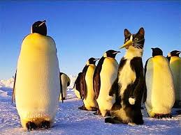
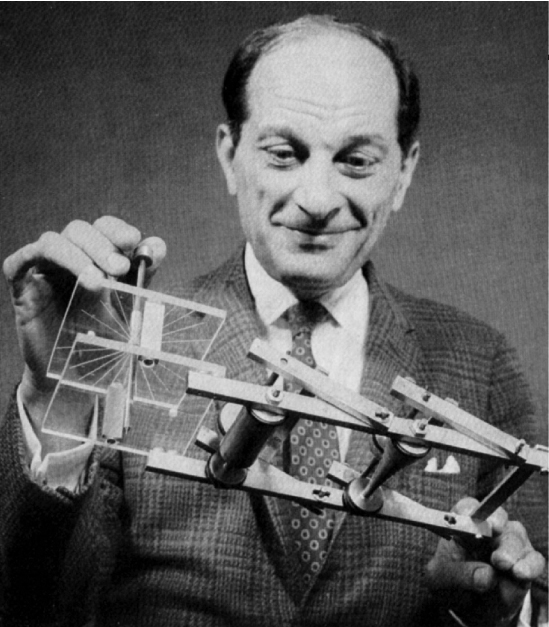

```{r setup, include=FALSE}
fig.dim <- 5
knitr::opts_chunk$set(fig.width=2*fig.dim,
                      fig.height=fig.dim,
                      fig.align='center')
set.seed(23)
library(matrixStats)
```

# Looking back


##

{width=80%}


## Steps in data analysis

1. Care, or at least think, about the data.

2. Look at the data.

3. Query the data.

4. Sanity check.

5. Communicate.

##

{width=80%}

## Statistics

::: {.columns}
:::::: {.column width=50%}

**statistics** are numerical summaries of data,

**parameters** are numerical attributes of a model.

- confidence intervals

- $p$-values

- report effect sizes!

- statistical significance does not imply real-world significance
:::
:::::: {.column width=50%}

- Central Limit Theorems:

    * sums of many independent sources of noise gives a Gaussian
    * sums of squared deviations is Chi-squared
    * count of many rare events is Poisson


:::
::::::

## Experimental design

::: {.columns}
:::::: {.column width=50%}

- experiment versus observational study

- controls, randomization, replicates

- samples: from what population?


- statistical power : $\sigma/\sqrt{n}$

- confounding factors

- correlation versus causation

:::
:::::: {.column width=50%}


:::
::::::

## Tidy data

- readable

- descriptive

- documented

- columns are variables, rows are observations

- semantically coherent

## Visualization

- makes precise visual analogies

- with real units

- labeled

- maximize information per unit ink

## Tests and skills

::: {.columns}
:::::: {.column width=50%}

- $t$-tests

- ANOVA: ratios of mean-squares

- Kaplan-Meier survival curves

- Cox proportional hazard models

- smoothing: `loess`

- multiple comparisons: Bonferroni; FDR

:::
:::::: {.column width=50%}

- simulation

- simulation

- oh, and simulation

- permutation tests

- goodness of fit

- crossvalidation

- interpolation

- nonidentifiability

:::
::::::


# Randomness: deal with it

## Distributions

::: {.columns}
:::::: {.column width=50%}


- Normal (a.k.a, Gaussian)
- logNormal
- scale mixtures of Normals
- multivariate Normal
- Student's $t$
- the $F$ distribution
- Beta
- Binomial
- Beta-Binomial

:::
:::::: {.column width=50%}

- Exponential
- Gamma
- Cauchy
- Poisson
- Weibull
- chi-squared
- Dirichlet

:::
::::::

##


## Linear models and `lm()`

$$ X_{ijk} = \mu + \alpha_i + \beta_j + \epsilon_{ijk} $$

- *linear*: describes the `+`s

- R's *formulas* are powerful (`model.matrix( )`!!)

. . .

- least-squares regression: implies Gaussian noise

- model comparison: with ANOVA and the $F$ test

. . .

Random effects:
```
ALGAE ~ TREAT + (1|PATCH)
```


# Stanland


## Bayesian what-not

- bags of biased coins
- probability, and Bayes' rule
- posterior = prior $\times$ likelihood:
  $$ p(\theta | D) = \frac{ p(D | \theta) p(\theta) }{ p(D) } $$
- "updating prior ideas based on (more) data"
- credible intervals
- hierarchical models
- *sharing power* and *shrinkage*
- posterior predictive sampling
- overdispersion: make it random

## MC Stan

::: {.columns}
:::::: {.column width=50%}

- kinda picky

- can climb the posterior likelihood surface (`optimizing( )`)

- or, can skateboard around on it (`sampling( )`)

:::
:::::: {.column width=50%}



:::
::::::

## Examples:

::: {.columns}
:::::: {.column width=50%}

- pumpkins (ANOVA)
- limpits (mixed models)
- biased coins
- baseball players
- snail parasites
- lung cancer survival
- Mauna Loa C02
- ocean temperatures
- hair and eye color
- gene ontonlogy
- **cream cheese**
- beer
- wine
- Austen versus Melville
- gene expression

:::
:::::: {.column width=50%}


:::
::::::

## GLMs

$$\begin{aligned}
&\text{(response distribution)} \\
&\qquad
\sim
    \text{(inverse link function)}
    + \text{(linear predictor)}
\end{aligned}$$

- Gaussian + identity
- Binomial + logistic
- Poisson + gamma

. . .

- parametric survival analysis

## Stan versus `glm()`/`glmer`

::: {.columns}
:::::: {.column width=50%}

`glm(er)`:

- fast
- easy
- quick
- not so picky about syntax
- uses formulas


:::
:::::: {.column width=50%}

`stan`:

- does not sweep convergence issues under the rug
- doesn't use formulas
- more control, for:
- overdispersion
- hierarchical modeling


`brms`:

- best of both worlds?

:::
::::::

## Things that aren't obviously models that we did in Stan anyhow

- robust regression: response is Cauchy
- sparse regression: coefficients are Cauchy
- dimension reduction: PCA, t-SNE
- deconvolution: NMF
- spatial smoothing: multivariate Gaussian

# Thank you!!!
