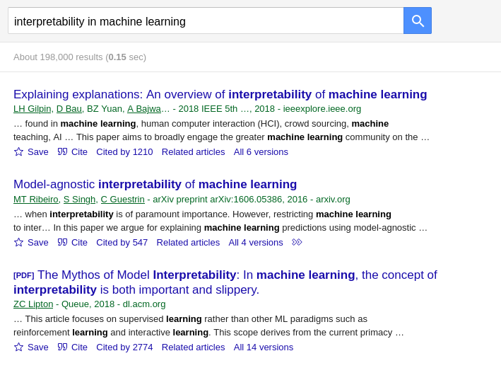
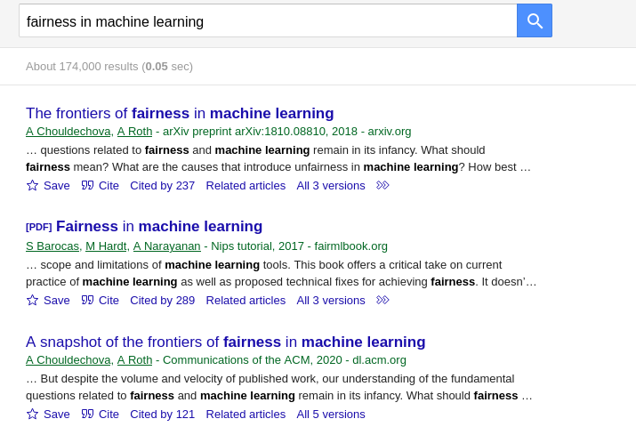
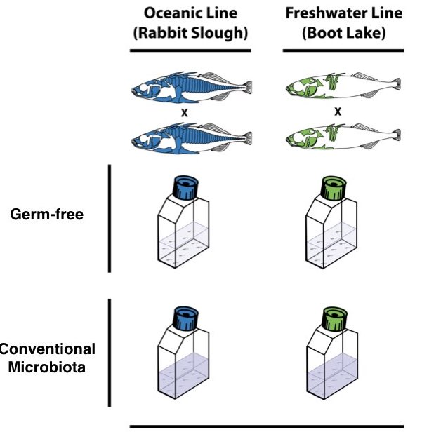

```{r setup, include=FALSE}
fig.dim <- 5
knitr::opts_chunk$set(fig.width=2*fig.dim,
                      fig.height=fig.dim,
                      fig.align='center')
set.seed(23)
```

# Statistical modeling

<!--

The *cultures* are within academia: this is written because of the reception
of academic statisticians to CART, neural nets, etc. However,
understanding the different underlying *philosophies* is helpful.

Breiman is really contrasting to GLM-type models with few explanatory variables.
In large, heterogeneous datasets these are probably good descriptors
*locally* (i.e., in parts of parameter space with a certain set of the variables)
but maybe not globally.

- multiplicity of data models
- goodness of fit and residual analysis
- algorithmic models versus data models
- focus on predictions
- is there necessarily a conflict between interpretablity and accuracy?
- what's better: a canned lm or a canned rf?

"Bayesian methods combined with Markov Chain Monte Carlo are cropping up all
over. This may signify that as data becomes more complex, the data models
become more cumbersome and are losing the advantage of presenting a simple and
clear picture of nature’s mechanism."

"In the mid-1980s two powerful new algorithms for fitting data became available:
neural nets and decision trees. A new research community using these tools
sprang up. Their goal was predictive accuracy. The community consisted of young
com- puter scientists, physicists and engineers plus a few aging statisticians.
They began using the new tools in working on complex prediction problems where
it was obvious that data models were not applicable: speech recognition, image
recognition, nonlinear time series prediction, handwriting recognition,
prediction in financial markets."

"random forests does not overfit"

Cox:

"Professor Breiman takes data as his starting point. I would prefer to start
with an issue, a ques- tion or a scientific hypothesis, although I would be
surprised if this were a real source of disagree- ment."

"However, much prediction is not like this. Often the prediction is under quite
different conditions from the data;
That is, it may be desired to predict the consequences of something only
indirectly addressed by the data available for analysis. As we move toward such
more ambitious tasks, prediction, always hazardous, without some understanding
of underlying process and linking with other sources of information, becomes
more and more tentative. "

"Better a rough answer to the right question than an exact answer to the wrong
question,"


"Analyses and model development are at least partly exploratory. Automatic
methods of model selection (and of variable selection in regression-like
problems) are to be shunned or, if use is absolutely unavoidable, are to be
examined carefully for their effect on the final conclusions. Unfocused tests
of model adequacy are rarely helpful."


Efron:

"At first glance Leo Breiman’s stimulating paper looks like an argument against
parsimony and scientific insight, and in favor of black boxes with lots of
knobs to twiddle. At second glance it still looks that way, but the paper is
stimulating, and Leo has some important points to hammer home."

"Now it is the twenty-first century when, as the paper reminds us, we are being
asked to face prob- lems that never heard of good experimental design."

-->


##


> *Abstract:* There are two cultures in the use of statistical modeling to
> reach conclusions from data. One assumes that the data are generated
> by a given stochastic data model. The other uses algorithmic models and
> treats the data mechanism as unknown.

. . .

What's the difference between a "data model" and an "algorithmic model"?

## Efron's summary:

> At first glance Leo Breiman’s stimulating paper looks like an argument against
> parsimony and scientific insight, and in favor of black boxes with lots of
> knobs to twiddle. At second glance it still looks that way, but the paper is
> stimulating, and Leo has some important points to hammer home.

. . .

What is Efron's criticism here?

## Some history

::: {.columns}
:::::: {.column width=80%}

*"In the mid-1980s two powerful new algorithms for fitting data became available:
neural nets and decision trees. A new research community using these tools
sprang up. Their goal was predictive accuracy. The community consisted of young
computer scientists, physicists and engineers plus a few aging statisticians.
They began using the new tools in working on complex prediction problems where
it was obvious that data models were not applicable: speech recognition, image
recognition, nonlinear time series prediction, handwriting recognition,
prediction in financial markets."*


:::
:::::: {.column width=20%}

:::
::::::


## Some history

::: {.columns}
:::::: {.column width=80%}

*"In the mid-1980s two powerful new algorithms for fitting data became available:
neural nets and decision trees. A new research community using these tools
sprang up. Their goal was predictive accuracy. The community consisted of young
computer scientists, physicists and engineers plus a few aging statisticians.
They began using the new tools in working on complex prediction problems where
it was obvious that data models were not applicable: speech recognition, image
recognition, nonlinear time series prediction, handwriting recognition,
prediction in financial markets."*


:::
:::::: {.column width=20%}


::: {.caption .flushright}
"a few aging statisticians" 
(Grace Wahba in 1986)
:::

:::
::::::


---------------

Questions to consider:

1. Are we trying to learn about the underlying mechanism,
   or do we only care about good prediction?

2. Do we want to squeeze every possible drop of information out of the data,
   or do we have plenty of data and just need something that works?

3. Is our data well-described by a GLM,
   or not?

. . .

*Exercise:* make up some situations
that have a wide variety of answers to these questions.

. . .

*Where's visualization fit into all this?*


## Prediction

> The most obvious way to see how well the model box emulates nature’s box is
> this: put a case $x$ down nature’s box getting an output $y$. Similarly, put
> the same case $x$ down the model box getting an output $y'$. The closeness of
> $y$ and $y'$ a measure of how good the emulation is.

. . .

Breiman contrasts *crossvalidation* with *goodness-of-fit*
(e.g., residual analysis, or a posterior predictive check).
What's the difference?


## The conversation continues




## See also: [Algorithmic bias](https://en.wikipedia.org/wiki/Algorithmic_bias)




# Looking back


##

{width=80%}


## Steps in data analysis

1. Care, or at least think, about the data.

2. Look at the data.

3. Query the data.

4. Check the answers.

5. Communicate.

##

{width=80%}


## Statistics or parameters?

A **statistic** is

: a numerical description of a dataset.

. . .

A **parameter** is 

: a numerical attribute of a model of reality.

. . .

Often, *statistics* are used to estimate *parameters*.


## Lurking, behind everything:

is *uncertainty*

. . .

thanks to *randomness*.

. . .

How do we understand randomness, concretely and quantitatively?

. . .

With *models*.


## Statistics

::: {.columns}
:::::: {.column width=50%}

**statistics** are numerical summaries of data,

**parameters** are numerical attributes of a model.

- confidence intervals

- $p$-values

- report effect sizes!

- statistical significance does not imply real-world significance
:::
:::::: {.column width=50%}

- Central Limit Theorems:

    * sums of many independent sources of noise gives a Gaussian
    * count of many rare, independent events is Poisson


:::
::::::


## Experimental design

::: {.columns}
:::::: {.column width=50%}

- experiment versus observational study

- controls, randomization, replicates

- samples: from what population?


- statistical power : $\sigma/\sqrt{n}$

- confounding factors

- correlation versus causation

:::
:::::: {.column width=50%}



:::
::::::

## Tidy data

- readable

- descriptive

- documented

- columns are variables, rows are observations

- semantically coherent

## Visualization

- makes precise visual analogies

- with real units

- labeled

- maximize information per unit ink

## Concepts and skills

::: {.columns}
:::::: {.column width=50%}

- $z$-scores and $t$-tests

- ANOVA: ratios of mean-squares

- Kaplan-Meier survival curves

- Cox proportional hazard models

- smoothing: `loess`

- multiple comparisons: Bonferroni; FDR

- the bootstrap - resampling

- conditional probability

:::
:::::: {.column width=50%}

- simulation

- simulation

- oh, and simulation

- power analysis

- permutation tests

- goodness of fit

- crossvalidation

- imputation and interpolation

- nonidentifiability

:::
::::::


# Randomness: deal with it

## Distributions

::: {.columns}
:::::: {.column width=50%}


- Normal (a.k.a, Gaussian)
- logNormal
- scale mixtures of Normals
- multivariate Normal
- Student's $t$
- the $F$ distribution
- Beta
- Binomial
- Beta-Binomial

:::
:::::: {.column width=50%}

- Exponential
- Gamma
- Cauchy
- Poisson
- Weibull
- chi-squared
- Dirichlet

:::
::::::

<!--
## In-class: brainstormed examples

```
Negative-binomial: Differential gene expression

Poisson: non-normalized transcript countsi

Cauchy: # of cases of Coronavirus in cities around the world

Normal (gaussian): height

Beta-binomial: Coin flips with random coin

Exponential: radioactive decay

LogNormal: milk production by cows

Beta: probability that a baseball player gets a hit

Gamma: Amount of snowfall accumulated

Dirichlet: probability distribution of n proportions sizes (which must all sum to 1). Such as if you have three subspecies making up a species population: this would be an appropriate prior for the proportion sizes

Poisson: Total counts of coffee’s sold at starbucks at any particular time 

Weibull: Survival analysis 

Multivariate Normal: probability of something happening in 3D space

Poisson--birth rates

Poisson - Counts of rare plant species (from presence/absence surveys)

Weibull: time until someone falls ill with coronavirus

Cauchy: Distance commuted on a daily basis

Multivariate normal: height, weight, and shoe size

Weibull: hazard rate in survival analysis

F distribution: the F statistic

Multivariate Normal: spatial correlation of bike trip
Poisson distribution: observing transcript counts, looking at the effects of age and exposure

Negative binomial: how many eggs a chicken lays until the 5th egg with two yolks

logNormal: rent prices across Manhattan

Poisson: number of bursts of EEG activity

Binomial: number of people on the bus who should be at home ‘cause they are sick

Poisson: number of cosmic particles going through a detector

Poisson: number of toilet paper sheets with errors in perforation

Beta binomial - number of polls (across different political analysis sources?) that say that Bernie will win 
```
-->

##


## Linear models and `lm()`

$$ y_i = \mu + \alpha_{g_i} + \beta x_j + \epsilon_{ijk} $$

- *linear*: describes the `+`s

- R's *formulas* are powerful (`model.matrix( )`!!)

. . .

- least-squares: implies Gaussian noise

- model comparison: with ANOVA and the $F$ test

. . .

Random effects / mixed models:
```
ALGAE ~ TREAT + (1|PATCH)
```

# Stepping back

## Steps in data analysis

1. Care, or at least think, about the data.

2. Look at the data.

3. Query the data.

4. Check the answers.

5. Communicate.

. . .

What questions are you asking?

----------------


well, numbers aren’t racist?

. . .

but how we use them might be

--------------


More important than statistical technique:

- What questions are being asked?

- What data is being collected? (and how)

- What assumptions are being made?

- What are the important conclusions?


# Models

##

A $p$-value is:

. . .


> the probability of seeing a result at least as surprising as what was
> observed in the data, if the null hypothesis is true. 

---------

A $p$-value is **not**:

. . .

> an effect size.


## Bayesian what-not

- bags of biased coins
- probability, and Bayes' rule
- posterior = prior $\times$ likelihood:
  $$ p(\theta | D) = \frac{ p(D | \theta) p(\theta) }{ p(D) } $$
- "updating prior ideas based on (more) data"
- credible intervals
- hierarchical models
- *sharing power* and *shrinkage*
- posterior predictive sampling
- overdispersion: make it random

## MC Stan

::: {.columns}
:::::: {.column width=50%}

- kinda picky

- can climb the posterior likelihood surface (`optimizing( )`)

- or, can skateboard around on it (`sampling( )`)

- needs checking up on

- the basis for `brms`

:::
:::::: {.column width=50%}


:::
::::::

## Examples:

::: {.columns}
:::::: {.column width=50%}

- AirBnB
- pumpkins (ANOVA)
- limpets (mixed models)
- biased coins
- baseball players
- lung cancer survival
- diabetes
- hair and eye color
- beer
- wine
- gene expression
- biketown

:::
:::::: {.column width=50%}


- Austen versus Melville
- blue tit nestlings
- hurricane lizards
- bikeshare

:::
::::::

## GLMs

*Ingredients:*

- response distribution ("family")
- inverse link function
- linear predictor

. . .

*Examples:*

- Gaussian + identity
- Binomial + logistic
- Poisson + gamma

. . .

- parametric survival analysis

## `brms` versus `glm()`/`glmer`

::: {.columns}
:::::: {.column width=50%}

`glm(er)`:

- fast
- easy
- quick


:::
:::::: {.column width=50%}

`brms`:

- easy
- does not sweep convergence issues under the rug
- more control, for:
- overdispersion
- hierarchical modeling


:::
::::::


## Space and time

::: {.columns}
:::::: {.column width=50%}

*Time series*
and
*spatial statistics*:


both have to deal with

**autocorrelation.**

:::
:::::: {.column width=50%}

*Methods:*

- mechanistic models

- multivariate Normal / Gaussian process

- spline / smoothing / loess

:::
::::::

# Conclusion

## Be confident!


# Thank you!!!
