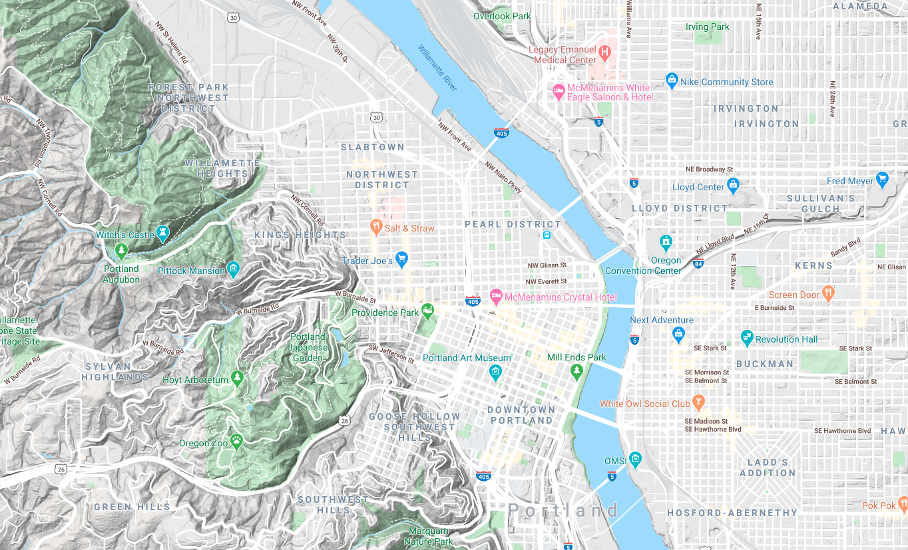

```{r setup, include=FALSE}
fig.dim <- 5
knitr::opts_chunk$set(fig.width=2*fig.dim,
                      fig.height=fig.dim,
                      fig.align='center')
set.seed(23)
library(matrixStats)
```

```{r more_setup, include=FALSE}
library(RColorBrewer)
library(KernSmooth)
library(fields)
library(rgdal)
library(sp)
library(raster)
```

```{r biketown, cache=TRUE, include=FALSE}
data_dir <- "../../../datasets" 
bt <- read.csv(file.path(data_dir, "biketown/2019_08.csv.gz"), header=TRUE, stringsAsFactors=FALSE)
xylims <- c(-122.75, -122.6, 45.46, 45.56)
bt <- subset(bt, !is.na(Start_Latitude) & Start_Latitude > xylims[3] & Start_Latitude < xylims[4] 
                 & !is.na(End_Latitude) & End_Latitude > xylims[3] & End_Latitude < xylims[4] 
                 & !is.na(Start_Longitude) & Start_Longitude > xylims[1] & Start_Longitude < xylims[2] 
                 & !is.na(End_Longitude) & End_Longitude > xylims[1] & End_Longitude < xylims[2])
```

```{r load_maps0, cache=TRUE, warning=FALSE, include=FALSE}
crop_extent <- extent(xylims)
river <- readOGR(dsn=file.path(data_dir, "biketown/River_Overlay/"))
bikepaths <- readOGR(dsn=file.path(data_dir, "biketown/bicycle_network/"))
streets <- readOGR(dsn=file.path(data_dir, "biketown/pdx_streets/"))
bikepaths <- subset(bikepaths, Status == "Active")
streets <- subset(streets, LCITY == "Portland" | RCITY == "Portland")
river <- crop(river, crop_extent)
freeways <- crop(subset(streets, TYPE == 1110), crop_extent)
bigstreets <- crop(subset(streets, TYPE %in% c(1300, 1400)), crop_extent)
rm(streets)
```


```{r get_points, cache=TRUE, dependson=c("load_maps", "biketown"), include=FALSE}
bt_start <- SpatialPointsDataFrame(coords=cbind(bt$Start_Longitude, bt$Start_Latitude),
                                   data=bt, proj4string=CRS("+proj=longlat"))
bt_end <- SpatialPointsDataFrame(coords=cbind(bt$End_Longitude, bt$End_Latitude),
                                   data=bt, proj4string=CRS("+proj=longlat"))
bt_start <- crop(
                 spTransform(bt_start,
                             proj4string(river)),
                 crop_extent)
bt_end <- crop(
               spTransform(bt_end,
                           proj4string(river)),
               crop_extent)
```


```{r setup_map, include=FALSE}
setup_map <- function (..., add=FALSE) {
    sp::plot(bigstreets, col=grey(0.75), add=add, ...)
    lines(freeways, col=adjustcolor('brown', 0.25), lwd=2)
    sp::plot(river, col=adjustcolor('blue', 0.25), add=TRUE)
    lines(bikepaths, col=adjustcolor(grey(0.25), 0.5))
}
```

# Biketown

##

```{r plot_pdx, dependson="load_maps"}
layout(t(1:2))
setup_map(main='starts'); points(bt_start, pch=20, cex=0.5, col='red')
setup_map(main='ends'); points(bt_end, pch=20, cex=0.5, col='blue')
```

# Spatial density estimation

## Kernel density estimation

::: {.columns}
::::::: {.column width=60%}

Suppose we have a bunch of points

$$ (x_1, y_1), \ldots, (x_n, y_n) $$

with density $f(x,y)$, i.e.,

$$
f(x,y) \approx \frac{\#(\text{of points within $r$ of $(x,y)$})}{\pi r^2}
$$

---------------------------

Using

$$
\rho_\sigma(x,y) = \frac{1}{2\pi\sigma^2} e^{-\frac{x^2+y^2}{2\sigma^2}} 
$$


we can estimate $f(x,y)$ by

$$
\hat f(x,y) = \sum_{i=1}^n \rho_\sigma(x_i-x, y_i-y) .
$$


## The two choices of kernel density estimation


1. The **kernel**, $\rho()$.

   (we used a Gaussian)

2. The **bandwidth**, $\sigma$.


## Your turn

1. Simulate 200 spatial locations with a density having two "bumps".
   Plot these points.
    (`rnorm(n, mean=-3), rnorm(n, mean=+3)`)

2. Make a $20 \times 20$ grid of "reference" locations.
    (`expand.grid( )`)

3. Compute the kernel density estimate for each location,
   with $\sigma$ chosen appropriately, and plot it.
   (`dnorm( )`)


# Bike trip density estimation

## `bkde2D`

```{r do_ks}
library(KernSmooth)
grid_n <- 301
start_smooth <- bkde2D(bt_start@coords, bandwidth=0.004, gridsize=c(grid_n, grid_n))
str(start_smooth)
```

## Plotting surfaces, method 1

`image( )` and `contour( )`

```{r plot_surface1, eval=FALSE}
image(x=start_smooth$x1, y=start_smooth$x2, z=matrix(start_smooth$fhat, nrow=grid_n, ncol=grid_n), xlab='eastings', ylab='northings')
contour(x=start_smooth$x1, y=start_smooth$x2, z=matrix(start_smooth$fhat, nrow=grid_n, ncol=grid_n), add=TRUE)
```

##

```{r plot_surface1x, fig.height=2*fig.dim, echo=FALSE}
image(x=start_smooth$x1, y=start_smooth$x2, z=matrix(start_smooth$fhat, nrow=grid_n, ncol=grid_n), xlab='eastings', ylab='northings')
contour(x=start_smooth$x1, y=start_smooth$x2, z=matrix(start_smooth$fhat, nrow=grid_n, ncol=grid_n), add=TRUE)
```


## Plotting surfaces, method 2

```{r plot_surface2, fig.height=2*fig.dim, eval=FALSE}
library(raster)
smooth_df <- as.data.frame(expand.grid(x=start_smooth$x1, y=start_smooth$x2))
smooth_df$z <- as.vector(start_smooth$fhat)
raster_smooth <- rasterFromXYZ(smooth_df)

plot(raster_smooth)
setup_map(add=TRUE)
contour(raster_smooth, add=TRUE)
```

##

```{r plot_surface2x, fig.height=2*fig.dim, echo=FALSE, warning=FALSE}
the_palette <- c(NA, rev(heat.colors(50, alpha=0.75)))
smooth_df <- as.data.frame(expand.grid(x=start_smooth$x1, y=start_smooth$x2))
smooth_df$z <- as.vector(start_smooth$fhat)
raster_smooth <- rasterFromXYZ(smooth_df)

sp::plot(raster_smooth, col=the_palette)
setup_map(add=TRUE)
contour(raster_smooth, add=TRUE)
```

# Choosing a bandwidth

## The bandwidth is important

```{r kernsmooth, cache=TRUE, echo=FALSE, fig.height=2*fig.dim, fig.width=3*fig.dim}
bw_list <- c(0.0003, 0.001, 0.003, 0.009, 0.015, 0.02)
layout(matrix(1:6, nrow=2, byrow=TRUE))
for (bw in bw_list) {
    start_smooth <- bkde2D(bt_start@coords, bandwidth=bw, gridsize=c(grid_n, grid_n))

    image(x=start_smooth$x1, y=start_smooth$x2, z=matrix(start_smooth$fhat, nrow=grid_n, ncol=grid_n),
    main=sprintf("bandwidth = %0.04f", bw))
    contour(x=start_smooth$x1, y=start_smooth$x2, z=matrix(start_smooth$fhat, nrow=grid_n, ncol=grid_n), add=TRUE)
}
```

## How to pick a bandwidth?

There are various automatic methods.

. . .

But... crossvalidation!

. . .

For each bandwidth:

1. Fit using most of the data,
2. and predict the remaining data.
3. Do this a bunch and return an estimate of goodness-of-fit.

. . .

... but wait, what's this mean, here?

## Revised:

For each bandwidth:

1. Fit the smooth using most of the data,
2. predict the density at the locations of the remaining data,
3. and return the mean log density at "true" points.

. . .

*Why log?:*

If $f$ and $g$ are probability distributions, and $x_1, \ldots, x_n$ are drawn from $f$,
then
$$  L(g) = \sum_{i=1}^n \log g(x_i) \lessapprox L(f) , $$
i.e., is maximized for $g=f$.
(see: [cross entropy](https://en.wikipedia.org/wiki/Cross_entropy))


## On example data

```{r do_it}
n <- 400
xy <- cbind(rnorm(n, mean=rep(c(-3,3), times=c(n/2,n/2))), rnorm(n))
xygrid <- expand.grid(x=seq(-5,5,length.out=40),
                      y=seq(-5,5,length.out=40))
xy_fhat <- rep(NA, nrow(xygrid))
sigma <- 0.25
for (k in 1:nrow(xygrid)) {
    xy_fhat[k] <- sum( exp(-( (xy[,1] - xygrid[k,1])^2 + (xy[,2] - xygrid[k,2])^2 )/(2*sigma^2) ) / (2 * pi * sigma^2 ) )
}
plot(xy, asp=1, pch=20)
points(xygrid[,1], xygrid[,2], cex=xy_fhat/6)
```

## Prediction, by linear interpolation

```{r xval_fnA, cache=TRUE}
library(fields)
the_xval <- function (bw, points, ntest, grid_n=301) {
    use_these <- sample(rep(c(TRUE, FALSE), times=c(nrow(xy)-ntest, ntest)))
    smooth <- bkde2D(xy[use_these,], bandwidth=bw, gridsize=c(grid_n, grid_n))
    names(smooth) <- c("x", "y", "z")
    pred <- interp.surface(smooth, loc=xy[!use_these,])
    return(mean(log(pred), na.rm=TRUE))
}
```

##

```{r do_xvalA, cache=TRUE, dependson='xval_fnA'}
the_scores <- data.frame(bw = rep(seq(0.1, 1.0, length.out=12), each=20),
                          xent = NA)
for (k in 1:nrow(the_scores)) {
    pred <- the_xval(bw=the_scores$bw[k], points=bt_start, ntest=100)
    the_scores$xent[k] <- pred
}
```

## The results

```{r plot_xvalA}
plot(xent ~ bw, data=the_scores)
lines(lowess(the_scores$bw, the_scores$xent), lwd=2, col='red')
```


## Prediction, on bicycle data

```{r one_xval}
bw <- 0.004
xy <- bt_start@coords
ntest <- 100
use_these <- sample(rep(c(TRUE, FALSE), times=c(nrow(xy)-ntest, ntest)))
smooth <- bkde2D(xy[use_these,], bandwidth=bw, gridsize=c(grid_n, grid_n))
names(smooth) <- c("x", "y", "z")
pred <- fields::interp.surface(smooth, loc=xy[!use_these,])
hist(pred)
```

##

```{r xval_fn, cache=TRUE}
density_xval <- function (bw, points, ntest, grid_n=301) {
    xy <- points@coords
    use_these <- sample(rep(c(TRUE, FALSE), times=c(nrow(xy)-ntest, ntest)))
    smooth <- bkde2D(xy[use_these,], bandwidth=bw, gridsize=c(grid_n, grid_n))
    names(smooth) <- c("x", "y", "z")
    pred <- interp.surface(smooth, loc=xy[!use_these,])
    return(mean(log(pred), na.rm=TRUE))
}
```

##

```{r do_xval, cache=TRUE, dependson='xval_fn'}
xval_scores <- data.frame(bw = rep(bw_list[1:5], each=20),
                          xent = NA)
for (k in 1:nrow(xval_scores)) {
    pred <- density_xval(bw=xval_scores$bw[k], points=bt_start, ntest=100)
    xval_scores$xent[k] <- pred
}

plot(xent ~ bw, data=xval_scores)
```


# Bicycle migration

##

```{r plot_surface2y, fig.height=1.5*fig.dim, fig.width=3*fig.dim, echo=FALSE, warning=FALSE}
range.x <- list(range(bt_start@coords[,1], bt_end@coords[,1]), range(bt_start@coords[,2], bt_end@coords[,2]))
start_smooth <- bkde2D(bt_start@coords, bandwidth=0.002, gridsize=c(grid_n, grid_n), range.x=range.x)
end_smooth <- bkde2D(bt_end@coords, bandwidth=0.002, gridsize=c(grid_n, grid_n), range.x=range.x)
start_df <- as.data.frame(expand.grid(x=start_smooth$x1, y=start_smooth$x2))
start_df$z <- as.vector(start_smooth$fhat)
start_raster <- rasterFromXYZ(start_df)
end_df <- as.data.frame(expand.grid(x=end_smooth$x1, y=end_smooth$x2))
end_df$z <- as.vector(end_smooth$fhat)
end_raster <- rasterFromXYZ(end_df)

layout(t(1:2))
sp::plot(start_raster, col=the_palette, main='start')
setup_map(add=TRUE)
contour(start_raster, add=TRUE)
sp::plot(end_raster, col=the_palette, main='end')
setup_map(add=TRUE)
contour(end_raster, add=TRUE)
```

## Start minus end

```{r plot_diff, fig.width=2*fig.dim, fig.height=1.5*fig.dim, echo=FALSE}
library(sp)
diff_palette <- c(NA, rev(hcl.colors(50, alpha=0.75)))
sp::plot(start_raster - end_raster, col=diff_palette, main='start - end')
setup_map(add=TRUE)
```


##



