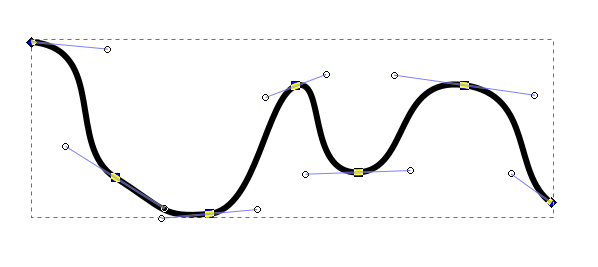

```{r setup, include=FALSE}
fig.dim <- 5
knitr::opts_chunk$set(fig.width=2*fig.dim,
                      fig.height=fig.dim,
                      fig.align='center')
set.seed(23)
library(matrixStats)
```

```{r more_setup, include=FALSE}
library(RColorBrewer)
library(KernSmooth)
library(fields)
library(rgdal)
library(sp)
library(raster)
library(brms)
library(bayesplot)
options(mc.cores = parallel::detectCores())
options(warnPartialMatchDollar=FALSE) # hush, brms
```

```{r biketown, cache=TRUE, include=FALSE}
data_dir <- "../../../datasets" 
bt <- read.csv(file.path(data_dir, "biketown/2019_08.csv.gz"), header=TRUE, stringsAsFactors=FALSE)
xylims <- c(-122.75, -122.6, 45.46, 45.56)
bt <- subset(bt, !is.na(Start_Latitude) & Start_Latitude > xylims[3] & Start_Latitude < xylims[4] 
                 & !is.na(End_Latitude) & End_Latitude > xylims[3] & End_Latitude < xylims[4] 
                 & !is.na(Start_Longitude) & Start_Longitude > xylims[1] & Start_Longitude < xylims[2] 
                 & !is.na(End_Longitude) & End_Longitude > xylims[1] & End_Longitude < xylims[2])
```

```{r load_maps0, cache=TRUE, warning=FALSE, include=FALSE}
crop_extent <- extent(xylims)
river <- readOGR(dsn=file.path(data_dir, "biketown/River_Overlay/"))
bikepaths <- readOGR(dsn=file.path(data_dir, "biketown/bicycle_network/"))
streets <- readOGR(dsn=file.path(data_dir, "biketown/pdx_streets/"))
bikepaths <- subset(bikepaths, Status == "Active")
streets <- subset(streets, LCITY == "Portland" | RCITY == "Portland")
river <- crop(river, crop_extent)
freeways <- crop(subset(streets, TYPE == 1110), crop_extent)
bigstreets <- crop(subset(streets, TYPE %in% c(1300, 1400)), crop_extent)
rm(streets)
```


```{r get_points, cache=TRUE, dependson=c("load_maps", "biketown"), include=FALSE}
bt_start <- SpatialPointsDataFrame(coords=cbind(bt$Start_Longitude, bt$Start_Latitude),
                                   data=bt, proj4string=CRS("+proj=longlat"))
bt_end <- SpatialPointsDataFrame(coords=cbind(bt$End_Longitude, bt$End_Latitude),
                                   data=bt, proj4string=CRS("+proj=longlat"))
bt_start <- crop(
                 spTransform(bt_start,
                             proj4string(river)),
                 crop_extent)
bt_end <- crop(
               spTransform(bt_end,
                           proj4string(river)),
               crop_extent)
```


```{r setup_map, include=FALSE}
setup_map <- function (..., add=FALSE) {
    sp::plot(bigstreets, col=grey(0.75), add=add, ...)
    lines(freeways, col=adjustcolor('brown', 0.25), lwd=2)
    sp::plot(river, col=adjustcolor('blue', 0.25), add=TRUE)
    lines(bikepaths, col=adjustcolor(grey(0.25), 0.5))
}
```

# Biketown, again

##

```{r plot_pdx, dependson="load_maps"}
layout(t(1:2))
setup_map(main='starts'); points(bt_start, pch=20, cex=0.5, col='red')
setup_map(main='ends'); points(bt_end, pch=20, cex=0.5, col='blue')
```


## Goals:

Visualize:

1. <strike>Starting and ending locations of trips.</strike>
2. <strike>Net flux of bikes by area (e.g., places where more trips start than end).</strike>
3. Distance of trips depending on start and end location.


## What is mean local trip length?

```{r duration}
bt$Duration <- as.numeric(as.difftime(bt$Duration, format="%X"))
hist(as.numeric(bt$Duration), breaks=200, xlab='ride durations in minutes')
```


# Smoothing


## The general idea:

Response equals smooth plus noise:
$$
  y_i \approx f(x_i),
$$
where

- $y_i$: response of $i^\text{th}$ observation
- $x_i$: location in space of $i^\text{th}$ observation
- $f( )$: a "smooth" function

. . .

*To be determined:*
What's "smooth"?
What's "plus noise"?


## Our old friend, loess

```{r loess, echo=c(3,4), cache=TRUE}
yt <- data.frame(t=seq(0, 4*pi, length.out=150))
yt$y <- cos(yt$t) + rnorm(nrow(yt), sd=0.4)
ytsm <- loess(y ~ t, data=yt, span=0.1)
yt$smoothed <- predict(ytsm, newdata=yt)
plot(y ~ t, data=yt)
lines(smoothed ~ t, data=yt, col='red')
```

## ... applied to these data:

```{r duration_loess, cache=TRUE}
lo_dur <- loess(Duration ~ Start_Latitude * Start_Longitude, data=bt, span=0.3)
pred_lats <- seq(min(bt$Start_Latitude), max(bt$Start_Latitude), length.out=101)
pred_lons <- seq(min(bt$Start_Longitude), max(bt$Start_Longitude), length.out=101)
pred_locs <- expand.grid(Start_Latitude=pred_lats,
                         Start_Longitude=pred_lons)
pred_duration <- predict(lo_dur, newdata=pred_locs)
```

## ... loess!?!?!

```{r plot_loess, echo=FALSE, fig.width=2*fig.dim, fig.height=1.8*fig.dim}
loess_image <- as.data.frame(expand.grid(x=pred_lons, y=pred_lats))
loess_image$z <- as.vector(pred_duration)
raster_loess <- raster::rasterFromXYZ(loess_image)

raster::plot(raster_loess)
setup_map(add=TRUE)
contour(raster_loess, add=TRUE)
```

# Gaussian processes for smoothing

## 

Response equals smooth plus noise:
$$
  y_i = f(x_i) + \epsilon_i,
$$
where

- $y_i$: response of $i^\text{th}$ observation
- $x_i$: location in space of $i^\text{th}$ observation
- $\epsilon_i \sim \Normal(0, \sigma^2_\epsilon)$: observation noise

and $f(x)$ is spatially autocorrelated:

$$\begin{aligned}
    f(x_i) &\sim \MVN(\mu, \Sigma) \\
    \cov[f(x_i), f(x_j)] &= \rho(\|x_i - x_j\|) .
\end{aligned}$$


## Also known as: [Kriging](https://en.wikipedia.org/wiki/Kriging)

```
> help(Krig, package="fields")
Krig                  package:fields                   R Documentation

Kriging surface estimate

Description:

     Fits a surface to irregularly spaced data. The Kriging model
     assumes that the unknown function is a realization of a Gaussian
     random spatial processes. The assumed model is additive Y = P(x) +
     Z(X) + e, where P is a low order polynomial and Z is a mean zero,
     Gaussian stochastic process with a covariance that is unknown up
     to a scale constant. The main advantages of this function are the
     flexibility in specifying the covariance as an R language function
     and also the supporting functions plot, predict, predictSE,
     surface for subsequent analysis. Krig also supports a correlation
     model where the mean and marginal variances are supplied.

Usage:

     Krig(x, Y, cov.function = "stationary.cov", lambda = NA, df
                      = NA, GCV = FALSE, Z = NULL, cost = 1, knots = NA,
                      weights = NULL, m = 2, nstep.cv = 200, scale.type =
                      "user", x.center = rep(0, ncol(x)), x.scale = rep(1,
                      ncol(x)), rho = NA, sigma2 = NA, method = "REML",
                      verbose = FALSE, mean.obj = NA, sd.obj = NA,
                      null.function = "Krig.null.function", wght.function =
                      NULL, offset = 0, na.rm = TRUE, cov.args = NULL,
                      chol.args = NULL, null.args = NULL, wght.args = NULL,
                      W = NULL, give.warnings = TRUE, ...)
```

--------------------

```{r kriging, cache=TRUE, echo=1:2}
krig_dur <- fields::Krig(x=cbind(bt$Start_Latitude, bt$Start_Longitude), Y=bt$Duration)
pred_krig <- matrix(predict(krig_dur, x=pred_locs), nrow=length(pred_lats))
krig_image <- as.data.frame(expand.grid(x=pred_lons, y=pred_lats))
krig_image$z <- as.vector(pred_krig)
raster_krig <- raster::rasterFromXYZ(krig_image)
```

```{r plot_krig, echo=FALSE, fig.width=2*fig.dim, fig.height=1.8*fig.dim}
raster::plot(raster_krig)
setup_map(add=TRUE)
contour(raster_krig, add=TRUE)
```

# More familiar tools

## `gp( )`

In brms, we can use `gp( )` to add a "Gaussian process" predictor:
```{r gp_brms, echo=1:3, cache=TRUE, dependson=c('loess'), warning=FALSE}
brsm <- brm(y ~ gp(t), data=subset(yt, t > 5 & t < 8), control=list(adapt_delta=0.9))
pred_df <- data.frame(t=seq(4, 9, length.out=101))
pred_df <- cbind(pred_df, predict(brsm, newdata=pred_df))
```

---------------

```{r gp_brms_plot, echo=FALSE}
plot(y ~ t, data=yt)
polygon(c(pred_df$t, rev(pred_df$t)), c(pred_df$Q2.5, pred_df$Q97.5), col=adjustcolor('blue', 0.25), border=NA)
abline(v=c(5,8), lty=3)
lines(Estimate ~ t, data=pred_df, col='blue', lwd=2)
lines(smoothed ~ t, data=yt, col='red', lwd=2)
legend("topright", lty=c(1,1,NA), fill=c(NA, NA, adjustcolor('blue', 0.25)), col=c('red', 'blue', NA), legend=c('loess', 'gp estimate', 'gp 95% CI'), border=NA)
```

## Note: more predictors

A bivariate predictor is specified by:
```
    y ~ gp(x1, x2)
```

. . .

*Question:* what's the difference to
```
    y ~ gp(x1) + gp(x2)
```
?

## However...

Gaussian processes don't scale well.
This would take **forever**:
```
brsm <- brm(y ~ gp(t), data=yt)
yt$brms_gp <- predict(ytsm, newdata=yt)
```

. . .

*Why?* With $n$ observations, the covariance matrix has $n^2$ entries.
Fitting the MVN requires *inverting* it.

. . .

*<ominous music>*


# Splines

## You might already know about splines:

[Bézier curves](https://en.wikipedia.org/wiki/B%C3%A9zier_curve)
are piecewise polynomial, i.e., splines:



## Smoothing with splines:

Response equals smooth plus noise:
$$
  y_i = f(x_i) + \epsilon_i,
$$
where

- $y_i$: response of $i^\text{th}$ observation
- $x_i$: location in space of $i^\text{th}$ observation
- $\epsilon_i \sim \Normal(0, \sigma^2_\epsilon)$: observation noise

and $f(x)$ is a $k$-th order *spline* with *knots* $u_1, \ldots, u_m$:
$$\begin{aligned}
    f(x) &= a_{j0} + a_{j1} x + a_{j2} x^2 + \cdots + a_{jk} x^k \\
    \text{for} &\qquad  u_j \le x \le u_{j+1} .
\end{aligned}$$
and 'smooth' at the knots.


## Fitting a spline model:

Using `brms`, this is as easy as using `s( )` as a predictor:
```{r fit_s, cache=TRUE, echo=1:2, dependson=c('loess'), warning=FALSE}
brm_spline <- brm(y ~ s(t), data=yt,
                  prior=c(set_prior("exponential(1000)", class='sigma')))
s_pred_df <- data.frame(t=seq(0, max(yt$t), length.out=501))
s_pred_df <- cbind(s_pred_df, predict(brm_spline, newdata=s_pred_df))
```

----------------

```{r plot_fit_s, echo=FALSE}
plot(y ~ t, data=yt)
polygon(c(s_pred_df$t, rev(s_pred_df$t)), c(s_pred_df$Q2.5, rev(s_pred_df$Q97.5)), col=adjustcolor('blue', 0.25), border=NA)
lines(Estimate ~ t, data=s_pred_df, col='blue', lwd=2)
lines(smoothed ~ t, data=yt, col='red', lwd=2)
legend("topright", lty=c(1,1,NA), fill=c(NA, NA, adjustcolor('blue', 0.25)), col=c('red', 'blue', NA), legend=c('loess', 'spline estimate', 'spline 95% CI'), border=NA)
```

## Applied to biketown

```{r bt_s, cache=TRUE}
downtown <- subset(bt, Start_Latitude > 45.51 & Start_Latitude < 45.53
                       & Start_Longitude > -122.69 & Start_Longitude < -122.67
                       & (rbinom(nrow(bt), size=1, prob=0.1) == 1))
s_dur <- brm(Duration ~ t2(Start_Latitude, Start_Longitude),
             data=downtown)
```

--------

```{r plot_bt_s, cache=TRUE, dependson='bt_s', echo=FALSE}
dtn_lats <- seq(45.51, 45.53,length.out=101)
dtn_lons <- seq(-122.69, -122.67, length.out=101)
dtn_locs <- expand.grid(Start_Latitude=dtn_lats,
                         Start_Longitude=dtn_lons)
pred_s <- predict(s_dur, newdata=dtn_locs)
s_image <- as.data.frame(expand.grid(x=dtn_lons, y=dtn_lats))
s_image$z <- as.vector(pred_s[,"Estimate"])
raster_s <- raster::rasterFromXYZ(s_image)
```
```{r plot_bt_s_plot, echo=FALSE, fig.width=2*fig.dim, fig.height=1.8*fig.dim}
raster::plot(raster_s)
setup_map(add=TRUE)
contour(raster_s, add=TRUE)
```

## Conclusion

Built-in smoothing with ` ~ gp( )` and ` ~ s( )` and ` ~ t2( )` in brms is very promising.

. . .

But, it's not magical (yet).


# More with splines:

## 

Recall that a [Generalized Linear Model (GLM)](Week_10_GLMs.slides.html#/ingredients-of-a-glm)
has 
1. a *family* describing the distribution of the response, $Y$
2. a *linear predictor*
$$\begin{aligned}
    X \beta = \beta_0 + \beta_1 X_1 + \cdots + \beta_n X_n
\end{aligned}$$
3. a *link function* connecting the two:
$$\begin{aligned}
    h(\E[Y]) = X\beta .
\end{aligned}$$

## "Linear" $\to$ "Additive"

A Generalized *Additive* Model (GAM)
replaces the linear predictor with
$$\begin{aligned}
    \beta_0 + f_1(X_1) + \cdots + f_n(X_n),
\end{aligned}$$
where each $f_i( )$ is some *smooth function*,
e.g., a spline.

