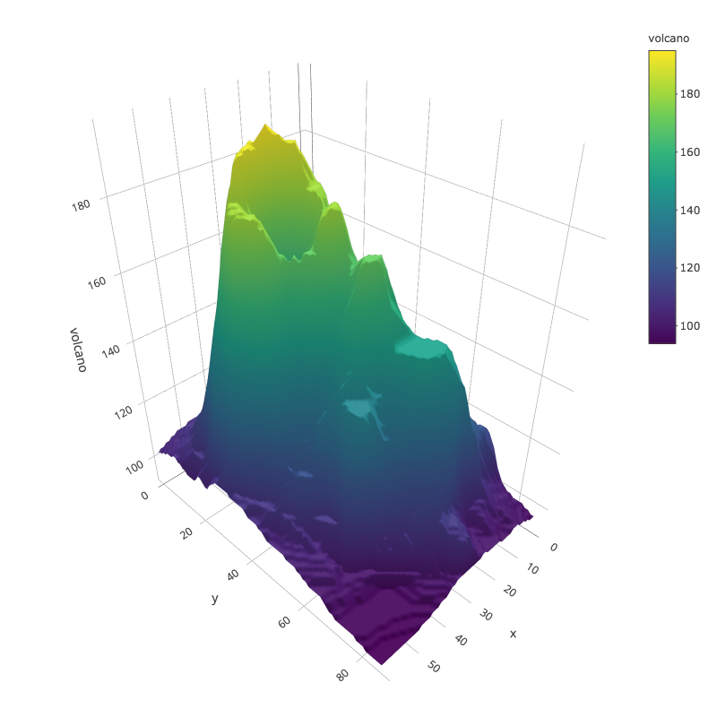
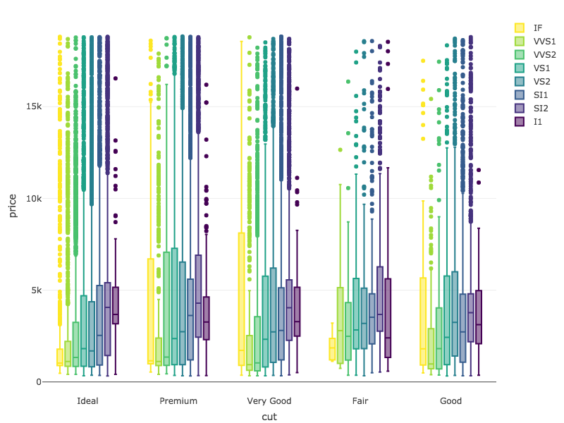
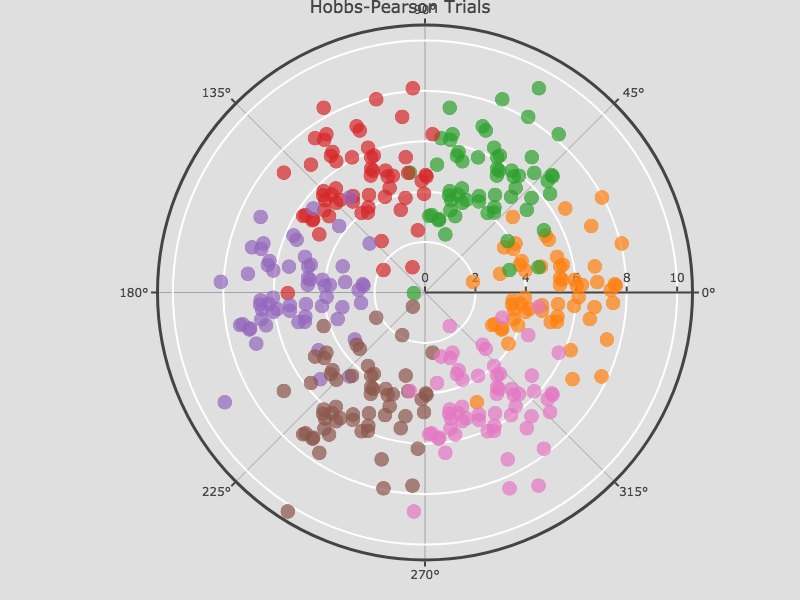
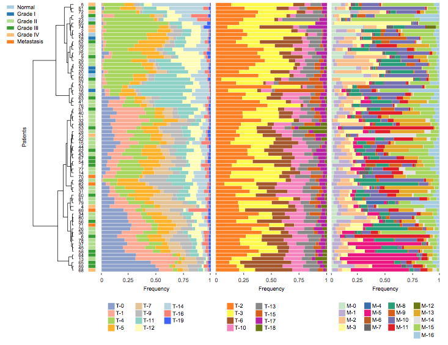
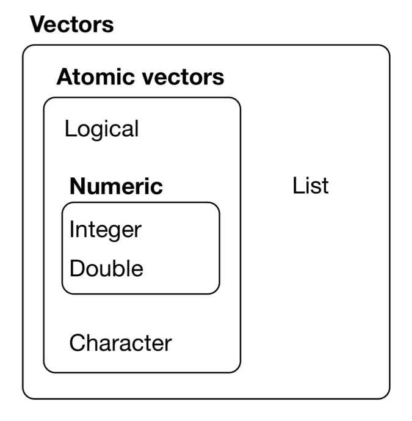

```{r setup, include=FALSE, warning=FALSE}
knitr::opts_chunk$set(echo = FALSE)
```

```{r, warning=FALSE}
library(knitr)
opts_chunk$set(tidy.opts=list(width.cutoff=60),tidy=TRUE)
```

# Lecture 1 - Using R for Biostatistical Analyses
- navigate into this directory: ~/CLASS_MATERIALS/R_and_Rmd_Review/
- type 'git fetch', then 'git status', then 'git merge origin/master' if you need to pull down changes
___________________

# Why use `R`?

## {}
- R is a _statistical_ programming language (derived from S)
- Superb data management & graphics capabilities
- You can write your own functions
- Powerful and flexible
- Runs on all computer platforms
- Well established system of packages and documentation
- Active development and dedicated community
- Can use a nice GUI front end such as `Rstudio`
- Reproducibility 
    - keep your scripts to see exactly what was done
    - distribute these with your data
    - embed your `R` analyses in polished `RMarkdown` files
- FREE
    
## {.flexbox .vcenter}
```{r, echo=FALSE, out.width='35%'}





```

## `R` resources  {.flexbox .vcenter}

- The R Project Homepage: http://www.r-project.org
- Quick R Homepage: http://www.statmethods.net
- Bioconductor: http://www.bioconductor.org    
- An Introduction to R (long!): http://cran.r-project.org/doc/manuals/R-intro.html
- R for Data Science: https://r4ds.had.co.nz
- Google - tutorials, guides, demos, packages and more

## Running `R` {.flexbox .vcenter}
- Need to make sure that you have `R` installed 
    - locally or on a server
    - https://www.r-project.org
  
- Run R from the command line
    - just type `R`
    - can run it locally as well as on clusters

- Install an R *Integrated Development Environment* (IDE)
    - RStudio: http://www.rstudio.com
    - Makes working with R much easier, particularly for a new R user
    - Run on Windows, Mac or Linux OS

## `RStudio` {.flexbox .vcenter}

```{r, echo=FALSE, out.width='75%', fig.align='center'}
knitr::include_graphics("images/RStudio_Screenshot.png")
```


## Exercise 1.1 - Exploring `RStudio` {}
- Open `RStudio`  
- Take a few minutes to familiarize yourself with the `Rstudio` environment by locating the following features:
    - See what types of new files can be made in `Rstudio` by clicking the top left icon- open a new R script.
    - The windows clockwise from top left are: the code editor, the workspace and history, the plots and files window, and the R console.
    - In the plots and files window, click on the packages and help tabs to see what they offer. 
- Now open the file called *ABS_2019_Exercises_for_R_Review.Rmd* in ~/CLASS_MATERIALS/R_and_Rmd_Review/02.Exercises/ 
    - This file will serve as your digital notebook for this review and contains the exercises.

___________________

# Introduction to `RMarkdown`

## `RMarkdown` {.flexbox .vcenter}

- A great way to embed `R code` into descriptive files to keep your life organized
    - http://kbroman.org/knitr_knutshell/pages/Rmarkdown.html
    - https://bookdown.org/yihui/rmarkdown/
    - https://bookdown.org/yihui/bookdown/
- You can insert `R chunks` into `Rmarkdown` documents
- You will be using the markdown language throughout the term!

## The markdown language is very flexible
- You can import RMarkdown templates into RStudio and open as a new Rmarkdown file
- Better yet there are packages that add functionality
- When you install the package it will show up in the 'From Template' section of the 'new file' startup screen
- There are packages to make
    - books
    - journal articles
    - slide shows
    - interactive exercises
    - many more

## What is markdown?  {}
- Lightweight _formal_ markup languages are used to add formatting to plaintext documents
    - Adding basic syntax to the text will make elements look different once rendered/knit
    - Available in many base editors (e.g., Atom text editor)
- You then need a markdown application with a markdown processor/parser to render your text files into something more exciting
    - Static and dynamic outputs!
    - pdf, HTML, presentations, websites, scientific articles, books etc
    
## What is Knitr and PANDOC?  {}
- Knitr is a package in R to render markdown files
- PANDOC is a general way to render markdown files into something else
- https://pandoc.orgis
- Can include math using LaTeX
- GitHub will render markdown directly
- Markdown can easily be rendered within most editors now
- Within RStudio just use the `knit` button to render markdown
- Markdown syntax is very easy
    
## Formatting text  {}    

```{r, eval=FALSE, echo=TRUE}
*Italic* or _Italic_
**Bold** or __Bold__
```

- *Italic* or _Italic_
- **Bold** or __Bold__


## Formatting text  {}  

```{r, eval=FALSE, echo=TRUE}
> "You know the greatest danger facing us is ourselves, an irrational fear of the unknown. 
But there’s no such thing as the unknown — only things temporarily hidden, temporarily not understood."
>
> --- Captain James T. Kirk
```

> "You know the greatest danger facing us is ourselves, an irrational fear of the unknown. But there’s no such thing as the unknown — only things temporarily hidden, temporarily not understood."
>
> --- Captain James T. Kirk

## Formatting lists  {}    

```{r, eval=FALSE, echo=TRUE}
- list_element
    - sub_list_element #double tab to indent
    - sub_list_element #double tab to indent
    - sub_list_element #double tab to indent
- list_element
    - sub_list_element #double tab to indent
#note the space after each dash- this is important!
```

- list_element
    - sub_list_element
    - sub_list_element
    - sub_list_element
- list_element
    - sub_list_element
  

## Formatting lists  {}    

```{r, eval=FALSE, echo=TRUE}
1. One
2. Two
3. Three
4. Four
```

1. One
2. Two
3. Three
4. Four

## Inserting images or URLs  {}    

```{r, eval=FALSE, echo=TRUE}
[Link](https://commonmark.org/help/)

```

[Link](https://commonmark.org/help/)


## Exercise 1.2-1.3 - Intro to `RMarkdown` Files and `Rmarkdown` Advanced

- Take a few minutes to familiarize yourself with RMarkdown files and the markdown language by completing exercise 1.2 & 1.3 in your exercises document- don't worry if you don't get all the way through

___________________

# BASICS of `R` 

## BASICS of `R` {}

- Commands can be submitted through 
    - terminal, console or scripts
    - can be embedded as `code chunks` in RMarkdown
- On these slides evaluating code chunks and showing output
    - shown here after the two `#` symbols
    - the number of output items is in `[]`
- `R` follows the normal priority of mathematical evaluation (PEDMAS)

## BASICS of `R` {}

Input code chunk and then output
```{r basic multiplication, echo=TRUE}
4*4
```

Input code chunk and then output
```{r more multiplication, echo=TRUE}
(4+3*2^2)
```

## Assigning Variables {.flexbox .vcenter}

- A better way to do this is to assign variables
- Variables are assigned values using the `<-` operator (better than `=`).
- Variable names must begin with a letter, but other than that, just about anything goes.
- Do keep in mind that `R` is **case sensitive**.

## Assigning Variables {.flexbox .vcenter}

```{r assigning variables, echo=TRUE, tidy=TRUE}

x <- 2
x*3
y <- x * 3
y-2

```

These do not work

```{r eval=FALSE, echo=TRUE}
3y <- 3
3*y <- 3
```


## Arithmetic operations on variables {}

- Arithmetic operations can be performed easily on variables as well as numbers.

```{r functions, eval = TRUE, echo = TRUE}
x <- 12
x+2
x^2
log(x)
```

## Arithmetic operations on variables {}
- Note that the last of these - `log` - is a built-in function of `R`, and therefore the object of the function needs to be put in parentheses
- These parentheses will be important, and we'll come back to them later when we add `arguments` in the parentheses after the function   
- The outcome of calculations can be assigned to new variables as well, and the results can be checked using the `print` command


## Arithmetic operations on variables {.flexbox .vcenter}

```{r, echo=TRUE}
y <- 67
print(y)

x <- 124
z <- (x*y)^2
print(z)
```

## STRINGS {.flexbox .vcenter}
- Operations can be performed on _character_ variables as well
- Note that "characters" need to be set off by quotation marks to differentiate them from numbers
- The `c` stands for `concatenate`
- Note that we are using the same variable names as we did previously, which means that we're overwriting our previous assignment
- A good rule of thumb is to use new names for each variable, and make them short but still descriptive

## STRINGS {.flexbox .vcenter}

```{r, echo=TRUE}
x <- "I Love"
print (x)
y <- "Biostatistics"
print (y)
z <- c(x,y)
print (z)
```


## VECTORS {.flexbox .vcenter}

- In general `R` thinks in terms of vectors
    - a list of characters, factors or numerical values ("I Love")
    - it will benefit any `R` user to try to write scripts with that in mind
    - it will simplify most things
- Vectors can be assigned directly using the `c()` function and then entering the exact values with commas separating each element.

## VECTORS {.flexbox .vcenter}

```{r Example vectors, echo=TRUE}
n <- c(2,3,4,2,1,2,4,5,10,8,9)
print(n)
n2<-c(n,3)
print(n2)
n2
```

```{r Example vectors two, echo=TRUE}
z <- n +3
print(z)
```

## FACTORS {.flexbox .vcenter}

- The vector `x` is now what is called a list of character values ("I Love").
- Sometimes we would like to treat the characters as if they were units for subsequent calculations.
- These are called `factors`, and we can redefine our character variables as factors.
- This might seem a bit strange, but it’s important for statistical analyses where we might want to see the mean or variance for two different treatments.

## FACTORS {.flexbox .vcenter}

```{r, eval = TRUE, echo = TRUE}
x_factor <- as.factor(x)
print (x_factor)
```
- Note that factor levels are reported alphabetically

## FACTORS {.flexbox .vcenter}

- We can also determine how `R` "sees" a variable using `str()` or `class()` functions. 
- This is a useful check when importing datasets or verifying that you assigned a class correctly
```{r, eval = TRUE, echo = TRUE}
str(x)
class(x)
```


## Types or 'classes' of vectors of data {.smaller}

```{r, echo=FALSE, out.width='50%', fig.align='center'}

```

## Types of vectors of data {}

- `int` stands for integers  

- `dbl` stands for doubles, or real numbers (or `num`)

- `chr` stands for character vectors, or strings  

- `dttm` stands for date-times (a date + a time)  

- `lgl` stands for logical, vectors that contain only TRUE or FALSE

- `fctr` stands for factors, which R uses to represent categorical variables with fixed possible values  

- `date` stands for dates  

## Types of vectors of data {.smaller}

- Logical vectors can take only three possible values:
    - `FALSE`
    - `TRUE`
    - `NA` which is 'not available' and is the default coding for missing data in `R`

- Integer and double vectors are known collectively as numeric vectors.
    - In `R` numbers are doubles by default.

- Integers have one special value: NA, while doubles have four:
    - `NA`
    - `NaN` which is 'not a number'
    - `Inf`
    - `-Inf`

## Basic Statistics {.flexbox .vcenter}

Many functions exist to operate on vectors.
```{r, eval = FALSE, echo = TRUE}
mean(n)
median(n)
var(n)
log(n)
exp(n)
sqrt(n)
sum(n)
length(n)
sample(n, replace = T) #has an additional argument (replace=T)
```
- Arguments modify or direct the function in some way
    - There are many arguments for each function, some of which are defaults
    - Tab complete is helpful to view argument options

## Getting Help {.flexbox .vcenter}

- Getting Help on any function is very easy - just type a question mark and the name of the function (or `??` from functions within packages).
- There are functions for just about anything within `R` and it is easy enough to write your own functions if none already exist to do what you want to do.
- In general, function calls have a simple structure: a function name, a set of parentheses and an optional set of parameters/arguments to send to the function.
- Help pages exist for all functions that, at a minimum, explain what parameters exist for the function.  


## Getting Help {.flexbox .vcenter}

```{r, eval = FALSE, echo = TRUE}
- help(mean)
- ?mean
- example(mean)
- help.search("mean")
- apropos("mean")
- args(mean)
```

## Creating vectors {}

- Creating a vector of new data by entering it by hand can be a drag
- However, it is also very easy to use functions such as
    - `seq`
    - `sample`

## Creating vectors {}
- What do the arguments mean?
```{r, echo = TRUE}
seq_1 <- seq(0.0, 10.0, by = 0.1)
print(seq_1)
```

## Creating vectors {}
```{r, echo = TRUE}
seq_2 <- seq(10.0, 0.0, by = -0.1)
print(seq_2)
```

## Creating vectors {.smaller}

```{r, echo = TRUE}
seq_square <- (seq_2)*(seq_2)
print(seq_square)
```

## Creating vectors {.smaller}

```{r, echo = TRUE}
seq_square_new <- (seq_2)^2
print(seq_square_new)
```

## R Interlude 

Complete Exercises 1.4-1.7

```{r, echo=FALSE, out.width='50%', fig.align='center'}

```


## Drawing samples from distributions {.smaller}

- Here is a way to create your own data sets that are random samples... we started doing this in class already!
```{r Samples from distributions 2, out.width='50%', echo = TRUE}
x <- rnorm (n = 10000, mean = 0, sd = 10)
y <- sample (1:10000, 10000, replace = T)
xy <- cbind(x,y)
plot(xy)
```

## Drawing samples from distributions {.smaller}

```{r Samples from distributions 3, out.width='50%', echo = TRUE}
x <- rnorm (10000, 0, 10)
y <- sample (1:10000, 10000, replace = T)
xy <- cbind(x,y)
hist(x)
```

## Drawing samples from distributions {.flexbox .vcenter}

- You’ve probably figured out that y from the last example is drawing numbers with equal probability.
- What if you want to draw from a distribution?
- Again, play around with the arguments in the parentheses to see what happens.

```{r Samples from distributions 4, out.width='50%', echo = TRUE, eval=F}
x <- rnorm (10000, 0, 10)
y <- sample (???, 10000, replace = ???)
```

## Drawing samples from distributions {.flexbox .vcenter out.width='50%'}

- `dnorm()` generates the probability density, which can be plotted using the `curve()` function.
- Note that is curve is added to the plot using `add=TRUE`

```{r, out.width='30%', echo = TRUE}
x <-rnorm(1000, 0, 100)
hist(x, xlim = c(-500,500))
curve(50000*dnorm(x, 0, 100), xlim = c(-500,500), add=TRUE, col='Red')
```

## A Note About Arguments in `R` Functions

- Sometimes `R` can guess what you mean because of order...

```{r, eval=T, echo=T}
x <- rnorm(1000, 0, 10)  #n=, mean=, sd=
x[1:10]
```

- But sometimes if the order isn't right, you can confuse `R` and get something you _really_ didn't want...
```{r, eval=T, echo=T}
x2 <- rnorm(10, 1000, 0)  #n=, mean=, sd=
x2
```

## Arguments in `R` Functions

- A work-around and best-practice: include the arguments!!
```{r, eval=T, echo=T}
set.seed(145)
x <- rnorm(n=1000, mean=0, sd=10)  #n=, mean=, sd=
x[1:10]
```

```{r, eval=T, echo=T}
set.seed(145)
x2 <- rnorm(sd=10, n=1000, mean=0)  #n=, mean=, sd=
x2[1:10]
```
   
  - Notice we also set the seed to replicate our sample results!


# Visualizing Data in `R`

## Visualizing Data {.flexbox .vcenter}

- So far you've been visualizing just the list of output numbers
- Except for the last example where I snuck in a `hist` function.
- You can also visualize all of the variables that you've created using the `plot` function (as well as a number of more sophisticated plotting functions).
- Each of these is called a `high level` plotting function, which sets the stage
- `Low level` plotting functions will tweak the plots and make them beautiful

## Visualizing Data {.flexbox .vcenter .smaller}

```{r, out.width='50%', echo = TRUE}
seq_1 <- seq(0.0, 10.0, by = 0.1)
plot (seq_1, xlab="space", ylab ="function of space", type = "p", col = "red")
```

## Putting plots in a single figure {.flexbox .vcenter}
- The first line of the lower script tells R that you are going to create a composite figure that has two rows and two columns (on next slide)
    - Can you tell how?
```{r, echo=TRUE, outwidth="40%", out.height="20%"}
seq_1 <- seq(0.0, 10.0, by = 0.1)
seq_2 <- seq(10.0, 0.0, by = -0.1)
```
```{r, echo=TRUE, eval=FALSE, outwidth="50%", out.height="40%"}
par(mfrow=c(2,2))
plot (seq_1, xlab="time", ylab ="p in population 1", type = "p", col = 'red')
plot (seq_2, xlab="time", ylab ="p in population 2", type = "p", col = 'green')
plot (seq_square, xlab="time", ylab ="p2 in population 2", type = "p", col = 'blue')
plot (seq_square_new, xlab="time", ylab ="p in population 1", type = "l", col = 'yellow')
```

## Putting plots in a single figure {.flexbox .vcenter .smaller}

```{r, echo=FALSE, eval=TRUE, outwidth="50%", out.height="50%"}
par(mfrow=c(2,2))
plot (seq_1, xlab="time", ylab ="p in population 1", type = "p", col = 'red')
plot (seq_2, xlab="time", ylab ="p in population 2", type = "p", col = 'green')
plot (seq_square, xlab="time", ylab ="p2 in population 2", type = "p", col = 'blue')
plot (seq_square_new, xlab="time", ylab ="p in population 1", type = "l", col = 'yellow')
```

## R Interlude 

Complete Exercises 1.8-1.9


# Working with Imported Datasets in `R`

## Creating Data Frames in `R` {.smaller}

- As you have seen, in `R` you can generate your own random data set drawn from nearly any distribution very easily.
- Often we will want to use collected data.
- Now, let’s make a dummy dataset to get used to dealing with data frames
    - Set up three variables (habitat, temp and elevation) as vectors

```{r, echo=TRUE}
habitat <- factor(c("mixed", "wet", "wet", "wet", "dry", "dry", "dry","mixed"))
temp <- c(3.4, 3.4, 8.4, 3, 5.6, 8.1, 8.3, 4.5)
elevation <- c(0, 9.2, 3.8, 5, 5.6, 4.1, 7.1, 5.3)
```

## Creating Data Frames in R {.smaller}
- Create a data frame where vectors become columns

```{r, echo=TRUE}
mydata <- data.frame(habitat, temp, elevation)
row.names(mydata) <- c("Reedy Lake", "Pearcadale", "Warneet", "Cranbourne", "Lysterfield", "Red Hill", "Devilbend", "Olinda")
head(mydata)
```
- Now you have a hand-made data frame with row names

## R Interlude: Reading in Data Frames in R
- A strength of `R` is being able to import data from an external source
    - Create the same table that you did above in a spreadsheet using Excel or similar 
    - Export it to a comma separated and tab separated text files for importing into `R`.
    - The first will read in a comma-delimited file, whereas the second is a tab-delimited
    - In both cases the header and row.names arguments indicate that there is a header row and row label column
    - Note that the name of the file by itself will have `R` look in the PWD, whereas a full path can also be used

## Reading in Data Frames in R {.flexbox .vcenter}

```{r, eval = FALSE, echo = TRUE}
YourFile <- read.table('yourfile.csv', header=T, row.names=1, sep=',')
YourFile <- read.csv('yourfile.csv', header=T, row.names=1, sep=',')
YourFile <- read.table('yourfile.txt', header=T, row.names=1, sep='\t')
```

## Exporting Data Frames in R {.flexbox .vcenter}

```{r, eval = FALSE, echo = TRUE}
write.csv(YourFile, "yourfile.csv", quote=F, row.names=T, sep=",")
write.table(YourFile, "yourfile.txt", quote=F, row.names=T, sep="\t")
```
- you will get more practice with this during the next R interlude

## Indexing in data frames {.flexbox .vcenter}
- Next up - indexing just a subset of the data
- This is a very important feature in `R`, that allows you to analyze just a subset of the data.
```{r, echo=TRUE, eval=FALSE}
print (YourFile[,2])
print (YourFile$temp)
print (YourFile[2,])
plot (YourFile$temp, YourFile$elevation)
```

## Indexing in data frames {.flexbox .vcenter}
- You can also assign values, or single values, from a data set to a new variable

```{r, echo=TRUE, eval=FALSE}
x <- (YourFile[,2])
y <-  (YourFile$temp)
z <- (YourFile$elevation)
plot (y, z)
```

## Indexing in data frames {.flexbox .vcenter}
- You can perform operations on particular levels of a factor
- Note that the first argument is the numerical column vector, and the second is the factor column vector.
- The third is the operation. **Reversing the first two does not work**
    - Tab complete will tell you the correct order for arguments 

```{r, eval = FALSE, echo = TRUE}
tapply(YourFile$temp, YourFile$habitat, mean)
tapply(YourFile$temp, YourFile$habitat, var)
```

## R Interlude

Complete Exercises 1.10-1.11
