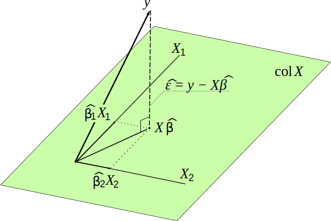

```{r setup, include=FALSE}
knitr::opts_chunk$set(echo = FALSE)
library(tidyverse)
library(plotly)
library(MASS)
```

## Why learn linear algebra?

Applications include:

- differential equations and dynamical systems
- Markov chains
- circuits
- social network analyses
- frequency analysis
- Google's Page Rank algorithm
- machine learning

Goal of this tutorial: Explain linear models (regression) using linear algebra

## Vectors

- A **vector** is a list of numbers.
- The dimension of a vector is the same as its length.
  
**Example:** if $v = (42, \pi, 0, -e)$ then $\dim(v) = 4$ 

**Example:** $v = (4, 3)$

```{r echo = FALSE, out.width = "75%"}
plot(4, 3, xlim = c(-1, 5), ylim = c(-1, 5), xlab = "", ylab = "")
arrows(0, 0, 4, 3)
abline(h = 0, v = 0)
```

## Basis
- A **basis** is a coordinate system
- In 2D we typically use the **Euclidean basis** with basis vectors $\hat{i}=(1,0)$ and $\hat{j}=(0,1)$

**Example:** The vector $(4,3)$ in the Euclidean basis is written as such because 
$$
  \begin{pmatrix} 4 \\ 3 \end{pmatrix} = 4\begin{pmatrix} 1 \\ 0 \end{pmatrix} + 3\begin{pmatrix} 0 \\ 1\end{pmatrix}
$$
Say we want to change basis to using $v_1 = (1,2)$ and $v_2 = (1.5, 0.5)$ instead. Observe, 
$$
  \begin{pmatrix} 4 \\ 3 \end{pmatrix} = 1\begin{pmatrix} 1 \\ 2 \end{pmatrix} + 2\begin{pmatrix} 1.5 \\ 0.5 \end{pmatrix}
$$
so $(4,3)$ is actually written as $(1,2)$ in this new basis.

## Matrices

- [Linear transformations and matrices](https://www.youtube.com/watch?v=kYB8IZa5AuE&list=PLZHQObOWTQDPD3MizzM2xVFitgF8hE_ab&index=3)

- [Inverse matrices, column space and null space](https://www.youtube.com/watch?v=uQhTuRlWMxw&list=PLZHQObOWTQDPD3MizzM2xVFitgF8hE_ab&index=7)

## Application: Linear Models
- Consider an additive model with $p$ predictors.
- The model for the $i$th observation is

$$
  y_i = \beta_0 + \beta_1x_{i1} + \beta_2x_{i2} + \cdots + \beta_nx_{ip} + \varepsilon_i
$$

- If we wrote out the model for all $n$ observations it would be

$$
\begin{align}
  y_1 &= \beta_0 + \beta_1 x_{11} + \beta_2 x_{12} + \cdots + \beta_p x_{1p} + \varepsilon_1\\
  y_2 &= \beta_0 + \beta_1 x_{21} + \beta_2 x_{22} + \cdots + \beta_p x_{2p} + \varepsilon_2\\
  &\hspace{2mm}\vdots\\
  y_n &= \beta_0 + \beta_1 x_{n1} + \beta_2 x_{n2} + \cdots + \beta_p x_{np} + \varepsilon_n
\end{align}
$$

## Application: Linear Models
- Let $X$ be $n \times (p+1)$ where $X_{\cdot 1}=1$ and $(X)_{ij}$ is the $(j-1)$th predictor, $j = 2,\ldots,p+1$, for the $i$th observation 
- $X$ is called the **design matrix**
- The previous system of equations can be written compactly as 
$$
  y = X\beta + \varepsilon
$$
where $\dim(y) = \dim(\varepsilon) = n$ and $\beta = (\beta_0, \beta_1, \ldots, \beta_p)$


## Application: Linear Models

Want to find the "best" estimates of $\beta$

- Least squares

    - Find $\hat{\mathbf{y}} = \mathbf{X}\hat{\beta}$ that minimizes $\sum_{i = 1}^n (\hat{y_i} - y_i)^2$
    
    - Take the derivative of sum of squares, set to zero, show this is a minimum (Gauss-Markov Theorem)
    
- Or using linear algebra

## Application: Linear Models

Simple example

$$
  \mathbf{y} = \begin{pmatrix} 2 \\ 2 \\ 1 \end{pmatrix}, \mathbf{X} = \begin{pmatrix} 1 & 4 \\ 1 & 3 \\ 1 & 4 \end{pmatrix}, \mathbf{\beta} = \begin{pmatrix} \beta_0 \\ \beta_1 \end{pmatrix}
$$

The equation $\mathbf{y} = \mathbf{X}\beta$ doesn't have a solution because it's overdetermined - two unknowns and 3 equations

## Application: Linear Models

$(\beta_0, \beta_1)$ is the coordinates of $\mathbf{X}\beta$ in the column space of $\mathbf{X}$:

$$
\begin{align}
\mathbf{X}\beta &= \begin{pmatrix} 1 & 4 \\ 1 & 3 \\ 1 & 4 \end{pmatrix} \begin{pmatrix} \beta_0 \\ \beta_1 \end{pmatrix}\\
&= \beta_0 \begin{pmatrix} 1 \\ 1 \\ 1 \end{pmatrix} + \beta_1 \begin{pmatrix} 4 \\ 3 \\ 4 \end{pmatrix}
\end{align}
$$

If $\mathbf{y}$ is **not** in the column space of $\mathbf{X}$, then there is no $\beta$ such that $\mathbf{y} = \mathbf{X}\beta$

We want to choose $\hat{\beta}$ so that $\mathbf{X}\hat{\beta}$ is as close as possible to $\mathbf{y}$

## 



## Application: Linear Models

Project $\mathbf{y}$ onto column space of $\mathbf{X}$

$$\mathbf{X}\hat{\beta} = \mathbf{X}(\mathbf{X}^T \mathbf{X})^{-1} \mathbf{X}^T \mathbf{y} = \mathbf{P}\mathbf{y}$$

$\mathbf{P}$ is the projection matrix

$\hat{\beta} = (\mathbf{X}^T \mathbf{X})^{-1} \mathbf{X}^T \mathbf{y}$

## Application: Linear Models

```{r echo = TRUE}
x <- cbind(c(1, 1, 1), c(4, 3, 4))
p <- x %*% solve(t(x) %*% x) %*% t(x)
p
```

```{r, echo = TRUE}
y <- c(2, 2, 1)
p %*% y
```

## Application: Linear Models

$$
\mathbf{P}\mathbf{y} = \begin{pmatrix} 1.5 \\ 2 \\ 1.5 \end{pmatrix} = 3.5 \begin{pmatrix} 1 \\ 1 \\ 1 \end{pmatrix} - 0.5 \begin{pmatrix} 4 \\ 3 \\ 4 \end{pmatrix}
$$

So

$\beta_0 = 3.5, \beta_1 = - 0.5$

## Application: Linear Models
```{r echo = TRUE}
lm(y ~ x - 1)
```

## Application: Linear Models

$$Y = \begin{pmatrix} y_{11} & y_{12} \\ \vdots & \vdots \\ y_{n1} & y_{n2} \end{pmatrix}$$ 

$$X = \begin{pmatrix} 1 & x_{11} \\ \vdots & \vdots \\ 1 & x_{n1} \end{pmatrix}$$ 

$$\beta = \begin{pmatrix} \beta_{01} & \beta_{02} \\ \beta_{11} & \beta_{12}  \end{pmatrix}$$

## Application: Linear Models

```{r echo = TRUE}
x <- cbind(rep(1, 10), 0.1*1:10)
y <- cbind(rnorm(10, x %*% c(4, 2)), rnorm(10, x %*% c(6, 1), 0.3))
betahat <- solve(t(x) %*% x) %*% t(x) %*% y
betahat
lm_res <- lm(y ~ x - 1)
lm_res$coefficients
```

## The Eigenvalue Equation {.build}
- If there is a vector $v$ with an associated scalar $\lambda$ such that $$Av = \lambda v$$
we say $v$ and $\lambda$ are an eigenvector and eigenvalue of $A$
- Together, $(\lambda, v)$ are called an eigenpair
- "Eigen" is German for "own" or "inherent" so think of eigenvectors as special vectors associated with $A$

## Eigenvectors of a 2x2
<center>
```{r 2dPower, fig.height=6, echo = FALSE}
# From Matt's slides
# plot lattice converging to principal eigenvector
matrix2dVisual <- function(A, latticeWidth, numIter){
  # initialize data frame with lattice
  xyRange <- 10
  a <- seq(-xyRange, xyRange, length.out = latticeWidth+1)
  df <- expand.grid(a,a)
  names(df) <- c("x1", "x2")
  numPoints <- nrow(df)

  # construct data frame with lattice at each iteration
  for(k in 0:(numIter-1)){
    Ax <- A %*% t( as.matrix( df[(k*numPoints + 1):((k + 1)*numPoints),] ) )
    Ax <- xyRange * Ax / max(abs(Ax))
    Ax <- data.frame(t(Ax))
    names(Ax) <- c("x1", "x2")
    df <- rbind(df, Ax)
  }
  
  # index number of matrix multiplications
  matMul <- rep(0:numIter, each=numPoints)
  df$matMul <- matMul
  
  # get eigenvectors for plotting
  v <- eigen(A)$vectors
  
  # plot lattices with eigenvectors
  plot_ly() %>%
    add_trace(
      data = df,
      x = ~ x1,
      y = ~ x2,
      frame = ~ matMul,
      type = 'scatter',
      mode = 'markers',
      showlegend = FALSE
    ) %>%
    add_annotations(
      x = 4*v[1,],
      y = 4*v[2,],
      xref = 'x',
      yref = 'y',
      axref = 'x',
      ayref = 'y',
      text = '',
      showarrow = TRUE,
      ax = 0,
      ay = 0
    ) 
}

D <- diag(c(1.3,1), nrow=2) # eigenvalues
X <- cbind(c(1,1), c(-1,1)) # eigenvectors
A <- X %*% D %*% t(X)
matrix2dVisual(A, latticeWidth = 20, numIter = 6)
```
</center>

## Application: Game Theory {.build}
- Suppose Alice, Bob, and Charlie have some initial amount of money in their account: $a_0$, $b_0$ and $c_0$
- The next day: 
  - Alice's account decreases by 2.5% but increases by 5% of Bob's account balance and decreases by 5% of Charlies account balance.
  - Bob's account decreases by 7.5% but increases by 3.75% of Alice's account balance and decreases by 32.5% of Charlies account balance.
  - Charlie's account decreases by 40%.
- Who will end up with the most money?
$$
  \begin{pmatrix} a_{t+1} \\ b_{t+1} \\ c_{t+1} \end{pmatrix} 
  = a_t\begin{pmatrix} 0.975 \\ 0.0375 \\ 0 \end{pmatrix} +
  b_t\begin{pmatrix} 0.05 \\ 0.925 \\ 0 \end{pmatrix} +
  c_t\begin{pmatrix} -0.05 \\ -0.325 \\ 0.6 \end{pmatrix} 
$$

## Application: Game Theory
```{r 3dpower_method}
# plot lattice converging to principal eigenvector
matrix3dVisual <- function(A, latticeWidth, numIter){
  # initialize data frame with lattice
  xyRange <- 10
  a <- seq(0, xyRange, length.out = latticeWidth+1)
  df <- expand.grid(a,a,a)
  names(df) <- c("x1", "x2", "x3")
  numPoints <- nrow(df)
  
  # construct data frame with lattice at each iteration
  for(k in 0:(numIter-1)){
    Ax <- A %*% t( as.matrix( df[(k*numPoints + 1):((k + 1)*numPoints),] ) )
    Ax < Ax / max(abs(Ax))
    Ax <- data.frame(t(Ax))
    names(Ax) <- c("x1", "x2", "x3")
    df <- rbind(df, Ax)
  }
  
  # index number of matrix multiplications
  matMul <- rep(0:numIter, each=numPoints)
  df$matMul <- matMul
  
  # get eigenvectors for plotting
  scaleVectors <- 8
  v <- scaleVectors*eigen(A)$vectors
  
  # plot lattices with eigenvectors
  ax <- list(showticklabels = FALSE,
             showgrid = FALSE,
             zeroline = TRUE)
  p <- plot_ly() %>%
    add_trace(
      data = df,
      x = ~ x1,
      y = ~ x2,
      z = ~ x3,
      frame = ~ matMul,
      type = 'scatter3d',
      mode = 'markers',
      size = 5,
      showlegend = FALSE
    ) %>%
    layout(
      scene = list(
        xaxis = ax,
        yaxis = ax,
        zaxis = ax
      )
    )
    
  
  # plot the eigenvectors
  for(k in 1:3){
    p <- p %>%
    add_trace(
      x = c(0,v[1,k]),
      y = c(0,v[2,k]),
      z = c(0,v[3,k]),
      type = 'scatter3d',
      mode = 'lines',
      line = list(width = 8),
      name = paste('eigenvector', k)
    )
  }
  
  p
}
```
<center>
```{r show3d_plot, fig.height=6}
# example matrix
D <- diag(c(1,0.9,0.6), nrow=3) # eigenvalue
X <- cbind(c(1,0.5,0), c(-1,1.5,0), c(0,1,1)) %>% as.matrix() # eigenvectors
A <- X %*% D %*% solve(X)

matrix3dVisual(A, latticeWidth = 8, numIter = 20)
```
</center>

## Application: Game Theory {.build}
- The eigenpairs for the coefficient matrix were 
$$
  \lambda_1 = 1, v_1 = \begin{pmatrix} 1 \\ 0.5 \\ 0 \end{pmatrix},
  \quad 
  \lambda_2 = 0.9, v_2 = \begin{pmatrix} -1 \\ 1.5 \\ 0 \end{pmatrix},
  \quad 
  \lambda_3 = 0.6, v_3 = \begin{pmatrix} 0 \\ 1 \\ 1 \end{pmatrix},
$$
- Since $\lambda_1$ dominates the eigenvalues the system will, in the long run, converge to the line spanned by $v_1$.
- So for many initial conditions we should expect Alice to have twice as much money as Bob and for Charlie to be broke.

## Example: Multivariate Normal
From class
```{r setup_from_lecture_slides, echo = FALSE}
# From Peter's slides
fig.dim <- 4
# knitr::opts_chunk$set(fig.width=2*fig.dim,
#                      fig.height=fig.dim,
#                      fig.align='center')
set.seed(23)
options(digits=2)
draw_ellipse <- function (Sigma, r=1, ...) {
    ev <- eigen(Sigma)
    a <- ev$values[1]^2
    b <- ev$values[2]^2
    theta <- seq(0, 2*pi, length.out=100)
    xy <- cbind(cos(theta), sin(theta)) %*% (sqrt(ev$values[1:2]) * t(ev$vectors[,1:2]))
    for (rr in r) {
        lines(rr * xy[,1], rr * xy[,2], ...)
    }
}
```

If $X$ is random *vector*
that has a [*multivariate Normal distribution*](https://en.wikipedia.org/wiki/Multivariate_normal_distribution), we say
$$\begin{aligned}
   X = (X_1, \ldots, X_k) \sim \mathrm{MVN}(\mu, \Sigma) .
\end{aligned}$$

The parameters are the *mean vector* $\mu$ and *covariance matrix* $\Sigma$:
$$\begin{aligned}
   \mathrm{E}[X_i] = \mu_i
\end{aligned}$$
and
$$\begin{aligned}
    \mathrm{cov}[X_i, X_j] = \Sigma_{i,j}  .
\end{aligned}$$

## Example: a univariate linear model

Let's say that $X \sim \mathrm{Normal}(0, 1)$ and
$$\begin{aligned}
   Y &= \beta X + \epsilon  \\
   \epsilon &\sim \mathrm{Normal}(0, \sigma) .
\end{aligned}$$

. . .

Then $Y$ also has a Normal distribution, and
$$\begin{aligned}
   \mathrm{var}[X] &= 1, \\
   \mathrm{var}[Y] &= \beta^2 + \sigma^2 \qquad \text{and} \\
   \mathrm{cov}[X, Y] &= \beta, 
\end{aligned}$$

------------------

so
$$\begin{aligned}
    (X, Y) \sim \mathrm{MVN}\left(
        \begin{bmatrix}
            0 \\ 0
        \end{bmatrix}
        \begin{bmatrix}
           1 & \beta \\ 
           \beta & \beta^2 + \sigma^2
        \end{bmatrix}
    \right) .
\end{aligned}$$

$\beta = 0.7$

$\sigma = 1$

------------------

```{r sim_mvn, fig.width=1.5*fig.dim, fig.height=1.5*fig.dim, cache = TRUE}
nobs <- 100000
beta <- 0.7
sigma <- 1
xy <- data.frame(x = rnorm(nobs, mean=0, sd=1))
xy$y <- beta * xy$x + rnorm(nobs, mean=0, sd=sigma)
plot(y ~ x, data=xy, asp=1, pch=20, cex=0.25, col=adjustcolor('black', 0.15))
covmat <- cbind(c(1, beta), c(beta, beta^2 + sigma^2))
draw_ellipse(covmat, r=seq(0,1.5,length.out=5), col='red')
```


## Eigenvalues and Eigenvectors

```{r, echo = TRUE}
covmat
eigen(covmat)
```

## Eigenvalues and Eigenvectors

```{r sim_mvn3, fig.width=1.5*fig.dim, fig.height=1.5*fig.dim, echo=8, cache = TRUE}
v1 <- eigen(covmat)$vectors[,1]
v2 <- eigen(covmat)$vectors[,2]
plot(y ~ x, data=xy, asp=1, pch=20, cex=0.25, col=adjustcolor('black', 0.15))
draw_ellipse(covmat, r=seq(0,1.5,length.out=5), col='red')
# Plot eigenvectors
abline(a = 0, b = v1[2]/v1[1], col = "Blue")
abline(a = 0, b = v2[2]/v2[1], col = "Orange")
```

## The Eigenbasis
- Most matrices have linearly independent eigenvectors
- Expanding coordinate in terms of the eigenvectors will turn $A$ into a diagonal matrix, making arithmetic ezpz
- So the eigenvector coordinates are in some sense the "best" coordinates for $A$
- A rotation matrix won't have a real eigenpair, so if your eigenvalues are complex it suggests some sort of rotation is happening
- When $A$ is symmetric, i.e. $A_{ij} = A_{ji}$, it will have real eigenvalues and orthogonal eigenvectors


## Additional Sources

- [The Essence of Linear Algebra](https://www.youtube.com/watch?v=fNk_zzaMoSs&list=PLZHQObOWTQDPD3MizzM2xVFitgF8hE_ab) on YouTube is a great visual tutorial on linear algebra.

- [Setosa](http://setosa.io/#/) has more interactive webpages, including one for [eigenvectors and eigenvalues](http://setosa.io/ev/eigenvectors-and-eigenvalues/)
