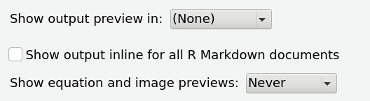

### Course resources

* Tips on [writing Rmd reports](rmarkdown_tips.html)
* Tips on [writing peer reviews](peer_reviews.html)
* A page of [example datasets](datasets.html).
* How to [use `rstan` on the cluster](rstan_on_talapas.html)
* How to [check if `rstan` is installed correctly](check_stan_install.html)
* A description of how to [use git](using-git.html) to get the course material.
* A [primer on linear algebra](../CLASS_MATERIALS/Tutorials/LA_primer_slides.html)
* Some notes on [how the slides are made from Rmd](development.html).

**Tutorials:**

* An example of [debugging Stan convergence](../CLASS_MATERIALS/Tutorials/Improving_convergence_1.html)
* A [technical look at brms](../CLASS_MATERIALS/Tutorials/using_brms.html)

### Stan

* [Stan documentation](https://mc-stan.org/users/documentation/) 
    - the [Reference Manual](https://mc-stan.org/docs/reference-manual/index.html)
        describes the syntax and workings of a Stan program
    - the [Functions Reference](https://mc-stan.org/docs/functions-reference/index.html)
        is where you look up *"what's that function again?"*
    - the [User's Guide](https://mc-stan.org/docs/stan-users-guide/index.html) has examples
        of complex models implemented in Stan, and discusses good programming practice

* [RStan documentation](https://mc-stan.org/users/interfaces/rstan.html) 
* [Example models in Stan](https://github.com/stan-dev/example-models): 
    each contains a Stan program, code for simulating data, real data, and model output and diagnostics
* Vignette on [stanfit objects](https://cran.r-project.org/web/packages/rstan/vignettes/stanfit-objects.html)
* Brief guide to [Stan's warnings](http://mc-stan.org/misc/warnings)
* Rewrite of [Kruschke's models using brms (and tidyverse)](https://bookdown.org/content/3686/), by A. Solomon Kurz.

### Other books

If you are looking for more reference or reading material, these are also good:

* Logan, M. 2010. *Biostatistical Design and Analysis Using R.* Wiley-Blackwell.
    A fairly comprehensive book that covers how to use R to do many of the topics in Quinn and Keough.

* Wickham, H. & G. Grolemund. 2016. *R for Data Science.* O'Reilly Publishers. (free [web version](https://r4ds.had.co.nz/))
    How to do many common data analysis tasks in R, specifically in the [tidyverse](http://www.tidyverse.org).

* Wickham, H. *ggplot2: Elegant Graphics for Data Analysis, 2nd edition* (free [web version](https://ggplot2-book.org/) of the in-process 3rd edition)
    A more comprehensive reference to ggplot2 than the [chapter of *R for data science*](https://r4ds.had.co.nz/data-visualisation.html).
    Also see [the documentation](https://ggplot2.tidyverse.org/index.html).

* Wilke, Claus O. *Fundamentals of Data Visualization.*. O'Reilly Publishers. (free [web version](https://serialmentor.com/dataviz/))
    How to think about visualization (with source code for plots available!).

* Haddock, S. and C. Dunn. 2011. *Practical Computing for Biologists.* Sinauer and Associates. 

### Miscellaneous R tips

* [knitr chunk options](https://yihui.name/knitr/options/) for control of Rmarkdown code chunks
* [Formulae in R](http://conjugateprior.org/2013/01/formulae-in-r-anova/) and, in more detail, [General linear models in R FAQ](http://bbolker.github.io/mixedmodels-misc/glmmFAQ.html)
* How to [print the source code](https://stackoverflow.com/questions/19226816/how-can-i-view-the-source-code-for-a-function/19226817#19226817) 
    for functions that don't show it to you when you type their names. (tldr; `showMethods(fun); getMethod(fun, c(x='class1', y='class2'))`)

### ggplotting

* [ggplot2 quick reference](http://ggplot2.tidyverse.org/reference/)
* [practical ggplot2](https://wilkelab.org/practicalgg/) an annotated website of examples by Claus Wilke

### Rstudio

* Strongly recommended global configuration: 

### General resources

- [linuxcommand.org](http://linuxcommand.org/) and [bashguide](http://mywiki.wooledge.org/BashGuide)
- [Software Carpentry](http://software-carpentry.org/lessons/)
- Reproducible Research by Karl Broman:
  [talk](https://github.com/kbroman/Talk_ReproRes) and
  [course](http://kbroman.org/Tools4RR)
- Karl Broman's excellent [short tutorials](http://kbroman.org/pages/tutorials.html) on
  [rmarkdown](http://kbroman.org/knitr_knutshell/pages/Rmarkdown.html), git/github, make, perl, and more.
- a [visual introduction to git](https://learngitbranching.js.org/)
- [Bioinformatics Data Skills](http://shop.oreilly.com/product/0636920030157.do) by Vince Buffalo
- [Jenny Bryan's stat 545](https://stat545.com/): Data wrangling, exploration, and analysis with R
- [Yaniv Brandvain's Applied Biostats course](https://bookdown.org/ybrandvain/Applied-Biostats/)

### Probability and statistics

- List of [common probability distributions](https://en.wikipedia.org/wiki/Probability_distribution#Common_probability_distributions)
- [ANOVA: a short intro using R](https://stat.ethz.ch/~meier/teaching/anova/) by Lukas Meier
- Interactive plot of the [beta distribution](https://www.desmos.com/calculator/mnvwjlvnyj)
- Interactive plot of the [gamma distribution](https://www.desmos.com/calculator/vk2tqrxpk5)
- Interactive plot of [Student's t-distribution](https://www.desmos.com/calculator/u1ftxqcsqd)
